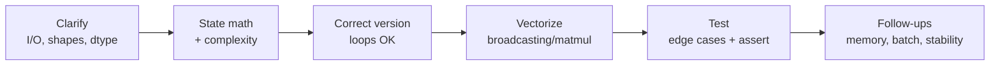

# ML 코딩 라운드

> [!TIP] 이것부터 말하세요
> "ML-from-scratch"는 *유한한* 범위의 syllabus이고, research/applied 인터뷰 루프에서 가장 레버리지가 큰 차별화 요소입니다. 열 개 남짓한 canonical 문제가 물어보는 것의 대부분을 커버합니다. shape, numerical-stability 트릭, 그리고 설명 방식을 외워두면 절대 얼지 않습니다.

이 라운드는 LeetCode가 아닙니다. 인터뷰어는 여러분이 **math를 vectorized array 코드로** 바꿀 수 있는지, **shape와 complexity를** 따질 수 있는지, 그리고 모델을 실제로 학습시켜 본 사람과 글로만 읽어본 사람을 가르는 **failure mode를** 아는지 보고 싶어 합니다. 돌아가는 코드는 기본 조건일 뿐이고, 진짜 signal은 *거기에 도달하는 방식*에 있습니다.

## 실제로 무엇을 평가하나

<dl class="kv">
<dt>Math → code fluency</dt><dd>$\text{softmax}(x)_i = e^{x_i}/\sum_j e^{x_j}$에서 망설임 없이 안정적이고 batched된 NumPy 한 줄로 갈 수 있나요?</dd>
<dt>Vectorization mindset</dt><dd>Python 루프 대신 broadcasting과 matmul에 손이 가나요? 루프는 *첫* correct 버전용이고, 후속 질문은 언제나 "이제 vectorize 해보세요"입니다.</dd>
<dt>Shape discipline</dt><dd>모든 tensor는 머릿속에서 (이상적으로는 주석으로도) shape가 붙어 있어야 합니다. 버그의 대부분은 shape/axis 버그입니다.</dd>
<dt>Numerical stability</dt><dd>`exp` 전에 max를 빼나요? log-sum-exp를 쓰나요? `log` 전에 clamp 하나요? 이것이 가장 흔한 판별 지점입니다.</dd>
<dt>Edge cases & tests</dt><dd>빈 입력, zero-area box, 원소 하나짜리 batch, tie. 시키지 않아도 `__main__` sanity check를 작성하세요.</dd>
</dl>

## Canonical 문제 리스트

  <a class="card" href="#/ml-coding/nms-iou">
📦

IoU & NMS

Broadcasting으로 pairwise IoU; greedy + Soft-NMS. detection의 고전.
</a>
  <a class="card" href="#/ml-coding/conv-pooling">
🔲

Conv & Pooling

Naive 루프 → im2col + GEMM; max/avg pool. cuDNN의 경로를 이해하나요?
</a>
  <a class="card" href="#/ml-coding/attention">
🎯

Attention

Scaled dot-product + multi-head, mask, stable softmax. VLM/LLM의 핵심.
</a>
  <a class="card" href="#/ml-coding/transformer">
🧱

Transformer Block

MHA + FFN + residual + norm, causal mask, KV-cache.
</a>
  <a class="card" href="#/ml-coding/kmeans">
🌀

K-Means

Lloyd + k-means++, vectorized distance, empty-cluster 처리.
</a>
  <a class="card" href="#/ml-coding/dataloader-augmentation">
🔀

Dataloader & Aug

Batch/shuffle/collate + label-synced augmentation. 인터페이스 설계.
</a>
  <a class="card" href="#/ml-coding/losses-gradients">
📉

Losses & Gradients

MSE/CE/BCE/focal, softmax-CE gradient, autograd 없는 backward.
</a>
  <a class="card" href="#/ml-coding/metrics-map-miou">
📊

mAP & mIoU

Confusion-matrix mIoU; per-image greedy matching + PR integration.
</a>

## 어떻게 설명할 것인가

인터뷰어는 결과물만이 아니라 여러분의 process를 채점합니다. 눈에 보이는 루프를 따르세요:

1. **Contract를 명확히 하세요.** "Box는 `[x1,y1,x2,y2]`, float, `(N,4)`인가요? Score는 `(N,)`? indices를 반환하나요, 아니면 filtered box를 반환하나요?" 좋은 clarifying 질문 하나가 신뢰를 삽니다.
2. **Math와 complexity를 소리 내어 말하세요** — 타이핑하기 전에. "IoU는 intersection over union이고, pairwise는 $O(NM)$이고 $(N,M)$ 행렬을 materialize 하겠습니다."
3. **먼저 correct 버전을 만드세요**, 루프 허용. 그다음 "vectorize 해보겠습니다"라고 말하고 실행하세요. 둘 다 보여주는 것이 영리한 버전으로 바로 뛰어드는 것보다 *더* signal이 됩니다.
4. **shape를 주석으로 표기하세요**, 진행하면서. `# (B, H, T, Dh)`.
5. **시키지 않아도 테스트하세요.** `assert` 하나가 들어간 세 줄짜리 `__main__`은 "저는 돌아가는 코드를 냅니다"라고 말해줍니다.

> [!WARNING] 얼어붙는 함정
> 머릿속이 하얘지면 naive triple-loop로 후퇴하고 *그렇다고 말하세요*: "여기 명백히 correct한 버전이 있고, 다음에 vectorize 하겠습니다." 명확하게 설명하는 느리지만 correct한 답이, 멈춰버린 영리한 답을 매번 이깁니다.

## Vectorization mindset

데이터에 대한 명시적 루프를 array 연산으로 대체하세요. 케이스의 ~90%를 커버하는 세 가지 수:

| Move | When | Example |
| --- | --- | --- |
| **Broadcasting** | pairwise / outer 연산 | `a[:,None,:] - b[None,:,:]` → `(N,M,D)` distance |
| **matmul / einsum** | inner product, projection | `q @ k.T`, `np.einsum('nd,md->nm', a, b)` |
| **Fancy/boolean indexing** | gather, mask, scatter | `probs[np.arange(N), targets]` |
| **`reshape`/`transpose`** | head split/merge, im2col | `.reshape(B,T,H,Dh).transpose(0,2,1,3)` |

> [!NOTE] `[:, None]` 반사신경
> 길이 1짜리 axis를 삽입해서(`None`/`np.newaxis`/`unsqueeze`) tensor를 broadcasting에 맞게 정렬하는 것이 가장 유용한 습관 하나입니다. 두 collection에 대해 중첩 루프를 쓰려 할 때마다 "axis를 추가해서 broadcasting이 하게 만들 수 있을까?"라고 물으세요.

## Numerical-stability 체크리스트

인터뷰어가 적극적으로 이것들을 찾습니다. 네 가지를 체화하세요:

$$
\text{softmax}(x)_i = \frac{e^{x_i - \max_k x_k}}{\sum_j e^{x_j - \max_k x_k}}
\qquad
\text{LSE}(x) = \max_k x_k + \log\!\sum_j e^{x_j - \max_k x_k}
$$

- **Stable softmax:** `exp` 전에 axis 방향으로 `max`를 빼세요. 수학적으로는 결과가 동일하지만 `inf`를 피합니다. *(verifiable)*
- **Log-sum-exp:** `log(sum(exp(x)))`를 절대 직접 계산하지 마세요 — max를 밖으로 빼내세요. logits로부터의 cross-entropy가 이것을 암묵적으로 씁니다.
- **`log` 전에 clamp:** `np.log(np.clip(p, 1e-12, 1.0))`로 `log(0) = -inf`를 피하세요.
- **나눗셈을 방어하세요:** IoU union, softmax 분모, Dice에는 `x / np.maximum(denom, eps)`.
- **`log1p`/`expm1`/`logaddexp`/`logsigmoid`를 선호하세요** — BCE와 focal loss에서 `log`와 `exp`를 직접 조합하는 대신에.

> [!DANGER] 인터뷰어가 지켜보는 흔한 버그
> `argsort`는 오름차순을 줍니다(score에는 `[::-1]` 또는 `argsort(-x)`를 쓰세요); NumPy view는 메모리를 alias 합니다(in-place 편집 전에 `.copy()`); conv output-size 공식에서의 정수 나눗셈; `keepdims=True`를 잊어서 reduction이 다시 broadcast되지 못하는 것; 잘못된 axis에 대한 softmax; causal mask에서의 off-by-one.

인터뷰어는 왜 "이제 vectorize 해보세요" 후속 질문을 좋아할까요?

**짧게:** framework를 *쓰는* 사람과 그 아래의 array 모델을 *이해하는* 사람을 갈라냅니다.

**깊게:** vectorized 솔루션은 모든 intermediate의 정확한 shape, broadcasting이 어디서 일어나는지, 그리고 intermediate를 materialize하는 메모리 비용(예: $(N,M)$ IoU 행렬이나 $O(T^2)$ attention 행렬)을 따지도록 강제합니다. 그 사고 과정은 나중에 느린 training 루프를 profile하거나 FlashAttention이 값어치를 하는지 판단할 때 정확히 필요한 것입니다. 실제 엔지니어링 성숙도의 proxy인 셈이죠.

NumPy냐 PyTorch냐 — 어느 쪽으로 써야 하나요?

**짧게:** 알고리즘은 NumPy를 기본으로, framework 한 줄짜리는 언급하세요.

**깊게:** NumPy from-scratch는 연산을 이해했음을 증명합니다; 그다음 production 경로를 이름 대세요(`torchvision.ops.nms`, `F.scaled_dot_product_attention`, `F.cross_entropy`). 문제가 명시적으로 autograd나 GPU tensor에 관한 것이라면(Transformer block, custom backward) PyTorch로 쓰세요. 인터뷰어의 framing에 맞추고, 언제나 "production에서는 X를 쓰겠습니다"라고 말해서 무지 때문에 바퀴를 재발명하는 게 아님을 알리세요.

### *모든* 문제에서 예상해야 할 Follow-ups
- **"Time과 memory complexity가 뭔가요?"** — 물어보기 전에 답을 준비해두세요.
- **"이걸 어떻게 batch 하나요?"** — 보통 한 차원을 batch axis로 접어 넣거나 axis를 하나 더 broadcast 합니다.
- **"이게 수치적으로 어디서 깨지나요?"** — `exp`, `log`, 또는 나눗셈을 가리키세요.
- **"이걸 어떻게 테스트하나요?"** — loss에는 numerical gradient check; IoU에는 알려진 closed-form 케이스; 어디서나 degenerate/empty 입력.

## 35분을 배분하기

전형적인 ML-coding 슬롯은 ~35–45분입니다. 후속 질문(코드만큼의 signal을 담고 있는)을 위한 여유를 남기는 대략적인 배분:

| Phase | Time | What you're doing |
| --- | --- | --- |
| Clarify | 2–3 min | I/O, shape, dtype, return type를 확정 |
| Math + plan | 3–4 min | 공식과 complexity를 소리 내어 말하기 |
| Correct version | 10–12 min | 루프 허용; shape를 설명 |
| Vectorize | 6–8 min | broadcasting / matmul; 돌아가게 유지 |
| Test | 4–5 min | 알려진 케이스에 `assert`가 있는 `__main__` |
| Follow-ups | remaining | memory, batching, stability, production 경로 |

> [!EXAMPLE] IoU에서 "좋음"이 들리는 방식
> "Box는 `(N,4)` xyxy float이고 — `(N,M)` 행렬을 반환하겠습니다. Intersection은 top-left의 `max`, bottom-right의 `min`을 0에서 clamp한 것; union은 epsilon guard를 붙인 $A+B-I$. Time과 memory 모두 $O(NM)$입니다. 여기 broadcasted 버전이…" — 그다음 코드, 그다음 closed-form assert. 그 한 문장짜리 오프닝이 이미 process signal의 대부분을 벌어들입니다.

## Cheat-sheet

| Problem | Core trick | Complexity | Stability watch-out |
| --- | --- | --- | --- |
| IoU / NMS | broadcast lt/rb, `max(0, rb-lt)` | $O(NM)$ / greedy loop | union의 `eps` |
| Conv | im2col → GEMM | $O(N C_o C_i K^2 HW)$ | output-size 정수 나눗셈 |
| Attention | `qkᵀ/√d`, stable softmax | $O(T^2 d)$ | max 빼기, $-\infty$로 mask |
| Transformer block | pre-norm, residual, causal mask | $O(T^2 d + T d^2)$ | LN eps, softmax 전에 mask |
| K-Means | $\lVert x-c\rVert^2 = \lVert x\rVert^2+\lVert c\rVert^2-2x\!\cdot\!c$ | $O(NKD)$/iter | dist $\ge 0$ clamp, empty cluster |
| Dataloader | shuffle idx, batch, collate | $O(N)$ | `drop_last`, aug에 `.copy()` |
| Losses | `p - onehot(y)`가 CE grad | $O(NC)$ | stable softmax, log clamp, logsigmoid |
| mAP / mIoU | `bincount`로 confusion; PR integral | $O(HW)$ / $O(P\log P)$ | per-image greedy matching |

**Cross-links:** [Attention](#/foundations/architectures) · [Detection](#/cv/detection) · [Segmentation](#/cv/segmentation) · [Optimization](#/foundations/optimization) · [Evaluation Metrics](#/foundations/evaluation-metrics) · [Normalization & Stability](#/foundations/normalization-stability)
