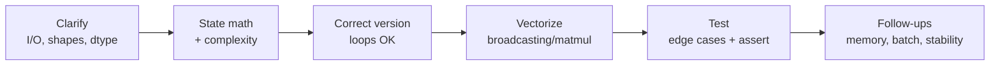

# The ML Coding Round

> [!TIP] Say this first
> "ML-from-scratch" is a *finite* syllabus and the highest-leverage differentiator in a research/applied loop. Ten or so canonical problems cover the vast majority of what's asked. Memorize the shapes, the numerical-stability tricks, and the narration — then you never freeze.

This round is not LeetCode. The interviewer wants to see that you can turn **math into vectorized array code**, reason about **shapes and complexity**, and know the **failure modes** that separate someone who has trained models from someone who has only read about them. Code that runs is table stakes; the signal is in *how you get there*.

## What it actually tests

<dl class="kv">
<dt>Math → code fluency</dt><dd>Can you go from $\text{softmax}(x)_i = e^{x_i}/\sum_j e^{x_j}$ to a stable, batched NumPy line without hesitating?</dd>
<dt>Vectorization mindset</dt><dd>Do you reach for broadcasting and matmul instead of Python loops? Loops are for the *first* correct version; the follow-up is always "now vectorize it."</dd>
<dt>Shape discipline</dt><dd>Every tensor should have an annotated shape in your head and (ideally) a comment. Most bugs are shape/axis bugs.</dd>
<dt>Numerical stability</dt><dd>Do you subtract the max before `exp`? Use log-sum-exp? Clamp before `log`? This is the single most common tell.</dd>
<dt>Edge cases & tests</dt><dd>Empty inputs, zero-area boxes, single-element batches, ties. Write a `__main__` sanity check unprompted.</dd>
</dl>

## The canonical question list

  <a class="card" href="#/ml-coding/nms-iou">
📦

IoU & NMS

Pairwise IoU by broadcasting; greedy + Soft-NMS. The detection classic.
</a>
  <a class="card" href="#/ml-coding/conv-pooling">
🔲

Conv & Pooling

Naive loops → im2col + GEMM; max/avg pool. Do you understand cuDNN's path?
</a>
  <a class="card" href="#/ml-coding/attention">
🎯

Attention

Scaled dot-product + multi-head, masks, stable softmax. The VLM/LLM core.
</a>
  <a class="card" href="#/ml-coding/transformer">
🧱

Transformer Block

MHA + FFN + residual + norm, causal mask, KV-cache.
</a>
  <a class="card" href="#/ml-coding/kmeans">
🌀

K-Means

Lloyd + k-means++, vectorized distances, empty-cluster handling.
</a>
  <a class="card" href="#/ml-coding/dataloader-augmentation">
🔀

Dataloader & Aug

Batch/shuffle/collate + label-synced augmentation. Interface design.
</a>
  <a class="card" href="#/ml-coding/losses-gradients">
📉

Losses & Gradients

MSE/CE/BCE/focal, softmax-CE gradient, autograd-free backward.
</a>
  <a class="card" href="#/ml-coding/metrics-map-miou">
📊

mAP & mIoU

Confusion-matrix mIoU; per-image greedy matching + PR integration.
</a>

## How to narrate

The interviewer scores your process, not just the artifact. Follow a visible loop:

1. **Clarify the contract.** "Boxes are `[x1,y1,x2,y2]`, float, `(N,4)`? Scores `(N,)`? Do I return indices or filtered boxes?" One good clarifying question buys trust.
2. **State the math and the complexity out loud** before typing. "IoU is intersection over union; pairwise is $O(NM)$ and I'll materialize an $(N,M)$ matrix."
3. **Get a correct version first**, loops allowed. Then say "let me vectorize" and do it. Showing both is *more* signal than jumping straight to the clever version.
4. **Annotate shapes** in comments as you go. `# (B, H, T, Dh)`.
5. **Test unprompted.** A three-line `__main__` with an `assert` says "I ship working code."

> [!WARNING] The freeze trap
> If you blank, retreat to the naive triple-loop and *say so*: "Here's the obviously-correct version; I'll vectorize next." A slow-correct answer with clear narration beats a stalled clever one every time.

## The vectorization mindset

Replace explicit loops over data with array ops. The three moves that cover ~90% of cases:

| Move | When | Example |
| --- | --- | --- |
| **Broadcasting** | pairwise / outer ops | `a[:,None,:] - b[None,:,:]` → `(N,M,D)` distances |
| **matmul / einsum** | inner products, projections | `q @ k.T`, `np.einsum('nd,md->nm', a, b)` |
| **Fancy/boolean indexing** | gather, mask, scatter | `probs[np.arange(N), targets]` |
| **`reshape`/`transpose`** | split/merge heads, im2col | `.reshape(B,T,H,Dh).transpose(0,2,1,3)` |

> [!NOTE] The `[:, None]` reflex
> Inserting a length-1 axis (`None`/`np.newaxis`/`unsqueeze`) to line tensors up for broadcasting is the single most useful habit. Whenever you'd write a nested loop over two collections, ask "can I add axes and let broadcasting do it?"

## Numerical-stability checklist

Interviewers actively look for these. Internalize the four:

$$
\text{softmax}(x)_i = \frac{e^{x_i - \max_k x_k}}{\sum_j e^{x_j - \max_k x_k}}
\qquad
\text{LSE}(x) = \max_k x_k + \log\!\sum_j e^{x_j - \max_k x_k}
$$

- **Stable softmax:** subtract `max` along the axis before `exp`. The result is identical mathematically but avoids `inf`. *(verifiable)*
- **Log-sum-exp:** never compute `log(sum(exp(x)))` directly — factor out the max. Cross-entropy from logits uses this implicitly.
- **Clamp before `log`:** `np.log(np.clip(p, 1e-12, 1.0))` to avoid `log(0) = -inf`.
- **Guard divisions:** `x / np.maximum(denom, eps)` for IoU unions, softmax denominators, Dice.
- **Prefer `log1p`/`expm1`/`logaddexp`/`logsigmoid`** for BCE and focal loss instead of composing `log` and `exp` yourself.

> [!DANGER] Common bugs interviewers watch for
> `argsort` gives ascending order (use `[::-1]` or `argsort(-x)` for scores); NumPy views alias memory (`.copy()` before in-place edits); integer division in the conv output-size formula; forgetting `keepdims=True` so a reduction broadcasts back; softmax over the wrong axis; off-by-one in causal masks.

Why do interviewers love the "now vectorize it" follow-up?

**Short:** it separates people who *use* frameworks from people who *understand* the array model underneath them.

**Deep:** a vectorized solution forces you to reason about the exact shape of every intermediate, where broadcasting happens, and the memory cost of materializing an intermediate (e.g., the $(N,M)$ IoU matrix or the $O(T^2)$ attention matrix). That reasoning is exactly what you need when you later profile a slow training loop or decide whether FlashAttention is worth it. It's a proxy for real engineering maturity.

NumPy or PyTorch — which should I write in?

**Short:** default to NumPy for the algorithm, mention the framework one-liner.

**Deep:** NumPy from-scratch proves you understand the operation; then name the production path (`torchvision.ops.nms`, `F.scaled_dot_product_attention`, `F.cross_entropy`). If the problem is explicitly about autograd or GPU tensors (a Transformer block, a custom backward), write PyTorch. Match the interviewer's framing, and always state "in production I'd use X" so they know you're not reinventing wheels by ignorance.

### Follow-ups you should expect on *every* problem
- **"What's the time and memory complexity?"** — have the answer ready before they ask.
- **"How would you batch this?"** — usually fold a dimension into the batch axis or broadcast one more axis.
- **"Where does this break numerically?"** — point at the `exp`, the `log`, or the division.
- **"How would you test it?"** — numerical gradient check for losses; a known closed-form case for IoU; a degenerate/empty input everywhere.

## Budget your 35 minutes

A typical ML-coding slot is ~35–45 minutes. A rough allocation that leaves room for the follow-ups (which carry as much signal as the code):

| Phase | Time | What you're doing |
| --- | --- | --- |
| Clarify | 2–3 min | pin down I/O, shapes, dtype, return type |
| Math + plan | 3–4 min | state the formula and complexity out loud |
| Correct version | 10–12 min | loops allowed; narrate shapes |
| Vectorize | 6–8 min | broadcasting / matmul; keep it running |
| Test | 4–5 min | `__main__` with an `assert` on a known case |
| Follow-ups | remaining | memory, batching, stability, production path |

> [!EXAMPLE] What "good" sounds like on IoU
> "Boxes are `(N,4)` xyxy floats — I'll return an `(N,M)` matrix. Intersection is `max` of the top-lefts, `min` of the bottom-rights, clamped at zero; union is $A+B-I$ with an epsilon guard. It's $O(NM)$ time and memory. Here's the broadcasted version…" — then code, then a closed-form assert. That single opening sentence already banks most of the process signal.

## Cheat-sheet

| Problem | Core trick | Complexity | Stability watch-out |
| --- | --- | --- | --- |
| IoU / NMS | broadcast lt/rb, `max(0, rb-lt)` | $O(NM)$ / greedy loop | `eps` in union |
| Conv | im2col → GEMM | $O(N C_o C_i K^2 HW)$ | output-size integer div |
| Attention | `qkᵀ/√d`, stable softmax | $O(T^2 d)$ | subtract max, mask with $-\infty$ |
| Transformer block | pre-norm, residual, causal mask | $O(T^2 d + T d^2)$ | LN eps, mask before softmax |
| K-Means | $\lVert x-c\rVert^2 = \lVert x\rVert^2+\lVert c\rVert^2-2x\!\cdot\!c$ | $O(NKD)$/iter | clamp dist $\ge 0$, empty clusters |
| Dataloader | shuffle idx, batch, collate | $O(N)$ | `drop_last`, `.copy()` on aug |
| Losses | `p - onehot(y)` is the CE grad | $O(NC)$ | stable softmax, clamp log, logsigmoid |
| mAP / mIoU | confusion via `bincount`; PR integral | $O(HW)$ / $O(P\log P)$ | per-image greedy matching |

**Cross-links:** [Attention](#/foundations/architectures) · [Detection](#/cv/detection) · [Segmentation](#/cv/segmentation) · [Optimization](#/foundations/optimization) · [Evaluation Metrics](#/foundations/evaluation-metrics) · [Normalization & Stability](#/foundations/normalization-stability)
