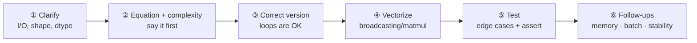

# ML Coding Round (From Scratch)

> [!NOTE] Goal of this chapter
> This part turns what you learned **conceptually** in [What Is Machine Learning?](#/foundations/what-is-ml) and [Neural Networks: A First Pass](#/foundations/neural-networks-basics) into implementations you write **by hand**. This opening chapter maps what from-scratch implementation demands and how to approach it. It is fine if your coding syntax is still rusty—read the [NumPy & Broadcasting Primer](#/ml-coding/numpy-primer) first and the rest of this part will be much easier.

## What "from-scratch implementation" means—and why it matters

ML coding here is different from **LeetCode algorithm puzzles**. Instead of calling a one-line library operation such as `torch.nn.Conv2d`, you use **NumPy to build the computation happening inside it**. Why is this important?

- **Proof of understanding.** Implement convolution yourself and "the kernel slides, multiplies, and sums" becomes physical intuition. It clearly separates you from someone who has only called a library.
- **Debugging ability.** When training behaves strangely, only someone who understands the internals can spot that "softmax is reducing over the wrong axis."
- **A core interview signal.** These exercises appear often in research/applied interviews, and the syllabus is **finite**. Roughly a dozen canonical problems below cover most of it.

> [!TIP] Interview one-liner
> "ML from scratch has a finite syllabus, so it offers unusually high preparation leverage. Internalize the shape discipline, numerical-stability tricks, and explanation order, and you will not freeze under pressure." Working code is only the baseline; the real signal is *how you reach it*.

## The five things interviewers actually evaluate

<dl class="kv">
<dt>Equation → code fluency</dt><dd>Can you translate an equation such as $\text{softmax}(x)_i = e^{x_i}/\sum_j e^{x_j}$ into stable NumPy code without hesitation?</dd>
<dt>Vectorized thinking</dt><dd>Do you reach for Python <code>for</code> loops, or for <b>broadcasting</b> and <b>matrix multiplication</b>? Loops are acceptable for a <i>first correct answer</i>; the follow-up is almost always, "Now vectorize it."</dd>
<dt>Shape discipline</dt><dd>Do you track every array's shape in your head and in comments? Most bugs are shape or axis mistakes.</dd>
<dt>Numerical stability</dt><dd>Do you subtract the maximum before <code>exp</code>? Clamp before <code>log</code>? These are common differentiators.</dd>
<dt>Edge cases & tests</dt><dd>Empty input, zero-area boxes, a one-element batch, ties. Add a sanity check under <code>__main__</code> without being asked.</dd>
</dl>

## Core concept: vectorization means "replace loops with array operations"

Ninety percent of from-scratch implementation is replacing explicit loops with array operations. The most important tool is **broadcasting**—the rule that automatically aligns arrays with different shapes. For example, it can compute every pairwise distance between $N$ points and $M$ points without a nested loop:

<figure>
<svg viewBox="0 0 640 210" xmlns="http://www.w3.org/2000/svg" font-family="Inter, sans-serif" font-size="12">
  <!-- A: (N,1,D) -->
  <rect x="30" y="60" width="40" height="110" rx="6" fill="none" stroke="#0ea5e9" stroke-width="1.8"/>
  <line x1="30" y1="97" x2="70" y2="97" stroke="#0ea5e9"/><line x1="30" y1="134" x2="70" y2="134" stroke="#0ea5e9"/>
  <text x="50" y="50" text-anchor="middle" fill="#0ea5e9">A</text>
  <text x="50" y="192" text-anchor="middle" fill="#98a3b2">(N,1,D)</text>
  <text x="95" y="120" text-anchor="middle" font-size="18" fill="currentColor">+</text>
  <!-- B: (1,M,D) -->
  <rect x="120" y="90" width="120" height="40" rx="6" fill="none" stroke="#e0533f" stroke-width="1.8"/>
  <line x1="160" y1="90" x2="160" y2="130" stroke="#e0533f"/><line x1="200" y1="90" x2="200" y2="130" stroke="#e0533f"/>
  <text x="180" y="80" text-anchor="middle" fill="#e0533f">B</text>
  <text x="180" y="150" text-anchor="middle" fill="#98a3b2">(1,M,D)</text>
  <text x="270" y="120" text-anchor="middle" font-size="18" fill="currentColor">→</text>
  <!-- result grid (N,M,D) -->
  <text x="470" y="40" text-anchor="middle" fill="#12a150">broadcasting fills the (N,M,D) grid</text>
  <g stroke="#12a150" stroke-width="1.5" fill="rgba(18,161,80,.12)">
    <rect x="330" y="60" width="30" height="30"/><rect x="360" y="60" width="30" height="30"/><rect x="390" y="60" width="30" height="30"/><rect x="420" y="60" width="30" height="30"/>
    <rect x="330" y="90" width="30" height="30"/><rect x="360" y="90" width="30" height="30"/><rect x="390" y="90" width="30" height="30"/><rect x="420" y="90" width="30" height="30"/>
    <rect x="330" y="120" width="30" height="30"/><rect x="360" y="120" width="30" height="30"/><rect x="390" y="120" width="30" height="30"/><rect x="420" y="120" width="30" height="30"/>
  </g>
  <text x="315" y="80" text-anchor="end" fill="#0ea5e9">N rows ↓</text>
  <text x="390" y="170" text-anchor="middle" fill="#e0533f">M columns →</text>
</svg>
<figcaption>One line—<code>A[:,None,:] + B[None,:,:]</code>—computes all N×M pairs without loops. Inserting a length-one axis with <code>None</code> to align shapes is the central vectorization habit. See the <a href="#/ml-coding/numpy-primer">NumPy Primer</a> for the full rules.</figcaption>
</figure>

Four moves cover roughly 90% of cases:

| Tool | When to use it | Example |
| --- | --- | --- |
| **Broadcasting** | pairwise / outer operations | `a[:,None,:] - b[None,:,:]` → `(N,M,D)` distances |
| **matmul / einsum** | dot products, projections | `q @ k.T`, `np.einsum('nd,md->nm', a, b)` |
| **Fancy/Boolean indexing** | gather, mask, scatter | `probs[np.arange(N), targets]` |
| **`reshape`/`transpose`** | split/merge heads, im2col | `.reshape(B,T,H,Dh).transpose(0,2,1,3)` |

## How to solve the problem (your explanation is part of the score)

Interviewers evaluate the **process**, not just the artifact. Follow a visible loop:

1. **Clarify the contract.** "Are boxes float arrays of shape `(N,4)` in `[x1,y1,x2,y2]` order? Should I return indices or filtered boxes?" One good question buys trust.
2. **Say the equation and complexity aloud** before typing. "IoU is intersection over union, pairwise computation is $O(NM)$, and I will build an `(N,M)` matrix."
3. Build a **correct version first**, loops allowed. Then say "I will vectorize this" and do it. Showing both gives a stronger signal than jumping directly to a clever implementation.
4. Track **shapes in comments** as you work: `# (B, H, T, Dh)`.
5. **Test without being prompted.** A three-line `__main__` with one `assert` says, "I ship working code."

> [!WARNING] When you freeze
> If your mind goes blank, fall back to the naive triple loop and *say so*: "I will establish an obviously correct version first, then vectorize it." A slow, clearly explained correct answer beats a clever answer that never materializes.

## Numerical-stability checklist

Interviewers actively look for these four items. **Log-sum-exp (LSE)** is the trick that stabilizes `log(sum(exp(x)))`: direct evaluation can overflow in `exp`, so pull the maximum outside.

$$
\text{softmax}(x)_i = \frac{e^{x_i - \max_k x_k}}{\sum_j e^{x_j - \max_k x_k}}
\qquad
\text{LSE}(x) = \max_k x_k + \log\!\sum_j e^{x_j - \max_k x_k}
$$

- **Stable softmax:** subtract the maximum along the reduction axis before `exp`. The result is unchanged, but you avoid `inf`.
- **Log-sum-exp:** never compute `log(sum(exp(x)))` directly; pull out the maximum. Cross-entropy from logits uses this implicitly.
- **Clamp before `log`:** use `np.log(np.clip(p, 1e-12, 1.0))` to avoid `log(0) = -inf`.
- **Guard division:** for IoU unions, softmax denominators, and Dice, use `x / np.maximum(denom, eps)`.

> [!DANGER] Common bugs interviewers watch for
> `argsort` is ascending, so scores need `argsort(-x)`; NumPy views share memory, so call `.copy()` before in-place edits; integer division in convolution output-size formulas; forgetting `keepdims=True`, so a reduction cannot broadcast back; applying softmax over the wrong axis; and off-by-one errors in causal masks.

## Canonical problem list

You will implement each of these across this part and the computer-vision part. Every chapter includes an **executable code editor**.

  <a class="card" href="#/ml-coding/losses-gradients">
📉

Losses & Gradients

MSE/CE/BCE/focal, softmax-CE gradient, backward without autograd.
</a>
  <a class="card" href="#/ml-coding/conv-pooling">
🔲

Convolution & Pooling

Naive loops → im2col + GEMM; max/average pooling.
</a>
  <a class="card" href="#/ml-coding/attention">
🎯

Attention

Scaled dot-product + multi-head, masking, stable softmax.
</a>
  <a class="card" href="#/ml-coding/transformer">
🧱

Transformer Block

MHA + FFN + residual + norm, causal mask, KV cache.
</a>
  <a class="card" href="#/ml-coding/kmeans">
🌀

K-Means

Lloyd + k-means++, vectorized distances, empty-cluster handling.
</a>
  <a class="card" href="#/ml-coding/dataloader-augmentation">
🔀

Dataloader & Augmentation

Batch/shuffle/collate + label-synchronized augmentation.
</a>
  <a class="card" href="#/ml-coding/nms-iou">
📦

IoU & NMS

Broadcasting pairwise IoU; greedy + Soft-NMS. (Computer-vision part)
</a>
  <a class="card" href="#/ml-coding/metrics-map-miou">
📊

mAP & mIoU

Confusion-matrix mIoU; greedy matching + PR. (Computer-vision part)
</a>

> [!NOTE] Reading order
> **IoU/NMS and mAP/mIoU** now live in the **computer-vision part**, where they sit next to detection and segmentation; their file paths and links remain unchanged. Here, you implement the central neural-network blocks—losses, convolution, attention, and the Transformer—beside their theory chapter, [CNNs, RNNs & Transformers](#/foundations/architectures).

## Allocating 35 minutes

A typical ML coding slot lasts about 35–45 minutes. Leave room for follow-ups, which carry as much signal as the code:

| Stage | Time | What to do |
| --- | --- | --- |
| Clarify | 2–3 min | lock down I/O, shape, dtype, and return type |
| Equation + plan | 3–4 min | state the formula and complexity aloud |
| Correct version | 10–12 min | loops allowed; narrate shapes |
| Vectorize | 6–8 min | broadcasting/matmul; keep it runnable |
| Test | 4–5 min | `__main__` with a known-case `assert` |
| Follow-ups | remaining time | memory, batching, stability, production path |

## Q&A

Why do interviewers like asking, "Now vectorize it"?

**Short:** It separates someone who can *use* a library from someone who understands the array model underneath it.

**Deep:** A vectorized solution forces you to reason about every intermediate shape, where broadcasting occurs, and the memory cost of actually materializing intermediate arrays—for example an $(N,M)$ IoU matrix or an $O(T^2)$ attention matrix. The same reasoning is later required to profile a slow training loop or understand why FlashAttention matters.

Should I use NumPy or PyTorch?

**Short:** Default to NumPy for the algorithm, and name the one-line framework equivalent.

**Deep:** A from-scratch NumPy implementation demonstrates the operation itself; then name the production path—`torchvision.ops.nms`, `F.scaled_dot_product_attention`, or `F.cross_entropy`. Use PyTorch when autograd or GPU tensors are central, such as a Transformer block or custom backward. Always add, "In production I would use X," so it is clear that you are rebuilding the wheel to demonstrate understanding, not from ignorance.

### Follow-ups to expect on every problem

- **"What are the time and memory complexities?"** Prepare them before being asked.
- **"How would you batch this?"** Usually fold one axis into the batch or add one more broadcasting axis.
- **"Where does this fail numerically?"** Point to `exp`, `log`, and division.
- **"How would you test it?"** Use numerical gradient checks for losses, closed-form cases for IoU, and degenerate/empty inputs everywhere.

## Cheat-sheet

| Problem | Core trick | Complexity | Stability concern |
| --- | --- | --- | --- |
| Losses & gradients | `p - onehot(y)` is the CE gradient | $O(NC)$ | stable softmax, log clamp |
| Convolution | im2col → GEMM | $O(N C_o C_i K^2 HW)$ | integer division in output size |
| Attention | `qkᵀ/√d`, stable softmax | $O(T^2 d)$ | subtract max, $-\infty$ mask |
| Transformer block | pre-norm, residual, causal mask | $O(T^2 d + T d^2)$ | layer-norm eps, mask before softmax |
| K-Means | $\lVert x-c\rVert^2=\lVert x\rVert^2+\lVert c\rVert^2-2x\!\cdot\!c$ | $O(NKD)$/iter | clamp distance $\ge 0$, empty cluster |
| Dataloader | shuffle→batch→collate | $O(N)$ | `drop_last`, `.copy()` before augmentation |
| IoU / NMS | broadcast lt/rb, `max(0, rb-lt)` | $O(NM)$/greedy | union `eps` |
| mAP / mIoU | `bincount` confusion; PR integration | $O(HW)$/$O(P\log P)$ | per-image greedy matching |

**Next:** [NumPy Primer](#/ml-coding/numpy-primer) · [Losses & Gradients](#/ml-coding/losses-gradients) · [CNNs, RNNs & Transformers](#/foundations/architectures) · [Detection](#/cv/detection) · [Optimization](#/foundations/optimization)
