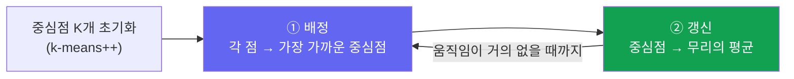

# K-Means: 비슷한 점끼리 묶기

> [!NOTE] 이 챕터의 목표
> K-Means는 **밑바닥부터 구현하는 가장 쉬운 알고리즘**이자, [머신러닝이란?](#/foundations/what-is-ml)에서 본 "비지도학습(unsupervised, 정답 없이 구조만 찾기)"의 대표 예입니다. 정답 라벨 없이 "비슷한 점끼리 묶는" 과정을, 움직이는 그림 → 두 줄짜리 반복 → 실행 코드 순서로 잡습니다. 부담 없이 시작하기 좋은 워밍업입니다.

## 무엇을 / 왜

데이터 점들이 흩어져 있을 때, "이건 A 무리, 저건 B 무리"처럼 **자연스러운 그룹(cluster, 군집)** 으로 나누고 싶을 때가 있습니다. 정답 라벨은 없습니다 — 오직 점들의 위치만 보고 나눠야 합니다. 이게 **clustering(군집화)** 이고, K-Means는 그중 가장 널리 쓰이는 방법입니다.

K-Means의 아이디어는 놀랄 만큼 단순합니다. **각 군집을 대표하는 중심점(centroid)** 을 $K$개 두고, 아래 두 스텝을 번갈아 반복합니다:

1. **배정(assign):** 각 점을 *가장 가까운* 중심점의 무리로 배정한다.
2. **갱신(update):** 각 중심점을 *자기 무리에 속한 점들의 평균* 위치로 옮긴다.

중심점이 더 이상 안 움직일 때까지 반복하면 끝입니다.

<figure>
<svg viewBox="0 0 640 300" xmlns="http://www.w3.org/2000/svg" font-family="Inter, sans-serif" font-size="12">
  <!-- cluster A points (left-bottom) -->
  <g fill="#0ea5e9">
    <circle cx="110" cy="215" r="5"/><circle cx="150" cy="235" r="5"/><circle cx="130" cy="195" r="5"/>
    <circle cx="175" cy="220" r="5"/><circle cx="95" cy="240" r="5"/><circle cx="160" cy="200" r="5"/>
  </g>
  <!-- cluster B points (right-top) -->
  <g fill="#e0533f">
    <circle cx="450" cy="80" r="5"/><circle cx="490" cy="100" r="5"/><circle cx="470" cy="60" r="5"/>
    <circle cx="510" cy="85" r="5"/><circle cx="440" cy="110" r="5"/><circle cx="500" cy="55" r="5"/>
  </g>
  <!-- centroid 1 (moves into cluster A) -->
  <g stroke="#12a150" stroke-width="2.5" fill="none">
    <circle r="9"/><path d="M-13 0 H13 M0 -13 V13"/>
    <animateTransform attributeName="transform" type="translate" dur="5s" repeatCount="indefinite"
      values="300 150; 240 175; 175 200; 138 216; 138 216; 300 150" keyTimes="0;0.18;0.4;0.62;0.9;1"/>
  </g>
  <!-- centroid 2 (moves into cluster B) -->
  <g stroke="#6366f1" stroke-width="2.5" fill="none">
    <circle r="9"/><path d="M-13 0 H13 M0 -13 V13"/>
    <animateTransform attributeName="transform" type="translate" dur="5s" repeatCount="indefinite"
      values="340 150; 400 135; 450 100; 476 82; 476 82; 340 150" keyTimes="0;0.18;0.4;0.62;0.9;1"/>
  </g>
  <text x="320" y="285" text-anchor="middle" fill="#98a3b2">두 중심점(＋)이 배정↔갱신을 반복하며 각 무리의 한가운데로 빨려 들어갑니다</text>
</svg>
<figcaption>초록·보라 중심점이 처음엔 엉뚱한 가운데에 있지만, "가까운 점 배정 → 평균으로 이동"을 반복하면 각 군집의 중심으로 수렴합니다. K-Means는 이 단순한 반복이 전부입니다.</figcaption>
</figure>

## 무엇을 최소화하나 — inertia

이 반복이 실제로 줄이는 값은 **각 점과 자기 중심점 사이 거리 제곱의 총합**이며, inertia(관성/응집도)라고 부릅니다:

$$
J = \sum_{i=1}^{N} \lVert x_i - c_{a_i} \rVert^2,\qquad a_i = \arg\min_k \lVert x_i - c_k\rVert^2
$$

여기서 $a_i$는 점 $i$가 배정된 중심점 번호입니다. 두 스텝은 각각 $J$를 줄이는 방향의 **coordinate descent(좌표별 하강)** 입니다: 중심점을 고정하면 최적 배정은 "가장 가까운 것", 배정을 고정하면 최적 중심점은 "평균". 그래서 **inertia는 절대 증가하지 않습니다** — 테스트에서 확인하기 좋은 불변식입니다. 단, 도달하는 곳은 전역 최소가 아니라 **국소(local) 최소**라서 초기화가 중요합니다.

## 거리 계산 트릭 (벡터화)

가장 흔한 실수: 모든 점–중심점 쌍의 차이를 $(N,K,D)$ 텐서로 만드는 것. 메모리를 낭비합니다. 대신 제곱을 전개하면 **행렬곱(matmul) 한 번**으로 $(N,K)$ 거리 행렬이 나옵니다:

$$
\lVert x - c\rVert^2 = \lVert x\rVert^2 + \lVert c\rVert^2 - 2\,x\!\cdot\!c
$$

교차항 $x c^\top$이 하나의 GEMM(대형 행렬곱)입니다. 이 브로드캐스팅·행렬곱 감각이 처음이면 [NumPy & 브로드캐스팅 프라이머](#/ml-coding/numpy-primer)를 먼저 보세요.

> [!WARNING] 거리를 0으로 clamp하세요
> 점이 중심점에 거의 겹칠 때 부동소수점 오차로 전개 결과가 아주 작은 음수가 될 수 있습니다. `np.maximum(d, 0)`으로 눌러 주면 나중에 `sqrt`에서 `nan`이 나오는 걸 막습니다.

> [!TIP] 면접 한 줄
> "Lloyd's algorithm은 수렴까지 배정↔갱신을 번갈아 하고, 진짜 함정은 거리 계산을 벡터화하는 것과 빈 군집(empty cluster) 처리뿐입니다." — 정의를 나열하지 말고 이 두 함정을 짚으면 실제로 구현해 본 사람처럼 들립니다.

## Practice — 직접 구현하고 실행·테스트

> [!TIP] 이 섹션 사용법
> 아래 각 문제에는 **NumPy가 준비된 라이브 Python 에디터**가 있습니다. 직접 풀이를 작성하고 **▶ Run tests**를 누르면 어떤 케이스가 통과하는지 보여줍니다. 막히면 **Solution**을 열 수 있지만 먼저 직접 시도하세요 — 그 씨름이 곧 연습입니다. 첫 Run에서 Python 런타임과 NumPy(~15 MB)를 내려받고, 이후 실행은 즉시입니다.

거리 행렬 → 배정 → 갱신 → 전체 루프 순서로 아래에서 위로 쌓습니다.

### 1. 거리 행렬 (Squared-Distance Matrix) Easy

$\lVert x\rVert^2+\lVert c\rVert^2-2xc^\top$ 전개로 $(N,K)$ 거리 제곱을 구하고 $\ge 0$으로 clamp.

### 2. 배정 스텝 (Assign) Easy

각 점을 가장 가까운 중심점 번호로 라벨링 — $K$ 축(`axis=1`)에 대한 `argmin`.

### 3. 갱신 스텝 (Update) Easy

각 중심점을 배정된 구성원의 평균으로 다시 계산합니다. 빈 군집은 이 함수만으로 새 중심을 합리적으로 정할 정보가 없으므로 `old_centroids`의 해당 중심을 유지합니다. 이전 중심을 주지 않았는데 빈 군집이 생기면 조용히 0을 반환하지 않고 오류를 냅니다.

### 4. 전체 K-Means (seeded) Medium

k-means++ 초기화 + Lloyd 반복. **k-means++** 는 첫 중심점을 무작위로 고른 뒤, 이후 중심점을 "기존 중심점에서 먼 점일수록 뽑힐 확률이 큰" 방식($D^2$-가중)으로 골라 중심점을 멀찍이 퍼뜨립니다 → 나쁜 국소 최소에 빠질 확률을 크게 줄입니다. Seed된 RNG로 결과가 재현 가능합니다.

> [!NOTE] 프레임워크 한 줄
> `sklearn.cluster.KMeans(n_clusters=k, init="k-means++")`; 대규모에서는 `MiniBatchKMeans` 또는 FAISS k-means(GPU, vector-quantization codebook용).

## 면접관이 지켜보는 흔한 버그

- **순진한 거리 계산:** 명시적 $(N,K,D)$ 차이 텐서는 메모리 낭비 — 전개 + 행렬곱을 쓰세요.
- **빈 군집(empty cluster):** 이전 중심을 유지하면 표준 Lloyd objective의 비증가 성질을 보존합니다. 무작위/가장 먼 점 재시드는 탈출 전략이지만 그 iteration의 inertia가 증가할 수 있으므로 별도 정책과 검사를 둡니다.
- **`argmin` 축:** $N$이 아니라 $K$ (`axis=1`).
- **수렴 판정:** `max_iter`만이 아니라 중심점 이동량이나 배정 변화로 판단.
- **재현성:** RNG를 seed. k-means는 초기화에 민감하므로 실무에선 `n_init`번 재시작해 inertia가 가장 낮은 결과를 씁니다.

## Q&A

k-means++는 왜 도움이 되고, 비용은 무엇인가요?

**짧게:** $D^2$-가중 샘플링으로 초기 중심점을 퍼뜨리면 random init이 빠지는 나쁜 국소 최소를 피하며, 비용은 추가 $O(NK)$ seeding pass 한 번뿐입니다.

**깊게:** random init은 흔히 같은 실제 군집 안에 중심점 두 개를 떨어뜨려 다른 군집을 주인 없이 남깁니다 — Lloyd가 탈출 못 하는 국소 최적이죠. k-means++는 멀리 떨어진 점이 선택될 확률을 높여 $O(\log K)$-competitive 기대 해와 보통 더 적은 iteration을 냅니다. seeding은 메인 루프에 비해 싸므로 사실상 공짜 보험이며 어디서나 기본값입니다.

K는 어떻게 고르나요?

**짧게:** inertia의 elbow(팔꿈치), silhouette(실루엣) score, 또는 gap statistic — 어느 것도 결정적이지 않으니 도메인 지식을 함께 쓰세요.

**깊게:** inertia는 $K$가 커질수록 단조 감소하므로, 이득이 평평해지는 "elbow"를 찾습니다. Silhouette는 점마다 응집도 대 분리도를 측정하고($[-1,1]$, 높을수록 좋음) over-clustering을 벌합니다. gap statistic은 inertia를 균일 무작위 참조와 비교합니다. 실무에선 downstream 작업(codebook 크기, prototype 수)이 $K$를 직접 고정하는 경우도 많습니다.

K-means vs Gaussian Mixture Model(GMM)?

**짧게:** k-means는 EM으로 적합한 GMM의 hard-assignment·등방(equal-isotropic) 분산 특수 경우입니다.

**깊게:** GMM의 E-step은 hard argmin 대신 responsibility $p(k\mid x_i)$를 계산하고, M-step은 평균·공분산·혼합 가중치를 갱신합니다. 공분산을 $\sigma^2I$로 두고 작은 분산 한계를 취하면 k-means와 연결됩니다. responsibility는 모델 내부의 posterior assignment이지 자동으로 잘 calibration된 확률은 아닙니다.

### Follow-ups
- **비구형/밀도가 다른 군집?** k-means는 실패(등방·동일 크기 가정) — GMM, DBSCAN, spectral clustering을 쓰세요.
- **feature 스케일링?** 먼저 표준화(standardize)하세요; raw Euclidean 거리라 스케일 큰 feature가 지배합니다.
- **스트리밍 / 거대한 N?** MiniBatch k-means가 샘플된 batch로 중심점을 갱신합니다.
- **CV 연결고리?** color quantization, bag-of-visual-words, VQ-VAE codebook 모두 k-means식 군집화에 기댑니다.

## Cheat-sheet

| Item | 값 |
| --- | --- |
| 목적(objective) | inertia $\sum \lVert x_i - c_{a_i}\rVert^2$ 최소화 |
| 두 스텝 | 배정(argmin dist) ↔ 갱신(군집 평균) |
| 거리 | $\lVert x\rVert^2+\lVert c\rVert^2-2xc^\top$, $\ge 0$으로 clamp |
| 초기화 | k-means++: $D^2$-가중 샘플링 |
| 빈 군집 | 기본: 이전 중심 유지. 재시드는 별도 heuristic이며 inertia 증가 가능 |
| 불변식 | 정확한 배정+평균 갱신(빈 중심 유지)의 Lloyd step은 inertia 비증가 |
| 복잡도 | iter당 $O(NKD)$, 메모리 $O(NK)$ |
| 수렴 | **국소** 최적 → `n_init` 재시작 |

**다음:** [NumPy & 브로드캐스팅 프라이머](#/ml-coding/numpy-primer) · [확률 & 통계](#/foundations/probability-statistics) · [Vision Foundation Models](#/cv/foundation-models) · [ML 코딩 라운드](#/ml-coding/intro)
