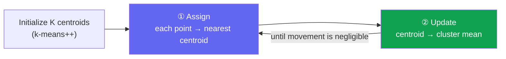

# K-Means: Grouping Similar Points

> [!NOTE] Goal of this chapter
> K-Means is both the **easiest algorithm to implement from scratch** and the canonical example of the unsupervised learning introduced in [What Is Machine Learning?](#/foundations/what-is-ml)—finding structure without answer labels. We will learn how to group similar points without labels, moving from an animation to a two-step loop and then executable code. It is a low-pressure warm-up.

## What it does—and why

When data points are scattered in space, you may want to divide them into **natural groups, or clusters**: this group looks like A, that group like B. There are no answer labels; the grouping must come only from the points' locations. This is **clustering**, and K-Means is its most widely used method.

The idea behind K-Means is remarkably simple. Place $K$ **centroids**, each representing one cluster, and alternate two steps:

1. **Assign:** assign every point to its *nearest* centroid.
2. **Update:** move every centroid to the *mean position of the points assigned to it*.

Stop when the centroids no longer move.

<figure>
<svg viewBox="0 0 640 300" xmlns="http://www.w3.org/2000/svg" font-family="Inter, sans-serif" font-size="12">
  <!-- cluster A points (left-bottom) -->
  <g fill="#0ea5e9">
    <circle cx="110" cy="215" r="5"/><circle cx="150" cy="235" r="5"/><circle cx="130" cy="195" r="5"/>
    <circle cx="175" cy="220" r="5"/><circle cx="95" cy="240" r="5"/><circle cx="160" cy="200" r="5"/>
  </g>
  <!-- cluster B points (right-top) -->
  <g fill="#e0533f">
    <circle cx="450" cy="80" r="5"/><circle cx="490" cy="100" r="5"/><circle cx="470" cy="60" r="5"/>
    <circle cx="510" cy="85" r="5"/><circle cx="440" cy="110" r="5"/><circle cx="500" cy="55" r="5"/>
  </g>
  <!-- centroid 1 (moves into cluster A) -->
  <g stroke="#12a150" stroke-width="2.5" fill="none">
    <circle r="9"/><path d="M-13 0 H13 M0 -13 V13"/>
    <animateTransform attributeName="transform" type="translate" dur="5s" repeatCount="indefinite"
      values="300 150; 240 175; 175 200; 138 216; 138 216; 300 150" keyTimes="0;0.18;0.4;0.62;0.9;1"/>
  </g>
  <!-- centroid 2 (moves into cluster B) -->
  <g stroke="#6366f1" stroke-width="2.5" fill="none">
    <circle r="9"/><path d="M-13 0 H13 M0 -13 V13"/>
    <animateTransform attributeName="transform" type="translate" dur="5s" repeatCount="indefinite"
      values="340 150; 400 135; 450 100; 476 82; 476 82; 340 150" keyTimes="0;0.18;0.4;0.62;0.9;1"/>
  </g>
  <text x="320" y="285" text-anchor="middle" fill="#98a3b2">The two centroids (＋) alternate assignment and update, pulled toward the center of each group</text>
</svg>
<figcaption>The green and purple centroids begin in an unhelpful middle region. Repeating "assign nearby points → move to their mean" makes them converge to the two cluster centers. That simple loop is all of K-Means.</figcaption>
</figure>

## What does it minimize?—inertia

The loop reduces the **sum of squared distances between each point and its assigned centroid**, called inertia or within-cluster sum of squares:

$$
J = \sum_{i=1}^{N} \lVert x_i - c_{a_i} \rVert^2,\qquad a_i = \arg\min_k \lVert x_i - c_k\rVert^2
$$

Here $a_i$ is the centroid index assigned to point $i$. The two steps are **coordinate descent** on $J$: with centroids fixed, the optimal assignment is the nearest one; with assignments fixed, the optimal centroid is the mean. Therefore, **inertia never increases**—a useful invariant to test. The destination is only a **local** rather than global minimum, however, so initialization matters.

## Distance-computation trick (vectorization)

A common mistake is materializing the difference for every point–centroid pair as an $(N,K,D)$ tensor. That wastes memory. Expanding the square instead produces the $(N,K)$ distance matrix with **one matrix multiplication**:

$$
\lVert x - c\rVert^2 = \lVert x\rVert^2 + \lVert c\rVert^2 - 2\,x\!\cdot\!c
$$

The cross-term $x c^\top$ is one GEMM, a large matrix multiplication. If broadcasting and matrix multiplication are not yet intuitive, read the [NumPy & Broadcasting Primer](#/ml-coding/numpy-primer) first.

> [!WARNING] Clamp distances to zero
> When a point almost coincides with a centroid, floating-point error can make the expanded expression slightly negative. Apply `np.maximum(d, 0)` so a later square root does not produce `nan`.

> [!TIP] Interview one-liner
> "Lloyd's algorithm alternates assignment and update until convergence; the only real traps are vectorizing the distance calculation and handling empty clusters." Naming those two traps instead of reciting the definition makes you sound like someone who has implemented it.

## Practice—implement, run, and test it

> [!TIP] How to use this section
> Every problem below has a **live Python editor with NumPy preloaded**. Write your solution and press **▶ Run tests** to see which cases pass. Open **Solution** if you are stuck, but try first—the struggle is the practice. The first run downloads the Python runtime and NumPy (about 15 MB); later runs are immediate.

Build from the bottom up: distance matrix → assignment → update → full loop.

### 1. Squared-Distance Matrix Easy

Use the expansion $\lVert x\rVert^2+\lVert c\rVert^2-2xc^\top$ to compute squared distances of shape $(N,K)$, then clamp them to $\ge 0$.

### 2. Assignment Step Easy

Label every point with the index of its nearest centroid—`argmin` over the $K$ axis, `axis=1`.

### 3. Update Step Easy

Recompute each centroid as the mean of its assigned members. If a cluster is empty, this function has no information from which to choose a sensible new center, so retain the corresponding entry from `old_centroids`. If no old centroids were supplied, raise an error rather than silently returning zero.

### 4. Full K-Means (seeded) Medium

Implement k-means++ initialization followed by Lloyd iterations. **K-means++** chooses the first center randomly, then samples every later center with probability proportional to its squared distance from the existing centers—$D^2$ weighting. This spreads the centers apart and greatly reduces the chance of a poor local minimum. A seeded RNG makes the result reproducible.

> [!NOTE] Framework one-liner
> Use `sklearn.cluster.KMeans(n_clusters=k, init="k-means++")`; at scale, use `MiniBatchKMeans` or FAISS k-means on GPU, often for vector-quantization codebooks.

## Common bugs interviewers watch for

- **Naive distance calculation:** an explicit $(N,K,D)$ difference tensor wastes memory. Use the expansion plus matrix multiplication.
- **Empty cluster:** retaining the old center preserves the non-increasing property of the standard Lloyd objective. Reseeding with a random or farthest point can help escape, but may increase inertia in that iteration, so treat it as an explicit policy and test it separately.
- **Wrong `argmin` axis:** reduce over $K$, not $N$—`axis=1`.
- **Convergence check:** do not rely only on `max_iter`; check centroid movement or assignment changes.
- **Reproducibility:** seed the RNG. K-Means is initialization-sensitive, so production code runs `n_init` restarts and keeps the solution with the lowest inertia.

## Q&A

Why does k-means++ help, and what does it cost?

**Short:** $D^2$-weighted sampling spreads the initial centroids out and avoids poor local minima from random initialization, at the cost of one additional $O(NK)$ seeding pass.

**Deep:** Random initialization often drops two centroids into the same real cluster and leaves another cluster unrepresented—a local optimum that Lloyd's algorithm cannot escape. K-means++ increases the probability of selecting distant points, giving an expected $O(\log K)$-competitive solution and usually fewer iterations. Seeding is cheap relative to the main loop, so it is nearly free insurance and the standard default.

How do you choose K?

**Short:** Use the inertia elbow, silhouette score, or gap statistic—but none is decisive, so combine them with domain knowledge.

**Deep:** Inertia decreases monotonically as $K$ grows, so look for the elbow where marginal gains flatten. Silhouette compares cohesion with separation for each point, ranges from $[-1,1]$, and penalizes over-clustering. The gap statistic compares inertia against a uniform random reference. In practice, the downstream task—codebook size or number of prototypes—often fixes $K$ directly.

K-Means vs. a Gaussian Mixture Model (GMM)?

**Short:** K-Means is the hard-assignment, equal-isotropic-variance special case of a GMM fitted with EM.

**Deep:** A GMM E-step computes responsibilities $p(k\mid x_i)$ instead of a hard argmin; its M-step updates means, covariances, and mixture weights. Setting every covariance to $\sigma^2 I$ and taking the small-variance limit connects it to K-Means. Responsibilities are posterior assignments inside the model, not automatically well-calibrated probabilities.

### Follow-ups

- **Nonspherical clusters or different densities?** K-Means fails because of its isotropic, similarly sized-cluster bias. Use a GMM, DBSCAN, or spectral clustering.
- **Feature scaling?** Standardize first; raw Euclidean distance is dominated by high-scale features.
- **Streaming or enormous N?** MiniBatch K-Means updates centroids from sampled batches.
- **Connection to CV?** Color quantization, bag-of-visual-words, and VQ-VAE codebooks all rely on K-Means-like clustering.

## Cheat-sheet

| Item | Value |
| --- | --- |
| Objective | minimize inertia $\sum \lVert x_i - c_{a_i}\rVert^2$ |
| Two steps | assignment (argmin distance) ↔ update (cluster mean) |
| Distance | $\lVert x\rVert^2+\lVert c\rVert^2-2xc^\top$, clamped to $\ge 0$ |
| Initialization | k-means++: $D^2$-weighted sampling |
| Empty cluster | default: retain old center; reseeding is a separate heuristic and can increase inertia |
| Invariant | an exact Lloyd assignment+mean update that retains empty centers never increases inertia |
| Complexity | $O(NKD)$ per iteration, $O(NK)$ memory |
| Convergence | **local** optimum → restart with `n_init` |

**Next:** [NumPy & Broadcasting Primer](#/ml-coding/numpy-primer) · [Probability & Statistics](#/foundations/probability-statistics) · [Vision Foundation Models](#/cv/foundation-models) · [ML Coding Round](#/ml-coding/intro)
