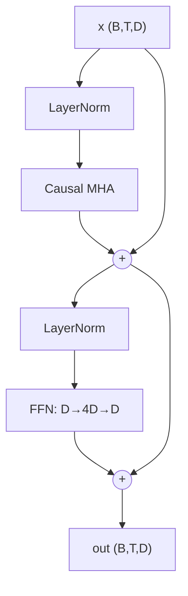

# Transformer Block 직접 구현

> [!NOTE] 이 챕터의 목표
> [Attention 직접 구현](#/ml-coding/attention)에서 만든 attention과 [Positional Encoding & RoPE](#/ml-coding/positional-encoding-rope)를 이제 **하나의 블록으로 조립**합니다. transformer 블록은 사실 딱 네 조각 — **attention + FFN + residual(잔차 연결) + normalization** — 의 레고 조립이고, 이 블록을 $N$번 쌓으면 GPT·LLM·VLM이 됩니다. 실제 코드베이스를 열면 보게 되는 게 바로 이 블록입니다.

## 블록은 네 조각의 조립이다

복잡해 보이지만 한 줄로 요약됩니다. 입력 `x`를 그대로 통과시키는 **큰길(residual stream, 잔차 흐름)** 이 있고, 그 위에 두 개의 "샛길"이 붙어 각자 조금씩 정보를 더합니다:

$$
x \leftarrow x + \text{Attn}(\text{Norm}(x)), \qquad x \leftarrow x + \text{FFN}(\text{Norm}(x))
$$

- **Attn**: 토큰끼리 정보를 섞음 ("이 단어가 어떤 단어를 봐야 하나")
- **FFN**(feed-forward network, 피드포워드): 각 토큰을 개별적으로 가공 ("지식"의 대부분이 여기 저장)
- **residual(잔차 연결)**: 원본 `x`에 결과를 *더함* — 큰길은 그대로 두고 delta만 얹음
- **Norm**(정규화): 각 샛길 입력의 크기를 안정화 ([Normalization & 학습 안정성](#/foundations/normalization-stability))

<figure>
<svg viewBox="0 0 640 220" xmlns="http://www.w3.org/2000/svg" font-family="Inter, sans-serif" font-size="12">
  <!-- residual highway -->
  <line x1="40" y1="110" x2="600" y2="110" stroke="#0ea5e9" stroke-width="4"/>
  <text x="70" y="100" fill="#0ea5e9" font-weight="700">residual stream (큰길)</text>
  <circle cx="40" cy="110" r="6" fill="#0ea5e9"/><text x="30" y="135" fill="currentColor">x</text>
  <!-- attn branch -->
  <path d="M200 110 v-45 h60" fill="none" stroke="#98a3b2" stroke-width="1.5"/>
  <rect x="200" y="35" width="130" height="30" rx="6" fill="#6366f1"/><text x="265" y="55" text-anchor="middle" fill="#fff">Attn(Norm(x))</text>
  <path d="M330 50 h30 v55" fill="none" stroke="#98a3b2" stroke-width="1.5"/>
  <circle cx="360" cy="110" r="11" fill="none" stroke="#e0533f" stroke-width="2"/><text x="360" y="114" text-anchor="middle" fill="#e0533f">+</text>
  <!-- ffn branch -->
  <path d="M430 110 v-45 h20" fill="none" stroke="#98a3b2" stroke-width="1.5"/>
  <rect x="430" y="35" width="110" height="30" rx="6" fill="#12a150"/><text x="485" y="55" text-anchor="middle" fill="#fff">FFN(Norm(x))</text>
  <path d="M540 50 h20 v55" fill="none" stroke="#98a3b2" stroke-width="1.5"/>
  <circle cx="560" cy="110" r="11" fill="none" stroke="#e0533f" stroke-width="2"/><text x="560" y="114" text-anchor="middle" fill="#e0533f">+</text>
  <circle cx="600" cy="110" r="6" fill="#0ea5e9"/><text x="590" y="135" fill="currentColor">out</text>
  <text x="320" y="185" text-anchor="middle" fill="#98a3b2">두 샛길이 각자 &quot;delta&quot;를 계산해 큰길에 더할 뿐 — 큰길(x)은 끊기지 않는다.</text>
  <text x="320" y="205" text-anchor="middle" fill="#98a3b2">이 끊기지 않는 큰길이 gradient를 깊은 스택까지 흘려보낸다 (residual의 핵심).</text>
</svg>
<figcaption>transformer 블록: 입력이 흐르는 residual "큰길"과, 각자 delta를 더하는 attention·FFN "샛길" 두 개. 입출력 shape이 같아 그대로 $N$번 쌓을 수 있습니다.</figcaption>
</figure>

## Pre-norm 블록 구조



**Pre-norm**(각 residual 분기 *안에서* 정규화)은 현대적 기본값입니다: residual stream이 처음부터 끝까지 정규화되지 않은(un-normalized) 상태로 유지되어 gradient가 깊은 스택을 깔끔하게 흐릅니다. Post-norm(원래 2017 논문)은 안정성을 위해 learning-rate warmup(초기 학습률 예열)이 필요합니다. [Normalization & 학습 안정성](#/foundations/normalization-stability) 참고.

> [!TIP] 면접 한 줄
> "pre-norm decoder block은 두 개의 residual sub-layer입니다: `x = x + Attn(Norm(x))` 다음 `x = x + FFN(Norm(x))`. residual stream이 척추이고, 모든 sub-layer는 정규화된 복사본을 읽어 delta를 다시 씁니다." 이 문장을 확실히 하면 코드는 저절로 써집니다.

## PyTorch로 구현한 전체 block

먼저 실무에서 실제로 쓰는 형태를 봅시다(읽기용). 아래 NumPy 랩에서 핵심 조각(LayerNorm·FFN)을 직접 구현하게 됩니다.

```python
import torch, torch.nn as nn, torch.nn.functional as F


def apply_rope(q, k, start_pos=0, base=10_000.0):
    """Rotate Q/K pairs; q,k:(B,H,T,Dh), cached K is stored after rotation."""
    rotary_dim = q.shape[-1] - q.shape[-1] % 2
    if rotary_dim == 0:
        return q, k
    pos = torch.arange(start_pos, start_pos + q.shape[-2], device=q.device,
                       dtype=torch.float32)
    inv = base ** (-torch.arange(0, rotary_dim, 2, device=q.device,
                                 dtype=torch.float32) / rotary_dim)
    angle = pos[:, None] * inv[None, :]
    cos = angle.cos().to(q.dtype)[None, None, :, :]
    sin = angle.sin().to(q.dtype)[None, None, :, :]

    def rotate(x):
        out = x.clone()
        even, odd = x[..., :rotary_dim:2], x[..., 1:rotary_dim:2]
        out[..., :rotary_dim:2] = even * cos - odd * sin
        out[..., 1:rotary_dim:2] = even * sin + odd * cos
        return out

    return rotate(q), rotate(k)


class FeedForward(nn.Module):
    """Position-wise FFN, 4x expansion. (Modern LLMs use SwiGLU.)"""
    def __init__(self, d_model, mult=4, dropout=0.0):
        super().__init__()
        self.net = nn.Sequential(
            nn.Linear(d_model, mult * d_model), nn.GELU(),
            nn.Linear(mult * d_model, d_model), nn.Dropout(dropout),
        )
    def forward(self, x):
        return self.net(x)


class CausalSelfAttention(nn.Module):
    def __init__(self, d_model, n_heads, dropout=0.0):
        super().__init__()
        assert d_model % n_heads == 0
        self.h, self.dh, self.drop = n_heads, d_model // n_heads, dropout
        self.qkv = nn.Linear(d_model, 3 * d_model, bias=False)
        self.proj = nn.Linear(d_model, d_model, bias=False)

    def forward(self, x, kv_cache=None):
        B, T, D = x.shape
        q, k, v = self.qkv(x).chunk(3, dim=-1)
        q, k, v = (t.view(B, T, self.h, self.dh).transpose(1, 2)
                   for t in (q, k, v))                 # (B,H,T,Dh)
        past = 0
        if kv_cache is not None and kv_cache.get("k") is not None:
            past = kv_cache["k"].shape[2]
        q, k = apply_rope(q, k, start_pos=past)

        if kv_cache is not None:                        # decode: append new K/V
            if past:
                k = torch.cat([kv_cache["k"], k], dim=2)
                v = torch.cat([kv_cache["v"], v], dim=2)
            kv_cache["k"], kv_cache["v"] = k, v

        # A single-token decode query has no future token in this call. For a
        # chunk after cached history, build an offset causal mask explicitly.
        attn_mask = None
        causal = kv_cache is None or past == 0
        if past and T > 1:
            q_pos = past + torch.arange(T, device=x.device)[:, None]
            k_pos = torch.arange(past + T, device=x.device)[None, :]
            attn_mask = k_pos <= q_pos
            causal = False
        o = F.scaled_dot_product_attention(
            q, k, v, attn_mask=attn_mask, is_causal=causal,
            dropout_p=self.drop if self.training else 0.0)
        return self.proj(o.transpose(1, 2).reshape(B, T, D))


class DecoderBlock(nn.Module):
    def __init__(self, d_model, n_heads, dropout=0.0):
        super().__init__()
        self.ln1, self.ln2 = nn.LayerNorm(d_model), nn.LayerNorm(d_model)
        self.attn = CausalSelfAttention(d_model, n_heads, dropout)
        self.ffn = FeedForward(d_model, dropout=dropout)

    def forward(self, x, kv_cache=None):
        x = x + self.attn(self.ln1(x), kv_cache=kv_cache)   # residual 1
        x = x + self.ffn(self.ln2(x))                       # residual 2
        return x
```

**Shape:** 입력/출력 모두 `(B, T, D)` 입니다 — block은 shape을 보존하며, 그래서 $N$개를 쌓을 수 있습니다. **block당 복잡도:** attention에 $O(T^2 d)$ + FFN에 $O(T d^2)$ (짧은 context에서는 FFN이 FLOP를 지배하고, 긴 context에서는 attention이 메모리를 지배합니다).

## LayerNorm (요약)

블록 안의 `nn.LayerNorm`은 **token마다 feature 차원에 대해** 정규화(평균 빼고 분산으로 나눈 뒤 $\gamma,\beta$로 scale·shift)하므로 batch size와 시퀀스 길이에 독립적입니다 — 그래서 Transformer가 BatchNorm 대신 이걸 씁니다. RMSNorm(LLaMA)은 mean-centering과 $\beta$를 버리고 scale만 유지합니다. from-scratch NumPy 구현 랩과 역전파·유도는 canonical owner인 [Normalization & 학습 안정성](#/foundations/normalization-stability) 참고.

## Feed-forward network (NumPy)

Position-wise FFN은 사이에 GELU를 둔 $D\to 4D\to D$ 입니다 (여기서는 tanh 근사). `feedforward`는 `np.random.seed(0)`으로 가중치를 seed해 출력이 결정적입니다:

<div class="widget" data-widget="code">
<script type="application/json" class="code-config">
{"func":"feedforward","packages":["numpy"],"approx":true,"starter":"import numpy as np\n\ndef gelu(x):\n    return 0.5 * x * (1.0 + np.tanh(np.sqrt(2.0 / np.pi) * (x + 0.044715 * x ** 3)))\n\ndef feedforward(x, mult=4):\n    # D -> mult*D -> D, GELU between; seed weights with np.random.seed(0), zero biases\n    pass","tests":[{"args":[[[1,0,2,-1]]],"expect":[[0.040465675581605985,0.08127055857994071,0.08630397145291878,0.008689684748444178]]},{"args":[[[0.5,-0.5,1.0,0.0],[1,1,1,1]]],"expect":[[0.007273512058388274,0.012726852245228204,0.04167160290468261,-0.030555200099704558],[0.011904363992137353,0.043640236183920614,0.02597430169327689,0.02262224203686889]]}],"solution":"import numpy as np\n\ndef gelu(x):\n    return 0.5 * x * (1.0 + np.tanh(np.sqrt(2.0 / np.pi) * (x + 0.044715 * x ** 3)))\n\ndef feedforward(x, mult=4):\n    x = np.asarray(x, dtype=float)\n    d = x.shape[-1]\n    np.random.seed(0)\n    W1 = np.random.randn(d, mult * d) * 0.1\n    b1 = np.zeros(mult * d)\n    W2 = np.random.randn(mult * d, d) * 0.1\n    b2 = np.zeros(d)\n    h = gelu(x @ W1 + b1)\n    return h @ W2 + b2"}
</script>
</div>

## Causal mask (인과 마스크)

`scaled_dot_product_attention`에서 `is_causal=True`는 square prefill/training에 하삼각 mask를 적용합니다. 과거 길이가 $P$인 cache 뒤에 길이 $T>1$인 chunk를 붙이면 단순히 `is_causal=False`로 둘 수 없습니다. query $i$는 key 위치 $\le P+i$만 보도록 **offset causal mask**가 필요합니다. Teacher forcing은 inference와 같은 causal dependency를 학습하지만, 학습 때는 정답 prefix를 보고 생성 때는 모델의 prefix를 본다는 distribution 차이(exposure bias)는 남습니다.

## KV-cache (inference 최적화)

> [!NOTE] 왜 존재하는가 — 직관
> 고정된 모델·adapter·prompt의 한 causal forward 안에서는 이미 지난 token의 layer별 K/V를 재사용할 수 있습니다. 모델, adapter, position scheme 또는 prefix가 바뀌면 cache는 무효입니다. KV-cache는 새 token의 Q/K/V만 계산해 step당 attention을 context 길이에 선형으로 줄이지만, 아래 교육용 `torch.cat`은 매번 cache를 복사합니다. 실제 serving은 preallocated/paged cache를 씁니다.

<figure>
<svg viewBox="0 0 640 170" xmlns="http://www.w3.org/2000/svg" font-family="Inter, sans-serif" font-size="12">
  <text x="20" y="20" fill="#98a3b2">생성이 진행될수록 캐시가 한 칸씩 자란다 (새 토큰만 계산):</text>
  <!-- growing cache cells appearing over time -->
  <g>
    <rect x="20" y="45" width="34" height="34" rx="4" fill="#0ea5e9" opacity="0.85"/>
    <rect x="58" y="45" width="34" height="34" rx="4" fill="#0ea5e9" opacity="0"><animate attributeName="opacity" values="0;0;0.85;0.85;0.85" keyTimes="0;0.2;0.25;0.9;1" dur="4s" repeatCount="indefinite"/></rect>
    <rect x="96" y="45" width="34" height="34" rx="4" fill="#0ea5e9" opacity="0"><animate attributeName="opacity" values="0;0;0;0.85;0.85" keyTimes="0;0.4;0.45;0.9;1" dur="4s" repeatCount="indefinite"/></rect>
    <rect x="134" y="45" width="34" height="34" rx="4" fill="#0ea5e9" opacity="0"><animate attributeName="opacity" values="0;0;0;0;0.85;0.85" keyTimes="0;0.6;0.62;0.65;0.9;1" dur="4s" repeatCount="indefinite"/></rect>
    <rect x="172" y="45" width="34" height="34" rx="4" fill="#e0533f" opacity="0"><animate attributeName="opacity" values="0;0;0;0;0;0.9;0.9" keyTimes="0;0.7;0.75;0.78;0.8;0.85;1" dur="4s" repeatCount="indefinite"/></rect>
    <text x="113" y="105" text-anchor="middle" fill="#0ea5e9">저장된 과거 K/V (재사용)</text>
    <text x="189" y="128" text-anchor="middle" fill="#e0533f">새 토큰만 계산</text>
  </g>
  <line x1="330" y1="45" x2="330" y2="120" stroke="#98a3b2" stroke-dasharray="4 3"/>
  <text x="350" y="60" fill="#98a3b2">Prefill: 프롬프트 전체를 한 번에 (square attention)</text>
  <text x="350" y="82" fill="#98a3b2">Decode: 스텝마다 Q/K/V 1개 계산 → 캐시에 append</text>
  <text x="350" y="104" fill="#98a3b2">→ 각 스텝 비용 O(T²) ⟶ O(T)</text>
</svg>
<figcaption>KV-cache: 파란 칸(과거 K/V)은 재사용하고 빨간 칸(새 토큰)만 계산해 이어붙입니다. 그래서 긴 context에서는 이 캐시 메모리가 서빙의 지배적 비용이 되고, GQA/MQA·paged/quantized KV가 중요해집니다.</figcaption>
</figure>

<dl class="kv">
<dt>Prefill</dt><dd>전체 prompt를 한 번에 처리(square, causal attention); 모든 K/V를 캐시합니다.</dd>
<dt>Decode</dt><dd>새 token마다: Q/K/V를 계산하고, K/V를 캐시에 append하며, 캐시 전체에 attend합니다. query 길이가 1이므로 causal mask가 필요 없습니다.</dd>
<dt>Cost</dt><dd>원소 수는 $2LBT H_{kv}d_h$이고, 메모리 byte는 여기에 dtype당 byte와 scale/metadata를 곱합니다. GQA/MQA는 query head가 아니라 $H_{kv}$를 줄입니다.</dd>
</dl>

> **PyTorch식 pseudocode — model-level prefill → decode**

```python
model.eval()
with torch.inference_mode():
    logits, cache = model(prompt_ids, use_cache=True)  # prefill: [B,T]
    next_id = sample(logits[:, -1])                    # 마지막 위치만 사용
    generated = [next_id]

    while not all_finished(generated):
        pos = cache.sequence_length                    # RoPE/position offset
        logits, cache = model(next_id[:, None], past=cache, position=pos)
        next_id = sample(logits[:, -1])                # decode 입력은 [B,1]
        generated.append(next_id)                      # EOS가 난 row는 별도 mask
```

## Sanity check

```python
if __name__ == "__main__":
    B, T, D, H = 2, 8, 64, 4
    blk = DecoderBlock(D, H)
    x = torch.randn(B, T, D)
    assert blk(x).shape == (B, T, D)             # shape-preserving

    # incremental decode with KV-cache matches full forward (eval mode)
    blk.eval()
    with torch.no_grad():
        full = blk(x)
        cache, outs = {"k": None, "v": None}, []
        for t in range(T):
            outs.append(blk(x[:, t:t + 1], kv_cache=cache))
        step = torch.cat(outs, dim=1)
    assert torch.allclose(full, step, atol=1e-4)  # cached == recomputed
    print("block OK, KV-cache consistent")
```

> [!DANGER] 면접관이 지켜보는 흔한 버그
> 분기 입력이 아니라 residual path에 norm 적용하기(pre-norm이 깨짐); sub-layer *이전*에 residual 더하기; feature 축이 아니라 batch/token 축으로 LayerNorm; `is_causal` 빼먹기(미래가 누출됨); off-by-one으로 캐시가 현재 token을 이중 계산; single-token decode 중에 causal mask를 끄지 않기.

## Q&A

<details class="qa"><summary>왜 residual connection인가 — 없으면 무엇이 깨지나요?</summary>
<div class="qa-body">

**짧게:** residual은 gradient에 identity path(항등 경로)를 주어 깊은 스택이 vanishing gradient(기울기 소실) 없이 학습되게 하고, 각 block은 running 표현에 대한 *delta*만 학습하면 됩니다.

**깊게:** $x+f(x)$의 Jacobian에는 identity 항이 있어 gradient 경로를 개선하지만, 다른 항과의 상쇄·나쁜 scale·projection 때문에 "손실 없는 전달"을 보장하지는 않습니다. residual과 normalization이 깊은 모델의 optimization을 크게 쉽게 만드는 것이 핵심이며, 특정 층수 이상이 절대 학습 불가능하다고 단정하지 않습니다.
</div></details>

<details class="qa"><summary>왜 FFN이 4×로 확장하나요?</summary>
<div class="qa-body">

**짧게:** attention은 token *간에* 정보를 섞지만 (token당) 가중 평균이라 대체로 선형입니다; FFN은 token 단위의 비선형 연산으로, 대부분의 파라미터와 "지식"이 여기 살며, 넓은 hidden layer가 그 용량을 줍니다.

**깊게:** GELU를 쓰는 두 층짜리 FFN $D\to 4D\to D$는 모든 position에 동일하게 적용됩니다. 4× 비율은 경험적 sweet spot입니다. 현대 LLM은 gated 변형(SwiGLU: $\text{Swish}(xW_1)\odot(xW_2)$ 다음 $W_3$)을 쓰며, 파라미터 수를 맞추기 위해 흔히 ~$\frac{8}{3}D$ hidden dim을 씁니다. FFN 층이 Transformer 파라미터의 대부분을 차지합니다.
</div></details>

<details class="qa"><summary>이 block은 VLM 안에서 어떻게 다른가요?</summary>
<div class="qa-body">

**짧게:** 구조적으로 동일합니다 — vision token(ViT encoder + projector에서 나온)이 같은 시퀀스에 삽입되고, decoder가 text + image token을 함께 self-attend합니다.

**깊게:** decoder-only VLM(LLaVA/Qwen-VL 스타일)은 block을 전혀 바꾸지 않습니다: image가 시퀀스 위치를 차지하는 embedding 집합이 되고(때로는 modality별 position scheme와 함께), causal mask가 text를 image token으로 되돌아 attend하게 합니다. Cross-attention VLM(Flamingo)은 대신 image K/V를 읽는 gated cross-attention 층을 추가합니다. [VLM Implementation Details](#/vlm/practical)를 참고하세요.
</div></details>

### Follow-ups
- **Pre-norm vs post-norm?** Pre-norm은 대체로 더 안정적이지만 large-scale recipe에서는 여전히 warmup을 자주 씁니다. post-norm의 품질·안정성 차이는 깊이와 초기화에 따라 달라집니다.
- **RMSNorm vs LayerNorm?** RMSNorm은 mean-centering을 건너뜁니다 — 더 싸고 품질은 비슷합니다 (LLaMA).
- **Weight tying?** token-embedding과 LM-head 행렬을 공유해 파라미터를 아끼고 입력/출력 공간을 결합합니다.
- **RoPE?** position마다 Q/K를 회전하고 decode 때 `start_pos=past_length` offset을 써야 합니다. 길이 scaling은 context 확장을 도울 수 있지만 학습 길이 밖의 품질을 자동 보장하지 않습니다.

## Cheat-sheet

| Item | Value |
| --- | --- |
| Block | `x += Attn(Norm(x)); x += FFN(Norm(x))` (pre-norm) |
| Shape | `(B,T,D)` 입출력 — 쌓을 수 있음 |
| LayerNorm axis | 마지막(feature) 차원, token마다 |
| FFN | $D\to 4D\to D$, GELU (또는 SwiGLU $\sim\frac83 D$) |
| Causal mask | lower-triangular, softmax 이전에 적용 |
| Complexity | block당 $O(T^2 d)$ attn + $O(T d^2)$ FFN |
| KV-cache | 과거 K/V 저장; decode 스텝 $O(T^2)\to O(T)$ |
| KV-cache shrink | GQA/MQA, quantized/paged KV |

**다음:** [Attention 직접 구현](#/ml-coding/attention) · [Positional Encoding & RoPE](#/ml-coding/positional-encoding-rope) · [CNN · RNN · Transformer](#/foundations/architectures) · [Normalization & 학습 안정성](#/foundations/normalization-stability) · [LLM Fundamentals](#/llm/fundamentals) · [VLM Implementation Details](#/vlm/practical)
