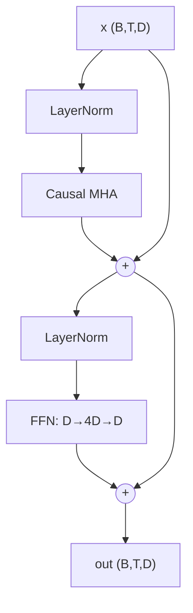

# Transformer Block

> [!TIP] 이 말부터 시작하세요
> "pre-norm decoder block은 두 개의 residual sub-layer입니다: `x = x + Attn(Norm(x))` 다음 `x = x + FFN(Norm(x))`. residual stream이 척추이고, 모든 sub-layer는 정규화된 복사본을 읽어 delta를 다시 씁니다." 이 문장을 확실히 하면 코드는 저절로 써집니다.

[Attention From Scratch](#/ml-coding/attention) 위에 세워집니다. 여기서는 전체 block — multi-head attention + feed-forward network + residual + normalization — 을 조립하고, causal mask를 추가하며, KV-cache를 설명합니다. 실제 LLM/VLM 코드베이스를 열면 보게 되는 것이 바로 이것입니다.

## Pre-norm decoder block 구조



**Pre-norm**(각 residual 분기 *안에서* 정규화)은 현대적 기본값입니다: residual stream이 처음부터 끝까지 un-normalized 상태로 유지되어 gradient가 깊은 스택을 깔끔하게 흐릅니다. Post-norm(원래 2017 논문)은 안정성을 위해 learning-rate warmup이 필요합니다. [Normalization & Stability](#/foundations/normalization-stability)를 참고하세요.

## PyTorch로 구현한 전체 block

```python
import torch, torch.nn as nn, torch.nn.functional as F


class FeedForward(nn.Module):
    """Position-wise FFN, 4x expansion. (Modern LLMs use SwiGLU.)"""
    def __init__(self, d_model, mult=4, dropout=0.0):
        super().__init__()
        self.net = nn.Sequential(
            nn.Linear(d_model, mult * d_model), nn.GELU(),
            nn.Linear(mult * d_model, d_model), nn.Dropout(dropout),
        )
    def forward(self, x):
        return self.net(x)


class CausalSelfAttention(nn.Module):
    def __init__(self, d_model, n_heads, dropout=0.0):
        super().__init__()
        assert d_model % n_heads == 0
        self.h, self.dh, self.drop = n_heads, d_model // n_heads, dropout
        self.qkv = nn.Linear(d_model, 3 * d_model, bias=False)
        self.proj = nn.Linear(d_model, d_model, bias=False)

    def forward(self, x, kv_cache=None):
        B, T, D = x.shape
        q, k, v = self.qkv(x).chunk(3, dim=-1)
        q, k, v = (t.view(B, T, self.h, self.dh).transpose(1, 2)
                   for t in (q, k, v))                 # (B,H,T,Dh)
        if kv_cache is not None:                        # decode: append new K/V
            if kv_cache.get("k") is not None:
                k = torch.cat([kv_cache["k"], k], dim=2)
                v = torch.cat([kv_cache["v"], v], dim=2)
            kv_cache["k"], kv_cache["v"] = k, v
        # is_causal only for the prefill/training path (square attention)
        causal = kv_cache is None
        o = F.scaled_dot_product_attention(
            q, k, v, is_causal=causal,
            dropout_p=self.drop if self.training else 0.0)
        return self.proj(o.transpose(1, 2).reshape(B, T, D))


class DecoderBlock(nn.Module):
    def __init__(self, d_model, n_heads, dropout=0.0):
        super().__init__()
        self.ln1, self.ln2 = nn.LayerNorm(d_model), nn.LayerNorm(d_model)
        self.attn = CausalSelfAttention(d_model, n_heads, dropout)
        self.ffn = FeedForward(d_model, dropout=dropout)

    def forward(self, x, kv_cache=None):
        x = x + self.attn(self.ln1(x), kv_cache=kv_cache)   # residual 1
        x = x + self.ffn(self.ln2(x))                       # residual 2
        return x
```

**Shape:** 입력/출력 모두 `(B, T, D)` 입니다 — block은 shape을 보존하며, 그래서 $N$개를 쌓을 수 있습니다. **block당 복잡도:** attention에 $O(T^2 d)$ + FFN에 $O(T d^2)$ (짧은 context에서는 FFN이 FLOP를 지배하고, 긴 context에서는 attention이 메모리를 지배합니다).

## LayerNorm 직접 구현

> [!TIP] 라이브 코드 — 직접 구현하고 실행·테스트
> 아래 NumPy 블록은 **라이브 에디터**입니다. 본문을 채우고 **▶ Run tests**를 누르면 어떤 케이스가 통과하는지 보여줍니다. 막히면 참고용 **Solution**을 열 수 있지만, 먼저 직접 시도하세요 — 그 씨름이 곧 연습입니다. 첫 Run에서 작은 Python 런타임과 NumPy(~15 MB)를 내려받고, 이후 실행은 즉시입니다.

<div class="widget" data-widget="code">
<script type="application/json" class="code-config">
{"func":"layer_norm","packages":["numpy"],"approx":true,"starter":"import numpy as np\n\ndef layer_norm(x, gamma, beta, eps=1e-5):\n    # normalize over the LAST dim (per token): (x-mean)/sqrt(var+eps), then scale by gamma, shift by beta\n    pass","tests":[{"args":[[[1,2,3,4]],[1,1,1,1],[0,0,0,0]],"expect":[[-1.3416354199689269,-0.447211806656309,0.447211806656309,1.3416354199689269]]},{"args":[[[1,2,3,4],[10,10,10,10]],[1,1,1,1],[0,0,0,0]],"expect":[[-1.3416354199689269,-0.447211806656309,0.447211806656309,1.3416354199689269],[0.0,0.0,0.0,0.0]]},{"args":[[[2,4,6,8]],[2,2,2,2],[1,1,1,1]],"expect":[[-1.6832788897221995,0.10557370342593342,1.8944262965740666,3.6832788897221995]]}],"solution":"import numpy as np\n\ndef layer_norm(x, gamma, beta, eps=1e-5):\n    x, gamma, beta = np.asarray(x, float), np.asarray(gamma, float), np.asarray(beta, float)\n    mu = x.mean(-1, keepdims=True)\n    var = x.var(-1, keepdims=True)\n    return gamma * (x - mu) / np.sqrt(var + eps) + beta"}
</script>
</div>

LayerNorm은 **token마다 feature 차원에 대해** 정규화하므로 batch size와 시퀀스 길이에 독립적입니다 — 그래서 Transformer가 BatchNorm 대신 이걸 씁니다. RMSNorm(LLaMA)은 mean-centering과 $\beta$를 버리고 scale만 유지합니다.

## Feed-forward network (NumPy)

Position-wise FFN은 사이에 GELU를 둔 $D\to 4D\to D$ 입니다 (여기서는 tanh 근사). `feedforward`는 `np.random.seed(0)`으로 가중치를 seed해 출력이 결정적입니다:

<div class="widget" data-widget="code">
<script type="application/json" class="code-config">
{"func":"feedforward","packages":["numpy"],"approx":true,"starter":"import numpy as np\n\ndef gelu(x):\n    return 0.5 * x * (1.0 + np.tanh(np.sqrt(2.0 / np.pi) * (x + 0.044715 * x ** 3)))\n\ndef feedforward(x, mult=4):\n    # D -> mult*D -> D, GELU between; seed weights with np.random.seed(0), zero biases\n    pass","tests":[{"args":[[[1,0,2,-1]]],"expect":[[0.040465675581605985,0.08127055857994071,0.08630397145291878,0.008689684748444178]]},{"args":[[[0.5,-0.5,1.0,0.0],[1,1,1,1]]],"expect":[[0.007273512058388274,0.012726852245228204,0.04167160290468261,-0.030555200099704558],[0.011904363992137353,0.043640236183920614,0.02597430169327689,0.02262224203686889]]}],"solution":"import numpy as np\n\ndef gelu(x):\n    return 0.5 * x * (1.0 + np.tanh(np.sqrt(2.0 / np.pi) * (x + 0.044715 * x ** 3)))\n\ndef feedforward(x, mult=4):\n    x = np.asarray(x, dtype=float)\n    d = x.shape[-1]\n    np.random.seed(0)\n    W1 = np.random.randn(d, mult * d) * 0.1\n    b1 = np.zeros(mult * d)\n    W2 = np.random.randn(mult * d, d) * 0.1\n    b2 = np.zeros(d)\n    h = gelu(x @ W1 + b1)\n    return h @ W2 + b2"}
</script>
</div>

## Causal mask

`scaled_dot_product_attention`에서 `is_causal=True`는 lower-triangular mask를 공짜로 적용합니다. 수동으로는 `torch.triu(torch.full((T,T), -inf), diagonal=1)`을 점수에 더하는 것입니다 — position $t$는 $\le t$에만 attend할 수 있고, autoregression을 강제해 teacher forcing 학습이 inference와 일치하게 합니다.

## KV-cache (inference 최적화)

> [!NOTE] 왜 존재하는가
> autoregressive 생성 중에 과거 token의 key와 value는 **절대 바뀌지 않습니다**. 매 스텝마다 재계산하는 것은 $O(T^2)$의 중복 작업입니다. KV-cache는 과거 $K,V$를 저장하고 새 token의 것만 append하여, 각 decode 스텝을 $O(T^2)$ 대신 $O(T)$로 만듭니다.

<dl class="kv">
<dt>Prefill</dt><dd>전체 prompt를 한 번에 처리(square, causal attention); 모든 K/V를 캐시합니다.</dd>
<dt>Decode</dt><dd>새 token마다: Q/K/V를 계산하고, K/V를 캐시에 append하며, 캐시 전체에 attend합니다. query 길이가 1이므로 causal mask가 필요 없습니다.</dd>
<dt>Cost</dt><dd>캐시 메모리는 $2 \cdot L \cdot B \cdot H \cdot T \cdot d_h$ 입니다 (K와 V를 위해 바이트 ×2) — 긴 context에서 지배적인 메모리이며, 그래서 <b>GQA/MQA</b>(더 적은 KV head)와 paged/quantized KV 캐시가 중요합니다.</dd>
</dl>

## Sanity check

```python
if __name__ == "__main__":
    B, T, D, H = 2, 8, 64, 4
    blk = DecoderBlock(D, H)
    x = torch.randn(B, T, D)
    assert blk(x).shape == (B, T, D)             # shape-preserving

    # incremental decode with KV-cache matches full forward (eval mode)
    blk.eval()
    with torch.no_grad():
        full = blk(x)
        cache, outs = {"k": None, "v": None}, []
        for t in range(T):
            outs.append(blk(x[:, t:t + 1], kv_cache=cache))
        step = torch.cat(outs, dim=1)
    assert torch.allclose(full, step, atol=1e-4)  # cached == recomputed
    print("block OK, KV-cache consistent")
```

> [!DANGER] 면접관이 지켜보는 흔한 버그
> 분기 입력이 아니라 residual path에 norm 적용하기(pre-norm이 깨짐); sub-layer *이전*에 residual 더하기; feature 축이 아니라 batch/token 축으로 LayerNorm; `is_causal` 빼먹기(미래가 누출됨); off-by-one으로 캐시가 현재 token을 이중 계산; single-token decode 중에 causal mask를 끄지 않기.

## Q&A

<details class="qa"><summary>왜 residual connection인가 — 없으면 무엇이 깨지나요?</summary>
<div class="qa-body">

**짧게:** residual은 gradient에 identity path를 주어 깊은 스택이 vanishing gradient 없이 학습되게 하고, 각 block은 running 표현에 대한 *delta*만 학습하면 됩니다.

**깊게:** $x + f(x)$의 $x$에 대한 미분은 $1 + f'(x)$ 입니다 — 이 $1$이 $f'$가 아주 작을 때도 gradient 흐름을 보장합니다. 개념적으로 residual stream은 모든 block이 읽고 작은 업데이트를 쓰는 공유 bus이고, 각 sub-layer 앞의 norm이 입력을 잘 스케일된 상태로 유지합니다. residual을 없애면 12층 이상의 Transformer는 사실상 학습되지 않습니다.
</div></details>

<details class="qa"><summary>왜 FFN이 4×로 확장하나요?</summary>
<div class="qa-body">

**짧게:** attention은 token *간에* 정보를 섞지만 (token당) 가중 평균이라 대체로 선형입니다; FFN은 token 단위의 비선형 연산으로, 대부분의 파라미터와 "지식"이 여기 살며, 넓은 hidden layer가 그 용량을 줍니다.

**깊게:** GELU를 쓰는 두 층짜리 FFN $D\to 4D\to D$는 모든 position에 동일하게 적용됩니다. 4× 비율은 경험적 sweet spot입니다. 현대 LLM은 gated 변형(SwiGLU: $\text{Swish}(xW_1)\odot(xW_2)$ 다음 $W_3$)을 쓰며, 파라미터 수를 맞추기 위해 흔히 ~$\frac{8}{3}D$ hidden dim을 씁니다. FFN 층이 Transformer 파라미터의 대부분을 차지합니다.
</div></details>

<details class="qa"><summary>이 block은 VLM 안에서 어떻게 다른가요?</summary>
<div class="qa-body">

**짧게:** 구조적으로 동일합니다 — vision token(ViT encoder + projector에서 나온)이 같은 시퀀스에 삽입되고, decoder가 text + image token을 함께 self-attend합니다.

**깊게:** decoder-only VLM(LLaVA/Qwen-VL 스타일)은 block을 전혀 바꾸지 않습니다: image가 시퀀스 위치를 차지하는 embedding 집합이 되고(때로는 modality별 position scheme와 함께), causal mask가 text를 image token으로 되돌아 attend하게 합니다. Cross-attention VLM(Flamingo)은 대신 image K/V를 읽는 gated cross-attention 층을 추가합니다. [VLM Implementation Details](#/vlm/practical)를 참고하세요.
</div></details>

### Follow-ups
- **Pre-norm vs post-norm?** Pre-norm은 warmup 없이 안정적으로 학습됩니다; post-norm은 최종 품질이 약간 더 나을 수 있지만 까다롭습니다. 현대적 기본값: pre-norm.
- **RMSNorm vs LayerNorm?** RMSNorm은 mean-centering을 건너뜁니다 — 더 싸고 품질은 비슷합니다 (LLaMA).
- **Weight tying?** token-embedding과 LM-head 행렬을 공유해 파라미터를 아끼고 입력/출력 공간을 결합합니다.
- **RoPE?** position마다 Q/K를 회전시켜 상대 위치를 주입합니다; NTK/YaRN 스케일링으로 extrapolate합니다.

## Cheat-sheet

| Item | Value |
| --- | --- |
| Block | `x += Attn(Norm(x)); x += FFN(Norm(x))` (pre-norm) |
| Shape | `(B,T,D)` 입출력 — 쌓을 수 있음 |
| LayerNorm axis | 마지막(feature) 차원, token마다 |
| FFN | $D\to 4D\to D$, GELU (또는 SwiGLU $\sim\frac83 D$) |
| Causal mask | lower-triangular, softmax 이전에 적용 |
| Complexity | block당 $O(T^2 d)$ attn + $O(T d^2)$ FFN |
| KV-cache | 과거 K/V 저장; decode 스텝 $O(T^2)\to O(T)$ |
| KV-cache shrink | GQA/MQA, quantized/paged KV |

**Cross-links:** [Attention From Scratch](#/ml-coding/attention) · [CNNs, RNNs & Transformers](#/foundations/architectures) · [Normalization & Stability](#/foundations/normalization-stability) · [LLM Fundamentals](#/llm/fundamentals) · [VLM Implementation Details](#/vlm/practical)
