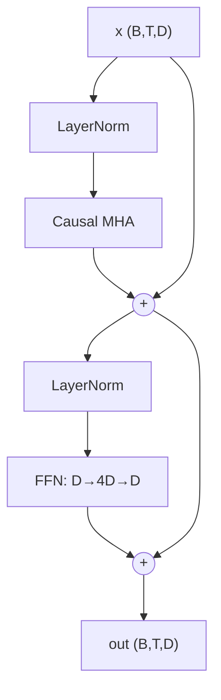

# A Transformer Block

> [!TIP] Say this first
> "A pre-norm decoder block is two residual sub-layers: `x = x + Attn(Norm(x))` then `x = x + FFN(Norm(x))`. The residual stream is the backbone; every sub-layer reads a normalized copy and writes a delta back." Nail that sentence and the code writes itself.

Builds on [Attention From Scratch](#/ml-coding/attention). Here you assemble the full block — multi-head attention + feed-forward network + residuals + normalization — add a causal mask, and explain the KV-cache. This is what you see when you open a real LLM/VLM codebase.

## Anatomy of a pre-norm decoder block



**Pre-norm** (normalize *inside* each residual branch) is the modern default: the residual stream stays un-normalized end-to-end, so gradients flow cleanly through deep stacks. Post-norm (the original 2017 paper) needs learning-rate warmup to stay stable. See [Normalization & Stability](#/foundations/normalization-stability).

## Full block in PyTorch

```python
import torch, torch.nn as nn, torch.nn.functional as F


class FeedForward(nn.Module):
    """Position-wise FFN, 4x expansion. (Modern LLMs use SwiGLU.)"""
    def __init__(self, d_model, mult=4, dropout=0.0):
        super().__init__()
        self.net = nn.Sequential(
            nn.Linear(d_model, mult * d_model), nn.GELU(),
            nn.Linear(mult * d_model, d_model), nn.Dropout(dropout),
        )
    def forward(self, x):
        return self.net(x)


class CausalSelfAttention(nn.Module):
    def __init__(self, d_model, n_heads, dropout=0.0):
        super().__init__()
        assert d_model % n_heads == 0
        self.h, self.dh, self.drop = n_heads, d_model // n_heads, dropout
        self.qkv = nn.Linear(d_model, 3 * d_model, bias=False)
        self.proj = nn.Linear(d_model, d_model, bias=False)

    def forward(self, x, kv_cache=None):
        B, T, D = x.shape
        q, k, v = self.qkv(x).chunk(3, dim=-1)
        q, k, v = (t.view(B, T, self.h, self.dh).transpose(1, 2)
                   for t in (q, k, v))                 # (B,H,T,Dh)
        if kv_cache is not None:                        # decode: append new K/V
            if kv_cache.get("k") is not None:
                k = torch.cat([kv_cache["k"], k], dim=2)
                v = torch.cat([kv_cache["v"], v], dim=2)
            kv_cache["k"], kv_cache["v"] = k, v
        # is_causal only for the prefill/training path (square attention)
        causal = kv_cache is None
        o = F.scaled_dot_product_attention(
            q, k, v, is_causal=causal,
            dropout_p=self.drop if self.training else 0.0)
        return self.proj(o.transpose(1, 2).reshape(B, T, D))


class DecoderBlock(nn.Module):
    def __init__(self, d_model, n_heads, dropout=0.0):
        super().__init__()
        self.ln1, self.ln2 = nn.LayerNorm(d_model), nn.LayerNorm(d_model)
        self.attn = CausalSelfAttention(d_model, n_heads, dropout)
        self.ffn = FeedForward(d_model, dropout=dropout)

    def forward(self, x, kv_cache=None):
        x = x + self.attn(self.ln1(x), kv_cache=kv_cache)   # residual 1
        x = x + self.ffn(self.ln2(x))                       # residual 2
        return x
```

**Shapes:** input/output are both `(B, T, D)` — a block is shape-preserving, which is why you can stack $N$ of them. **Complexity per block:** $O(T^2 d)$ for attention + $O(T d^2)$ for the FFN (the FFN dominates FLOPs at short context; attention dominates memory at long context).

## LayerNorm from scratch

> [!TIP] Live code — implement, run, test
> The NumPy blocks below are **live editors**. Fill in the body, hit **▶ Run tests**, and watch the cases pass. Stuck? Reveal the reference **Solution** — but attempt first; the struggle *is* the practice. The first Run downloads a small Python runtime and NumPy (~15 MB); later runs are instant.

<div class="widget" data-widget="code">
<script type="application/json" class="code-config">
{"func":"layer_norm","packages":["numpy"],"approx":true,"starter":"import numpy as np\n\ndef layer_norm(x, gamma, beta, eps=1e-5):\n    # normalize over the LAST dim (per token): (x-mean)/sqrt(var+eps), then scale by gamma, shift by beta\n    pass","tests":[{"args":[[[1,2,3,4]],[1,1,1,1],[0,0,0,0]],"expect":[[-1.3416354199689269,-0.447211806656309,0.447211806656309,1.3416354199689269]]},{"args":[[[1,2,3,4],[10,10,10,10]],[1,1,1,1],[0,0,0,0]],"expect":[[-1.3416354199689269,-0.447211806656309,0.447211806656309,1.3416354199689269],[0.0,0.0,0.0,0.0]]},{"args":[[[2,4,6,8]],[2,2,2,2],[1,1,1,1]],"expect":[[-1.6832788897221995,0.10557370342593342,1.8944262965740666,3.6832788897221995]]}],"solution":"import numpy as np\n\ndef layer_norm(x, gamma, beta, eps=1e-5):\n    x, gamma, beta = np.asarray(x, float), np.asarray(gamma, float), np.asarray(beta, float)\n    mu = x.mean(-1, keepdims=True)\n    var = x.var(-1, keepdims=True)\n    return gamma * (x - mu) / np.sqrt(var + eps) + beta"}
</script>
</div>

LayerNorm normalizes **per token over the feature dim**, so it's independent of batch size and sequence length — that's why Transformers use it instead of BatchNorm. RMSNorm (LLaMA) drops the mean-centering and $\beta$, keeping only the scale.

## Feed-forward network (NumPy)

The position-wise FFN is $D\to 4D\to D$ with a GELU in between (here the tanh approximation). `feedforward` seeds its weights with `np.random.seed(0)` so the output is deterministic:

<div class="widget" data-widget="code">
<script type="application/json" class="code-config">
{"func":"feedforward","packages":["numpy"],"approx":true,"starter":"import numpy as np\n\ndef gelu(x):\n    return 0.5 * x * (1.0 + np.tanh(np.sqrt(2.0 / np.pi) * (x + 0.044715 * x ** 3)))\n\ndef feedforward(x, mult=4):\n    # D -> mult*D -> D, GELU between; seed weights with np.random.seed(0), zero biases\n    pass","tests":[{"args":[[[1,0,2,-1]]],"expect":[[0.040465675581605985,0.08127055857994071,0.08630397145291878,0.008689684748444178]]},{"args":[[[0.5,-0.5,1.0,0.0],[1,1,1,1]]],"expect":[[0.007273512058388274,0.012726852245228204,0.04167160290468261,-0.030555200099704558],[0.011904363992137353,0.043640236183920614,0.02597430169327689,0.02262224203686889]]}],"solution":"import numpy as np\n\ndef gelu(x):\n    return 0.5 * x * (1.0 + np.tanh(np.sqrt(2.0 / np.pi) * (x + 0.044715 * x ** 3)))\n\ndef feedforward(x, mult=4):\n    x = np.asarray(x, dtype=float)\n    d = x.shape[-1]\n    np.random.seed(0)\n    W1 = np.random.randn(d, mult * d) * 0.1\n    b1 = np.zeros(mult * d)\n    W2 = np.random.randn(mult * d, d) * 0.1\n    b2 = np.zeros(d)\n    h = gelu(x @ W1 + b1)\n    return h @ W2 + b2"}
</script>
</div>

## Causal mask

`is_causal=True` in `scaled_dot_product_attention` applies a lower-triangular mask for free. Manually it's `torch.triu(torch.full((T,T), -inf), diagonal=1)` added to the scores — position $t$ may attend to $\le t$ only, enforcing autoregression so training with teacher forcing matches inference.

## KV-cache (the inference optimization)

> [!NOTE] Why it exists
> During autoregressive generation, keys and values for past tokens **never change**. Recomputing them every step is $O(T^2)$ redundant work. The KV-cache stores past $K,V$ and appends only the new token's, making each decode step $O(T)$ instead of $O(T^2)$.

<dl class="kv">
<dt>Prefill</dt><dd>Process the full prompt once (square, causal attention); cache all K/V.</dd>
<dt>Decode</dt><dd>Each new token: compute its Q/K/V, append K/V to the cache, attend over the whole cache. Query length is 1, so no causal mask needed.</dd>
<dt>Cost</dt><dd>Cache memory is $2 \cdot L \cdot B \cdot H \cdot T \cdot d_h$ (bytes ×2 for K and V) — the dominant memory at long context, and why <b>GQA/MQA</b> (fewer KV heads) and paged/quantized KV caches matter.</dd>
</dl>

## Sanity check

```python
if __name__ == "__main__":
    B, T, D, H = 2, 8, 64, 4
    blk = DecoderBlock(D, H)
    x = torch.randn(B, T, D)
    assert blk(x).shape == (B, T, D)             # shape-preserving

    # incremental decode with KV-cache matches full forward (eval mode)
    blk.eval()
    with torch.no_grad():
        full = blk(x)
        cache, outs = {"k": None, "v": None}, []
        for t in range(T):
            outs.append(blk(x[:, t:t + 1], kv_cache=cache))
        step = torch.cat(outs, dim=1)
    assert torch.allclose(full, step, atol=1e-4)  # cached == recomputed
    print("block OK, KV-cache consistent")
```

> [!DANGER] Common bugs interviewers watch for
> Applying norm to the residual path instead of the branch input (breaks pre-norm); adding the residual *before* the sub-layer; LayerNorm over the batch/token axis instead of the feature axis; forgetting `is_causal` (leaks the future); off-by-one so the cache double-counts the current token; not switching off the causal mask during single-token decode.

## Q&A

<details class="qa"><summary>Why residual connections — what breaks without them?</summary>
<div class="qa-body">

**Short:** residuals give gradients an identity path, so deep stacks train without vanishing gradients, and each block only has to learn a *delta* to the running representation.

**Deep:** the derivative of $x + f(x)$ w.r.t. $x$ is $1 + f'(x)$ — the $1$ guarantees gradient flow even when $f'$ is tiny. Conceptually the residual stream is a shared bus that every block reads from and writes small updates to; the norm before each sub-layer keeps the inputs well-scaled. Remove residuals and a 12+ layer Transformer effectively won't train.
</div></details>

<details class="qa"><summary>Why does the FFN expand to 4×?</summary>
<div class="qa-body">

**Short:** attention mixes information *across* tokens but is (per token) a weighted average — largely linear; the FFN is the per-token nonlinear compute where most parameters and "knowledge" live, and the wide hidden layer gives it capacity.

**Deep:** the two-layer FFN $D\to 4D\to D$ with GELU is applied identically at every position. The 4× ratio is an empirical sweet spot. Modern LLMs use gated variants (SwiGLU: $\text{Swish}(xW_1)\odot(xW_2)$ then $W_3$), often with a ~$\frac{8}{3}D$ hidden dim to keep parameter count matched. FFN layers hold the majority of a Transformer's parameters.
</div></details>

<details class="qa"><summary>How does this block differ inside a VLM?</summary>
<div class="qa-body">

**Short:** structurally identical — vision tokens (from a ViT encoder + projector) are inserted into the same sequence and the decoder self-attends over text + image tokens jointly.

**Deep:** a decoder-only VLM (LLaVA/Qwen-VL style) doesn't change the block at all: an image becomes a set of embeddings occupying sequence positions, sometimes with a modality-specific position scheme, and the causal mask lets text attend back to image tokens. Cross-attention VLMs (Flamingo) instead add gated cross-attention layers that read image K/V. See [VLM Implementation Details](#/vlm/practical).
</div></details>

### Follow-ups
- **Pre-norm vs post-norm?** Pre-norm trains stably without warmup; post-norm can give slightly better final quality but is finicky. Modern default: pre-norm.
- **RMSNorm vs LayerNorm?** RMSNorm skips mean-centering — cheaper, comparable quality (LLaMA).
- **Weight tying?** Share the token-embedding and LM-head matrix to save parameters and couple input/output spaces.
- **RoPE?** Inject relative position by rotating Q/K per position; extrapolate with NTK/YaRN scaling.

## Cheat-sheet

| Item | Value |
| --- | --- |
| Block | `x += Attn(Norm(x)); x += FFN(Norm(x))` (pre-norm) |
| Shape | `(B,T,D)` in and out — stackable |
| LayerNorm axis | last (feature) dim, per token |
| FFN | $D\to 4D\to D$, GELU (or SwiGLU $\sim\frac83 D$) |
| Causal mask | lower-triangular, apply before softmax |
| Complexity | $O(T^2 d)$ attn + $O(T d^2)$ FFN per block |
| KV-cache | store past K/V; decode step $O(T^2)\to O(T)$ |
| KV-cache shrink | GQA/MQA, quantized/paged KV |

**Cross-links:** [Attention From Scratch](#/ml-coding/attention) · [CNNs, RNNs & Transformers](#/foundations/architectures) · [Normalization & Stability](#/foundations/normalization-stability) · [LLM Fundamentals](#/llm/fundamentals) · [VLM Implementation Details](#/vlm/practical)
