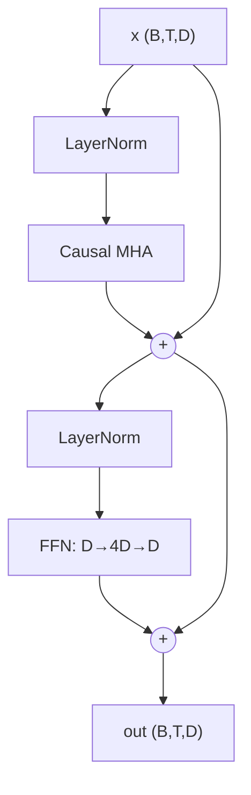

# Implementing a Transformer Block

> [!NOTE] Goal of this chapter
> Now assemble the attention from [Implementing Attention](#/ml-coding/attention) and the position machinery from [Positional Encoding & RoPE](#/ml-coding/positional-encoding-rope) into **one block**. A Transformer block is a Lego assembly of just four pieces—**attention + FFN + residual connections + normalization**. Stack this block $N$ times and you get GPTs, LLMs, and VLMs. This is exactly the block you will see when you open a real codebase.

## A block is an assembly of four pieces

It looks complicated, but one line captures it. A **residual stream**, or highway, carries the input `x` unchanged, while two side branches each add a small amount of information:

$$
x \leftarrow x + \text{Attn}(\text{Norm}(x)), \qquad x \leftarrow x + \text{FFN}(\text{Norm}(x))
$$

- **Attn:** mixes information across tokens—"Which other tokens should this token inspect?"
- **FFN**, or feed-forward network: processes each token independently; much of the model's stored "knowledge" resides here.
- **Residual connection:** *adds* the result back to the original `x`; the highway remains intact and each branch contributes only a delta.
- **Norm:** stabilizes the scale of each branch's input. See [Normalization & Training Stability](#/foundations/normalization-stability).

<figure>
<svg viewBox="0 0 640 220" xmlns="http://www.w3.org/2000/svg" font-family="Inter, sans-serif" font-size="12">
  <!-- residual highway -->
  <line x1="40" y1="110" x2="600" y2="110" stroke="#0ea5e9" stroke-width="4"/>
  <text x="70" y="100" fill="#0ea5e9" font-weight="700">residual stream (highway)</text>
  <circle cx="40" cy="110" r="6" fill="#0ea5e9"/><text x="30" y="135" fill="currentColor">x</text>
  <!-- attn branch -->
  <path d="M200 110 v-45 h60" fill="none" stroke="#98a3b2" stroke-width="1.5"/>
  <rect x="200" y="35" width="130" height="30" rx="6" fill="#6366f1"/><text x="265" y="55" text-anchor="middle" fill="#fff">Attn(Norm(x))</text>
  <path d="M330 50 h30 v55" fill="none" stroke="#98a3b2" stroke-width="1.5"/>
  <circle cx="360" cy="110" r="11" fill="none" stroke="#e0533f" stroke-width="2"/><text x="360" y="114" text-anchor="middle" fill="#e0533f">+</text>
  <!-- ffn branch -->
  <path d="M430 110 v-45 h20" fill="none" stroke="#98a3b2" stroke-width="1.5"/>
  <rect x="430" y="35" width="110" height="30" rx="6" fill="#12a150"/><text x="485" y="55" text-anchor="middle" fill="#fff">FFN(Norm(x))</text>
  <path d="M540 50 h20 v55" fill="none" stroke="#98a3b2" stroke-width="1.5"/>
  <circle cx="560" cy="110" r="11" fill="none" stroke="#e0533f" stroke-width="2"/><text x="560" y="114" text-anchor="middle" fill="#e0533f">+</text>
  <circle cx="600" cy="110" r="6" fill="#0ea5e9"/><text x="590" y="135" fill="currentColor">out</text>
  <text x="320" y="185" text-anchor="middle" fill="#98a3b2">Each side branch computes a delta and adds it to the highway; the highway x is never cut.</text>
  <text x="320" y="205" text-anchor="middle" fill="#98a3b2">That uninterrupted highway carries gradients through a deep stack—the point of residuals.</text>
</svg>
<figcaption>A Transformer block consists of the residual highway carrying the input and two side branches—attention and FFN—that add their deltas. Input and output shapes match, so the block can be stacked $N$ times.</figcaption>
</figure>

## Pre-norm block structure



**Pre-norm** normalizes *inside* each residual branch. It is the modern default: the residual stream remains unnormalized from beginning to end, giving gradients a clean path through a deep stack. Post-norm, used in the original 2017 paper, needs more care with learning-rate warmup for stability. See [Normalization & Training Stability](#/foundations/normalization-stability).

> [!TIP] Interview one-liner
> "A pre-norm decoder block has two residual sublayers: `x = x + Attn(Norm(x))`, followed by `x = x + FFN(Norm(x))`. The residual stream is the spine; every sublayer reads a normalized copy and writes back a delta." Make this sentence automatic and the code follows naturally.

## A complete PyTorch block

First inspect the form used in practice. The NumPy lab below then has you implement the central FFN component; the canonical LayerNorm implementation lives in the normalization chapter.

```python
import torch, torch.nn as nn, torch.nn.functional as F


def apply_rope(q, k, start_pos=0, base=10_000.0):
    """Rotate Q/K pairs; q,k:(B,H,T,Dh), cached K is stored after rotation."""
    rotary_dim = q.shape[-1] - q.shape[-1] % 2
    if rotary_dim == 0:
        return q, k
    pos = torch.arange(start_pos, start_pos + q.shape[-2], device=q.device,
                       dtype=torch.float32)
    inv = base ** (-torch.arange(0, rotary_dim, 2, device=q.device,
                                 dtype=torch.float32) / rotary_dim)
    angle = pos[:, None] * inv[None, :]
    cos = angle.cos().to(q.dtype)[None, None, :, :]
    sin = angle.sin().to(q.dtype)[None, None, :, :]

    def rotate(x):
        out = x.clone()
        even, odd = x[..., :rotary_dim:2], x[..., 1:rotary_dim:2]
        out[..., :rotary_dim:2] = even * cos - odd * sin
        out[..., 1:rotary_dim:2] = even * sin + odd * cos
        return out

    return rotate(q), rotate(k)


class FeedForward(nn.Module):
    """Position-wise FFN, 4x expansion. (Modern LLMs use SwiGLU.)"""
    def __init__(self, d_model, mult=4, dropout=0.0):
        super().__init__()
        self.net = nn.Sequential(
            nn.Linear(d_model, mult * d_model), nn.GELU(),
            nn.Linear(mult * d_model, d_model), nn.Dropout(dropout),
        )
    def forward(self, x):
        return self.net(x)


class CausalSelfAttention(nn.Module):
    def __init__(self, d_model, n_heads, dropout=0.0):
        super().__init__()
        assert d_model % n_heads == 0
        self.h, self.dh, self.drop = n_heads, d_model // n_heads, dropout
        self.qkv = nn.Linear(d_model, 3 * d_model, bias=False)
        self.proj = nn.Linear(d_model, d_model, bias=False)

    def forward(self, x, kv_cache=None):
        B, T, D = x.shape
        q, k, v = self.qkv(x).chunk(3, dim=-1)
        q, k, v = (t.view(B, T, self.h, self.dh).transpose(1, 2)
                   for t in (q, k, v))                 # (B,H,T,Dh)
        past = 0
        if kv_cache is not None and kv_cache.get("k") is not None:
            past = kv_cache["k"].shape[2]
        q, k = apply_rope(q, k, start_pos=past)

        if kv_cache is not None:                        # decode: append new K/V
            if past:
                k = torch.cat([kv_cache["k"], k], dim=2)
                v = torch.cat([kv_cache["v"], v], dim=2)
            kv_cache["k"], kv_cache["v"] = k, v

        # A single-token decode query has no future token in this call. For a
        # chunk after cached history, build an offset causal mask explicitly.
        attn_mask = None
        causal = kv_cache is None or past == 0
        if past and T > 1:
            q_pos = past + torch.arange(T, device=x.device)[:, None]
            k_pos = torch.arange(past + T, device=x.device)[None, :]
            attn_mask = k_pos <= q_pos
            causal = False
        o = F.scaled_dot_product_attention(
            q, k, v, attn_mask=attn_mask, is_causal=causal,
            dropout_p=self.drop if self.training else 0.0)
        return self.proj(o.transpose(1, 2).reshape(B, T, D))


class DecoderBlock(nn.Module):
    def __init__(self, d_model, n_heads, dropout=0.0):
        super().__init__()
        self.ln1, self.ln2 = nn.LayerNorm(d_model), nn.LayerNorm(d_model)
        self.attn = CausalSelfAttention(d_model, n_heads, dropout)
        self.ffn = FeedForward(d_model, dropout=dropout)

    def forward(self, x, kv_cache=None):
        x = x + self.attn(self.ln1(x), kv_cache=kv_cache)   # residual 1
        x = x + self.ffn(self.ln2(x))                       # residual 2
        return x
```

**Shape:** input and output are both `(B, T, D)`. The block preserves shape, so you can stack $N$ of them. **Complexity per block:** $O(T^2d)$ for attention plus $O(Td^2)$ for the FFN. The FFN dominates FLOPS at short context lengths; attention dominates memory at long ones.

## LayerNorm (summary)

The block's `nn.LayerNorm` normalizes **over the feature dimension independently for every token**: subtract the mean, divide by the standard deviation, then scale and shift with $\gamma,\beta$. It is independent of batch size and sequence length, which is why Transformers use it instead of BatchNorm. RMSNorm, used by LLaMA, drops mean-centering and $\beta$ and keeps only scaling. See the canonical [Normalization & Training Stability](#/foundations/normalization-stability) chapter for the from-scratch NumPy lab, backward pass, and derivation.

## Feed-forward network (NumPy)

The position-wise FFN is $D\to 4D\to D$ with GELU in the middle, using the tanh approximation here. `feedforward` seeds its weights with `np.random.seed(0)`, making the output deterministic:

<div class="widget" data-widget="code">
<script type="application/json" class="code-config">
{"func":"feedforward","packages":["numpy"],"approx":true,"starter":"import numpy as np\n\ndef gelu(x):\n    return 0.5 * x * (1.0 + np.tanh(np.sqrt(2.0 / np.pi) * (x + 0.044715 * x ** 3)))\n\ndef feedforward(x, mult=4):\n    # D -> mult*D -> D, GELU between; seed weights with np.random.seed(0), zero biases\n    pass","tests":[{"args":[[[1,0,2,-1]]],"expect":[[0.040465675581605985,0.08127055857994071,0.08630397145291878,0.008689684748444178]]},{"args":[[[0.5,-0.5,1.0,0.0],[1,1,1,1]]],"expect":[[0.007273512058388274,0.012726852245228204,0.04167160290468261,-0.030555200099704558],[0.011904363992137353,0.043640236183920614,0.02597430169327689,0.02262224203686889]]}],"solution":"import numpy as np\n\ndef gelu(x):\n    return 0.5 * x * (1.0 + np.tanh(np.sqrt(2.0 / np.pi) * (x + 0.044715 * x ** 3)))\n\ndef feedforward(x, mult=4):\n    x = np.asarray(x, dtype=float)\n    d = x.shape[-1]\n    np.random.seed(0)\n    W1 = np.random.randn(d, mult * d) * 0.1\n    b1 = np.zeros(mult * d)\n    W2 = np.random.randn(mult * d, d) * 0.1\n    b2 = np.zeros(d)\n    h = gelu(x @ W1 + b1)\n    return h @ W2 + b2"}
</script>
</div>

## Causal mask

In `scaled_dot_product_attention`, `is_causal=True` applies a lower-triangular mask for square prefill or training. When a chunk of length $T>1$ follows cached history of length $P$, however, you cannot simply set `is_causal=False`. Query $i$ may see only key positions $\le P+i$, so you need an **offset causal mask**. Teacher forcing trains the same causal dependency used at inference, but a distribution gap remains: training sees a ground-truth prefix while generation sees the model's own prefix—exposure bias.

## KV cache (inference optimization)

> [!NOTE] Why it exists—intuition
> Within one causal forward pass with a fixed model, adapter, prompt, and position scheme, you can reuse each layer's K/V values for tokens already processed. Change the model, adapter, position scheme, or prefix and the cache is invalid. A KV cache computes only the new token's Q/K/V and reduces per-step attention to linear work in context length. The educational `torch.cat` below copies the cache every time; real serving uses preallocated or paged caches.

<figure>
<svg viewBox="0 0 640 170" xmlns="http://www.w3.org/2000/svg" font-family="Inter, sans-serif" font-size="12">
  <text x="20" y="20" fill="#98a3b2">The cache grows one cell at a time during generation; compute only the new token:</text>
  <!-- growing cache cells appearing over time -->
  <g>
    <rect x="20" y="45" width="34" height="34" rx="4" fill="#0ea5e9" opacity="0.85"/>
    <rect x="58" y="45" width="34" height="34" rx="4" fill="#0ea5e9" opacity="0"><animate attributeName="opacity" values="0;0;0.85;0.85;0.85" keyTimes="0;0.2;0.25;0.9;1" dur="4s" repeatCount="indefinite"/></rect>
    <rect x="96" y="45" width="34" height="34" rx="4" fill="#0ea5e9" opacity="0"><animate attributeName="opacity" values="0;0;0;0.85;0.85" keyTimes="0;0.4;0.45;0.9;1" dur="4s" repeatCount="indefinite"/></rect>
    <rect x="134" y="45" width="34" height="34" rx="4" fill="#0ea5e9" opacity="0"><animate attributeName="opacity" values="0;0;0;0;0.85;0.85" keyTimes="0;0.6;0.62;0.65;0.9;1" dur="4s" repeatCount="indefinite"/></rect>
    <rect x="172" y="45" width="34" height="34" rx="4" fill="#e0533f" opacity="0"><animate attributeName="opacity" values="0;0;0;0;0;0.9;0.9" keyTimes="0;0.7;0.75;0.78;0.8;0.85;1" dur="4s" repeatCount="indefinite"/></rect>
    <text x="113" y="105" text-anchor="middle" fill="#0ea5e9">cached past K/V (reused)</text>
    <text x="189" y="128" text-anchor="middle" fill="#e0533f">compute new token only</text>
  </g>
  <line x1="330" y1="45" x2="330" y2="120" stroke="#98a3b2" stroke-dasharray="4 3"/>
  <text x="350" y="60" fill="#98a3b2">Prefill: process the full prompt once (square attention)</text>
  <text x="350" y="82" fill="#98a3b2">Decode: compute one Q/K/V per step → append to cache</text>
  <text x="350" y="104" fill="#98a3b2">→ per-step cost O(T²) ⟶ O(T)</text>
</svg>
<figcaption>A KV cache reuses the blue cells, past K/V values, and computes only the red cell for the new token. At long context lengths, cache memory becomes a dominant serving cost, motivating GQA/MQA and paged or quantized KV.</figcaption>
</figure>

<dl class="kv">
<dt>Prefill</dt><dd>Process the full prompt at once with square causal attention and cache every K/V.</dd>
<dt>Decode</dt><dd>For each new token, compute Q/K/V, append K/V to the cache, and attend over the full cache. Query length is 1, so no causal mask is necessary.</dd>
<dt>Cost</dt><dd>The number of elements is $2LBT H_{kv}d_h$; multiply by bytes per dtype plus scales and metadata to obtain memory bytes. GQA/MQA reduce $H_{kv}$, not the number of query heads.</dd>
</dl>

> **PyTorch-style pseudocode—model-level prefill → decode**

```python
model.eval()
with torch.inference_mode():
    logits, cache = model(prompt_ids, use_cache=True)  # prefill: [B,T]
    next_id = sample(logits[:, -1])                    # use the final position only
    generated = [next_id]

    while not all_finished(generated):
        pos = cache.sequence_length                    # RoPE/position offset
        logits, cache = model(next_id[:, None], past=cache, position=pos)
        next_id = sample(logits[:, -1])                # decode input is [B,1]
        generated.append(next_id)                      # mask rows that emitted EOS separately
```

## Sanity check

```python
if __name__ == "__main__":
    B, T, D, H = 2, 8, 64, 4
    blk = DecoderBlock(D, H)
    x = torch.randn(B, T, D)
    assert blk(x).shape == (B, T, D)             # shape-preserving

    # incremental decode with KV-cache matches full forward (eval mode)
    blk.eval()
    with torch.no_grad():
        full = blk(x)
        cache, outs = {"k": None, "v": None}, []
        for t in range(T):
            outs.append(blk(x[:, t:t + 1], kv_cache=cache))
        step = torch.cat(outs, dim=1)
    assert torch.allclose(full, step, atol=1e-4)  # cached == recomputed
    print("block OK, KV-cache consistent")
```

> [!DANGER] Common bugs interviewers watch for
> Applying normalization to the residual path instead of the branch input, which breaks pre-norm; adding the residual *before* the sublayer; applying LayerNorm across batch or token axes instead of features; forgetting `is_causal`, leaking the future; an off-by-one that computes the current token twice in the cache; and failing to disable a causal mask during single-token decode.

## Q&A

<details class="qa"><summary>Why residual connections—what breaks without them?</summary>
<div class="qa-body">

**Short:** A residual gives gradients an identity path through a deep stack, reducing vanishing-gradient problems, and lets every block learn only a *delta* to the running representation.

**Deep:** The Jacobian of $x+f(x)$ contains an identity term, which improves gradient flow. It does not guarantee lossless transmission: the other term can cancel it, scales can be poor, and projections can intervene. The defensible claim is that residuals and normalization make deep-model optimization far easier, not that training becomes absolutely impossible beyond some depth without them.
</div></details>

<details class="qa"><summary>Why does the FFN expand by 4×?</summary>
<div class="qa-body">

**Short:** Attention mixes information *across* tokens but is mostly a weighted linear combination per token. The FFN supplies token-wise nonlinear computation, contains most parameters and much of the model's stored "knowledge," and the wide hidden layer provides capacity.

**Deep:** The two-layer GELU FFN $D\to 4D\to D$ applies the same function at every position. The 4× ratio is an empirical sweet spot. Modern LLMs use gated variants such as SwiGLU—$\text{Swish}(xW_1)\odot(xW_2)$ followed by $W_3$—often with hidden dimension around $\frac{8}{3}D$ to match parameter count. FFN layers contain most Transformer parameters.
</div></details>

<details class="qa"><summary>How does this block differ inside a VLM?</summary>
<div class="qa-body">

**Short:** Structurally it is the same. Vision tokens produced by a ViT encoder and projector enter the same sequence, and the decoder self-attends jointly over text and image tokens.

**Deep:** A decoder-only VLM in the LLaVA/Qwen-VL family need not change the block: images become a set of embeddings occupying sequence positions, sometimes with a modality-specific position scheme, and the causal mask lets later text attend back to image tokens. A cross-attention VLM such as Flamingo instead adds gated cross-attention layers that read image K/V. See [VLM Implementation Details](#/vlm/practical).
</div></details>

### Follow-ups

- **Pre-norm vs. post-norm?** Pre-norm is generally more stable, although large-scale recipes still often use warmup. Quality and stability differences for post-norm depend on depth and initialization.
- **RMSNorm vs. LayerNorm?** RMSNorm skips mean-centering. It is cheaper and often similar in quality; LLaMA uses it.
- **Weight tying?** Share the token-embedding and LM-head matrices to save parameters and couple the input and output spaces.
- **RoPE?** Rotate Q/K at every position, using `start_pos=past_length` during decode. Length scaling can extend context, but it does not guarantee quality beyond the training length.

## Cheat-sheet

| Item | Value |
| --- | --- |
| Block | `x += Attn(Norm(x)); x += FFN(Norm(x))` (pre-norm) |
| Shape | `(B,T,D)` input/output—stackable |
| LayerNorm axis | final feature dimension, independently per token |
| FFN | $D\to 4D\to D$, GELU—or SwiGLU at roughly $\frac83 D$ |
| Causal mask | lower triangular, applied before softmax |
| Complexity | $O(T^2 d)$ attention + $O(T d^2)$ FFN per block |
| KV cache | store past K/V; decode-step work $O(T^2)\to O(T)$ |
| Shrinking KV cache | GQA/MQA, quantized or paged KV |

**Next:** [Implementing Attention](#/ml-coding/attention) · [Positional Encoding & RoPE](#/ml-coding/positional-encoding-rope) · [CNNs, RNNs & Transformers](#/foundations/architectures) · [Normalization & Training Stability](#/foundations/normalization-stability) · [LLM Fundamentals](#/llm/fundamentals) · [VLM Implementation Details](#/vlm/practical)
