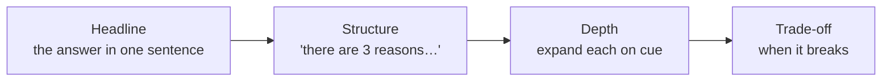
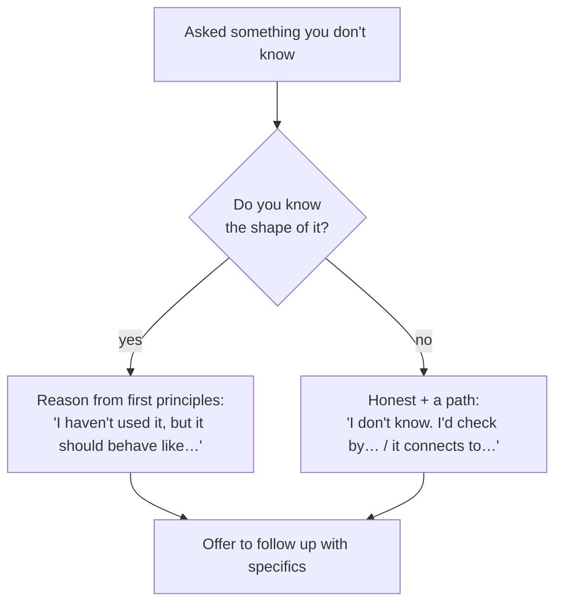

# Communication & Whiteboarding

think aloudheadline-firstdriving vs driven"I don't know"time management

> [!TIP] 메타 규칙
> 대부분의 라운드에서 정답뿐 아니라 문제를 구조화하고 협업하는 과정도 중요한 signal입니다. 정확한 rubric은 회사와 라운드마다 다르므로 recruiter의 prep guide를 우선하되, 자신의 추론을 *읽을 수 있고 방향을 조종할 수 있게* 만드세요. 구조를 내레이션하고, 답부터 말하고, 대화를 함께 이끌어갑니다.

이 챕터는 라운드를 가리지 않는 전달 기술입니다. coding, ML depth, system design, [job talk](#/research/job-talk), [behavioral](#/behavioral/star)에 모두 적용됩니다.

## Think aloud — 단, 의식의 흐름이 아니라 구조적으로

침묵은 적입니다. 면접관은 들을 수 없는 생각에 부분 점수를 줄 수 없습니다. 하지만 날것의 의식의 흐름도 거의 그만큼 나쁩니다. 패닉처럼 들리기 때문입니다. 모든 키 입력이 아니라 **결정과 구조** 수준에서 내레이션하세요.

이건 내레이션하세요

- 시작 전의 계획 ("X를 하고, Y를 하고, Z를 확인하겠습니다")
- 대안 대신 어떤 접근을 고른 *이유*
- 가정과 당신이 하고 있는 trade-off
- 벽에 부딪혔을 때, 그리고 어떻게 풀어나갈지

이건 아닙니다

- 타이핑하는 모든 토큰 ("이제 for loop, i는 0…")
- 60초짜리 침묵 구간
- 결론 없는 방향 없는 중얼거림
- 생각한다고 반복해서 사과하기

> [!EXAMPLE] 내레이션 리듬
> "제대로 이해했는지 문제를 다시 말해보겠습니다… *[재진술]*. 두 가지 접근이 떠오릅니다. O(n)의 hash map, 아니면 O(n log n)이지만 O(1) 공간의 sorting. 여기선 시간이 더 중요하니 hash map으로 가겠습니다. 계획: map을 만들고, 한 번 순회해서 확인. 코드로 옮겨보겠습니다… *[코딩]* …이제 `[2,7,11]`을 추적해서 target이 첫 원소와 같은 edge case를 확인하겠습니다."

## Headline-first: 모든 답변에 BLUF

결론부터 말하고 그다음에 뒷받침하세요. 이것이 **BLUF** — Bottom Line Up Front입니다. 학자는 결론을 향해 쌓아 올리도록 훈련받지만, 면접은 그 반대 순서에 보상을 줍니다. 그러면 면접관이 얼마나 깊이 들어갈지 *선택*할 수 있는데, 이것이 바로 당신이 그들에게 넘겨주고 싶은 통제권입니다.

| 질문 유형 | 약함 (쌓아 올리기) | 강함 (headline-first) |
| --- | --- | --- |
| "BatchNorm이 왜 도움이 되나요?" | "음, 우선 loss surface를 보고, gradient를 보고…" | "**loss landscape를 매끄럽게 만들어서** 더 높은 learning rate를 쓸 수 있게 합니다. 세 가지 메커니즘: …" |
| "이걸 어떻게 설계하시겠어요?" | "그러니까 data가 있고, 그다음 모델이 있고…" | "**two-stage retrieve-then-rank 시스템으로 프레이밍하겠습니다.** 가정부터 말하고, data → model → serving 순으로 짚겠습니다." |
| "갈등 경험을 말해보세요." | "그러니까 배경은…" | "**프로젝트에서 모델 품질과 latency 우선순위가 충돌했고, 공유 eval 기준으로 결정했습니다.** 어떻게 했냐면…" |

> [!TIP] "signpost" 요령
> 내용 전에 형태를 예고하세요. *"여기 세 가지 trade-off가 있는데, 순서대로 짚겠습니다."* 이제 면접관이 당신을 따라오고, 정확한 지점에서 끼어들 수 있으며, 당신은 생각하는 와중에도 정돈된 사람으로 들립니다.

## 주도하기 vs 끌려가기

강한 후보는 **주도**합니다. 구조를 제안하고, 가정을 말하고, 허락을 기다리지 않고 문제를 앞으로 밀고 나갑니다. 약한 후보는 다음 질문을 받기를 기다립니다. 주도는 밀어붙이기가 아닙니다. 주도하면서 *동시에* 확인합니다.

<dl class="kv">
<dt>주도</dt><dd>"이렇게 구조를 잡겠습니다: … 괜찮을까요, 아니면 다른 데서 시작할까요?" 그러고 나서 진행.</dd>
<dt>확인</dt><dd>매 갈림길에서: "실시간 serving을 가정하겠습니다 — 맞나요?" 한 호흡, 그리고 계속. 매 단계마다 허락을 구하지 말 것.</dd>
<dt>신호 읽기</dt><dd>"넘어가죠" 또는 "그건 된다고 치죠"라고 하면 그들이 방향을 잡는 것이니 즉시 따르세요. 면접관의 방향 조종에 맞서는 건 red flag입니다.</dd>
</dl>

균형: **당신은 구조를 소유하고, 그들은 우선순위를 소유합니다.** 그들이 방향을 틀면 그것을 선물로 여기세요. 그들이 필요로 하는 signal이 어디 있는지 알려주는 것입니다.

## "I don't know" 다루기

이건 실패가 아니라 *스킬*입니다. 정확한 평가 방식은 조직마다 다르지만, 모르는 것을 숨기기보다 경계를 밝히고 확인 경로를 제시하는 편이 추론과 신뢰를 보여주기 쉽습니다. 확신에 찬 추측은 뒤의 follow-up에서 신뢰를 무너뜨릴 수 있습니다.

> [!EXAMPLE] 우아한 세 가지 수
> - **추론으로 도달:** "정확한 공식은 기억나지 않지만, X를 Y와 저울질할 테니 아마 이렇게 생겼을 겁니다…"
> - **범위로 묶기:** "정확한 숫자는 모릅니다. 자릿수로는 ~N이고, 확인해드릴 수 있습니다."
> - **정직하게 방향 전환:** "그건 제 직접 경험 밖입니다. 저는 인접한 ___ 문제를 다뤘는데, 거기서 유사한 아이디어는 ___입니다."

방어할 수 없는 확신에 찬 추측으로 침묵을 채우지 마세요. 뒤따르는 [dig-in](#/research/failure)이 그걸 폭로할 것이고, 그 대가는 솔직한 인정보다 훨씬 큽니다.

## STAR-for-technical: 열린 문제 구조화하기

[STAR](#/behavioral/star)의 본능 — *내용 전에 구조* — 는 기술 질문에도 통합니다. 어떤 열린 ML/design 질문이든, 고정된 skeleton을 돌려서 백지 앞에서 얼어붙지 않도록 하세요.

| 단계 | 말할 것 | 이유 |
| --- | --- | --- |
| **Clarify** | 재진술 + 날카로운 범위 질문 2~3개 | 엉뚱한 문제를 풀지 않음을 보여줌 |
| **Assume** | 가정을 소리 내어 말하고 동의를 얻음 | 답변 전체의 위험을 낮춤 |
| **Approach** | 1~2개 접근 제시 + 이유와 함께 하나 선택 | 암기가 아니라 판단력을 보여줌 |
| **Execute** | 만들면서 내레이션 | 읽을 수 있는 추론 |
| **Verify** | 예제 추적 / 테스트 / 실패 모드 논의 | 시니어 signal — 자기 작업을 스스로 점검 |

이건 [ML system-design 프레임워크](#/system-design/framework)와 같은 척추입니다. 한 번 내재화하면 압박 속에서 재사용하세요.

## 시간 관리

아무것도 작동하지 않는 채로 시간을 다 쓰는 게 최악입니다. 계획을 밝힌 깔끔한 부분 완성은 회복 가능합니다. 명시적으로 예산을 잡으세요.

<dl class="kv">
<dt>Coding (45분)</dt><dd>~5분 clarify + approach · ~20~25분 코딩 · ~5~10분 테스트/최적화 · 버퍼 남기기. ~15분 지점에서 막히면 fallback을 소리 내어 말하고 전환.</dd>
<dt>System / ML design (45~60분)</dt><dd>각 단계를 timebox. 한 컴포넌트에 깊이 빠져 있는데 15분 남았다면 줌아웃: "시간이 다 가기 전에 eval과 serving은 꼭 커버하겠습니다."</dd>
<dt>Behavioral (story당)</dt><dd>2~3분. 90초가 지났는데 아직 Situation이라면 Action으로 점프 — [STAR 시간 배분](#/behavioral/star) 참고.</dd>
</dl>

> [!WARNING] 자기 시계를 챙기세요
> 면접관이 페이스를 잡아주길 기대하지 마세요. 시간을 힐끗 보고, 페이싱 결정을 *내레이션*하세요: "~10분 남았으니 core function을 마치고 최적화는 구현하지 않고 논의하겠습니다." 이 한 문장만으로도 시니어처럼 들립니다.

## 비원어민 영어 화자를 위한 전달

비원어민 영어 화자의 목표는 원어민처럼 들리는 것이 아니라 **쉽게 따라갈 수 있는 구조와 정확한 의미 전달**입니다. 발음보다 문장 구조, 속도, signpost를 우선하세요.

- 한 문장에 한 아이디어, relative-clause 사슬을 피할 것.
- 공격적으로 signpost: *First / Second / The trade-off is / To summarize.*
- filler("um, like, kind of")보다 0.5초의 침묵이 낫습니다.
- 10% 천천히. 페이스는 자신감으로 읽히고 생각할 시간을 벌어줍니다.
- 질문을 되풀이하세요 — 이해를 확인해주고 *동시에* 한 박자를 벌어줍니다.

## 후속 질문

"거기서 한동안 조용했는데 — 무슨 생각을 하고 있었나요?"

**짧게:** 침묵 *후*가 아니라 *전*에 내레이션하세요. "데이터 구조를 20초만 생각해보겠습니다"라고 말하면, 허가된 멈춤은 정체가 아니라 침착함으로 읽힙니다.

**깊게:** 면접관이 *설명되지 않은* 침묵에 벌점을 주는 이유는 채점할 수 없기 때문입니다. 미리 예고한 멈춤은 괜찮고 심지어 시니어답습니다. 침묵에 빠진 자신을 발견하면 구조로 다시 떠오르세요: "좋습니다 — 두 가지 옵션이 있고, 이걸 고르겠습니다, 이유는…"

"내레이션하지 말고 그냥 답을 말해줄 수 있나요?"

**짧게:** 네 — headline을 즉시 주고, 멈춰서 그들이 끌어당기게 하세요.

**깊게:** 이건 BLUF로의 방향 전환입니다. 일부 면접관은 결론을 빠르게, 그다음 타겟된 깊이를 원합니다. "답부터 말하라"로 읽고, 내레이션을 결정만으로 압축하고, 덜 자주 확인하세요.

## 치트시트

| 습관 | 하기 |
| --- | --- |
| Think aloud | 키 입력이 아니라 결정 & 구조를 내레이션, 설명되지 않은 침묵 금지 |
| Headline-first | BLUF — 답, 그다음 뒷받침, 깊이는 그들이 선택하게 |
| Signpost | 나열 전에 "세 가지 이유가 있습니다" |
| Drive | 구조를 소유, 갈림길에서 확인, 그들의 방향 조종은 즉시 따름 |
| "I don't know" | 추론으로 도달 / 범위로 묶기 / 정직하게 방향 전환 — 절대 허세 금지 |
| STAR-for-technical | Clarify → Assume → Approach → Execute → Verify |
| Time | 단계별 예산, 페이싱 결정 예고, 시계 힐끗 보기 |
| 비원어민 EN | 문장당 한 아이디어, signpost, filler보다 침묵, 10% 천천히 |

**관련:** [STAR & The Story Bank](#/behavioral/star) · [Remote Interview Setup](#/playbook/remote-setup) · [Day-Of Tactics & Recovery](#/playbook/tactics) · [Coding Round Strategy](#/coding/strategy) · [The Design Framework](#/system-design/framework) · [The Research Job Talk](#/research/job-talk) · [Common Mistakes & Red Flags](#/playbook/mistakes)
