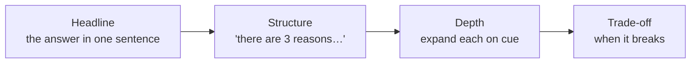
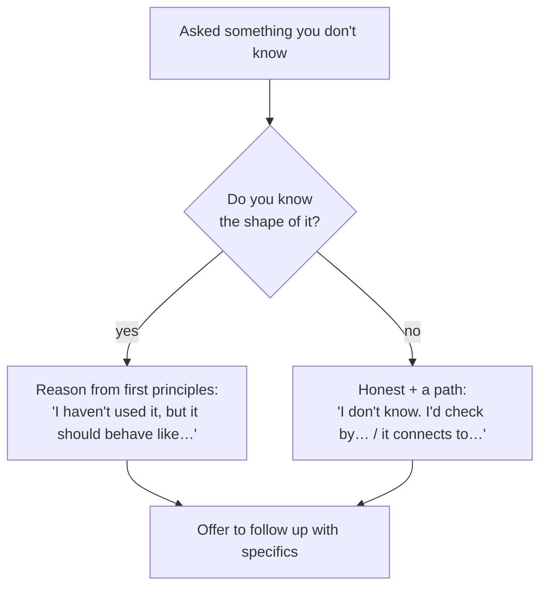

# Communication & Whiteboarding

think aloudheadline-firstdriving vs driven"I don't know"time management

> [!TIP] The meta-rule
> In most rounds, not only the answer but also how you structure the problem and collaborate is an important signal. The exact rubric varies by company and round, so prioritize the recruiter's prep guide; make your reasoning *legible and steerable*, narrate the structure, lead with the answer, and help drive the conversation.

This chapter is round-agnostic delivery: it applies to coding, ML depth, system design, the [job talk](#/research/job-talk), and [behavioral](#/behavioral/star).

## Think aloud — but structured, not stream-of-consciousness

Silence is the enemy: an interviewer can't give partial credit for thoughts they can't hear. But raw stream-of-consciousness is almost as bad — it sounds like panic. Narrate at the level of **decisions and structure**, not every keystroke.

Narrate this

- The plan before you start ("I'll do X, then Y, then check Z")
- *Why* you chose an approach over an alternative
- Assumptions and the trade-off you're making
- When you hit a wall and how you'll get unstuck

Not this

- Every token you type ("now a for loop, i equals zero…")
- Silent 60-second stretches
- Undirected musing with no conclusion
- Apologizing repeatedly for thinking

> [!EXAMPLE] The narration cadence
> "Let me restate the problem to make sure I have it… *[restate]*. Two approaches come to mind: a hash map for O(n), or sorting for O(n log n) but O(1) space. I'll go with the hash map since time matters more here. Plan: build the map, then one pass to check. Let me code that… *[code]* …now let me trace `[2,7,11]` to check the edge case where the target equals the first element."

## Headline-first: BLUF every answer

Lead with the conclusion, then support it. This is **BLUF** — Bottom Line Up Front. Academics are trained to build to a conclusion; interviews reward the opposite order. The interviewer can then *choose* how deep to go, which is exactly the control you want to hand them.

| Question type | Weak (build-up) | Strong (headline-first) |
| --- | --- | --- |
| "Why does BatchNorm help?" | "Well, first consider the loss surface, and gradients, and…" | "**It smooths the loss landscape**, which lets you use higher learning rates. Three mechanisms: …" |
| "How would you design this?" | "So there's data, and then models, and…" | "**I'd frame it as a two-stage retrieve-then-rank system.** Let me state assumptions, then walk data → model → serving." |
| "Tell me about a conflict." | "So the background is…" | "**On a project, model quality and latency priorities conflicted, and we decided using shared evaluation criteria.** Here's how…" |

> [!TIP] The "signpost" trick
> Announce the shape before the content: *"There are three trade-offs here — let me take them in order."* Now the interviewer can track you, interrupt precisely, and you sound organized even while thinking.

## Driving vs. being driven

Strong candidates **drive**: they propose structure, state assumptions, and move the problem forward without waiting for permission. Weak candidates wait to be asked the next question. Driving is not steamrolling — you drive *and* check in.

<dl class="kv">
<dt>Drive</dt><dd>"Here's how I'll structure this: … Does that work, or do you want me to start elsewhere?" Then go.</dd>
<dt>Check in</dt><dd>At each fork: "I'll assume real-time serving — sound right?" One breath, then continue. Don't ask permission for every step.</dd>
<dt>Read the cue</dt><dd>If they say "let's move on" or "assume that works," they're steering — follow instantly. Fighting the interviewer's steer is a red flag.</dd>
</dl>

The balance: **you own the structure; they own the priorities.** When they redirect, treat it as a gift — it tells you where the signal they need is.

## Handling "I don't know"

This is a *skill*, not a failure. Exact evaluation practices differ by organization, but stating the boundary of your knowledge and giving a verification path usually demonstrates reasoning and trustworthiness better than hiding what you do not know. A confident guess can undermine trust in the follow-up.

> [!EXAMPLE] Three graceful moves
> - **Reason to it:** "I don't recall the exact formula, but it must trade off X against Y, so it should look like…"
> - **Bound it:** "I don't know the precise number; order of magnitude is ~N, and I can confirm."
> - **Redirect honestly:** "That's outside my direct experience — I've worked on the adjacent problem of ___, where the analogous idea is ___."

Never fill silence with a confident guess you can't defend — the [dig-in](#/research/failure) that follows will expose it and cost you far more than the admission would have.

## STAR-for-technical: structuring open-ended problems

The [STAR](#/behavioral/star) instinct — *structure before content* — works for technical questions too. For any open-ended ML/design prompt, run a fixed skeleton so you never freeze on a blank start:

| Stage | Say | Why |
| --- | --- | --- |
| **Clarify** | restate + ask 2–3 sharp scoping questions | shows you don't code the wrong problem |
| **Assume** | state assumptions out loud, get a nod | de-risks the whole answer |
| **Approach** | name 1–2 approaches + pick one with a reason | shows judgment, not just recall |
| **Execute** | narrate as you build | legible reasoning |
| **Verify** | trace an example / test / discuss failure modes | senior signal — you check your own work |

This is the same spine as the [ML system-design framework](#/system-design/framework); internalize it once and reuse it under pressure.

## Managing time

Running out of time with nothing working is the worst outcome; a clean partial with a stated plan is recoverable. Budget explicitly.

<dl class="kv">
<dt>Coding (45 min)</dt><dd>~5 clarify + approach · ~20–25 code · ~5–10 test/optimize · leave buffer. If stuck at ~15 min in, say your fallback out loud and switch.</dd>
<dt>System / ML design (45–60 min)</dt><dd>Timebox each stage; if you're deep in one component with 15 min left, zoom out: "Let me make sure I cover eval and serving before we run out."</dd>
<dt>Behavioral (per story)</dt><dd>2–3 min. If you're 90 s in and still in Situation, jump to Action — see [STAR time budget](#/behavioral/star).</dd>
</dl>

> [!WARNING] Watch your own clock
> Don't rely on the interviewer to pace you. Glance at the time, and *narrate* pacing decisions: "We have ~10 minutes; I'll finish the core function and then discuss optimizations rather than implement them." That sentence alone reads as senior.

## Delivery for a non-native English speaker

For a non-native English speaker, the goal is not to sound native; it is **easy-to-follow structure and precise meaning**. Prioritize sentence structure, pace, and signposts over accent.

- One idea per sentence; avoid relative-clause chains.
- Signpost aggressively: *First / Second / The trade-off is / To summarize.*
- A half-second of silence beats a filler ("um, like, kind of").
- Slow down 10%. Pace reads as confidence and buys thinking time.
- Repeat the question back — it confirms understanding *and* gives you a beat.

## Follow-ups

"You went quiet for a while there — what were you thinking?"

**Short:** Narrate *before* the silence, not after. Say "let me think for 20 seconds about the data structure" — a sanctioned pause reads as composure, not a stall.

**Deep:** Interviewers penalize *unexplained* silence because they can't score it. A pre-announced pause is fine and even senior. If you catch yourself silent, resurface with structure: "OK — two options; here's the one I'll take and why."

"Can you just tell me the answer instead of narrating?"

**Short:** Yes — give the headline immediately, then stop and let them pull.

**Deep:** This is a steer toward BLUF. Some interviewers want the conclusion fast, then targeted depth. Read it as "lead with the answer," compress your narration to decisions only, and check in less often.

## Cheat-sheet

| Habit | Do |
| --- | --- |
| Think aloud | narrate decisions & structure, not keystrokes; no unexplained silence |
| Headline-first | BLUF — answer, then support; let them choose the depth |
| Signpost | "there are three reasons" before listing them |
| Drive | own the structure; check in at forks; follow their steer instantly |
| "I don't know" | reason to it / bound it / redirect honestly — never bluff |
| STAR-for-technical | Clarify → Assume → Approach → Execute → Verify |
| Time | budget stages; announce pacing decisions; glance at the clock |
| Non-native EN | one idea/sentence, signpost, silence > filler, slow 10% |

**Related:** [STAR & The Story Bank](#/behavioral/star) · [Remote Interview Setup](#/playbook/remote-setup) · [Day-Of Tactics & Recovery](#/playbook/tactics) · [Coding Round Strategy](#/coding/strategy) · [The Design Framework](#/system-design/framework) · [The Research Job Talk](#/research/job-talk) · [Common Mistakes & Red Flags](#/playbook/mistakes)
