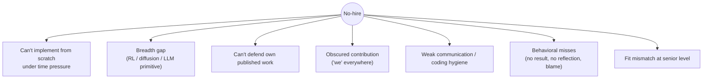

# Common Mistakes & Red Flags

rejection reasonsper-round pitfallsRS/AS-specifichow to avoid

> [!TIP] 자료만이 아니라 실패 모드를 배우세요
> 대부분의 탈락은 "충분히 알지 못해서"가 아니라 **예측 가능하고 피할 수 있는 실수** 때문입니다: 시간 압박 속 처음부터 구현 못 함, 자기 논문 방어 못 함, 기여를 가림, "모르겠습니다" 대신 허세. 이 챕터는 책 전체의 음화(negative image)입니다 — 이것들을 알면 no-hire의 대다수를 피합니다.

## RS/AS 후보의 최상위 탈락 사유

강한 연구자가 왜 여전히 탈락하는지에 대한 실무자 기고를 종합한 것입니다. 각각은 패널이 기록하는 *signal*입니다 — 당신의 것을 해결책에 매핑하세요.

| # | 탈락 사유 | 강한 사람에게도 일어나는 이유 | 해결책 |
| --- | --- | --- | --- |
| 1 | **처음부터 구현 못 함** | "매일 ML 사용" ≠ "attention / backward pass / SGD loop를 맨몸으로 코딩". | [ML-coding from scratch](#/ml-coding/intro)를 드릴하세요: attention, NMS/IoU, k-means, training loop을 깔끔하게, <30분. |
| 2 | **Breadth gap** | RS fundamentals 라운드는 "거의 아무거나 묻습니다", 구멍 하나(RL, diffusion, MoE, RoPE)가 가라앉힙니다. | [foundations](#/foundations/optimization) 맵을 커버하세요, 모든 곳에 깊이는 필요 없지만 0점은 없어야 합니다. |
| 3 | **자기 작업 방어 못 함** | *자기 논문*의 baseline, ablation, 한계를 더듬는 건 research 직군에서 실격 사유. | 모든 논문을 pre-mortem: "왜 baseline X가 아닌가?", 실패 사례, 무엇을 다시 할지. [job talk](#/research/job-talk) 참고. |
| 4 | **기여를 가림** | "we"를 남용해 패널이 *당신이* 한 것을 분리 못 함. | 깔끔한 [I-vs-we 분리](#/behavioral/star): 목표에는 "we", 모든 결정에는 "I". |
| 5 | **coding 위생 / 디버깅 못 함** | 특히 AS/RE 트랙 — 지저분, 테스트 없음, 라이브 디버깅 못 함. | 타입, 테스트, 작은 함수, 디버깅을 내레이션. |
| 6 | **Behavioral 실책** | 구체적 결과 없음, 회고 없음, 협업 signal 부실, 남 탓. | 모든 story를 정량화, ownership + 학습으로 마무리. |
| 7 | **Fit 불일치 (시니어)** | 1~2 자리 팀은 "강하지만 fit 안 맞음"을 통과시킴, eng 트랙으로 리다이렉트할 수도. | *현재* 문제가 맞는 팀을 타겟, [HM 스크린](#/process/recruiter-hm)에서 fit을 명시적으로. |
| 8 | **협상에서의 integrity** | 부풀리거나 위조한 경쟁 오퍼 — 이 연봉대에서 즉각적 신뢰 상실. | 범위를 정직하게 공유, 절대 날조하지 말 것. [Negotiation](#/process/negotiation) 참고. |

> [!DANGER] research 직군의 치명적 두 가지
> **자기 출판 작업을 방어 못 함**과 **기여를 가림**이 research 특유의 킬러입니다. 질문 아래 해부하지 못하는 훌륭한 논문, 또는 패널이 당신이 개인적으로 무엇을 주도했는지 알 수 없는 story, 둘 다 "공저자가 캐리했을지도"로 읽힙니다. CV의 그 무엇도 이 인상에서 회복시키지 못합니다.

## 라운드별 실수

### Coding 라운드

하기

- 코딩 전 clarify + 가정 진술
- 접근 내레이션, 막히면 fallback 예고
- 작은 추적으로 테스트, edge case 포함
- 시계 관리, 깔끔한 부분 완성이 망가진 "완성"보다 낫다

피하기

- 몇 분간 침묵 코딩 (부분 점수 불가)
- 문제 이해 전에 코드로 점프
- 물을 때까지 복잡도 무시
- 힌트를 받는 대신 면접관의 힌트에 맞서기

[Coding Round Strategy](#/coding/strategy)와 [Communication](#/playbook/communication) 참고.

### ML depth / fundamentals

- **Breadth gap을 허세로 메우기.** RLHF나 diffusion에서 확신에 찬 오답은 솔직한 "형태는 알지만 구현은 안 해봤습니다"보다 나쁩니다. → ["I don't know" 다루기](#/playbook/communication).
- **Depth 없는 breadth (또는 반대).** vision은 깊은데 LLM primitive에서 막힐 수 있습니다. 맵을 메워 0점이 없게.
- **추론 없는 암송.** "Transformer가 쓰니까 LayerNorm"은 실패합니다, 가변 길이 sequence에 왜 BN이 아니라 LN인지 설명하세요.

### Research deep-dive / job talk

- **자료가 너무 많음.** 논문 전체를 욱여넣으면 → 패널은 아무것도 기억 못 합니다. 중요성 + 설명 가능성으로 선별.
- **잘못된 고도.** 혼합 패널에 너무 많은 jargon, 또는 전문가에게 너무 얕음. 방을 읽으세요.
- **선택을 방어 못 함.** "왜 baseline X가 아닌가?"나 자기 실패 사례에서 머뭇거리면 치명적. [Failure & Negative Results](#/research/failure) 참고.
- **시간 관리 부실.** Q&A 전에 시간 초과. 시계 놓고 리허설.

### Behavioral

- **"저는 실패한 적 없어요."** 부정직하거나 야망이 낮은 걸로 읽힙니다. research 경력은 *곧* 실패한 실험입니다.
- **남 탓하기.** ownership에 대한 anti-signal, "까다로운 팀원" story는 *당신의* 적응을 보여줘야 합니다.
- **숫자 없음, 회고 없음.** 결과나 교훈 없는 story는 그냥 일화입니다.
- **맥락 앞에 몰아넣기.** 40% Situation은 signal을 묻습니다. Action은 50~60%. → [STAR 시간 배분](#/behavioral/star).

### Fit / motivation

- **뻔한 "why us."** 뿌리고 기도하는 signal. 조직마다 정직한 "저는 ___를 존경했습니다" 하나면 해결.
- **연봉만 또는 남 탓하는 "why leave."** push가 아니라 pull(70%)로 프레이밍. → [HM 스크린](#/process/recruiter-hm).
- **미공개 product 추측하기.** 특히 Apple(기밀 문화)에서 치명적.

## 전방위 behavioral & communication red flag

이것들은 라운드와 무관하게 debrief에 기록됩니다:

<dl class="kv">
<dt>힌트에 대한 방어성</dt><dd>넛지에 맞서는 건 "같이 일하기 어려움"으로 읽힙니다. 힌트를 우아하게 받으세요 — 당신을 *돕는* 것입니다.</dd>
<dt>허세</dt><dd>확신에 찬 오답은 인정보다 신뢰를 더 무너뜨립니다. dig-in이 어차피 폭로합니다.</dd>
<dt>에고 / 무시</dt><dd>이전 팀원, baseline, "뻔한" 질문을 깎아내리기. Low-ego 협업은 명시적으로 중시됩니다 (Meta, Mistral, NVIDIA).</dd>
<dt>안 듣기</dt><dd>물은 질문이 아니라 준비한 질문에 답하기, 면접관의 방향 조종을 놓치기.</dd>
<dt>자기 논평</dt><dd>면접관/recruiter에게 "그 라운드 망친 것 같아요"는 부정적 해석을 유도하고, 당신은 자신에 대해 노이즈 많은 심판입니다.</dd>
</dl>

> [!WARNING] intellectual-honesty 시험은 항상 돌아가고 있습니다
> NVIDIA가 명시적으로 이름 붙이지만 모든 패널이 가중합니다: 아는 것의 한계, 자기 논문의 한계, 선택한 접근의 한계를 인정하는 건 *긍정* signal입니다. 과대 주장은 research 면접을 잃는 가장 빠른 길입니다.

## PhD → 산업 번역 함정

학계는 면접에서 역효과를 내는 습관을 훈련시킵니다. 의도적으로 번역하세요.

| 학계 습관 | 면접 현실 | 재배선 |
| --- | --- | --- |
| 뉘앙스 & 단서로 시작 | 명확한 결정에 보상 | **결정 먼저**, 단서는 요청 시 |
| "We" (lab 규범, 겸손) | 패널이 *당신을* 분리해야 함 | **당신의 결정에는 "I"** |
| 성공 = 논문 | 성공 = 결정 + 측정 가능한 impact | **정량화된 결과 + 출시** |
| 완전함의 소진 | Time-box, 우선순위 | **headline 먼저, 중요성으로 선별** |
| 권위/인용으로 방어 | 증거 & 추론으로 방어 | **데이터, ablation, first principles** |

## loop 전에 자기 실패 모드를 진단하세요

볼 수 없는 실수는 고칠 수 없습니다. 대부분의 후보는 여덟 개 전부가 아니라 **한두 개의 지배적 실패 모드**를 가집니다. 값싼 계측으로 당신의 것을 찾으세요:

- **Mock을 녹화하세요** (coding, 논문 방어, behavioral story 하나). 되돌려 보세요: 내레이션했나? STAR에서 Action이 지배했나? 낯선 사람이 *당신이* 무엇을 만들었는지 알 수 있었나?
- **Mock 파트너에게 한 질문:** "저를 채용하기 가장 망설이게 만드는 단 하나는 뭔가요?" 솔직한 답이 보통 당신의 지배적 모드입니다.
- **Debrief 로그를 추적하세요.** 실제 라운드마다 질문과 스스로 평가한 약한 순간을 적으세요. 3~4 라운드에 걸쳐 패턴이 드러납니다 — 그 패턴이 당신의 fix-list입니다.
- **스스로 시간을 재세요.** 습관적으로 시간이 부족하다면 실수는 지식이 아니라 [페이싱](#/playbook/communication)입니다.

> [!NOTE] 한 번에 하나씩 고치기
> 한 번에 다 고치려 하면 아무것도 못 고칩니다. 최상위 모드를 골라 일주일 드릴하고, 다시 녹화하고, 다음으로 넘어가세요. 여기선 복리가 폭보다 낫습니다.

## 후속 질문

라운드 초반에 틀린 답을 준 걸 깨달았어요. 정정해야 하나요?

**짧게:** 네 — 자기 정정은 *긍정* signal입니다.

**깊게:** "아까 X라고 했는데 정정하고 싶습니다: 사실은 Y입니다, 왜냐하면…"은 intellectual honesty와 rigor로 읽힙니다, 정확히 research 패널이 보상하는 것. 자기 오류를 잡는 게 그들이 못 봤길 바라는 것보다 낫습니다, 알고 있는 오류를 놔두는 게 진짜 위험입니다.

거만하게 들리지 않으면서 "기여를 가림" 함정을 어떻게 피하죠?

**짧게:** 목표는 팀에 공을 돌리고, 결정은 당신이 가져가세요.

**깊게:** "팀이 X를 출시했고, *제가* architecture, loss, data 결정을 맡았으며, 구체적으로 Y를 결정했습니다." 협업자에게 공을 돌리면서(거만하지 않음) 당신의 역할을 모호하지 않게(가려지지 않음) 했습니다. 각 대표 프로젝트에 이 분리를 리허설하세요 — 가장 레버리지 큰 behavioral 해결책입니다. [I-vs-we](#/behavioral/star) 참고.

## 치트시트

| 실수 | 한 줄 해결책 |
| --- | --- |
| 처음부터 코딩 못 함 | attention / NMS / training loop을 맨몸으로 드릴, <30분 |
| Breadth gap | foundations 맵 전반에 0점 없기 |
| 자기 논문 방어 못 함 | baseline, ablation, 실패 사례 pre-mortem |
| 기여를 가림 | 목표에는 "we", 모든 결정에는 "I" |
| 허세 | 추론으로 도달 / 범위로 묶기 / "모르겠습니다" + 경로 |
| 결과 / 회고 없음 | 정량화 + ownership & 학습으로 마무리 |
| 맥락 앞에 몰아넣기 | Action = 50~60%, headline 먼저 |
| 뻔한 "why us" | 조직마다 정직한 "저는 ___를 존경했습니다" 하나 |
| 날조한 오퍼 | 범위 공유, 절대 지어내지 말 것 — 걸리면 치명적 |
| 힌트에 맞서기 / 에고 | 넛지를 받기, low-ego 협업이 채점됨 |

**관련:** [STAR & The Story Bank](#/behavioral/star) · [Common Questions & Answers](#/behavioral/questions) · [Communication & Whiteboarding](#/playbook/communication) · [Day-Of Tactics & Recovery](#/playbook/tactics) · [The Research Job Talk](#/research/job-talk) · [Failure & Negative Results](#/research/failure) · [Recruiter & HM Screens](#/process/recruiter-hm) · [The ML Coding Round](#/ml-coding/intro)
