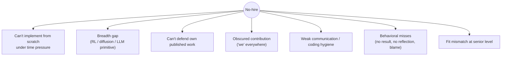

# Common Mistakes & Red Flags

rejection reasonsper-round pitfallsRS/AS-specifichow to avoid

> [!TIP] Learn the failure modes, not just the material
> Rejection reasons often are not disclosed, so their proportions cannot be stated confidently. Still, mock interviews and retrospectives can reduce recurring risks: failing to implement under time pressure, being unable to defend your own work, blurring contribution boundaries, and covering uncertainty with guesses. This chapter is a diagnostic checklist for those **observable failure modes**.

## Recurring risks for RS/AS candidates

This list is not an official ranking or rubric for any company. Prioritize the current role's preparation guide and the recruiter's explanation, then map problems observed in your own mocks to the fixes.

| # | Rejection reason | Why it happens to strong people | The fix |
| --- | --- | --- | --- |
| 1 | **Can't implement from scratch** | "Uses ML daily" and "can implement a core operation in a constrained environment" are different skills. | Practice [ML coding from scratch](#/ml-coding/intro) under a time limit and the actual tool policy. |
| 2 | **Breadth gap** | If an explanation breaks down on a core foundation for the role, there is less time to demonstrate other strengths. | Prioritize the [foundations](#/foundations/optimization) map using the job description and preparation guide. |
| 3 | **Can't defend own work** | If you cannot explain the baselines, ablations, or limitations of flagship work, ownership becomes difficult to assess. | Pre-mortem every flagship paper: "why not baseline X?", failure cases, and what you would redo. See [job talk](#/research/job-talk). |
| 4 | **Obscured contribution** | Over-using "we" so the panel can't isolate what *you* did. | The crisp [I-vs-we split](#/behavioral/star): "we" for the goal, "I" for every decision. |
| 5 | **Coding hygiene / can't debug** | Especially AS/RE tracks — messy, untested, can't debug live. | Types, tests, small functions; narrate your debugging. |
| 6 | **Behavioral misses** | No concrete result, no reflection, poor collaboration signal, blame. | Quantify every story; end on ownership + learning. |
| 7 | **Fit mismatch** | Strong general ability and the scope this team currently needs can differ. | Target teams whose *current* problems match, and verify fit in the [HM screen](#/process/recruiter-hm). |
| 8 | **Compromised negotiation integrity** | Inflated or fabricated competing offers create trust, relationship, and documentary risks. | Share only real facts and deadlines. See [Negotiation](#/process/negotiation). |

> [!WARNING] Two items to check especially carefully for research roles
> **The ability to defend your own published work** and **clear contribution boundaries** are important evidence for assessing ownership. Do not stop at listing strong results; prepare to explain decisions, alternatives, validation, and limitations under questioning.

## Mistakes by round

### Coding round

Do

- Clarify + state assumptions before coding
- Narrate approach; announce the fallback if stuck
- Test with a small trace, including an edge case
- Manage the clock; a clean partial beats a broken "complete"

Avoid

- Silent coding for minutes (no partial credit possible)
- Jumping to code before understanding the problem
- Ignoring complexity until asked
- Fighting the interviewer's hint instead of taking it

See [Coding Round Strategy](#/coding/strategy) and [Communication](#/playbook/communication).

### ML depth / fundamentals

- **Bluffing a breadth gap.** Confident-wrong on RLHF or diffusion is worse than an honest "I know the shape but haven't implemented it." → [Handle "I don't know"](#/playbook/communication).
- **Depth without breadth (or vice-versa).** You can go deep in vision but stall on an LLM primitive. Patch the map so there are no zeros.
- **Reciting without reasoning.** "LayerNorm because Transformers use it" fails; explain *why* LN over BN for variable-length sequences.

### Research deep-dive / job talk

- **Too much material.** Cramming the whole thesis → the panel remembers nothing. Select for importance + explainability.
- **Wrong altitude.** Too much jargon for a mixed panel, or too shallow for experts. Read the room.
- **Can't defend choices.** Hesitating on "why not baseline X?" or your own failure cases is fatal. See [Failure & Negative Results](#/research/failure).
- **Poor time management.** Running over before Q&A. Rehearse with a clock.

### Behavioral

- **"I never failed."** Reads as dishonest or low-ambition. A research career *is* failed experiments.
- **Blaming others.** Anti-signal for ownership; the "difficult teammate" story should show *your* adaptation.
- **No numbers, no reflection.** A story without a result or a lesson is just an anecdote.
- **Front-loading context.** 40% Situation buries the signal. Action is 50–60%. → [STAR time budget](#/behavioral/star).

### Fit / motivation

- **Generic "why us."** Spray-and-pray signal. One honest "I admired ___" per org fixes it.
- **Comp-only or blame-driven "why leave."** Frame as pull (70%), not push. → [HM screen](#/process/recruiter-hm).
- **Speculating about unreleased products or roadmaps.** Stay within public job descriptions and official materials.

## Cross-cutting behavioral & communication red flags

These get logged in the debrief regardless of round:

<dl class="kv">
<dt>Defensiveness under a hint</dt><dd>Fighting a nudge reads as "hard to work with." Take hints gracefully — they're *helping* you.</dd>
<dt>Bluffing</dt><dd>A confident wrong answer destroys trust more than an admission. The dig-in exposes it anyway.</dd>
<dt>Ego / dismissiveness</dt><dd>Trashing prior teammates, baselines, or "obvious" questions weakens confidence in your collaboration style and judgment.</dd>
<dt>Not listening</dt><dd>Answering the question you prepared instead of the one asked; missing the interviewer's steer.</dd>
<dt>Self-editorializing</dt><dd>"I think I bombed that" to the interviewer/recruiter primes a negative read and you're a noisy judge of yourself.</dd>
</dl>

> [!WARNING] Intellectual honesty is a round-independent principle
> Exact rubrics vary by company, but clearly bounding what you know, what your own research establishes, and what a chosen approach can support demonstrates verifiable reasoning. Admit unknowns together with a path to check them.

## The PhD → industry translation trap

Academia trains habits that misfire in interviews. Translate deliberately.

| Academic habit | Interview reality | Rewire to |
| --- | --- | --- |
| Lead with nuance & caveats | Rewards clear decisions | **decision first**, caveats on request |
| "We" (lab norm, modesty) | Panel must isolate *you* | **"I" for your decisions** |
| Success = the paper | Success = decision + measurable impact | **quantified outcome + shipped** |
| Exhaustive completeness | Time-boxed, prioritized | **headline-first, select for importance** |
| Defend by authority/citation | Defend by evidence & reasoning | **data, ablations, first principles** |

## Diagnose your own failure mode before the loop

You can't fix a mistake you can't see. Most candidates have **one or two dominant failure modes**, not all eight. Find yours with cheap instrumentation:

- **Record a mock** (coding, a paper defense, and one behavioral story). Watch it back: Did you narrate? Did Action dominate the STAR? Could a stranger tell what *you* built?
- **Ask a mock partner one question:** "What's the single thing that would most make you hesitant to hire me?" The honest answer is usually your dominant mode.
- **Track a debrief log.** After each real round, jot the question and your self-assessed weak moment. Patterns emerge across 3–4 rounds — that pattern is your fix-list.
- **Time yourself.** If you routinely run out of clock, the mistake isn't knowledge, it's [pacing](#/playbook/communication).

> [!NOTE] One fix at a time
> Trying to fix everything at once fixes nothing. Pick your top mode, drill it for a week, re-record, then move to the next. Compounding beats breadth here.

## Follow-ups

I realize I gave a wrong answer earlier in the round. Should I correct it?

**Short:** Yes — self-correction is a *positive* signal.

**Deep:** "Earlier I said X — I want to correct that: it's actually Y, because…" reads as intellectual honesty and rigor, exactly what research panels reward. Catching your own error beats hoping they didn't notice; leaving a known error standing is the real risk.

How do I avoid the "obscured contribution" trap without sounding arrogant?

**Short:** Credit the team for the goal, claim the decisions.

**Deep:** "The team shipped X; *I* owned the architecture, loss, and data decisions, and specifically decided Y." You've credited collaborators (not arrogant) while making your role unambiguous (not obscured). Rehearse this split for each flagship project — it's the single highest-leverage behavioral fix. See [I-vs-we](#/behavioral/star).

## Cheat-sheet

| Mistake | One-line fix |
| --- | --- |
| Can't code from scratch | drill attention / NMS / a training loop within the allowed environment and time |
| Breadth gap | no zeros across the foundations map |
| Can't defend own paper | pre-mortem baselines, ablations, failure cases |
| Obscured contribution | "we" for the goal, "I" for every decision |
| Bluffing | reason to it / bound it / say "I don't know" + a path |
| No result / reflection | quantify + end on ownership & learning |
| Front-loading context | Action = 50–60%; headline first |
| Generic "why us" | one honest "I admired ___" per org |
| Fabricated offers | share ranges, never invent — fatal if caught |
| Fighting hints / ego | take the nudge; low-ego collaboration is scored |

**Related:** [STAR & The Story Bank](#/behavioral/star) · [Common Questions & Answers](#/behavioral/questions) · [Communication & Whiteboarding](#/playbook/communication) · [Day-Of Tactics & Recovery](#/playbook/tactics) · [The Research Job Talk](#/research/job-talk) · [Failure & Negative Results](#/research/failure) · [Recruiter & HM Screens](#/process/recruiter-hm) · [The ML Coding Round](#/ml-coding/intro)
