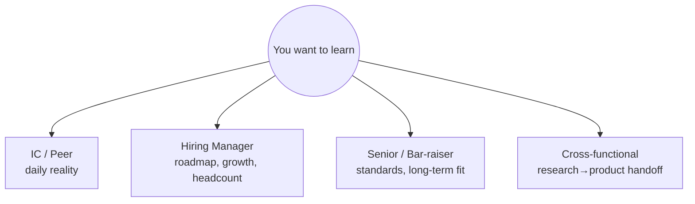
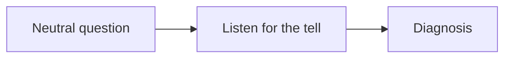

# Questions to Ask Them

per interviewer typewhat to learnsignal you're evaluatingred flags to probe

> [!TIP] 두 가지 임무를 동시에
> 모든 라운드는 "저에게 궁금한 점 있나요?"로 끝납니다 — 이걸 채점되는 면접의 일부이자 *동시에* 당신의 실질적 실사로 다루세요. 좋은 질문은 당신이 **그저 일자리를 쫓는 게 아니라 fit과 impact를 평가하고 있음**을 알리고, (a) 미래 오퍼를 순위 매기고 (b) 남은 라운드를 조율하는 데 필요한 정보를 끌어냅니다. 아무것도 안 묻는 건 약한 부정 signal이고, 뻔한 질문은 낭비된 턴입니다.

질문을 면접관의 시점에 맞추세요 — 동료 IC는 매일의 현실을 보고, HM은 로드맵과 headcount를 보고, bar-raiser는 조직의 기준을 보고, cross-functional 파트너는 research가 실제로 어떻게 출시되는지 봅니다. 각자에게 *그들만* 답할 수 있는 것을 물으세요.

## IC / 동료 연구자 — 매일의 현실

그들은 당신의 standup에 함께 있을 것이고, 포장할 유인이 가장 적습니다. 이 일이 실제로 *어떤 느낌인지* 알아내세요.

| 물을 것 | 드러나는 것 |
| --- | --- |
| "최근 한 주를 짚어주세요 — research vs. eng vs. 미팅이 각각 얼마였나요?" | 실제 시간 배분, 이게 RS인가 아니면 위장된 엔지니어링 역할인가? |
| "지금 무엇을 하고 계시고, 그 프로젝트는 어떻게 선정됐나요?" | 방향이 어떻게 정해지는가 — top-down인가 bottom-up인가 |
| "여기서 compute와 data 접근이 실제로 어떻게 되나요 — GPU를 큐잉하나요?" | CV/VLM 작업에 결정적인 제약 |
| "코드/실험 인프라는 어떤가요? 공유 프레임워크인가 각자 만드나요?" | 재현성 & 속도 |
| "합류 후 가장 놀란 게 뭐였나요?" | 적히지 않은 현실, 종종 그날 가장 솔직한 답 |

> [!TIP] 동료 라운드가 문화를 솔직히 탐침하는 곳입니다
> 동료는 "실제로 어떤지"를 매니저보다 솔직하게 답합니다. WLB, 자율성, 그리고 팀이 실제로 출시하는지를 들여다볼 최고의 창입니다.

## Hiring manager — 로드맵, 성장, fit

HM은 headcount와 당신의 궤적을 소유합니다. 방향과 성공의 모습을 물으세요 — 이건 당신이 그들의 로드맵을 자기 스킬에 매핑했음을 보여주기도 합니다 ([Recruiter & HM Screens](#/process/recruiter-hm) 참고).

<dl class="kv">
<dt>방향</dt><dd>"팀의 12개월 성공은 논문, product, 아니면 둘 다로 정의되나요?" · "2년 뒤 이 팀이 어디 있길 바라시고, 거기 가는 데 가장 큰 gap은 뭔가요?"</dd>
<dt>역할</dt><dd>"새 scientist가 첫 6개월에 무엇을 맡길 원하세요?" · "이건 특정한 열린 문제인가요, 아니면 제가 agenda를 함께 짜게 되나요?"</dd>
<dt>성장</dt><dd>"여기서 IC는 매니저가 되지 않고 어떻게 성장하나요?" · "이 팀에서 강한 scientist와 탁월한 scientist를 가르는 건 뭔가요?"</dd>
<dt>출판 정책</dt><dd>"출판 / 오픈소스 정책이 *실제로* 어떤가요?" — 논문·공개 자산이 커리어 목표에 중요한 후보라면 대상 팀의 승인 절차와 최근 사례를 확인.</dd>
</dl>

## 시니어 IC / bar-raiser — 기준과 장기 관점

초대장에 별도 senior interviewer, calibration interviewer, 또는 팀 밖의 staff/principal 대화가 있다면 그 면접관이 보는 관점을 recruiter에게 확인하세요. 조직 기준과 장기 관점을 다루는 라운드라면 기준과 과학에 대해 물을 수 있습니다.

| 물을 것 | 드러나는 것 |
| --- | --- |
| "지난 1년간 이 조직의 research 중 가장 자랑스러운 건 뭐고 왜인가요?" | 진짜 품질 기준 + 무엇을 중시하는가 |
| "조직은 어떤 bet에 자금을 대고 어떤 걸 접을지 어떻게 결정하나요?" | 규모의 research taste, 야심 찬 bet의 여지가 있는가? |
| "프로젝트가 출시돼야 할 때 research와 engineering이 어떻게 상호작용하나요?" | RS 작업이 production에 닿는가 아니면 repo에서 죽는가 |
| "강한 사람이 여기서 *잘 안 풀리는* 가장 흔한 이유는 뭔가요?" | 솔직한 위험 탐침, 답이 진단적임 |

이 질문들은 *당신의* 시니어리티도 보여줍니다 — 책상만이 아니라 조직을 생각하고 있다는.

## Cross-functional 파트너 — research가 실제로 어떻게 출시되는가

PM, serving/eng, 또는 applied 파트너에게는 research와 product의 이음매를 탐침하세요. 특히 research-to-product 경험이 강점이라면, 자신의 구체 사례는 [이력서 딥다이브 맵](#/resume/overview)에서 골라 연결합니다.

- "모델이 research 결과에서 사용자 앞의 무언가로 어떻게 가나요? 각 단계는 누가 소유하나요?"
- "오늘 research와 product 사이 가장 큰 마찰은 뭔가요?"
- "모델 품질과 product KPI가 충돌할 때 어떻게 조율하나요?" (당신의 [갈등 story](#/behavioral/star)를 반영)
- "scientist가 고객 / product 데이터와 직접 얼마나 상호작용하나요?"

> [!NOTE] 고객 대면 역할의 경우
> 고객 프로젝트 작업 vs. 내부 foundation research의 균형을 물으세요: *"scientist 기준 client 대면 시간 대 내부 모델 작업의 비율은 어떤가요?"* 결정에 관련된 숫자이고, 그들의 비즈니스 모델을 이해함을 보여줍니다.

## 탐침할 red flag (그리고 어떻게 알아들을지)

중립적 질문을 하고, *신호를 들으세요*. 적대적이지 않게 위험을 진단하는 것입니다.

| 탐침 질문 | red-flag 답변 | 의미할 가능성 |
| --- | --- | --- |
| "이 자리가 왜 열렸나요?" | 회피적, 상세 없이 "지난 사람이 떠나서" | 이직률 / 번아웃된 자리 |
| "이 팀에 얼마나 계셨나요?" | 모두 6개월 미만 전에 합류 | 높은 이탈 또는 막 재조직된 팀 |
| "팀의 runway / headcount 안정성은 어떤가요?" | 모호, 방어적 | 재조직 또는 자금 위험 (특히 스타트업, 새 lab) |
| "crunch 동안 work-life balance는 어떻게 다루나요?" | 구체적 원칙·회복 방식 없이 웃어넘김 | 정상화된 과로 가능성; 다른 팀원에게 교차 확인 |
| "우선순위는 어떻게 정해지나요 — 자주 바뀌나요?" | 지친 어조로 "계속요, 우린 매우 agile해요" | 갈팡질팡, 전략 없음, 반응적 리더십 |
| "지난 큰 프로젝트는 어떻게 됐나요?" | 출시/출판된 결과를 대지 못함 | 착지하지 못하는 research |

> [!WARNING] 탐침을 면접관에 맞추세요
> 어려운 문화/안정성 질문은 *동료와 cross-functional 파트너*에게 하세요 — 솔직하게 답합니다. *HM과 bar-raiser*에게는 미래 지향적이고 전략적인 질문을 유지하세요. 매니저를 이탈률로 몰아붙이지 말고, 동료가 말한 것을 조용히 교차 확인하세요.

## 로지스틱스 질문 (면접관이 아니라 recruiter에게 아껴두세요)

프로세스, 타임라인, 레벨 범위, 연봉 밴드, 비자, 팀 매칭 방식, 그리고 어떤 coding 플랫폼을 쓰는지는 모두 기술 면접관이 아니라 **recruiter**의 몫입니다 — [Recruiter & HM Screens](#/process/recruiter-hm)와 [Remote Setup](#/playbook/remote-setup) 참고. 면접관의 Q&A를 로지스틱스에 쓰는 건 최고의 signal 발신 기회를 낭비하는 것입니다.

## 한 슬롯 쓸 가치 있는 회사·팀별 질문

한 질문은 **대상 JD나 최신 공식 자료에서 직접 확인한 특성**을 겨냥하세요. 템플릿은 “공개 자료에서 `{특성}`을 봤는데, 실제 팀에서는 `{의사결정/시간 배분/성공 기준}`이 어떻게 작동하나요?”입니다. 회사 전체의 문화나 프로세스를 전제로 깔지 말고, 조사일과 확인 상태는 [회사별 플레이북](#/process/companies)에 기록하세요.

## 전달 팁

- **~5개 준비, 2~3개 질문.** 양보다 질, 라운드에서 나온 것에 맞는 걸 고르세요.
- **그들이 말한 것을 참조:** "아까 X를 언급하셨는데 — 그게 Y와 어떻게 상호작용하나요?" 집중하고 있었음을 증명.
- **30초 검색으로 답 나오는 질문은 피하세요** (대표 product, 펀딩 라운드) — 조사를 안 한 걸로 읽힙니다.
- **fallback을 준비하세요** 그들이 다 답했다면: "제 주요 질문은 다 다뤄주셨네요 — 후보들이 더 물어봤으면 하는 팀에 관한 게 있나요?"

## 후속 질문

"질문 있나요?"라는데 솔직히 남은 게 없어요 — 뭐라고 하죠?

**짧게:** 가능하면 "없어요"로 끝내기보다, 공을 그들에게 돌리는 fallback 질문 하나를 쓰세요.

**깊게:** "제가 알고 싶었던 걸 사실 다 다뤄주셨는데, 좋은 신호네요. 하나만 더 여쭤도 될까요 — 여기서 일하며 *당신을* 놀라게 한 게 있나요?" 이건 몰입을 유지하고, 솔직한 답을 끌어내고, 낮은 관심으로 읽히는 밋밋한 "없어요"를 피합니다.

스크린 vs. 후반 온사이트 라운드에서 질문이 달라야 하나요?

**짧게:** 네 — 초반은 넓고 전략적으로, 후반은 구체적이고 실사 위주로.

**깊게:** [recruiter/HM 스크린](#/process/recruiter-hm)에서는 아직 투자할지 결정 중이니 방향, 역할 범위, fit을 물으세요. 후반 온사이트 라운드쯤엔 팀 쪽으로 기울고 있을 테니, *오퍼 결정*을 좌우할 질문으로 옮기세요: 인프라 현실, 성장 경로, research가 어떻게 출시되는지, 동료용 문화 탐침. 후반 라운드에서 아직 "이 팀은 뭘 하나요?"인 질문은 앞서 집중하지 않았다는 신호입니다.

기술 라운드에서 연봉이나 레벨을 물어도 되나요?

**짧게:** 보통은 recruiter에게 묻는 편이 정확합니다. 기술 면접관에게는 일과 팀에 관한 질문을 우선하세요.

**깊게:** 기술 면접관은 보통 연봉을 정하지 않고, 그러면 교환이 거래처럼 됩니다. 그들의 Q&A는 일, 팀, 과학에 관한 것으로 유지하세요. 연봉 전략은 [Offers & Negotiation](#/process/negotiation)에 있습니다.

## 치트시트

| 면접관 | 물을 주제 | 최고의 단일 질문 |
| --- | --- | --- |
| **IC / 동료** | 매일의 현실, 인프라, GPU, 문화 | "합류 후 가장 놀란 게 뭐였나요?" |
| **Hiring manager** | 로드맵, ownership, 성장, 출판 정책 | "첫 6개월에 제가 무엇을 맡게 되나요?" |
| **Senior / bar-raiser** | 기준, bet, research→eng | "지난 1년 조직 작업 중 가장 자랑스러운 건?" |
| **Cross-functional** | research→product 이음매, KPI 충돌 | "research와 product 사이 가장 큰 마찰은 어디?" |
| **Recruiter (면접관 아님)** | 프로세스, 레벨, 연봉, 비자, 도구 | "팀 매칭은 어떻게 되고, 연봉은 언제 논의되나요?" |

**관련:** [Recruiter & HM Screens](#/process/recruiter-hm) · [Day-Of Tactics & Recovery](#/playbook/tactics) · [Remote Interview Setup](#/playbook/remote-setup) · [Offers, Levels & Negotiation](#/process/negotiation) · [Company Playbooks](#/process/companies) · [STAR & The Story Bank](#/behavioral/star) · [Common Mistakes & Red Flags](#/playbook/mistakes)
