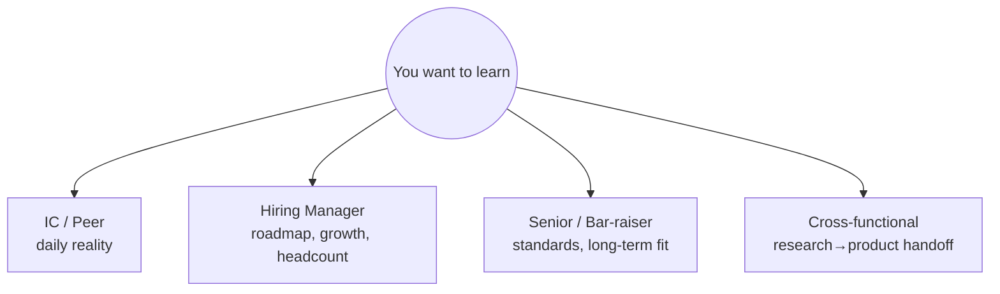
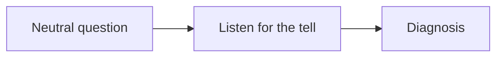

# Questions to Ask Them

per interviewer typewhat to learnsignal you're evaluatingred flags to probe

> [!TIP] Two jobs at once
> Every round ends with "what questions do you have for me?" — treat it as a scored part of the interview *and* as your real diligence. Good questions signal you're **evaluating fit and impact, not just chasing a job**; they also surface the information you need to (a) rank a future offer and (b) tailor your remaining rounds. Asking nothing is a mild negative signal; asking generic questions is a wasted turn.

Match the question to the interviewer's vantage point — a peer IC sees daily reality; the HM sees roadmap and headcount; the bar-raiser sees the org's standards; cross-functional partners see how research actually ships. Ask each what only *they* can answer.

## IC / peer researcher — the daily reality

They'll be in your standups; they have the least incentive to spin. Learn what the job actually *feels* like.

| Ask | What it reveals |
| --- | --- |
| "Walk me through a recent week — how much of it was research vs. eng vs. meetings?" | real time allocation; is this an RS or a disguised engineering role? |
| "What are you working on right now, and how did that project get chosen?" | how directions are set — top-down or bottom-up |
| "How do compute and data access actually work here — do you queue for GPUs?" | a make-or-break constraint for CV/VLM work |
| "What's the code/experiment infra like? Shared framework or everyone rolls their own?" | reproducibility & velocity |
| "What surprised you most after joining?" | the unwritten reality; often the most honest answer of the day |

> [!TIP] The peer round is where you probe culture honestly
> Peers answer "what's it really like" more candidly than a manager can. This is your best window into WLB, autonomy, and whether the team ships.

## Hiring manager — roadmap, growth, and fit

The HM owns the headcount and your trajectory. Ask about direction and what success looks like — this also lets you show you've mapped their roadmap onto your skills (see [Recruiter & HM Screens](#/process/recruiter-hm)).

<dl class="kv">
<dt>Direction</dt><dd>"Is the team's 12-month success defined by papers, product, or both?" · "Where do you want this team to be in two years, and what's the biggest gap to get there?"</dd>
<dt>The role</dt><dd>"What would you want a new scientist to own in the first 6 months?" · "Is this a specific open problem, or would I help shape the agenda?"</dd>
<dt>Growth</dt><dd>"How do ICs grow here without becoming managers?" · "What separates a strong from an exceptional scientist on this team?"</dd>
<dt>Publication policy</dt><dd>"What does the publish / open-source policy look like *in practice*?" — critical for an RS with a paper record; especially sharp for Apple (secrecy) and ByteDance.</dd>
</dl>

## Senior IC / bar-raiser — standards and the long view

The "As Appropriate" (Microsoft), bar-raiser (Amazon-style), or a staff/principal from outside the team assesses long-term potential and org standards. Ask about the bar and the science.

| Ask | What it reveals |
| --- | --- |
| "What research from this org in the last year are you proudest of, and why?" | the real quality bar + what they value |
| "How does the org decide which bets to fund and which to kill?" | research taste at scale; is there room for ambitious bets? |
| "How do research and engineering interact when a project needs to ship?" | whether RS work reaches production or dies in a repo |
| "What's the most common reason strong people *don't* work out here?" | a candid risk probe; the answer is diagnostic |

These questions also demonstrate *your* seniority — you're thinking about the org, not just the desk.

## Cross-functional partners — how research actually ships

For PM, serving/eng, or applied partners: probe the seam between research and product — the exact competency your CV is strong on (ZIM → CLOVA-X, foreground-API, on-device serving).

- "How does a model go from a research result to something in front of users? Who owns each step?"
- "What's the biggest friction between research and product today?"
- "How are model quality and product KPIs reconciled when they conflict?" (mirrors your own [conflict story](#/behavioral/star))
- "How much do scientists interact with customers / product data directly?"

> [!NOTE] For customer-facing labs (Mistral)
> Ask about the balance of customer-project work vs. internal foundation research: *"What's the ratio of client-facing time to internal model work for a scientist?"* It's a decision-relevant number and shows you understand their business model.

## Red flags to probe (and how to hear them)

Ask neutral questions, then *listen for the tell*. You're diagnosing risk without being adversarial.

| Probe question | Red-flag answer | What it likely means |
| --- | --- | --- |
| "Why is this role open?" | evasive; "the last person left" with no detail | churn / a burned-out seat |
| "How long have you been on this team?" | everyone joined <6 months ago | high attrition or a just-reorged team |
| "What's the team's runway / how stable is headcount?" | vague, defensive | reorg or funding risk (esp. startups, new labs) |
| "How do you handle work-life balance during crunches?" | "we work hard here 😅" / laughs it off | normalized overwork (ByteDance "996" reputation) |
| "How are priorities set — do they change often?" | "constantly, we're very agile" said wearily | thrash, no strategy, reactive leadership |
| "What happened to the last big project?" | can't name a shipped/published outcome | research that doesn't land |

> [!WARNING] Match the probe to the interviewer
> Ask *peers and cross-functional partners* the hard culture/stability questions — they answer honestly. Keep questions to the *HM and bar-raiser* forward-looking and strategic. Don't grill the manager on attrition; do quietly cross-check what peers said.

## Logistics questions (save for recruiter, not interviewers)

Process, timeline, level range, comp band, visa, team-matching mechanics, and which coding platform is used all belong to the **recruiter**, not your technical interviewers — see [Recruiter & HM Screens](#/process/recruiter-hm) and [Remote Setup](#/playbook/remote-setup). Spending an interviewer's Q&A on logistics wastes your best signal-sending opportunity.

## Company-specific questions worth one slot

Each targets a real, public characteristic of the org — asking it proves you did the reading (see [Company Playbooks](#/process/companies)).

| Company | Ask | Why it lands |
| --- | --- | --- |
| **Meta / FAIR** | "How do you decide whether a project lives in FAIR vs. the product/GenAI orgs?" | shows you know the org split; clarifies publish-vs-ship expectations |
| **Apple** | "Within the secrecy constraints, what *can* a scientist publish or open-source here?" | acknowledges the culture without prying into products |
| **NVIDIA** | "How much do research projects lean on the latest hardware, and is GPU access a bottleneck?" | matches their systems/GPU identity |
| **Adobe** | "How tight is the loop between a research result and a Firefly/Creative-Cloud feature?" | probes their research→product strength |
| **ByteDance Seed** | "How are OKRs set for a research team, and how is a longer-horizon bet protected?" | surfaces the fast/OKR culture *and* whether deep research survives |
| **Mistral** | "What's the split between customer-project work and internal foundation research for a scientist?" | decision-relevant given their business model |
| **Microsoft / MSR** | "How does the 'As Appropriate' / cross-org collaboration actually shape a research agenda?" | shows you understand their structure |

## Delivery tips

- **Prepare ~5, ask 2–3.** Quality over quantity; pick the ones that fit what emerged in the round.
- **Reference something they said:** "You mentioned X earlier — how does that interact with Y?" Proves you were present.
- **Avoid questions a 30-second search answers** (headline products, funding rounds) — reads as not doing the reading.
- **Have a fallback** if they answered everything: "You've covered my main questions — what's something about the team you wish more candidates asked about?"

## Follow-ups

They asked "any questions?" and I honestly have none left — what do I say?

**Short:** Never say "no." Use the fallback that turns it back to them.

**Deep:** "You've actually covered what I came in wanting to know, which is a good sign. If I can ask one more — what's something about working here that surprised *you*?" This stays engaged, extracts a candid answer, and avoids the flat "nope" that reads as low interest.

Should my questions be different in a screen vs. a late onsite round?

**Short:** Yes — broad and strategic early, specific and diligence-driven late.

**Deep:** In the [recruiter/HM screen](#/process/recruiter-hm) you're still deciding whether to invest, so ask about direction, role scope, and fit. By the late onsite rounds you're likely leaning toward the team, so shift to the questions that would sway an *offer decision*: infra reality, growth path, how research ships, and the culture probes for peers. A late-round question that's still "what does the team do?" signals you weren't paying attention earlier.

Is it okay to ask about compensation or level in a technical round?

**Short:** No — route all comp/level/logistics to the recruiter.

**Deep:** Technical interviewers usually don't set comp and it makes the exchange transactional. Keep their Q&A about the work, the team, and the science. Comp strategy lives in [Offers & Negotiation](#/process/negotiation).

## Cheat-sheet

| Interviewer | Ask about | Best single question |
| --- | --- | --- |
| **IC / peer** | daily reality, infra, GPUs, culture | "What surprised you most after joining?" |
| **Hiring manager** | roadmap, ownership, growth, publish policy | "What would I own in my first 6 months?" |
| **Senior / bar-raiser** | standards, bets, research→eng | "What org work from the past year are you proudest of?" |
| **Cross-functional** | research→product seam, KPI conflicts | "Where's the biggest friction between research and product?" |
| **Recruiter (not interviewers)** | process, level, comp, visa, tool | "How does team-matching work, and when is comp discussed?" |

**Related:** [Recruiter & HM Screens](#/process/recruiter-hm) · [Day-Of Tactics & Recovery](#/playbook/tactics) · [Remote Interview Setup](#/playbook/remote-setup) · [Offers, Levels & Negotiation](#/process/negotiation) · [Company Playbooks](#/process/companies) · [STAR & The Story Bank](#/behavioral/star) · [Common Mistakes & Red Flags](#/playbook/mistakes)
