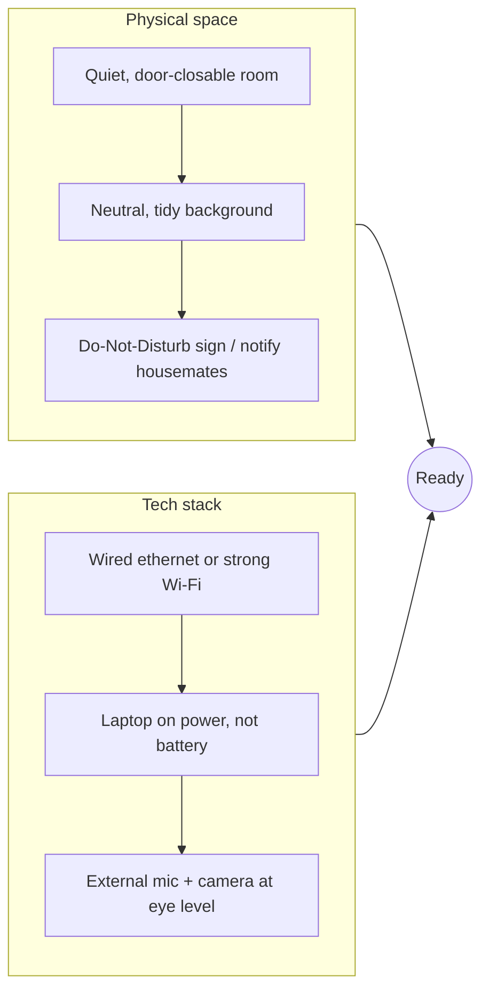
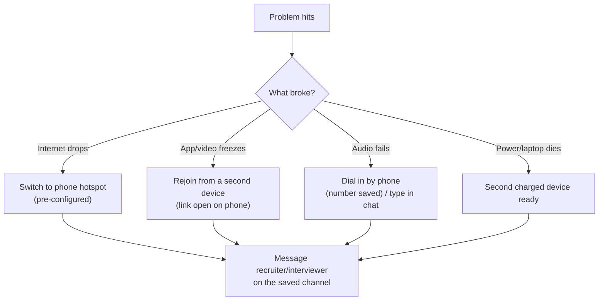

# Remote Interview Setup

environmentcamera / audioCoderPad / live-sharebackup plansbody language on video

> [!TIP] 왜 셋업에 공을 들이나
> 원격 라운드는 여전히 흔하지만, 원격·대면·혼합 여부는 팀과 시점에 따라 달라집니다. 얼어붙은 화면 공유, 죽은 마이크, 어두운 방은 답변에 쓸 시간을 잡아먹습니다. 초대장과 recruiter 안내로 실제 형식을 확인하고, 사용할 환경을 미리 재현해 보세요.

여러 시간대에 걸쳐 면접하는 후보(서울 → 미국/EU)라면, 셋업은 <strong>이상한 시간대와 비원어민 영어 오디오 채널</strong>까지 견뎌야 합니다. 명료함이 평소보다 더 중요합니다.

## 환경 체크리스트

<dl class="kv">
<dt>방</dt><dd>조용하고, 닫을 수 있는 문, 무음 처리한 폰, 끈 알림(시스템 전역 Do Not Disturb / Focus). 그 시간 동안 연락이 안 된다고 공간 안 사람들에게 알리세요.</dd>
<dt>배경</dt><dd>깔끔하고 중립적인 배경이 virtual background보다 낫습니다 (손 주변에서 깨지는데 — whiteboard를 가리킬 때 나빠집니다). 민무늬 벽이나 책장이 이상적입니다.</dd>
<dt>전원 & 네트워크</dt><dd>노트북은 전원 연결. 가능하면 **유선 이더넷**, 아니면 라우터 가까이에 앉으세요. 대역폭을 잡아먹는 것(클라우드 동기화, 다운로드, 다른 탭)을 닫으세요.</dd>
</dl>

## 카메라 & 오디오: "프로페셔널"로 읽히는 디테일

오디오 품질이 비디오보다 더 중요합니다. 또렷한 마이크와 울림이 적은 환경은 억양과 관계없이 전달 명료도를 높입니다.

| 요소 | 값싼 해결책 | 왜 중요한가 |
| --- | --- | --- |
| **마이크** | 유선 이어버드/헤드셋 마이크 > 노트북 마이크 | 방 울림과 키보드 소음을 없앰, 비원어민 억양에 더 또렷 |
| **카메라 높이** | 렌즈가 <strong>눈높이</strong>에 오도록 노트북을 올림 | 내려다보면 자신감 없어 보임, 눈높이 = 몰입 |
| **조명** | 창을 마주하거나 램프를 *카메라 뒤에* 둠 | 역광은 당신을 실루엣으로 만듦 |
| **프레이밍** | 머리-어깨, 머리 위 여백 조금 | 너무 가까우면 강렬, 너무 멀면 무관심 |
| **아이 컨택** | 화면 속 얼굴이 아니라 <strong>렌즈</strong>를 봄 | 비디오에서는 렌즈 응시가 *곧* 아이 컨택 |

> [!WARNING] 거울이 아니라 실제 도구로 테스트하세요
> Photo Booth에서 "카메라 됨" ≠ "면접 앱에서 됨". 실제로 쓸 <strong>같은 앱, 같은 기기, 같은 네트워크</strong>에서 실제 테스트 콜(친구, 또는 플랫폼 테스트룸)을 하세요. 마이크가 엉뚱한 기기가 아닌지, 화면 공유가 실제로 전송되는지 확인하세요.

## coding/협업 도구를 미리 연습하세요

면접 플랫폼은 당신이 *제거*할 수 있는 변수입니다. 각각 특이점이 있습니다 — autocomplete 없음, run 버튼 없음, 낯선 키바인딩 — 이런 걸 처음 만나면 시간을 잡아먹습니다.

<dl class="kv">
<dt>공유 coding editor</dt><dd>CoderPad, Codility, HackerRank 등은 설정이 서로 다릅니다. 실제 플랫폼을 확인한 뒤, autocomplete 없이 작성하기·언어 선택·테스트 실행 가능 여부를 연습하세요.</dd>
<dt>VS Code Live Share</dt><dd>자기 에디터에서 실시간 협업 편집. 미리 설치하고 테스트하세요. 터미널 공유와 면접관 커서 따라가는 법을 알아두세요.</dd>
<dt>Google Doc / 순수 공유 텍스트</dt><dd>일부 research 라운드는 실행 없는 맨 문서를 씁니다. 컴파일러에 기댈 수 없으니 *실행되는 듯한* 코드를 쓰고 손으로 추적하는 연습을 하세요.</dd>
<dt>가상 whiteboard (Excalidraw / 내장)</dt><dd>system/ML design용. 박스-화살표를 빠르게 그리는 연습, 노드 만들기/라벨/이동을 알아두세요. [The Design Framework](#/system-design/framework) 참고.</dd>
</dl>

> [!TIP] 어떤 도구인지 recruiter에게 물어보세요
> recruiter-screen 질문 목록에 포함시키세요 ([Recruiter & HM Screens](#/process/recruiter-hm) 참고): *"어떤 coding 플랫폼을 쓰나요, 그리고 코드 실행 / AI 보조가 허용되나요?"* 그런 다음 바로 그 도구에서 워밍업 문제 하나를 풀어보세요.

## AI 보조 coding 라운드

생성형 AI나 autocomplete 정책은 회사 이름으로 일반화할 수 없습니다. 같은 회사에서도 라운드별로 <strong>허용·제한·금지</strong>가 다를 수 있으므로, 초대장 또는 recruiter의 서면 답변을 기준으로 따르세요. 답이 없으면 허용된다고 가정하지 말고 확인합니다.

- **금지/비활성화 라운드:** IDE 보조 없이 구현·테스트·디버그하는 연습을 합니다.
- **허용 라운드:** 어떤 도구와 기능이 가능한지 확인하고, 생성 결과의 가정·복잡도·edge case·테스트를 직접 검증하는 workflow를 연습합니다.
- **제한이 모호할 때:** 라운드 시작 전에 면접관에게 확인하고, 답변을 기록된 정책에 맞춥니다.

도구가 허용되더라도 평가 기준이 자동으로 “prompting 능력”으로 바뀐다고 단정하지 마세요. 문제 해결과 검증을 자신이 소유하고 있음을 내레이션하는 것이 안전합니다.

## 백업 플랜 (고장을 짧게 끝내기)

글리치가 라운드가 아니라 30초만 잡아먹도록 문서화된 fallback을 준비하세요.

- **면접관/recruiter 연락처를 저장**(이메일 + 폰/Slack)해두세요. 연결이 끊기면 즉시 닿을 수 있도록 *통화 전에*.
- <strong>폰 핫스팟을 미리 설정</strong>해서 네트워크 fallback으로.
- **join 링크를 두 번째 기기에 열어두어** 몇 초 안에 재접속할 수 있게.
- 무언가 고장 나면 **침착하게 소통하세요**: "오디오가 끊겼습니다 — 지금 전화로 접속합니다." 글리치 속 침착함 자체가 긍정적 signal입니다.

## 비디오에서의 바디랭귀지

비디오는 존재감을 납작하게 만들므로 약간 보정하세요.

좋게 읽힘

- 렌즈 높이 응시, *당신이* 말할 때 카메라를 봄
- 바로 앉기, 어깨 펴기, 들을 때 살짝 몸을 기울임
- 손이 보이게, 강조를 위한 자연스러운 제스처
- 끄덕임/"음-흠"으로 따라가고 있음을 표시
- 인사와 마무리에 미소

나쁘게 읽힘

- 자기 썸네일 응시 (회피처럼 보임)
- 구부정하게 / 프레임 밖으로 기울기
- 대놓고 두 번째 화면에서 읽기
- 밋밋하고 미동 없는 "인질 비디오" 에너지
- 안절부절, 화면 밖 흘긋거림 (컨닝 필기처럼 보임)

> [!NOTE] 비디오에서 노트는 괜찮습니다 — 어느 정도 보인다면
> 작은 노트 카드를 힐끗 보는 건 정상이지만, *대놓고* 화면 밖을 길게 읽으면 답을 읽는 것처럼 보입니다. 노트는 스크립트가 아니라 키워드 bullet(당신의 [story-bank](#/behavioral/star) 트리거, 물어볼 질문)으로 유지하세요. 더 많은 내용은 [Day-Of Tactics](#/playbook/tactics)에.

## 30분 전 의식

- [ ] 기기 재시작, 비필수 앱과 탭 전부 닫기.
- [ ] 시스템 Do Not Disturb / Focus 켜기, 폰 무음 & 뒤집어 놓기.
- [ ] **실제** 앱에서 카메라, 마이크, 스피커 테스트, join 링크를 두 번째 기기에 준비.
- [ ] 물 손닿는 곳에, 화장실 미리, 긴 loop이면 간식.
- [ ] 면접관 이름 & recruiter 연락처를 탭에 열어두기.
- [ ] 이력서, JD, story-bank 키워드를 보이되 최소한으로.
- [ ] **2~3분 일찍** 접속, 준비된 채로 앉기, 0:00에 허둥대지 말 것.

## 후속 질문

인터넷이 불안정한데 — 미리 알려야 하나요?

**짧게:** 네, 선제적으로, 그리고 핫스팟을 준비해두세요.

**깊게:** 시작할 때 한 줄 알림("오늘 연결이 조금 불안정합니다. 얼어붙으면 즉시 폰으로 재접속하겠습니다")은 기대치를 설정하고, 취약함이 아니라 준비된 사람으로 읽힙니다. 그러면 실제로 일어났을 때 패닉 속에 사과하는 대신 침착하게 플랜을 실행합니다.

virtual background나 blur를 써도 되나요?

**짧게:** 실제 깔끔한 배경이 낫습니다. 약한 blur는 허용, 완전한 virtual background는 위험.

**깊게:** virtual background는 움직이는 손과 제스처 주변에서 깨집니다 — 공유 보드를 가리키는 design 라운드에서 산만합니다. 공간이 지저분하면 *은은한* blur가 안전한 중간입니다. 절대 산만한 테마 배경은 안 됩니다.

## 치트시트

| 영역 | 필수 |
| --- | --- |
| 네트워크 | 유선/강한 Wi-Fi, 노트북 전원 연결, 핫스팟 fallback 준비 |
| 오디오 | 헤드셋 마이크 > 노트북 마이크, 실제 앱에서 테스트 |
| 카메라 | 렌즈 눈높이, 빛은 앞에서 뒤가 아니라, 머리-어깨 |
| 도구 | 어떤 플랫폼인지 recruiter에게 확인, 그 안에서 워밍업 1회, 특이점 파악 |
| AI 라운드 | 정책 확인, 허용되면 조종-검증 workflow 연습 |
| 백업 | 연락처 저장, join 링크 열린 두 번째 기기, 고장 시 침착한 소통 |
| 바디랭귀지 | 렌즈를 보기, 바로 앉기, 손 보이게, 자기 썸네일 응시 금지 |
| 의식 | 재시작, DND, 테스트, 물, 이름 & 노트 띄우기, 2~3분 일찍 접속 |

**관련:** [Communication & Whiteboarding](#/playbook/communication) · [Day-Of Tactics & Recovery](#/playbook/tactics) · [Recruiter & HM Screens](#/process/recruiter-hm) · [Coding Round Strategy](#/coding/strategy) · [The Design Framework](#/system-design/framework) · [Questions to Ask Them](#/playbook/questions-to-ask)
