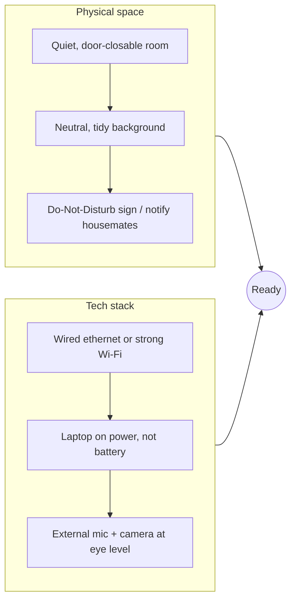
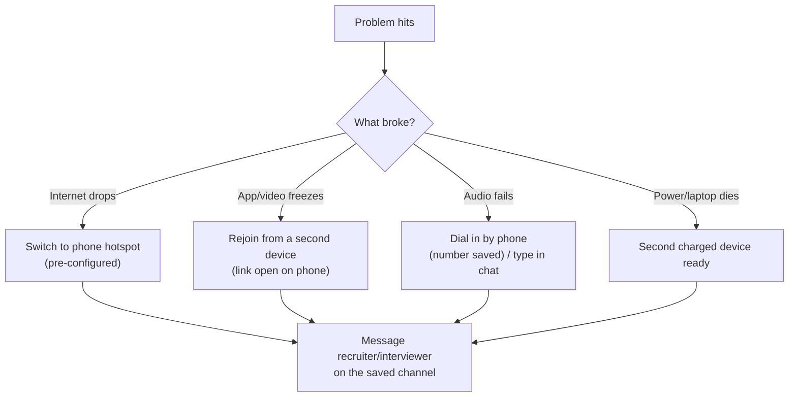

# Remote Interview Setup

environmentcamera / audioCoderPad / live-sharebackup plansbody language on video

> [!TIP] Why sweat the setup
> Remote rounds remain common, but whether a loop is remote, in person, or hybrid varies by team and date. A frozen screen share, a dead mic, or a dark room consumes time you could spend answering. Confirm the actual format from the invitation and recruiter guidance, then reproduce and test the environment you will use in advance.

For a candidate interviewing across time zones (Seoul → US/EU), the setup also has to survive <strong>odd hours and a non-native-English audio channel</strong> — clarity matters more than usual.

## The environment checklist

<dl class="kv">
<dt>Room</dt><dd>Quiet, door you can close, phone silenced, notifications off (system-wide Do Not Disturb / Focus). Tell anyone in the space you're unreachable for the window.</dd>
<dt>Background</dt><dd>Neutral and tidy beats a virtual background (which glitches around your hands — bad when you gesture at a whiteboard). A plain wall or bookshelf is ideal.</dd>
<dt>Power & network</dt><dd>Laptop plugged in. **Wired ethernet** if possible; otherwise sit close to the router. Close bandwidth hogs (cloud sync, downloads, other tabs).</dd>
</dl>

## Camera & audio: the details that read as "professional"

Audio quality matters more than video. A clear microphone and low-echo environment improve intelligibility regardless of accent.

| Element | Cheap fix | Why it matters |
| --- | --- | --- |
| **Mic** | Wired earbuds/headset mic > laptop mic | kills room echo & keyboard clatter; clearer for non-native accents |
| **Camera height** | Raise laptop so the lens is at <strong>eye level</strong> | looking down reads as low-confidence; eye-level = engaged |
| **Lighting** | Face a window or put a lamp *behind the camera* | back-lighting turns you into a silhouette |
| **Framing** | Head-and-shoulders, small headroom | too close = intense; too far = disengaged |
| **Eye contact** | Glance at the <strong>lens</strong>, not the face on screen | on video, lens-gaze *is* eye contact |

> [!WARNING] Test with the actual tool, not just a mirror
> "Camera works" in Photo Booth ≠ "works in the interview app." Do a real test call (a friend, or the platform's test room) on the <strong>same app, same machine, same network</strong> you'll use. Verify the mic isn't the wrong device and screen-share actually transmits.

## Practice the coding/collaboration tool in advance

The interview platform is a variable you can *remove*. Each has quirks — no autocomplete, no run button, unfamiliar keybindings — that eat time if you meet them cold.

<dl class="kv">
<dt>Shared coding editor</dt><dd>CoderPad, Codility, HackerRank, and similar tools differ in configuration. After confirming the actual platform, practice writing without autocomplete, selecting the language, and determining whether test execution is allowed.</dd>
<dt>VS Code Live Share</dt><dd>Real-time collaborative editing in your own editor. Install and test it beforehand; know how to share terminal and follow the interviewer's cursor.</dd>
<dt>Google Doc / plain shared text</dt><dd>Some research rounds use a bare doc — no execution. Practice writing *runnable-looking* code and tracing by hand, since you can't lean on a compiler.</dd>
<dt>Virtual whiteboard (Excalidraw / built-in)</dt><dd>For system/ML design. Practice drawing boxes-and-arrows fast; know how to make/label/move nodes. See [The Design Framework](#/system-design/framework).</dd>
</dl>

> [!TIP] Ask the recruiter which tool
> Include it in your recruiter-screen question list (see [Recruiter & HM Screens](#/process/recruiter-hm)): *"Which coding platform will we use, and is code execution / AI assistance allowed?"* Then do one warm-up problem in that exact tool.

## AI-assisted coding rounds

Generative-AI and autocomplete policies cannot be generalized from the company name. Even within the same company, a round may <strong>allow, restrict, or prohibit</strong> them; follow the invitation or the recruiter's written answer. If there is no answer, do not assume permission — ask.

- **Prohibited or disabled round:** practice implementing, testing, and debugging without IDE assistance.
- **Allowed round:** confirm which tools and features are permitted, then practice a workflow in which you personally verify assumptions, complexity, edge cases, and tests in generated output.
- **Ambiguous restrictions:** confirm with the interviewer before the round starts, and follow the recorded policy.

Even when a tool is allowed, do not assume the evaluation criterion automatically becomes "prompting ability." The safe approach is to narrate how you retain ownership of problem solving and verification.

## Backup plans (keep failures short)

Have a written fallback so a glitch costs 30 seconds, not the round.

- **Save the interviewer/recruiter contact** (email + any phone/Slack) *before* the call, so you can reach them instantly if you drop.
- <strong>Pre-configure a phone hotspot</strong> as a network fallback.
- **Keep the join link open on a second device** so you can rejoin in seconds.
- If something breaks, **stay calm and communicate**: "I've lost audio — dialing in now." Composure under a glitch is itself a positive signal.

## Body language on video

Video flattens presence, so compensate slightly.

Reads well

- Lens-level gaze; look at the camera when *you* speak
- Sit up, shoulders back, slight lean-in when listening
- Hands visible; natural gestures for emphasis
- Nod/verbal "mm-hm" to show you're tracking
- Smile at greeting and sign-off

Reads poorly

- Staring at your own thumbnail (looks like avoidance)
- Slouching / leaning out of frame
- Reading obviously off a second screen
- Flat, motionless "hostage video" energy
- Fidgeting, off-screen glances (looks like notetaking-cheating)

> [!NOTE] Notes on video are fine — if visible-ish
> Glancing at a small note card is normal, but *obvious* long reads off-screen look like you're reading answers. Keep any notes to keyword bullets (your [story-bank](#/behavioral/star) triggers, questions to ask), not scripts. More in [Day-Of Tactics](#/playbook/tactics).

## The 30-minute-before ritual

- [ ] Restart the machine; close every non-essential app and tab.
- [ ] System Do Not Disturb / Focus on; phone silent & face-down.
- [ ] Test camera, mic, speaker in the **actual** app; join link ready on a 2nd device.
- [ ] Water within reach; bathroom done; snack if it's a long loop.
- [ ] Interviewer names & the recruiter contact open in a tab.
- [ ] Résumé, JD, and your story-bank keywords visible but minimal.
- [ ] Join **2–3 minutes early**; sit ready, don't scramble at 0:00.

## Follow-ups

My internet is unreliable — should I flag it?

**Short:** Yes, proactively, and have the hotspot ready.

**Deep:** A one-line heads-up at the start ("my connection has been slightly flaky today; if I freeze I'll rejoin immediately from my phone") sets expectations and reads as prepared, not fragile. Then if it happens, you execute the plan calmly instead of apologizing in a panic.

Can I use a virtual background or blur?

**Short:** Prefer a real tidy background; light blur is acceptable, full virtual backgrounds are risky.

**Deep:** Virtual backgrounds glitch around moving hands and gestures — distracting in a design round where you point at a shared board. If your space is messy, a *subtle* blur is the safe middle. Never a distracting themed background.

## Cheat-sheet

| Area | Must-do |
| --- | --- |
| Network | wired/strong Wi-Fi; laptop on power; hotspot fallback ready |
| Audio | headset mic > laptop mic; test in the real app |
| Camera | lens at eye level; light in front, not behind; head-and-shoulders |
| Tool | ask recruiter which platform; do 1 warm-up in it; know its quirks |
| AI rounds | confirm policy; if allowed, practice steer-and-verify workflow |
| Backup | save contacts; 2nd device on join link; calm comms if it breaks |
| Body language | look at the lens; sit up; hands visible; not at your own thumbnail |
| Ritual | restart, DND, test, water, names & notes up, join 2–3 min early |

**Related:** [Communication & Whiteboarding](#/playbook/communication) · [Day-Of Tactics & Recovery](#/playbook/tactics) · [Recruiter & HM Screens](#/process/recruiter-hm) · [Coding Round Strategy](#/coding/strategy) · [The Design Framework](#/system-design/framework) · [Questions to Ask Them](#/playbook/questions-to-ask)
