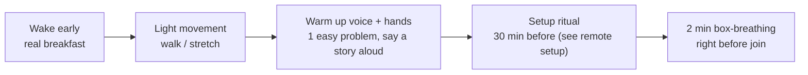
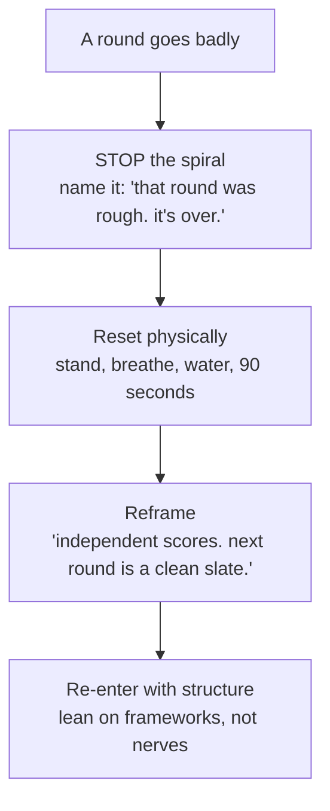

# Day-Of Tactics & Recovery

pre-interview routineenergy & pacingbombed-round recoverynote-takingnerves24h checklist

> [!TIP] 당일을 이기는 마인드셋
> 풀 RS/AS 온사이트는 **하루에 4~6개 라운드** — 스프린트가 아니라 지구력 종목입니다. 두 가지 진실이 따라옵니다. (1) 라운드는 *독립적으로* 채점되므로, 망친 라운드가 다음 라운드로 번지게 놔두지 않는 한 loop 전체를 가라앉히지 않습니다. (2) 5라운드쯤엔 당신의 임무는 최대한 영리해지는 게 아니라 에너지를 보호하는 것입니다. 로지스틱스에 의지력을 쓰지 않도록 루틴을 준비하세요.

## 24시간 전 체크리스트

*줄일 수 있는* 작업은 전날 하고, 당일은 가볍게 두세요.

- [ ] 일정, 시간대, 라운드 유형, 면접관 이름/역할 확인 (recruiter로부터).
- [ ] JD와 이 조직용 [why-us / why-leave](#/process/recruiter-hm) 한 줄을 다시 읽기.
- [ ] [story-bank matrix](#/behavioral/star)를 훑기 — 스크립트가 아니라 트리거 키워드만.
- [ ] 팀의 최근 논문/모델 *하나*를 다시 읽고 → 정직한 "저는 ___를 존경했습니다" 한 줄.
- [ ] **가볍게** 워밍업: 실제 플랫폼에서 쉬운 coding 문제 1~2개 (갈아 넣는 게 아니라).
- [ ] 풀 [remote 셋업](#/playbook/remote-setup) 테스트: 카메라, 마이크, 화면 공유, 백업.
- [ ] 물리 공간 준비: 물, 간식, 노트패드, 충전기, 노트 카드, DND.
- [ ] 수면. 오늘 밤을 넘긴 벼락치기는 **음의** 기댓값입니다 — 피로 비용이 한계 지식보다 큽니다.

> [!WARNING] 전날 밤에 새 자료를 배우지 마세요
> 늦은 벼락치기는 불안을 높이고 수면을 방해하며, 4라운드에 대한 피로세는 얻을 어떤 지식보다 큽니다. 아는 것을 다지고, 몇 달의 준비를 믿으세요.

## 면접 전 루틴 (당일)

- **악기를 워밍업하세요.** [STAR](#/behavioral/star) story 하나를 소리 내어 말하고 쉬운 문제 하나를 풀어보세요 — 조율하는 음악가처럼. 첫 라운드가 그날의 첫 발화 문장이 되면 안 됩니다.
- **지구력을 위해 먹고 수분 보충**, 당 스파이크가 아니라. 카페인은 평소 수준까지, 그 이상은 아니게.
- **여유를 두고 도착.** 2~3분 일찍 접속, 허둥대며 하루를 시작하지 말 것.

## 풀 온사이트 전반의 에너지 & 페이싱

5라운드 하루는 예측 가능한 피로 곡선을 그립니다. 의도적으로 관리하세요.

| 국면 | 라운드 | 위험 | 전술 |
| --- | --- | --- | --- |
| **오프닝** | 1~2 | 카페인 과다, 서두름 | 10% 천천히, 기본기를 깔끔하게 |
| **The dip** | 정오 / 점심 후 | 에너지 저하, 실수 | 단백질 위주 가벼운 점심, 라운드 사이 진짜 산책 |
| **The grind** | 4~5 | 정신적 피로, 짧은 답변 | *구조*에 더 기대기 — 창의력이 흔들릴 때 프레임워크가 실어 나름 |
| **The close** | 마지막 라운드 + Q&A | 안도로 인한 방심 | 여전히 카운트됨, 진심 어린 에너지로 최고의 질문을 |

<dl class="kv">
<dt>틈을 활용하세요</dt><dd>라운드 사이: 일어서고, 창밖을 보고(눈을 위한 20-20-20), 물 마시고, 리셋. 지난 라운드를 **되감지 마세요** — 다음 라운드를 오염시키는 가장 빠른 길입니다.</dd>
<dt>목소리를 보호하세요</dt><dd>5시간 말하는 건 피곤합니다, 특히 제2언어로. 매 라운드 물을 손닿는 곳에, 멈추고 한 모금 마셔도 됩니다.</dd>
<dt>점심/skip-level 대화도 카운트됩니다</dt><dd>"비공식" 라운드도 debrief에 들어갑니다. 따뜻하고 호기심 있게, 스위치를 끄지 마세요.</dd>
</dl>

## 망친 라운드에서 회복하기

당일 가장 값진 스킬입니다. 라운드가 독립적으로 채점되므로, **나쁜 라운드가 주는 유일한 진짜 피해는 다음 라운드로 흘러드는 사기 저하입니다.** 그것을 봉쇄하세요.

- **약한 라운드를 사과가 아니라 품위로 마무리하세요.** 끝까지 풀지 못했다면 깔끔하게 닫으세요: "거기까지 다 가진 못했습니다. 남은 계획은 X입니다." 침착함은 signal을 회복시키고, 눈에 보이는 붕괴는 더 많이 잃습니다.
- **자기 수행을 절대 논평하지 마세요** 면접관이나 recruiter에게 ("그 라운드 망친 것 같아요"). 당신은 종종 느끼는 것보다 더 나쁜 심판이고, 이건 부정적 해석을 유도합니다.
- **한 라운드가 결정하는 일은 드뭅니다.** 패널은 loop 전체를 저울질하고, 넘어진 뒤의 강한 회복은 그 *자체로* 회복력에 대한 긍정적 signal일 수 있습니다.

> [!EXAMPLE] 90초 리셋 스크립트
> 라운드 사이, 속으로: "그건 끝났고 바꿀 수 없다. 다음 라운드는 맥락이 전혀 없는 새 면접관이다. 나는 clarify하고, 구조를 잡고, 주도한다." 그리고 느린 호흡 몇 번. 1라운드인 것처럼 재입장하세요.

## 노트 필기

가벼운 노트는 답을 날카롭게 하고, 무거운 노트는 읽는 것처럼 보이게 합니다. 조율하세요.

적을 가치 있음

- 문제 진술 / 제약을 말한 그대로
- design 컴포넌트를 배치하면서 (기억 부담을 덜어줌)
- 면접관 이름 (한 번, 따뜻하게 사용)
- 되돌아갈 그들의 질문들
- 그들이 준 숫자

하지 말 것

- 스크립트된 긴 답을 화면 밖에서 읽기 (비디오에서 티남)
- 몰입 대신 노트패드에 얼굴 파묻기
- 전부 받아쓰고 듣기를 멈추기
- [story-bank](#/behavioral/star) 내용을 노트에 의존 — 트리거만

**당신의** 질문과 후속할 것을 위한 러닝 스크래치를 유지하세요 — 라운드 끝 Q&A를 구체적으로 만들고 당신이 집중하고 있었음을 보여줍니다. [Questions to Ask Them](#/playbook/questions-to-ask) 참고.

## 긴장 다루기

긴장은 생리적입니다. 몸을 관리하면 마음이 따라옵니다.

- **Box breathing** (4-4-4-4)을 접속 전 2분 하면 심박수가 떨어지고 목소리가 안정됩니다.
- **각성을 재해석:** 같은 아드레날린도 그렇게 이름 붙이면 "설렘"으로 읽힙니다. "긴장돼"가 아니라 "설레"라고 말하세요.
- **시험이 아니라 공유된 문제.** 면접관을 함께 *푸는* 협업자로 대하세요 — 자세와 톤이 바뀝니다.
- **구조는 백지 상태의 해독제입니다.** 머리가 비면 skeleton으로 돌아가세요: *Clarify → Assume → Approach → Execute → Verify* ([Communication](#/playbook/communication) 참고). 영감이 안 올 때 프레임워크가 돌아갑니다.
- **준비가 가장 깊은 평정입니다.** 리허설한 story와 워밍업 문제는 첫 몇 분을 자동으로 만들고, 그 관성이 나머지를 실어 나릅니다.

> [!TIP] 통제할 신체 신호
> 너무 빠르게 말하기, 숨 참기, 줄어드는 목소리는 모두 긴장 아래 튀어 오릅니다. 의식적으로 10% 천천히, 문장 사이에 호흡, 살짝 크게 내세요. 몇 번의 mock 라운드로 학습 가능합니다.

## 대면 온사이트라면 (2026년의 귀환)

여러 조직이 대면 온사이트를 되살렸습니다. 지구력 논리는 같지만, 몇 가지 물리적 변수가 바뀝니다.

- **여유를 두고 이동.** 비행이라면 전날 밤 도착, 5라운드 하루 위에 시차는 잔혹합니다. 아침이 허둥대지 않도록 건물/경로를 미리 정찰하세요.
- **물리 키트를 챙기세요:** 안내받은 신분증/배지, 인쇄한 이력서 사본, 노트와 펜, 물, 간식, 충전기. whiteboard 마커가 된다고 가정하지 말고 테스트하세요.
- **Whiteboarding이 돌아왔습니다.** 실제 보드에 *서서* 코드를 쓰고 시스템 다이어그램을 그리는 연습을 하세요 — 타이핑과는 다른 운동 감각입니다. 크게 쓰고, 여백을 남기고, 쓰면서 말하세요.
- **방 사이 이동**을 리셋 창으로 활용하세요. 안내자와의 대화도 signal로 카운트되니 따뜻함을 유지하세요.

## 각 라운드 후 / 하루 끝

- 기억이 생생할 때 두 줄 적기: 무엇이 잘됐고, 다음 라운드를 위해 무엇을 조정할지.
- 적절하다면 recruiter에게 짧은 감사 인사를 보내기, 짧고 진심 있게.
- 그날 밤 강박적으로 사후 분석하지 마세요 — 자기 평가는 노이즈가 많고, loop이 계속된다면 반추가 다음 날을 해칩니다.

## 후속 질문

답변 중간에 완전히 백지가 됐어요. 그 순간 어떻게 하죠?

**짧게:** 그렇다고 말하고, 한 박자 벌고, 구조에서 다시 시작하세요.

**깊게:** "몇 초만 정리하겠습니다"는 완전히 받아들여지는 문장입니다 — *허가된* 멈춤은 침착함으로 읽힙니다. 그런 다음 skeleton을 통해 재입장하세요(문제 재진술, 접근 명명). 면접관은 순간의 백지보다 회복을 훨씬 더 중시합니다.

loop이 여러 시간대에 걸쳐 있고 제 라운드가 제 시간으로 새벽 2시예요. 어떻게 다루죠?

**짧게:** 며칠 일찍 수면을 옮기고, 이상한 시간을 하루의 *끝*이 아니라 *시작*으로 대하세요.

**깊게:** 서울→미국 loop이라면 2~3일에 걸쳐 스케줄을 면접 시간대 쪽으로 밀어서 새벽 2시가 늦은 아침 에너지처럼 느껴지게 하세요. circadian 저항과 싸우고 있으니 평소보다 더 세게 워밍업하고(목소리 + 문제 하나), 카페인은 *평소* 수준까지, 그 이상은 아니게 기대세요.

## 치트시트

| 순간 | 동작 |
| --- | --- |
| 24시간 전 | 로지스틱스 확인, story 훑기, 워밍업 1~2개, 셋업 테스트, **수면** |
| 당일 아침 | 아침 식사, 가벼운 움직임, 목소리 + 손 워밍업, 일찍 도착 |
| 페이싱 | 초반 10% 천천히, 라운드 사이 산책, 후반은 프레임워크가 실어 나름 |
| 라운드 사이 | 리셋 — 지난 라운드를 되감지 말 것 |
| 망친 라운드 | 이름 붙이기, 90초 리셋, "독립 채점", 구조로 재입장 |
| 노트 | 컴포넌트 + 이름 + 그들의 질문, 절대 스크립트 읽기 금지 |
| 긴장 | box-breathe, "긴장"이 아니라 "설렘", 백지보다 구조 |
| 절대 하지 말 것 | 면접관이나 recruiter에게 "그 라운드 망친 것 같아요" |

**관련:** [Communication & Whiteboarding](#/playbook/communication) · [Remote Interview Setup](#/playbook/remote-setup) · [Questions to Ask Them](#/playbook/questions-to-ask) · [STAR & The Story Bank](#/behavioral/star) · [The RS/AS Pipeline](#/process/pipeline) · [Common Mistakes & Red Flags](#/playbook/mistakes)
