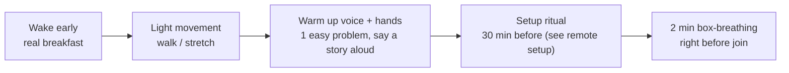
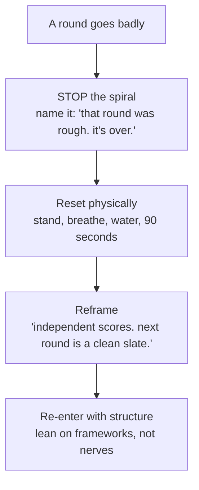

# Day-Of Tactics & Recovery

pre-interview routineenergy & pacingbombed-round recoverynote-takingnerves24h checklist

> [!TIP] The mindset that wins the day
> A full loop may consist of several conversations in succession, so it demands energy management and context switching as well as knowledge. The number of rounds and the decision process vary by application, but the principle of not carrying your self-assessment of a completed round into the next one remains useful. Prepare food, rest, travel, and connection routines around the actual schedule.

## The 24-hours-before checklist

Do the *reducible* work the day before; keep the day-of light.

- [ ] Confirm schedule, time zone, round types, interviewer names/roles (from the recruiter).
- [ ] Re-read the JD and your [why-us / why-leave](#/process/recruiter-hm) one-liner for this org.
- [ ] Skim your [story-bank matrix](#/behavioral/star) — trigger keywords only, not scripts.
- [ ] Re-read *one* recent paper/model from the team → one honest "I admired ___" line.
- [ ] Warm up **lightly**: 1–2 easy coding problems in the actual platform (not a grind).
- [ ] Test the full [remote setup](#/playbook/remote-setup): camera, mic, screen-share, backups.
- [ ] Prep the physical space: water, snacks, notepad, charger, notes card, DND.
- [ ] Sleep. Cramming past tonight has **negative** expected value — fatigue costs more than the marginal fact.

> [!WARNING] Don't learn new material the night before
> Late cramming raises anxiety and disrupts sleep, and the fatigue tax on round 4 outweighs any fact you'd gain. Consolidate what you know; trust the months of prep.

## The pre-interview routine (day of)

- **Warm up the instrument.** Say one [STAR](#/behavioral/star) story out loud and solve one easy problem — like a musician tuning up. You don't want the first round to be your first spoken sentence of the day.
- **Eat and hydrate for stamina**, not a sugar spike. Caffeine to your normal level, not above.
- **Arrive with margin.** Join 2–3 minutes early; don't start the day flustered.

## Energy & pacing across a full onsite

A 5-round day has a predictable fatigue curve. Manage it deliberately.

| Phase | Rounds | Risk | Tactic |
| --- | --- | --- | --- |
| **Opening** | first segment | over-caffeinated, rushing | go slightly slower than usual; execute the fundamentals cleanly |
| **The dip** | midday / after lunch | energy crash, sloppiness | protein-light lunch; a real walk between rounds |
| **The grind** | later segment | mental fatigue, short answers | lean harder on your *structure* — frameworks carry you when creativity flags |
| **The close** | last round + Q&A | relief-driven complacency | it still counts; ask your best questions with genuine energy |

<dl class="kv">
<dt>Use the gaps</dt><dd>Between rounds: stand up, look out a window (20-20-20 for the eyes), drink water, reset. Do **not** replay the last round — that's the fastest way to poison the next one.</dd>
<dt>Protect the voice</dt><dd>Talking for 5 hours is tiring, especially in a second language. Water within reach every round; it's fine to pause and sip.</dd>
<dt>Lunch/skip-level chats count</dt><dd>"Informal" rounds still feed the debrief. Stay warm and curious; don't switch off.</dd>
</dl>

## Recovering from a bombed round

One of the most valuable day-of skills. You cannot know how feedback from individual rounds will be combined, but ruminating on an answer that is already over also costs focus in the next conversation. Redirect attention to the next controllable action.

- **Finish a weak round with grace, not apology.** If you didn't fully solve it, close cleanly: "I didn't get all the way there; my remaining plan would be X." Composure recovers signal; visible collapse loses more.
- **Do not share an improvised self-assessment.** Telling the interviewer or recruiter "I think I bombed that round" introduces an unverified negative interpretation first.
- **Do not guess the decision process.** A round's weight varies by role and rubric. Stop trying to calculate the outcome and focus on the signal you can demonstrate in the next round.

> [!EXAMPLE] The 90-second reset script
> Between rounds, silently: "That's done and I can't change it. This next round is a fresh interviewer with zero context. I'll clarify, structure, and drive." Then a few slow breaths. Re-enter as if it's round 1.

## Note-taking

Light notes sharpen your answers; heavy notes make you look like you're reading. Calibrate.

Worth noting

- The problem statement / constraints as stated
- Design components as you place them (offloads memory)
- The interviewer's name (use it once, warmly)
- Their questions to circle back to
- A number they gave you

Don't

- Read long scripted answers off-screen (obvious on video)
- Bury your face in a notepad instead of engaging
- Transcribe everything and stop listening
- Rely on notes for [story-bank](#/behavioral/star) content — triggers only

Keep a running scratch for **your** questions and anything to follow up on — it makes the end-of-round Q&A specific and shows you were present. See [Questions to Ask Them](#/playbook/questions-to-ask).

## Dealing with nerves

Nerves are physiological; manage the body and the mind follows.

- **Box breathing** (4-4-4-4) for two minutes before joining drops the heart rate and steadies the voice.
- **Reframe the arousal:** the same adrenaline reads as "excited" if you label it that way. Say "I'm excited" not "I'm nervous."
- **A shared problem, not an exam.** Treat the interviewer as a collaborator you're solving *with* — it changes your posture and tone.
- **Structure is the antidote to blanking.** When your mind goes empty, fall back to the skeleton: *Clarify → Assume → Approach → Execute → Verify* (see [Communication](#/playbook/communication)). The framework runs when inspiration won't.
- **Prep is the deepest calm.** Rehearsed stories and a warm-up problem mean the first minutes are automatic, and momentum carries the rest.

> [!TIP] The physical tells to control
> Speaking too fast, breath-holding, and a shrinking voice all spike under nerves. Consciously slow 10%, breathe between sentences, and project slightly. These are learnable in a few mock rounds.

## If it is an in-person onsite

If the schedule is confirmed as in person, add travel, access, and physical-whiteboard variables to the same stamina principles.

- **Travel with margin.** Arrive the night before if flying; jet-lag on top of a 5-round day is brutal. Scout the building/route so the morning isn't a scramble.
- **Bring the physical kit:** ID/badge as instructed, a printed copy of your résumé, a notebook and pen, water, a snack, a charger. Don't assume a whiteboard marker works — test it.
- **Whiteboarding is back.** Practice writing code and drawing system diagrams *standing up* on a real board; it's a different motor skill than typing. Write large, leave whitespace, talk while you write.
- <strong>Use the walk between rooms</strong> as your reset window; the escort chat still counts as signal, so stay warm.

## After each round / end of day

- Jot two lines while fresh: what went well, what to adjust for the next round.
- Send a brief thank-you to the recruiter if appropriate; keep it short and genuine.
- Don't post-mortem obsessively that night — your self-assessment is noisy, and rumination hurts the next day if the loop continues.

## Follow-ups

I completely blanked mid-answer. What do I do in the moment?

**Short:** Say so, buy a beat, and restart from structure.

**Deep:** "Let me take a few seconds to reorganize" is a fully acceptable sentence — a *sanctioned* pause reads as composure. Then re-enter through the skeleton (restate the problem, name your approach). Interviewers care far more about recovery than about a momentary blank.

The loop is across time zones and my round is at 2am my time. How do I handle it?

**Short:** Shift your sleep a couple of days early and treat the odd hour as the *start* of your day, not the end.

**Deep:** For Seoul→US loops, nudge your schedule toward the interview window over 2–3 days so 2am feels like late-morning energy. Warm up harder than usual (voice + one problem) since you're fighting circadian drag, and lean on caffeine to your *normal* level, not above.

## Cheat-sheet

| Moment | Move |
| --- | --- |
| 24h before | confirm logistics, skim stories, 1–2 warm-ups, test setup, **sleep** |
| Day-of AM | breakfast, light movement, warm up voice + hands, arrive early |
| Pacing | go slightly slower early; reset between rounds; rely on frameworks later |
| Between rounds | reset — don't replay the last one |
| Bombed round | name it, reset briefly, and re-enter with structure without guessing the outcome |
| Notes | components + names + their questions; do not read long scripts |
| Nerves | box-breathe; "excited" not "nervous"; structure beats blanking |
| Avoid | improvising "I think I bombed that round" to the interviewer or recruiter |

**Related:** [Communication & Whiteboarding](#/playbook/communication) · [Remote Interview Setup](#/playbook/remote-setup) · [Questions to Ask Them](#/playbook/questions-to-ask) · [STAR & The Story Bank](#/behavioral/star) · [The RS/AS Pipeline](#/process/pipeline) · [Common Mistakes & Red Flags](#/playbook/mistakes)
