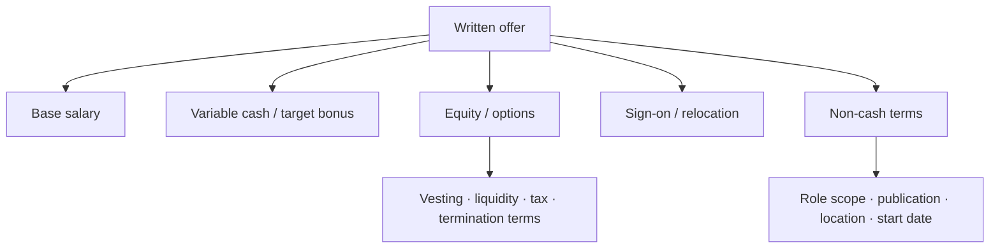
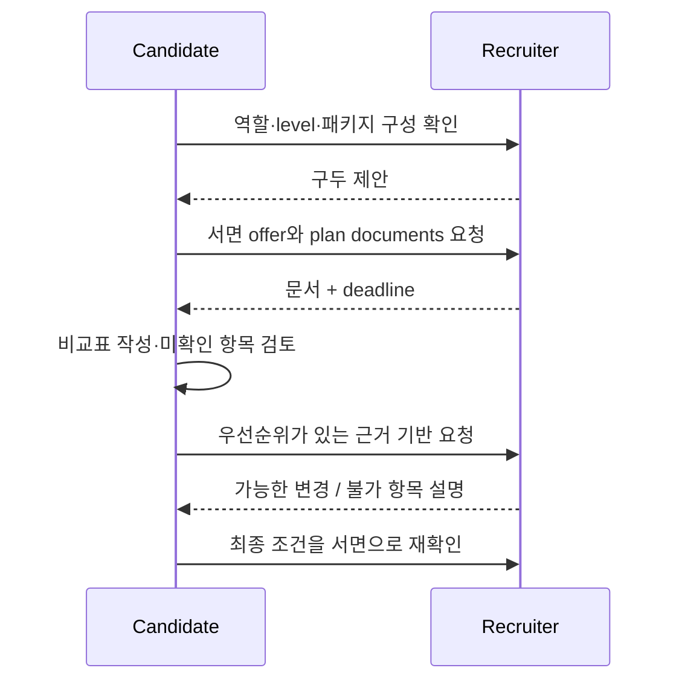

# Offers, Levels & Negotiation

<div class="tag-row"><span class="tag">leveling</span><span class="tag">comp structure</span><span class="tag">written offer</span><span class="tag">risk-adjusted comparison</span></div>

> [!TIP] 이 chapter가 존재하는 이유
> 협상의 핵심은 한 숫자를 크게 만드는 것이 아니라 **역할의 scope, level, 보상 구성, 위험, 비현금 조건을 같은 기준으로 비교하고 서면으로 확인하는 것**입니다. 회사별 title과 패키지는 서로 호환되지 않으므로, 먼저 사실을 모으고 그다음 우선순위에 맞춰 요청하세요.

> [!WARNING] 교육용 의사결정 프레임워크입니다
> 이 문서는 법률·세무·투자·재무 자문이 아닙니다. 세금, option 행사, 증권, 이민, 근로계약은 **관할 지역·고용 주체·거주자 지위·계약 시점**에 따라 달라집니다. 실제 결정은 recruiter가 보낸 서면 offer와 공식 plan document를 기준으로 하고, 필요하면 해당 지역의 자격 있는 변호사·세무사·재무 전문가에게 검토받으세요.

## level 이름을 회사 사이에서 직접 번역하지 않는다

`Senior`, `Staff`, `Researcher`, `Applied Scientist`, `ICT`, 숫자 level은 같은 단어여도 scope가 다릅니다. 공개 aggregate나 지인의 level을 일대일 대응표로 쓰지 말고 아래 항목을 확인하세요.

| 확인 항목 | recruiter/HM에게 물을 질문 | 비교할 근거 |
| --- | --- | --- |
| 공식 title·level | “서면 offer의 title과 내부 level은 무엇인가요?” | offer letter, req |
| 기대 scope | “첫 6–12개월에 독립적으로 소유할 문제와 의사결정 범위는?” | HM 답변, role description |
| 승진 기준 | “다음 level은 어떤 영향 범위와 증거를 요구하나요?” | 공식 career framework가 있다면 그것 |
| 평가·보정 | “이번 role의 level은 언제, 누가, 어떤 패킷으로 정하나요?” | recruiter가 확인한 절차 |
| 보상 band | “제안 level과 location에 적용되는 band/구성은?” | 서면 breakdown |

학위, 논문 수, 경력 연수 하나로 level이 자동 결정된다고 가정하지 마세요. 자신의 주장은 `연차`보다 **독립적으로 내린 결정, 영향 범위, mentoring, 제품·연구 결과, 다음 역할의 scope**로 뒷받침합니다. 개인별 level 근거는 범용 본문에 복제하지 말고 [Your CV → Interview Map](#/resume/overview)에서 관리하세요.

## 패키지를 구성요소별로 분해한다



| 구성요소 | 반드시 확인할 내용 | 흔한 비교 오류 |
| --- | --- | --- |
| Base | 통화, 지급 주기, 고용 지역, review 시점 | 환율·세후 차이 없이 headline만 비교 |
| Bonus | target과 실제 지급 조건, 첫해 prorating, 보장 여부 | target을 보장 현금처럼 계산 |
| Public equity | grant 기준 단위, vesting, 정산·세금, 주가 기준일 | 현재 주가를 미래 보장액으로 간주 |
| Private equity / option | 주식 수, 희석 기준, strike, 최근 평가 기준, 행사·퇴사 조건, 유동성 | 내부 평가액을 현금과 동등하게 계산 |
| Sign-on / relocation | 지급일, 반환(clawback) 조건, 세금 처리 | 첫해만 높은 금액을 지속 TC로 비교 |
| Refresh | 공식 정책, 재량 여부, eligibility와 시점 | 미래 grant를 확정액으로 포함 |
| 비현금 조건 | 역할 scope, publication/open-source, compute/data, 근무지, 출장, visa | 금액만 보고 커리어·생활 제약 누락 |

## 날짜가 있는 offer snapshot을 만든다

시장 자료는 빠르게 낡고 self-reported aggregate는 표본·지역·주가의 영향을 받습니다. 참고할 때는 출처와 조회일을 남기고, 제안 자체와 섞지 마세요.

```text
Company / team / req:
Offer received (YYYY-MM-DD):
Employment entity / work location:
Title / internal level:

Guaranteed cash:
Variable cash and conditions:
Equity type / amount / valuation basis:
Vesting / liquidity / exercise / termination terms:
Sign-on / relocation / clawback:
Benefits and non-cash terms:

Recruiter-confirmed but not yet written:
Still unverified:
Decision deadline and time zone:
Sources checked and dates:
Questions for legal/tax/financial review:
```

구두 설명과 문서가 다르면 “제가 이해한 내용을 확인하고 싶습니다”라고 차이를 표시하고, 수정된 서면 자료를 요청하세요.

## 비교는 세 가지 숫자로 나눈다

한 개의 `TC` 대신 다음을 따로 계산합니다.

1. **보장 가치** — base와 계약상 보장된 cash 중, clawback과 세금을 별도로 표시한 값.
2. **조건부 가치** — bonus, public equity처럼 지급·가격 조건이 있는 값. 가정과 기준일을 함께 기록.
3. **불확실 가치** — private equity/option, 재량 refresher처럼 유동성·희석·성과 변수가 큰 값. 낙관·기준·비관 시나리오로 분리.

서로 다른 국가의 offer는 통화를 맞추는 것만으로 충분하지 않습니다. 세금·보험·연금·이민·생활비·근무시간·relocation과 equity의 법적 구조가 다르므로, **gross headline 순위와 실제 의사결정 순위를 분리**하세요.

## 협상 순서



1. **기쁜 마음과 관심을 먼저 표현**하되, 통화 중 즉시 수락할 필요는 없습니다.
2. title, level, location, 각 보상 요소, vesting, deadline을 서면으로 요청합니다.
3. 무엇이 중요한지 순위를 정합니다. 예: scope/level, guaranteed cash, equity 조건, start date, publication·compute.
4. 요청은 `근거 → 구체적 변경 → 수락 판단에 미치는 영향`으로 한 번에 정리합니다.
5. 변경이 불가능하다는 답을 받으면 어떤 구성요소가 정책상 고정이고 무엇이 재검토 가능한지 구분해 묻습니다.
6. 최종 결정 전에는 합의한 변경이 문서에 반영됐는지 확인합니다.

> [!EXAMPLE] 근거 기반 counter
> “제안과 팀 scope를 검토해 보니 역할 자체에는 매우 관심이 있습니다. 다만 논의한 {독립적 ownership/영향 범위}와 {검증 가능한 시장 또는 경쟁 offer 근거}를 고려하면 {level 또는 특정 구성요소}를 재검토해 주실 수 있을까요? 제 우선순위는 {1순위}, 그다음은 {2순위}입니다. 가능한 범위를 알려주시면 전체 패키지로 판단하겠습니다.”

## 경쟁 offer와 timeline

- 실제로 진행 중인 프로세스나 서면 offer만 사실대로 말합니다. 회사명·금액을 어디까지 공유할지는 자신의 판단과 문서 조건을 따릅니다.
- 경쟁 offer가 있으면 제안이 자동으로 개선된다고 가정하지 마세요. 다만 deadline과 비교 기준을 명확히 전달하는 근거가 됩니다.
- 존재하지 않는 offer, 임의로 키운 금액, 거짓 deadline을 만들지 않습니다. 신뢰 훼손뿐 아니라 문서·관계·법적 위험이 생길 수 있습니다.
- 모든 회사가 deadline을 연장해 주는 것은 아닙니다. “가능한 연장 범위와 결정에 필요한 자료를 언제 받을 수 있는지”를 조기에 묻습니다.
- 프로세스 정렬은 [The RS/AS Pipeline](#/process/pipeline)의 기록표와 함께 관리하세요.

## 초반 comp 질문에 답하는 법

법과 관행은 지역마다 다르므로 현재 급여 공개가 의무라고 가정하지 않습니다. 답변할 수 있는 범위에서 이번 역할과 band로 대화를 돌립니다.

> “지금은 역할의 scope와 level을 먼저 정확히 이해하고 싶습니다. 이 req의 location별 보상 band와 구성요소를 공유해 주실 수 있을까요? 그 정보를 바탕으로 전체 패키지에 대해 이야기하겠습니다.”

희망 범위를 말해야 한다면 `통화`, `지역`, `level 가정`, `base인지 total package인지`를 명시하고, 한 숫자보다 범위와 전제를 전달하세요. 자세한 recruiter 대화는 [Recruiter & HM Screens](#/process/recruiter-hm)에 있습니다.

## 결정 전 최종 체크

- [ ] title, level, 팀/보고선, 근무지와 고용 주체가 서면에 있다.
- [ ] base, bonus 조건, equity 유형·vesting·유동성·퇴사 조건을 분리했다.
- [ ] sign-on/relocation의 clawback 조건을 확인했다.
- [ ] offer deadline의 날짜·시간대와 승인된 연장을 확인했다.
- [ ] publication/open-source, compute/data, remote/relocation처럼 중요한 비현금 조건을 확인했다.
- [ ] 구두 약속이 최종 문서 또는 공식 부속 문서에 반영됐다.
- [ ] 세금·option·계약·이민 쟁점은 필요한 전문가에게 검토받았다.
- [ ] 낙관적 equity 가치 없이도 walk-away 기준을 충족하는지 판단했다.

협상 이외의 전체 탈락 패턴은 중복하지 않고 [흔한 실수 & 레드 플래그](#/playbook/mistakes)를 canonical 목록으로 사용합니다.

## Cheat-sheet

| 질문 | 한 줄 원칙 |
| --- | --- |
| level 비교 | 이름이 아니라 scope·영향 범위·승진 기준으로 비교 |
| 숫자 출처 | 조회일과 표본 한계를 적고 실제 offer와 분리 |
| package | 보장·조건부·불확실 가치로 나누기 |
| private equity | 현금처럼 계산하지 말고 문서·시나리오·전문가 검토 |
| counter | 근거와 우선순위를 갖춘 구체적 요청 |
| 경쟁 offer | 사실만 말하고 deadline을 명확히 공유 |
| 최종 기준 | 구두 약속이 아니라 서면 offer와 공식 plan document |
| 법률·세무 | 관할별 전문가 확인; 이 문서는 자문이 아님 |

**Related:** [The RS/AS Pipeline](#/process/pipeline) · [Recruiter & HM Screens](#/process/recruiter-hm) · [Company Playbooks](#/process/companies) · [Common Mistakes & Red Flags](#/playbook/mistakes) · [Questions to Ask Them](#/playbook/questions-to-ask)
