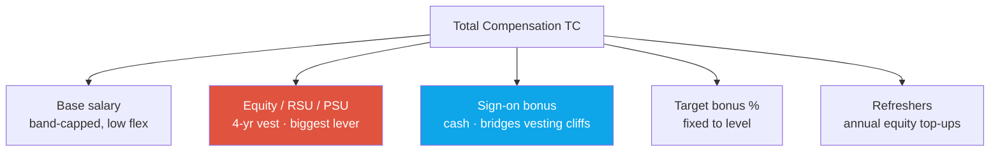
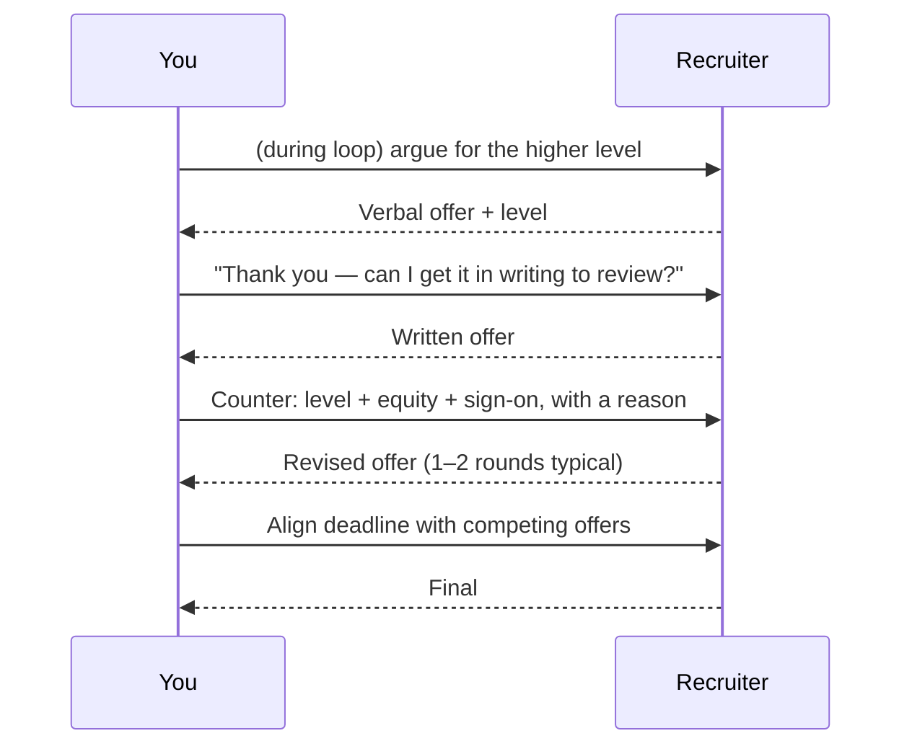

# Offers, Levels & Negotiation

levelingcomp structurecompeting offersred flags

> [!TIP] 이 chapter가 존재하는 이유
> Negotiation은 한 시간의 준비가 매년 수만 달러의 가치가 있고, 그게 복리로 쌓이는 유일한 단계입니다. 하지만 *leveling* 작업을 먼저 했을 때만 통합니다 — **level이 곧 숫자이고**, 나머지는 반올림 조정입니다. 이 chapter는 research role이 어떻게 leveling되는지, comp 패키지가 실제로 무엇으로 구성되는지, 그것을 움직이는 tactic, 그리고 (negotiation 자체를 포함해) 후보 자격을 끝내는 red flag를 다룹니다.

> [!WARNING] 수치는 aggregate이지, 견적이 아닙니다
> 모든 수치는 **levels.fyi self-reported aggregate(2025–2026)**를 참조하며 팀, location, 주가 성과에 따라 크게 변동합니다. *범위를 보정*하는 데 쓰되, 당신이 선언하는 hard target으로는 절대 쓰지 마세요. frontier-lab comp는 특히 변동적이고 일부는 언론 보도이니 — 신중하게 다루세요.

## leveling 맵 (research IC)

Title은 회사마다 다르지만, 시니어리티는 대략 이렇게 매핑됩니다 *[community/aggregate]*:

| 대략적 시니어리티 | Meta | Microsoft | Apple | NVIDIA | Signal |
| --- | --- | --- | --- | --- | --- |
| Fresh PhD / entry | E4 | 59–60 (Researcher) | ICT3 | IC1–IC2 | 독립적 논문, 지도받은 프로젝트 |
| Experienced PhD + industry | **E5** | 63–64 (Senior Researcher) | ICT4–5 | IC3–IC4 | First-author record, mentoring, product transfer |
| Staff / Principal track | E6+ | 65–67 (Principal→Partner) | ICT5–6 | IC5–IC6 | Org-level agenda, cross-team impact |

> [!NOTE] "PhD ⇒ senior"는 신화
> Leveling은 학위 하나가 아니라 **interview 패킷 + 경력 연수 + publication/impact**로 보정됩니다. Beomyoung의 경우, 그 조합 — **7편의 first-author 논문, ICCV 2025 Highlight, *그리고* NAVER Cloud에서의 5년 shipping** — 은 진짜로 강한 **E5-analog / senior** 사례이지만, 최종 판단은 loop 성과에 근거한 HC/HM의 몫입니다. 가장 leverage 높은 단 하나의 수는 어떤 숫자가 존재하기도 전에, loop 중에 level을 *위로* 주장하는 것입니다.

## comp 패키지는 무엇으로 구성되나

<dl class="kv">
<dt>Base</dt><dd>Level별 band-capped; 초과는 종종 VP 승인 필요 → <b>낮은 flex(~5–15%)</b>. 하지만 복리로 쌓이고 bonus/refresh baseline을 설정한다.</dd>
<dt>Equity (RSU/PSU)</dt><dd>4년 vest(스케줄 다양: 25/25/25/25, 또는 front/back-loaded). 보통 <b>가장 큰 lever</b> — 단일 예산 결정. NVIDIA는 RSU를 <b>"NSU"</b>로 브랜딩; 스타트업(Mistral)은 option; ByteDance는 <b>private/pre-IPO</b>(internal mark에서 illiquid).</dd>
<dt>Sign-on</dt><dd>현금, 종종 <b>높은 flex</b>: 몰수할 unvested equity를 bridge하고 band를 건드리지 않고 경쟁 offer에 대응.</dd>
<dt>Bonus %</dt><dd>보통 level에 고정 — 협상 여지 낮음.</dd>
<dt>Refreshers</dt><dd>연간 equity grant; year-1 TC ≠ steady-state TC인 이유. 초기 grant만이 아니라 *refresh* 정책을 물어라.</dd>
</dl>

> [!WARNING] 4년 cliff 착시
> 많은 "TC" 숫자는 **front-loaded 초기 grant를 4년에 걸쳐 평균**하고 보장되지 않은 refresher를 가정합니다. **vesting 스케줄**과 **historical refresh** 행태를 요청하세요. cliff와 얇은 refresher가 있는 큰 year-1 숫자는 더 평평한 패키지보다 훨씬 못한 가치일 수 있습니다.

## research comp가 회사 유형에 따라 어떻게 다른가

| 유형 | Comp 형태 | Negotiation 현실 |
| --- | --- | --- |
| **FAANG** (Meta, Apple, NVIDIA, Adobe, MS) | Base + 큰 RSU + sign-on; TC 벤치마크됨 | Level + equity + sign-on 밀어붙이기; 경쟁 offer가 움직임 |
| **Base-heavy** (Adobe ~71% base) | 가벼운 equity, 높은 base | 같은 "level"에서 TC가 FAANG에 못 미칠 수 있음; level + equity에 기대기 |
| **Private / pre-IPO** (ByteDance) | 큰 RSU, **internal mark에서 illiquid** | Equity를 할인; buyback/liquidity 조건을 물어라; level이 delta를 좌우 |
| **Startup / frontier** (Mistral) | 낮은 base + 큰 equity 상승 여력 | Equity **수량 + strike**를 협상; 현실적(illiquid) 결과를 모델링; RS는 RE보다 프리미엄을 가짐 |

> [!NOTE] Research-specific, 비현금 lever
> RS/AS role에서는 나중에 돈으로 되살 수 없는 것들을 협상하세요: **publication freedom + conference travel**, **open-source release 권리**, **compute/GPU quota + data access**, **pure-research 대 product-coupled 비율**, 그리고 **mentoring/intern** 할당. 이것들이 sign-on보다 여러분의 다음 논문 — 그리고 다음 일자리 — 을 더 크게 좌우합니다.

## 실제로 숫자를 움직이는 tactic

1. **진짜 경쟁 offer가 #1 lever.** 입찰 경쟁은 TC를 **40–80%** 올릴 수 있습니다(여러 FAANG 입찰자가 있으면 가끔 더). [pipeline](#/process/pipeline) 타임라인을 클러스터해서 offer가 겹치게 하세요.
2. **base가 아니라 level과 equity를 밀어붙이세요.** Base는 band-capped; **level-up이 가장 큰 평생 lever**이고, equity/sign-on은 여지가 더 많은 단일 예산 결정입니다.
3. **서면으로 받은 뒤, counter하세요.** 통화에서 verbal number를 절대 수락(또는 거절)하지 마세요. 서면 offer를 요청하고, *이유*와 함께 **하나의 명확한 counter**를 하세요("경쟁 offer에 맞추기 위해 / 우리가 논의한 senior scope를 반영하기 위해").
4. **범위와 total-comp 목표를 공유**하고, 구성요소는 그들이 조립하게 두세요. 동시 프로세스를 공개하세요 — 기대되는 일이고 우선순위를 올립니다.
5. **illiquid equity를 정직하게 할인하세요.** 90일 option-exercise window, 종이 이익에 대한 세금, pre-IPO mark. 현실적 결과를 모델링하고; 모든 grant 세부를 서면으로 받으세요.

> [!DANGER] 경쟁 offer를 절대 조작하지 마세요
> 이 comp 레벨에서는 회사가 **검증을 요청**할 수 있습니다. 위조되거나 부풀려진 offer는, 발각되면, 업계 전반에 back-channel될 수 있는 즉시 탈락 integrity 문제입니다. 진짜 범위를 공유하세요; 경쟁 offer가 없다면, 지어내지 말고 scope와 market data로 협상하세요.

### location이 계산을 바꾼다

US 대 Singapore 대 Seoul 대 Paris는 **통화, RSU liquidity, relocation, 세금**이 다릅니다. **location별로 분리된 target / walk-away 범위**를 유지하세요. Paris(Mistral) base는 US 랩보다 ~30–50% 낮게 돌아가며, 부분적으로 더 낮은 생활비와 **유리한 BSPCE 세금**(~12.8% + social charge 대 40–50% CA marginal)으로 상쇄됩니다 — 그래서 낮은 headline이 세후 기준으로는 경쟁력이 있을 수 있습니다. 지역 간 gross headline 숫자를 비교하지 마세요.

"comp 기대치가 어떻게 되나요?" — 프로세스 초반에.

**짧게:** 자신을 anchor하지 마세요. Market range와 total-comp 프레이밍으로 리다이렉트하고, 질문을 leveling으로 되돌리세요.

**깊게:** 스크립트: *"저는 유연하고 role, team, growth에 집중하고 있습니다. total comp는 {location}에서 이 level의 RS/AS market band에 맞춰 보정하고 있습니다. leveling을 이해하면 기꺼이 구체적으로 말하겠습니다 — 이 role은 보통 어느 밴드에 들어가나요?"* 이것은 세 가지를 합니다: 낮은 anchor를 거부하고, comp가 level-driven임을 아는 것을 신호하고, *그들이* 염두에 둔 밴드를 끌어냅니다. [Recruiter & HM Screens](#/process/recruiter-hm) 참조.

더 높은 base와 더 많은 equity 사이에서 어떻게 고르나요?

**짧게:** 회사를 믿고 risk를 감내할 수 있으면 equity/level을; equity가 illiquid하거나 회사가 변동적이면 base를 선호하세요.

**깊게:** Base는 보장되고 복리로 쌓입니다(raise, bonus, refresh baseline이 그것의 %). Equity는 기대값이 더 높지만 **risk-and-liquidity-adjusted**입니다 — public RSU(Meta/NVIDIA/Apple)는 vest 시 near-cash; pre-IPO(ByteDance)와 startup option(Mistral BSPCE)은 아닙니다. illiquid equity를 크게 할인하고, 큰 *nominal* grant가 공정한 base + level을 대체하게 두지 마세요. multi-year research 커리어를 최적화하는 후보에게는 **level**이 보통 둘 다를 압도합니다 — scope, 미래 comp, 그리고 다음 offer의 leveling을 게이팅하기 때문입니다.

## Red flag & 흔한 탈락 사유

research 후보가 *왜* 탈락하는지 아는 것은 tactic만큼 유용합니다 — 대부분 피할 수 있습니다.

통과하는 것

<ul>
<li>시간 압박 속에서 attention / training loop를 from scratch로 구현 가능</li>
<li>자기 논문을 방어: baseline, ablation, limitation</li>
<li>넓은 ML: RL, diffusion, LLM primitive, MoE, RLVR</li>
<li>명확한 I-vs-we; 구체적이고 성찰적인 behavioral 답변</li>
<li>정확한 team-fit + <i>이</i> org에 대한 진짜 동기</li>
</ul>

후보를 침몰시키는 것

<ul>
<li><b>From-scratch implementation에 미준비</b> — "매일 ML 씀" ≠ flash-attention을 코딩할 준비</li>
<li><b>Breadth 격차</b> — 구멍 하나(RL/diffusion)가 fundamentals를 침몰</li>
<li><b>자기 연구를 방어 못 함</b> — RS에 치명적</li>
<li>약한 coding hygiene / 실제 ML 코드를 디버그 못 함(AS/MLE)</li>
<li>job talk에서 가려진 기여; 불명확한 I-vs-we</li>
<li>senior 레벨에서 <b>fit mismatch</b> — 때로 eng로 리다이렉트</li>
<li><b>Negotiation에서의 integrity 문제</b> — 부풀려진/위조된 offer</li>
</ul>

> [!QUESTION] "comp는 움직일 수 없어요 — take it or leave it." 진짜인가요?
> **짧게:** 때때로 사실(경직된 band), 종종 테스트. *base*(정말로 capped)를 *equity/sign-on*(보통 여지 있음)에서 분리하고, 그것들에 대해 구체적으로 물으세요.
>
> **깊게:** 답변: *"base가 band에 제약된 건 이해합니다 — equity grant나 격차를 bridge할 sign-on에 유연성이 있나요?"* 모든 lever가 정말로 얼어붙었다면, 진짜 negotiation은 더 일찍 결정된 **level**이었던 겁니다. 그래서 level이 전부입니다: offer 시점에는 band가 이미 고정됐을 수 있습니다. 숫자와 level이 둘 다 최종이고 walk-away 아래라면, 그건 정보입니다 — 우아하게 거절하고 관계를 유지하세요(팀은 req를 다시 엽니다).

### 준비해 둬야 할 follow-up

- *"어떤 다른 회사와 이야기하고 있고, 그들은 프로세스 어디쯤인가요?"* — 반드시 숫자는 아니어도 단계로 정직하게 답하세요; 긴급성을 설정합니다.
- *"우리가 경쟁 offer를 맞추면 서명하실 건가요?"* — 사실일 때만 예라고 하세요. 번복할 soft yes는 recruiter 관계를 태웁니다.
- *"합류하게 하려면 뭐가 필요한가요?"* — 선물 같은 질문. 구체적이고 합리적인 답을 준비하세요(level + TC 범위 + compute/publication freedom 같은 비현금 항목 하나).

## Cheat-sheet

| 질문 | 한 줄 답 |
| --- | --- |
| 숫자 = level | Offer가 존재하기 전에, loop 중에 level을 위로 주장 |
| Base 대 equity 대 sign-on | Base low-flex(band); equity 가장 큰 lever; sign-on이 cliff를 bridge |
| #1 tactic | 진짜 경쟁 offer(40–80% 스윙); 타임라인을 겹치게 클러스터 |
| 절대 금지 | Offer 조작 — 검증이 흔하고; 발각은 치명적 |
| Illiquid equity | Pre-IPO(ByteDance) / option(Mistral BSPCE)을 할인; 조건을 서면으로 |
| 비현금 lever | Publication freedom, open-source 권리, compute quota, research/product 비율 |
| Location | Geo별 분리된 target/walk-away; headline이 아니라 세후로 비교 |
| Top 탈락 | From-scratch coding 격차 · breadth 구멍 · 자기 연구 방어 못 함 · fit mismatch |

**Related:** [The RS/AS Pipeline](#/process/pipeline) · [Recruiter & HM Screens](#/process/recruiter-hm) · [Company Playbooks](#/process/companies) · [Common Mistakes & Red Flags](#/playbook/mistakes) · [The Research Job Talk](#/research/job-talk)
