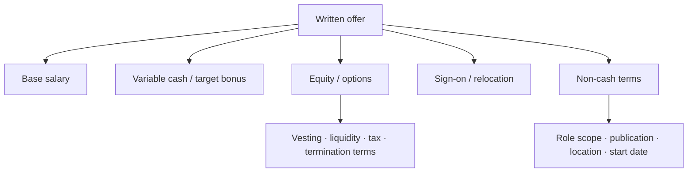
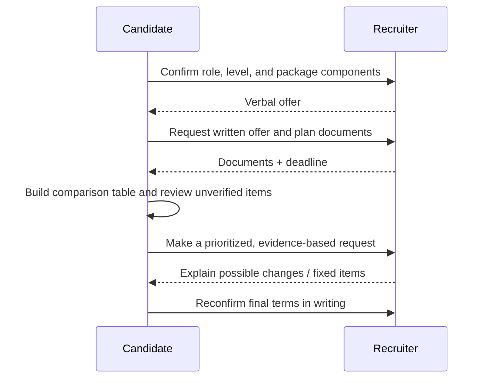

# Offers, Levels & Negotiation

<div class="tag-row"><span class="tag">leveling</span><span class="tag">comp structure</span><span class="tag">written offer</span><span class="tag">risk-adjusted comparison</span></div>

> [!TIP] Why this chapter exists
> Negotiation is not primarily about maximizing one number. It is about **comparing role scope, level, compensation structure, risk, and non-cash terms on the same basis and confirming them in writing**. Titles and packages are not portable across companies, so collect the facts first and then make requests according to your priorities.

> [!WARNING] This is an educational decision framework
> This document is not legal, tax, investment, or financial advice. Tax, option exercise, securities, immigration, and employment contracts vary by **jurisdiction, employing entity, residency status, and contract date**. Base actual decisions on the recruiter's written offer and official plan documents; when needed, have qualified local legal, tax, or financial professionals review them.

## Do not translate level names directly across companies

`Senior`, `Staff`, `Researcher`, `Applied Scientist`, `ICT`, and numeric levels can represent different scopes even when the labels look the same. Do not use public aggregates or an acquaintance's level as a one-to-one conversion table. Verify the following instead.

| Item to verify | Question for the recruiter/HM | Evidence to compare |
| --- | --- | --- |
| Official title and level | “What title and internal level will appear in the written offer?” | Offer letter, req |
| Expected scope | “What problems and decision scope would I own independently in the first 6–12 months?” | HM response, role description |
| Promotion bar | “What scope of impact and evidence does the next level require?” | Official career framework, if one exists |
| Evaluation and calibration | “When, by whom, and from what packet is the level for this role decided?” | Recruiter-confirmed process |
| Compensation band | “What band and components apply to the proposed level and location?” | Written breakdown |

Do not assume that a degree, publication count, or years of experience automatically determines a level. Support your case with **decisions made independently, scope of impact, mentoring, product or research outcomes, and scope of the next role**, not just `years of experience`. Keep person-specific leveling evidence in [Your CV → Interview Map](#/resume/overview) rather than duplicating it in the generic chapters.

## Decompose the package by component



| Component | What you must verify | Common comparison error |
| --- | --- | --- |
| Base | Currency, pay frequency, employment location, review timing | Comparing only headlines without accounting for exchange-rate or after-tax differences |
| Bonus | Target and actual payout conditions, first-year proration, whether guaranteed | Counting the target as guaranteed cash |
| Public equity | Grant denomination, vesting, settlement and tax, stock-price reference date | Treating the current stock price as a guaranteed future value |
| Private equity / option | Share count, dilution basis, strike, latest valuation basis, exercise and post-termination terms, liquidity | Treating an internal valuation as equivalent to cash |
| Sign-on / relocation | Payment date, repayment or clawback terms, tax treatment | Comparing a first-year-only amount as recurring total compensation |
| Refresh | Official policy, whether discretionary, eligibility, timing | Including a future grant as a confirmed amount |
| Non-cash terms | Role scope, publication/open-source, compute/data, work location, travel, visa | Looking only at money and omitting career or life constraints |

## Create a dated offer snapshot

Market data ages quickly, and self-reported aggregates are affected by sample, region, and stock price. If you use them, record the source and access date and keep them separate from the offer itself.

```text
Company / team / req:
Offer received (YYYY-MM-DD):
Employment entity / work location:
Title / internal level:

Guaranteed cash:
Variable cash and conditions:
Equity type / amount / valuation basis:
Vesting / liquidity / exercise / termination terms:
Sign-on / relocation / clawback:
Benefits and non-cash terms:

Recruiter-confirmed but not yet written:
Still unverified:
Decision deadline and time zone:
Sources checked and dates:
Questions for legal/tax/financial review:
```

If an oral explanation differs from a document, identify the discrepancy by saying, “I would like to confirm my understanding,” and request corrected written material.

## Compare three numbers

Instead of one `TC` number, calculate these separately.

1. **Guaranteed value** — base and contractually guaranteed cash, with clawbacks and taxes shown separately.
2. **Conditional value** — amounts such as bonus and public equity that depend on payout or price conditions. Record the assumptions and reference date.
3. **Uncertain value** — amounts such as private equity/options and discretionary refreshers with substantial liquidity, dilution, or performance uncertainty. Separate optimistic, base, and pessimistic scenarios.

Converting currency is not enough when comparing offers across countries. Tax, insurance, pension, immigration, cost of living, working hours, relocation, and the legal structure of equity all differ, so **separate the gross-headline ranking from the actual decision ranking**.

## Negotiation sequence



1. **Express appreciation and interest first**, but you do not need to accept immediately during the call.
2. Request the title, level, location, each compensation component, vesting, and deadline in writing.
3. Rank what matters. Examples: scope/level, guaranteed cash, equity terms, start date, publication, and compute.
4. Present requests together as `evidence → specific change → effect on the acceptance decision`.
5. If told a change is impossible, ask which components are fixed by policy and which can be reconsidered.
6. Before the final decision, verify that every agreed change appears in the documents.

> [!EXAMPLE] Evidence-based counter
> “After reviewing the offer and the team's scope, I remain very interested in the role. Given the {independent ownership/scope of impact} we discussed and {verifiable market or competing-offer evidence}, could you reconsider {the level or specific component}? My first priority is {priority 1}, followed by {priority 2}. If you can share what range is possible, I will evaluate the complete package.”

## Competing offers and timeline

- Describe only processes actually underway and written offers that actually exist. Use your judgment and follow document terms when deciding how much of a company name or amount to disclose.
- Do not assume a competing offer will automatically improve a proposal. It can, however, provide a concrete basis for communicating deadlines and comparison criteria.
- Do not invent an offer, inflate an amount, or fabricate a deadline. Besides damaging trust, doing so can create documentary, relationship, and legal risk.
- Not every company will extend a deadline. Ask early, “What extension may be possible, and when can I receive the material needed for a decision?”
- Manage process alignment alongside the tracking table in [The RS/AS Pipeline](#/process/pipeline).

## How to answer an early compensation question

Laws and practices vary by region, so do not assume you must disclose current pay. Within what you are comfortable answering, redirect the conversation to this role and its band.

> “I would first like to understand the role's scope and level accurately. Could you share the location-specific compensation band and components for this req? With that context, I can discuss the complete package.”

If you must state an expected range, specify the `currency`, `region`, `level assumption`, and `whether it is base or total package`; provide a range and its assumptions rather than a single number. See [Recruiter & HM Screens](#/process/recruiter-hm) for the detailed recruiter conversation.

## Final pre-decision check

- [ ] The title, level, team/reporting line, work location, and employing entity are in writing.
- [ ] I separated base, bonus conditions, and the equity type, vesting, liquidity, and post-termination terms.
- [ ] I verified clawback terms for sign-on and relocation payments.
- [ ] I confirmed the offer deadline's date and time zone, plus any approved extension.
- [ ] I verified important non-cash terms such as publication/open-source, compute/data, remote work, and relocation.
- [ ] Oral promises appear in the final document or an official addendum.
- [ ] Appropriate professionals reviewed any tax, option, contract, or immigration issues that require it.
- [ ] I determined whether the offer clears my walk-away threshold without optimistic equity value.

For rejection patterns beyond negotiation, avoid duplicating the list here and use [Common Mistakes & Red Flags](#/playbook/mistakes) as the canonical reference.

## Cheat Sheet

| Question | One-line principle |
| --- | --- |
| Level comparison | Compare scope, impact, and promotion bar—not names |
| Number sources | Record the access date and sample limitations; keep them separate from the actual offer |
| Package | Separate guaranteed, conditional, and uncertain value |
| Private equity | Do not count it as cash; review documents, scenarios, and professional advice |
| Counter | Make a specific request supported by evidence and priorities |
| Competing offer | State facts only and communicate the deadline clearly |
| Final authority | Written offer and official plan documents, not oral promises |
| Legal and tax | Verify with jurisdiction-specific professionals; this document is not advice |

**Related:** [The RS/AS Pipeline](#/process/pipeline) · [Recruiter & HM Screens](#/process/recruiter-hm) · [Company Playbooks](#/process/companies) · [Common Mistakes & Red Flags](#/playbook/mistakes) · [Questions to Ask Them](#/playbook/questions-to-ask)
