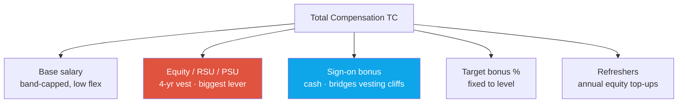
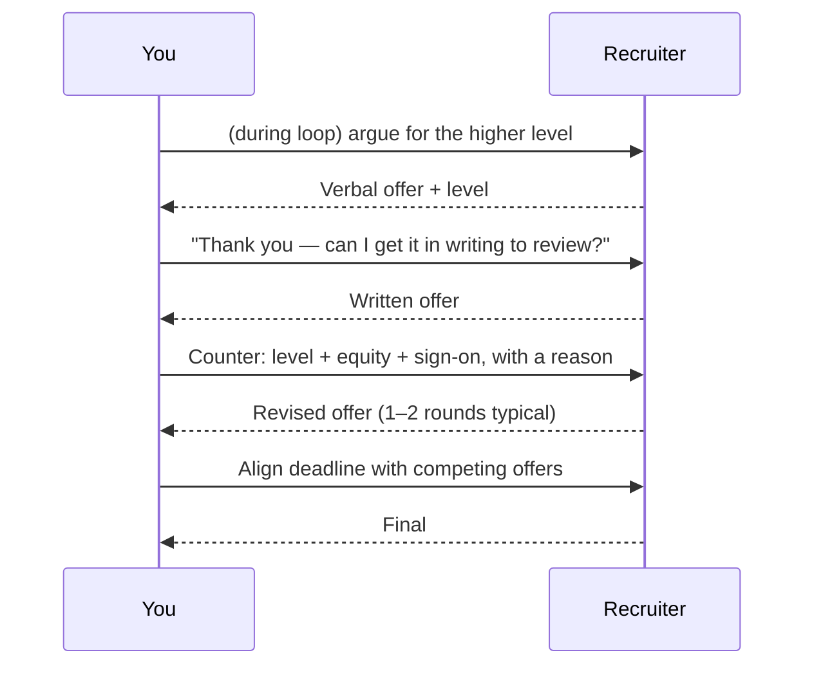

# Offers, Levels & Negotiation

levelingcomp structurecompeting offersred flags

> [!TIP] Why this chapter exists
> Negotiation is the one stage where an hour of preparation is worth tens of thousands of dollars per year, compounding. But it only works if you did the *leveling* work first — **the level is the number**, and everything else is a rounding adjustment. This chapter covers how research roles are leveled, what a comp package is actually made of, the tactics that move it, and the red flags that end candidacies (including in negotiation itself).

> [!WARNING] Numbers are aggregates, not quotes
> All figures reference **levels.fyi self-reported aggregates (2025–2026)** and fluctuate widely by team, location, and stock performance. Use them to *calibrate a range*, never as a hard target you announce. Frontier-lab comp in particular is volatile and partly press-reported — hedge it.

## The leveling map (research ICs)

Titles differ per company; seniority maps roughly like this *[community/aggregate]*:

| Rough seniority | Meta | Microsoft | Apple | NVIDIA | Signal |
| --- | --- | --- | --- | --- | --- |
| Fresh PhD / entry | E4 | 59–60 (Researcher) | ICT3 | IC1–IC2 | Independent papers, supervised projects |
| Experienced PhD + industry | **E5** | 63–64 (Senior Researcher) | ICT4–5 | IC3–IC4 | First-author record, mentoring, product transfer |
| Staff / Principal track | E6+ | 65–67 (Principal→Partner) | ICT5–6 | IC5–IC6 | Org-level agenda, cross-team impact |

> [!NOTE] "PhD ⇒ senior" is a myth
> Leveling is calibrated by the **interview packet + years of experience + publication/impact**, not by the degree alone. For Beomyoung, the combination — **7 first-author papers, an ICCV 2025 Highlight, *and* 5 years shipping at NAVER Cloud** — is a genuinely strong **E5-analog / senior** case, but the final call is the HC/HM's, informed by loop performance. The single highest-leverage move is arguing the level *up* during the loop, before any number exists.

## What a comp package is made of

<dl class="kv">
<dt>Base</dt><dd>Band-capped per level; exceeding often needs VP approval → <b>low flex (~5–15%)</b>. But it compounds and sets bonus/refresh baselines.</dd>
<dt>Equity (RSU/PSU)</dt><dd>4-year vest (schedules vary: 25/25/25/25, or front/back-loaded). Usually the <b>largest lever</b> — a single budget decision. NVIDIA brands RSUs <b>"NSU"</b>; startups (Mistral) use options; ByteDance is <b>private/pre-IPO</b> (illiquid at internal marks).</dd>
<dt>Sign-on</dt><dd>Cash, often <b>high flex</b>: bridges unvested equity you'd forfeit and counters a competing offer without touching the band.</dd>
<dt>Bonus %</dt><dd>Usually fixed to level — low negotiability.</dd>
<dt>Refreshers</dt><dd>Annual equity grants; the reason year-1 TC ≠ steady-state TC. Ask about the *refresh* policy, not just the initial grant.</dd>
</dl>

> [!WARNING] The 4-year cliff illusion
> Many "TC" numbers **average a front-loaded initial grant over 4 years** and assume refreshers that aren't guaranteed. Ask for the **vesting schedule** and **historical refresh** behavior. A big year-1 number with a cliff and thin refreshers can be worth far less than a flatter package.

## How research comp differs by company type

| Type | Comp shape | Negotiation reality |
| --- | --- | --- |
| **FAANG** (Meta, Apple, NVIDIA, Adobe, MS) | Base + large RSU + sign-on; TC benchmarked | Push level + equity + sign-on; competing offers move it |
| **Base-heavy** (Adobe ~71% base) | Lighter equity, higher base | TC can trail FAANG at same "level"; lean on level + equity |
| **Private / pre-IPO** (ByteDance) | Large RSUs, **illiquid at internal marks** | Discount equity; ask buyback/liquidity terms; level drives the delta |
| **Startup / frontier** (Mistral) | Lower base + big equity upside | Negotiate equity **quantity + strike**; model realistic (illiquid) outcomes; RS carry a premium over REs |

> [!NOTE] Research-specific, non-cash levers
> For RS/AS roles, negotiate the things money can't buy back later: **publication freedom + conference travel**, **open-source release rights**, **compute/GPU quota + data access**, the **pure-research vs product-coupled ratio**, and **mentoring/intern** allocation. These shape your next paper — and your next job — more than a sign-on does.

## The tactics that actually move the number

1. **Real competing offers are the #1 lever.** Bidding wars can lift TC **40–80%** (occasionally more with multiple FAANG bidders). Cluster your [pipeline](#/process/pipeline) timelines so offers overlap.
2. **Push level and equity, not base.** Base is band-capped; **level-up is the biggest lifetime lever**, and equity/sign-on are single budget decisions with more give.
3. **Get it in writing, then counter.** Never accept (or reject) a verbal number on the call. Ask for the written offer, then make **one clear counter** with a *reason* ("to match my competing offer / to reflect the senior scope we discussed").
4. **Share ranges and total-comp goals**, and let them assemble the components. Disclose concurrent processes — it's expected and raises your priority.
5. **Discount illiquid equity honestly.** 90-day option-exercise windows, tax on paper gains, pre-IPO marks. Model realistic outcomes; get every grant detail in writing.

> [!DANGER] Never fabricate a competing offer
> At this comp level, companies may **ask for verification**. A forged or inflated offer, if caught, is an instant-fail integrity issue that can be back-channeled across the industry. Share real ranges; if you don't have a competing offer, negotiate on scope and market data instead — don't invent one.

### Location changes the math

US vs Singapore vs Seoul vs Paris differ in **currency, RSU liquidity, relocation, and tax**. Keep **separate target / walk-away ranges per location**. Paris (Mistral) base runs ~30–50% below US labs, partly offset by lower cost-of-living and **favorable BSPCE tax** (~12.8% + social charges vs 40–50% CA marginal) — so a lower headline can be competitive net-of-tax. Don't compare gross headline numbers across geographies.

"What are your compensation expectations?" — early in the process.

**Short:** Don't anchor yourself. Redirect to a market range and total-comp framing, and turn the question around to leveling.

**Deep:** Script: *"I'm flexible and focused on the role, team, and growth. For total comp I'm calibrating to the market band for RS/AS at this level in {location}. Happy to get specific once I understand the leveling — what band does this role typically fall in?"* This does three things: refuses the low anchor, signals you know comp is level-driven, and extracts the band *they* have in mind. See [Recruiter & HM Screens](#/process/recruiter-hm).

How do I choose between a higher base and more equity?

**Short:** Prefer equity/level if you believe in the company and can tolerate risk; prefer base if the equity is illiquid or the company is volatile.

**Deep:** Base is guaranteed and compounds (raises, bonus, refresh baselines are % of it). Equity is higher-expected-value but **risk-and-liquidity-adjusted** — public RSUs (Meta/NVIDIA/Apple) are near-cash on vest; pre-IPO (ByteDance) and startup options (Mistral BSPCE) are not. Discount illiquid equity heavily and don't let a big *nominal* grant substitute for a fair base + level. For a candidate optimizing a multi-year research career, **level** usually dominates both — it gates scope, future comp, and your next offer's leveling.

## Red flags & common rejection reasons

Knowing *why* research candidates get rejected is as useful as the tactics — most are avoidable.

What passes

<ul>
<li>Can implement attention / a training loop from scratch under time pressure</li>
<li>Defends own papers: baselines, ablations, limitations</li>
<li>Broad ML: RL, diffusion, LLM primitives, MoE, RLVR</li>
<li>Clear I-vs-we; concrete, reflective behavioral answers</li>
<li>Exact team-fit + real motivation for <i>this</i> org</li>
</ul>

What sinks candidates

<ul>
<li><b>Unprepared for from-scratch implementation</b> — "used ML daily" ≠ ready to code flash-attention</li>
<li><b>Breadth gaps</b> — one hole (RL/diffusion) sinks fundamentals</li>
<li><b>Can't defend own work</b> — fatal for RS</li>
<li>Weak coding hygiene / can't debug real ML code (AS/MLE)</li>
<li>Obscured contribution in the job talk; unclear I-vs-we</li>
<li><b>Fit mismatch</b> at senior levels — sometimes redirected to eng</li>
<li><b>Integrity issues in negotiation</b> — inflated/forged offers</li>
</ul>

> [!QUESTION] "We can't move on comp — take it or leave it." Is that real?
> **Short:** Sometimes true (rigid band), often a test. Separate *base* (genuinely capped) from *equity/sign-on* (usually has room), and ask specifically about those.
>
> **Deep:** Reply: *"I understand base is band-constrained — is there flexibility on the equity grant or a sign-on to bridge the gap?"* If every lever is truly frozen, then the real negotiation was the **level**, which is decided earlier. That's why level is the whole game: by offer time, the band may already be fixed. If the number and level are both final and below your walk-away, it's information — decline gracefully and keep the relationship (teams re-open reqs).

### Follow-ups you should be ready for

- *"What other companies are you talking to, and where are they in the process?"* — answer honestly with stage, not necessarily numbers; it sets urgency.
- *"If we match your competing offer, will you sign?"* — only say yes if it's true. A soft yes you renege on burns the recruiter relationship.
- *"What would it take to get you to join?"* — the gift question. Have a concrete, reasonable answer (level + a TC range + one non-cash item like compute/publication freedom).

## Cheat-sheet

| Ask | One-liner |
| --- | --- |
| The number *is* the level | Argue level up during the loop — before any offer exists |
| Base vs equity vs sign-on | Base low-flex (band); equity biggest lever; sign-on bridges cliffs |
| #1 tactic | Real competing offers (40–80% swings); cluster timelines to overlap |
| Never | Fabricate an offer — verification is common; getting caught is fatal |
| Illiquid equity | Discount pre-IPO (ByteDance) / options (Mistral BSPCE); get terms in writing |
| Non-cash levers | Publication freedom, open-source rights, compute quota, research/product ratio |
| Location | Separate target/walk-away per geo; compare net-of-tax, not headline |
| Top rejections | From-scratch coding gaps · breadth holes · can't defend own work · fit mismatch |

**Related:** [The RS/AS Pipeline](#/process/pipeline) · [Recruiter & HM Screens](#/process/recruiter-hm) · [Company Playbooks](#/process/companies) · [Common Mistakes & Red Flags](#/playbook/mistakes) · [The Research Job Talk](#/research/job-talk)
