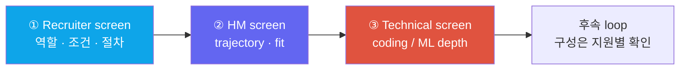

# 폰 스크린 당일 허브

phone screenrecruiterHMtechnical screenday-before index

> [!TIP] 이 챕터의 역할
> 폰 인터뷰는 짧은 시간 안에 목적이 다른 대화가 열릴 수 있는 관문입니다. 이 챕터는 각 유형의 원문을 늘어놓는 대신, **폰 인터뷰를 앞둔 사람이 당일 훑는 인덱스**입니다 — 어떤 대화인지 확인하고, 체크리스트를 점검한 뒤, 해당 원문으로 바로 이동하세요.

## 폰 스크린은 한 종류가 아니다

"폰 인터뷰"라고 뭉뚱그리지만 대표적으로 목적이 다른 세 유형이 있고, **평가하려는 signal이 다릅니다.** ① recruiter screen은 logistics·fit·동기·비자/위치·level·보상 범위를 맞출 수 있고, ② HM screen은 연구 궤적·ownership·팀 문제 접점을, ③ technical screen은 live coding 또는 ML/CV/LLM depth를 볼 수 있습니다. 실제 시간·평가 여부·다음 단계와의 관계는 초대장과 recruiter에게 확인하세요. 핵심은 통화 초반에 대화의 목적을 맞추는 것입니다 — recruiter에게 논문 전체를 설명하거나 technical interviewer에게 보상 이야기부터 꺼내면 준비한 signal이 어긋납니다.

## 당일/전날 체크리스트

유형과 무관하게 폰 스크린 전에 손에 쥐고 있어야 할 것만 추렸습니다. 각 항목의 *내용*은 아래 라우팅 표의 원문에 있습니다.

- **2문장 자기소개** — 이력 낭독이 아니라 theme → flagship(impact+venue) → 궤적으로 요약. 리허설해서 60–90초에 맞추기.
- **레벨 target 1개 + 비자/위치/타임라인** 답을 미리 정해두기.
- **회사 구체 근거 1개** — 최근 논문/모델/제품 하나를 읽고 "저는 ___를 존경했습니다" 한 문장.
- **연봉은 밴드로 넘기기** — 첫 통화에서 hard number를 확정하지 않기(스크립트는 아래 recruiter-hm).
- **프로젝트별 2분 pitch** — 이력서 대표 항목마다 "내가 무엇을·왜 결정했는가"를 수치와 함께.
- **그들에게 할 질문 2개** — 관심의 증거이자 실사.
- **기술 스크린이면** cue→pattern 매핑과 ML-from-scratch(softmax, attention, IoU/NMS, conv, k-means)를 워밍업.
- **원격 셋업** — 오디오·네트워크·화면공유를 미리 점검.

> [!WARNING] 흔한 mismatch
> **대화의 목적과 답변의 고도가 어긋나는 것.** recruiter에게 불필요한 technical depth를, technical screen에서 조건 협상을 먼저 꺼내는 식입니다. coding에서 판단을 전혀 말하지 않거나, 이력서 질문에서 "우리 팀이"만 반복해 *내* 기여가 보이지 않는 경우도 피하세요.

## 유형별 원문으로 라우팅

| 폰 스크린 유형 | 무엇을 원하나 | 준비 원문 |
| --- | --- | --- |
| ① 리크루터 스크린 | fit·logistics·동기 | [리크루터 & HM 스크리닝](#/process/recruiter-hm) — 자기소개·why-us·comp 넘기기 스크립트 |
| ② HM 스크린 | 연구 궤적·팀 fit | [리크루터 & HM 스크리닝](#/process/recruiter-hm) — 60–90초 arc·why-leave·follow-up |
| ③ 기술 (coding) | 문제해결·소통 | [코딩 라운드 전략](#/coding/strategy) · [핵심 패턴](#/coding/patterns) · ML-from-scratch: [ML 코딩](#/ml-coding/intro) |
| ③ 기술 (depth) | 기초·전문성 | [Foundations](#/foundations/optimization) · [컴퓨터 비전](#/cv/segmentation) · [VLM 101](#/vlm/vlm-101) · [LLM](#/llm/fundamentals) |
| 이력서 기반 답변·deep-dive | 단계별 말하기·ownership·trade-off 방어 | [단계별 예시 답변](#/resume/interview-stage-answers) · [예상 질문 & 답변](#/resume/predicted-questions) · [이력서 딥다이브 맵](#/resume/overview) |
| 전체 퍼널 맥락 | 어느 게이트가 무엇을 보나 | [빅테크 파이프라인](#/process/pipeline) |
| 그들에게 할 질문 | fit 평가 신호 | [그들에게 할 질문](#/playbook/questions-to-ask) |
| 원격/당일 운영 | 첫인상·리커버리 | [원격 인터뷰 셋업](#/playbook/remote-setup) · [당일 전략 & 리커버리](#/playbook/tactics) |

**Related:** [리크루터 & HM 스크리닝](#/process/recruiter-hm) · [빅테크 파이프라인](#/process/pipeline) · [단계별 예시 답변](#/resume/interview-stage-answers) · [예상 질문 & 답변](#/resume/predicted-questions) · [행동 면접 질문](#/behavioral/questions) · [코딩 전략](#/coding/strategy) · [커뮤니케이션](#/playbook/communication) · [그들에게 할 질문](#/playbook/questions-to-ask)
