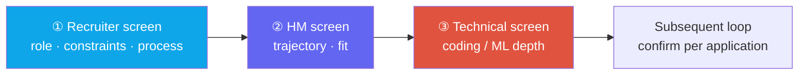

# Phone-Screen Day-Of Hub

phone screenrecruiterHMtechnical screenday-before index

> [!TIP] What this chapter is for
> A phone interview is a gateway that can open into several conversations with different purposes. Instead of duplicating the source material for each type, this chapter is the **day-of index for someone about to take a phone screen**: identify the conversation, run the checklist, and jump directly to the relevant chapter.

## A phone screen is not one kind of interview

"Phone interview" commonly covers three formats with **different target signals**. ① A recruiter screen may align logistics, fit, motivation, work authorization/location, level, and compensation range. ② An HM screen probes research trajectory, ownership, and overlap with the team's problems. ③ A technical screen may test live coding or ML/CV/LLM depth. Confirm the real duration, whether the call is evaluative, and how it connects to later stages from the invitation and recruiter. The key is to align on the conversation's purpose at the start: explaining an entire paper to a recruiter or leading with compensation in a technical screen sends the wrong prepared signal.

## Day-before and day-of checklist

These are the few items you should have in hand before any phone screen. The routing table below points to the source chapter for each item's content.

- **Two-sentence introduction** — not a resume recital; compress theme → flagship (impact + venue) → trajectory. Rehearse the expanded version to 60–90 seconds.
- **One target level plus work-authorization/location/timeline answers** decided in advance.
- **One company-specific piece of evidence** — read a recent paper, model, or product and prepare one sentence explaining what you respect about it.
- **Redirect compensation to the band** — do not lock in a hard number on the first call; the script is in the recruiter/HM chapter.
- **A two-minute pitch per project** — for each flagship resume item, explain what *you* decided, why, and the supporting number.
- **Two questions for them** — evidence of interest and part of your own diligence.
- **For a technical screen**, warm up cue→pattern mapping and ML from scratch: softmax, attention, IoU/NMS, convolution, and k-means.
- **Remote setup** — test audio, network, and screen sharing ahead of time.

> [!WARNING] Common mismatch
> **The answer's altitude does not match the conversation's purpose.** Examples include unnecessary technical depth for a recruiter or initiating terms negotiation in a technical screen. Also avoid silent implementation in coding or repeatedly saying "our team" in a resume discussion until *your* contribution disappears.

## Route to the source chapter by screen type

| Phone-screen type | What they want | Source material |
| --- | --- | --- |
| ① Recruiter screen | fit, logistics, motivation | [Recruiter & HM Screens](#/process/recruiter-hm) — introduction, why-us, and compensation-redirection scripts |
| ② HM screen | research trajectory, team fit | [Recruiter & HM Screens](#/process/recruiter-hm) — 60–90 second arc, why-leave, and follow-ups |
| ③ Technical (coding) | problem solving, communication | [Coding Round Strategy](#/coding/strategy) · [Core Patterns](#/coding/patterns) · ML from scratch: [ML Coding](#/ml-coding/intro) |
| ③ Technical (depth) | fundamentals, specialty depth | [Foundations](#/foundations/optimization) · [Computer Vision](#/cv/segmentation) · [VLM 101](#/vlm/vlm-101) · [LLMs](#/llm/fundamentals) |
| Resume-grounded answers/deep-dive | stage-specific delivery, ownership, trade-off defense | [Stage-by-Stage Answers](#/resume/interview-stage-answers) · [Predicted Q&A](#/resume/predicted-questions) · [Resume Deep-Dive Map](#/resume/overview) |
| Full-funnel context | what each gate measures | [The Interview Pipeline](#/process/pipeline) |
| Questions for them | signal and evaluate fit | [Questions to Ask Them](#/playbook/questions-to-ask) |
| Remote/day-of operations | first impression, recovery | [Remote Interview Setup](#/playbook/remote-setup) · [Day-Of Tactics & Recovery](#/playbook/tactics) |

**Related:** [Recruiter & HM Screens](#/process/recruiter-hm) · [The Interview Pipeline](#/process/pipeline) · [Stage-by-Stage Answers](#/resume/interview-stage-answers) · [Predicted Q&A](#/resume/predicted-questions) · [Behavioral Questions](#/behavioral/questions) · [Coding Strategy](#/coding/strategy) · [Communication](#/playbook/communication) · [Questions to Ask Them](#/playbook/questions-to-ask)
