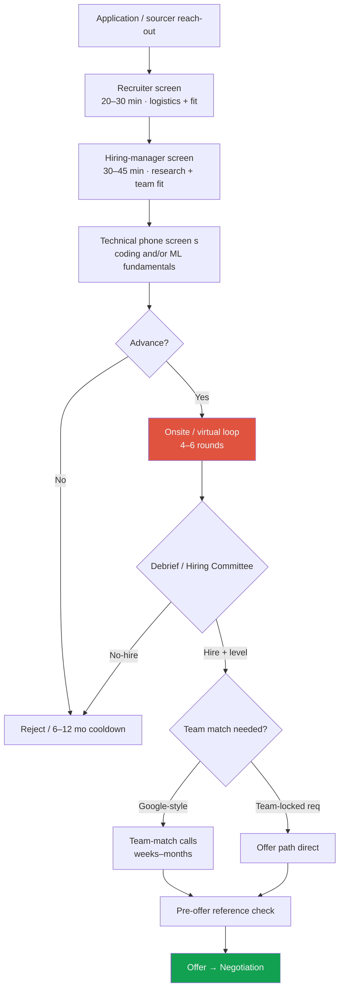
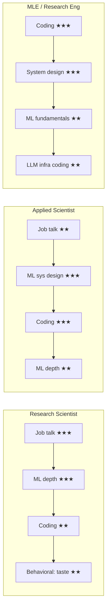

# The Big-Tech RS/AS Pipeline

recruiter → offerRS vs AS vs MLEteam match2026 trends

> [!TIP] 이 chapter가 존재하는 이유
> research/applied-scientist loop는 한 번의 면접이 아닙니다 — **약 1–3개월에 걸친 5–10개의 게이트 접점으로 이뤄진 funnel**이고, 각 게이트는 *서로 다른* 이유로 탈락시킵니다. 어느 라운드가 무엇을 측정하는지 알면 funnel이 가장 좁은 곳에 준비를 쏟을 수 있습니다. 이 chapter는 지도이고; 회사별 [Company Playbooks](#/process/companies)는 지형입니다.

> [!WARNING] 확실성에 대하여
> frontier 랩의 loop 구성은 분기마다 바뀝니다. 여기 있는 모든 라운드 목록은 **최빈값이지, 보장이 아닙니다** *(방어 가능)*. recruiter 본인의 안내를 진실의 원천으로 삼고, 구체적인 loop는 [recruiter screen](#/process/recruiter-hm)에서 확인하세요.

## funnel 한눈에 보기

**End-to-end 소요 기간:** 대개 **4–12주** *(커뮤니티 일치)*. 압축 요인: team-locked req, 정렬된 일정, 진행 중인 경쟁 offer. 연장 요인: Google-style team matching, Hiring-Committee 적체, MSR-style 세미나 일정, visa/relocation 심사.

## 각 라운드가 실제로 평가하는 것

가장 유용한 재해석: 면접관은 "당신이 똑똑한가"를 테스트하는 게 아니라 — **debrief rubric의 특정 칸**을 채우고 근거와 함께 hire/no-hire를 씁니다. *그들의* 칸을 위한 근거를 주세요.

| 라운드 | 길이 | 무엇을 측정하나 | 어떻게 떨어지나 |
| --- | --- | --- | --- |
| **Coding (DSA)** | 45–60 min | 문제 해결 유창성, data-structures/algorithms; 보통 Medium, follow-up 있는 일부 Hard | 조용히 코딩; 최적화 없는 brute force; 못 잡은 버그. Medium을 ~20분 목표로. |
| **ML/LLM coding** | 45–60 min | 실제 ML을 from scratch로 구현/디버그: attention, KV-cache, LoRA, beam search, SGD loop | transformer를 API로만 *써본* 경우; causal-mask attention을 참조 없이 못 씀 |
| **ML breadth** | 30–45 min | 속사포: optimization, backprop, norm, regularization, metric + 현대 primitive(RoPE, MoE, RLHF, diffusion) | 구멍 하나(RL? diffusion?)가 침몰시킴 — "틀린 답 한두 개면 충분할 수 있다" |
| **ML depth** | 45–60 min | *당신의* 세부 분야 deep dive; SOTA와 그 한계를 추론 | 자기 논문 너머로 얕음; 자기 연구를 문헌 안에 위치시키지 못함 |
| **ML system design** | 45–60 min | 문제를 end-to-end ML로 프레임: data→labels→features→model→train→eval→serve→iterate | 구조 없음; baseline 없음; 정량적 trade-off 없음. [framework](#/system-design/framework) 참조. |
| **Research deep-dive / job talk** | 45–90 min | 자기 연구의 depth + ownership; thesis처럼 방어 | "we" 뒤에 *자기* 기여를 가림; baseline/ablation을 방어 못 함 |
| **Behavioral** | 30–45 min | 협업, influence-without-authority, 실패, research taste, values fit | 구체적 결과 없음; 성찰 없음; 남 탓. [STAR](#/behavioral/star) 참조. |

<figure>
<svg viewBox="0 0 660 210" xmlns="http://www.w3.org/2000/svg" font-family="Inter, sans-serif" font-size="12">
  <defs><marker id="ar" markerWidth="8" markerHeight="8" refX="6" refY="3" orient="auto"><path d="M0 0 L6 3 L0 6" fill="#98a3b2"/></marker></defs>
  <!-- funnel trapezoids -->
  <polygon points="40,20 620,20 540,60 120,60" fill="#6366f1" opacity="0.85"/>
  <polygon points="120,66 540,66 470,106 190,106" fill="#0ea5e9" opacity="0.85"/>
  <polygon points="190,112 470,112 410,152 250,152" fill="#e0533f" opacity="0.9"/>
  <polygon points="250,158 410,158 360,196 300,196" fill="#12a150"/>
  <text x="330" y="45" text-anchor="middle" fill="#fff">Applicants / sourced (100%)</text>
  <text x="330" y="91" text-anchor="middle" fill="#fff">Recruiter + HM + phone screens (~15–25%)</text>
  <text x="330" y="137" text-anchor="middle" fill="#fff">Full loop (~5–10%)</text>
  <text x="330" y="182" text-anchor="middle" fill="#fff">Offer</text>
  <text x="635" y="45" fill="#98a3b2" text-anchor="end"></text>
</svg>
<figcaption>loop가 병목이지만, 초기 게이트가 가장 많은 사람을 잘라냅니다. 각 단계는 자기만의 이유로 탈락시킵니다 — breadth-first로 준비한 뒤, depth로.</figcaption>
</figure>

## RS 대 AS 대 MLE — loop가 어떻게 재편되나

동일한 일곱 라운드 유형이 title에 따라 **재가중**됩니다. title은 회사마다 일관되지 않으므로, 이것이 recruiter에게 명확히 해둬야 할 가장 중요한 것입니다.

<dl class="kv">
<dt>Research Scientist (RS)</dt><dd>Deliverable = <b>논문 + 새로운 방법</b>. loop는 <a href="#/research/job-talk">job talk</a>, ML depth, research-taste behavioral에 크게 가중한다. coding은 있지만 종종 ML-flavored/가볍다. <b>3편 이상의 first-author top-venue 논문</b>이 top 랩의 사실상 진입 기준 <i>(트렌드; 정확한 편수는 커뮤니티 lore)</i>. FAIR/MSR는 이를 <b>postdoc/faculty 채용</b>처럼 운영한다.</dd>
<dt>Applied Scientist (AS)</dt><dd>"ship도 할 수 있는 research scientist." 동일한 research 라운드 <b>플러스 최소 하나의 진짜 SWE/LeetCode 라운드</b>, 보통 <a href="#/system-design/framework">ML system design</a> 라운드. 재현 가능한 실험과 production-adjacent modeling으로 평가된다.</dd>
<dt>MLE / Research Engineer</dt><dd>loop가 <b>SWE</b>(다수의 coding + system design) <b>플러스 ML fundamentals</b>처럼 보인다. frontier-lab RE는 추가로 "무서운" 라운드를 받는다: LLM training/inference coding, multi-level OOP, 때로는 그래도 research presentation.</dd>
</dl>

> [!NOTE] title 함정
> 한 recruiter의 "이 엔지니어링 직무는 ML 없음"은 실제 면접관에게 일상적으로 뒤집힙니다. **title과 무관하게 depth와 implementation 둘 다 준비하세요.** Beomyoung 본인의 타겟도 이 경계에 걸쳐 있습니다 — Mistral의 서울 직무는 *Applied Scientist*(ship + 깔끔한 코드)인 반면, FAIR/MSR req는 순수 RS(job talk + depth)입니다. 같은 story bank, 다른 라운드 가중치.

## debrief와 leveling 결정

loop 후, 면접관들은 (anchoring을 줄이기 위해) 논의 *전에* **독립적인** 서면 피드백을 쓰고, 그다음 **debrief / Hiring Committee**가 점수를 단일 **hire/no-hire + level**로 변환합니다.

- **Central HC** (Meta, Google): cross-org 위원회가 패킷을 calibrate — 개별 면접관 편향을 줄이지만 지연을 더한다.
- **HM/team-driven** (NVIDIA, Apple, Adobe, MSR labs, ByteDance Seed): hiring manager와 패널이 더 직접적으로 결정한다.
- **Bar-raiser 유사물:** Amazon의 Bar Raiser; Microsoft의 **"As Appropriate" (AA)** 라운드 — *팀 외부*의 시니어 면접관이 기준과 장기 잠재력 signal을 지키며, 크게 가중된 투표권을 갖는다.

> [!QUESTION] "약한 라운드 하나가 나를 침몰시킬 수 있나요?"
> **짧게:** 때때로, 하지만 rubric과 회사에 따라 다릅니다. **깊게:** 속사포 *fundamentals*에서는 틀린 답 한두 개가 끝낼 수 있습니다. 전체 loop에서는, 단일 약한 라운드가 다른 곳의 강한 signal로 상쇄될 수 있습니다 — *단*, 그게 직무의 핵심이 걸린 라운드(AS/MLE의 coding; RS의 job talk)가 아니라면요. "완벽한" coding 솔루션도 rubric이 원한 *협업/커뮤니케이션* signal을 보여주지 못하면 여전히 no-hire일 수 있습니다.

## Team matching — 세 가지 모델

*팀을 위해* 면접을 보느냐 *회사를 위해* 면접을 보느냐가 타이밍과 leverage에 관한 모든 것을 바꿉니다.

| 모델 | 메커니즘 | 누구 | 함의 |
| --- | --- | --- | --- |
| **Google-style pooled** | HC를 먼저 통과, *그다음* manager call로 팀에 매칭; **매칭 전까지 공식 offer 없음** | Google, 일부 Meta org | 수 주–수 개월 정체될 수 있음; 강한 패킷도 매칭 안 될 수 있음 |
| **Meta-style pre-offer match** | HC 통과 후, offer 전에 **3–5회 HM 대화**; 팀을 확보한 뒤 offer(2023 이후, 옛 bootcamp team-pick은 사라짐) | Meta | Team-fit이 이제 형식이 아니라 *게이팅* 대화 |
| **Team-locked req** | JD가 *곧* 특정 팀/랩; loop가 *곧* 그 팀; 매칭 거의/전혀 없음 | Apple(대부분), NVIDIA Research, Adobe Research, ByteDance Seed, MSR labs, Mistral | Fit이 loop 안에서 평가됨; 더 빠르지만, 대안 팀은 없음 |

## 언급해야 할 2025–2026 트렌드

> [!EXAMPLE] 최신처럼 들리려면 이렇게 말하세요
> "여러 곳에서 loop가 onsite 쪽으로 다시 돌아섰고, coding 라운드가 AI-tool-supervised로 바뀌고 있으며, 예전의 획일적 rubric보다 team-fit과 pre-offer reference가 더 강하게 게이팅하고 있다는 걸 압니다."

1. **부분적 in-person onsite 복귀** *(여러 org에서 검증 가능)* — Google, LinkedIn, xAI, Perplexity가 on-site 라운드를 되살렸습니다; 대부분의 research loop는 **virtual**로 남고, 최종만 in-person입니다.
2. **AI-assisted / AI-supervised coding 라운드** — Meta 등은 *proctored* shared editor를 도입했습니다: autocomplete/AI가 종종 비활성화되고, copilot이 trivia를 값싸게 만들기 때문에 정확히 그 이유로 **from-scratch ML implementation**(attention, sampling, training loop)이 강조됩니다.
3. **Pre-offer reference check가 게이팅** — frontier 랩(OpenAI, Anthropic, DeepMind)은 offer 전에 **최근 매니저/협력자로부터 back-channel reference를 받는** 일이 일상적입니다. 지금 여러분을 대변해 줄 사람을 관리해 두세요.
4. **획일적 rubric보다 정확한 team-fit** — 시니어 레벨에서는 팀이 특정 scope를 위해 채용합니다; "강하지만 fit이 안 맞음"은 실제 탈락 사유이고, 때로는 엔지니어링 트랙으로 리다이렉트됩니다.
5. **Reasoning 시대의 ML depth** — RLVR/GRPO, MoE active-vs-total, native multimodal, agent/computer-use 질문을 이제 *기본* breadth로 예상하세요. [The 2026 Landscape](#/start/landscape-2026) 참조.

전체 과정이 얼마나 걸릴 것으로 예상해야 하고, offer들을 어떻게 정렬하나요?

**짧게:** 회사당 4–12주를 잡고, offer가 서로 ~2주 이내에 도착하도록 의도적으로 프로세스를 **클러스터**하세요.

**깊게:** 워밍업을 위해 느린/"안전한" 회사를 먼저 시작하되, 그들의 offer가 최우선 선택지가 결정하기 전에 만료될 만큼 너무 일찍은 아니게 하세요. recruiter에게 **동시 프로세스 진행 중**이라고 말하세요(정상이고 기대되는 일입니다 — 오히려 우선순위를 *올립니다*) 그리고 *가장 이른 실제 마감일*을 공유하세요. 대부분의 회사는 hard deadline을 1–2주 이상 연장하지 않으니, 정렬 작업은 여러분 몫입니다. [Offers, Levels & Negotiation](#/process/negotiation) 참조.

5년의 업계 경력(NAVER Cloud)을 가진 part-time PhD입니다. 어떤 title/level을 노려야 하나요?

**짧게:** job-talk + first-author record가 통화인 곳에서는 **RS**를, research-to-product shipping이 통화인 곳에서는 **AS**를 노리세요 — 그리고 leveling은 title이 아니라 패킷으로 보정되게 두세요.

**깊게:** 여러분의 프로필(ICCV Highlight 포함 7편의 first-author 논문, *플러스* ZIM→CLOVA-X와 on-device seg 같은 shipped product)은 **AS**에는 유난히 강하고 production transfer를 중시하는 팀에서는 **RS**에도 경쟁력이 있습니다. 업계 경력 + Highlight는 **senior(E5/L5 유사)** 논의에서 긍정 signal이지만, "PhD ⇒ 자동 senior"는 거짓입니다 — 여러분을 level링하는 건 loop 패킷입니다. [Negotiation](#/process/negotiation)의 leveling 맵 참조.

### 첫 답변 후 그들이 밀어붙일 follow-up

- *"어느 라운드가 본인에게 가장 어렵다고 생각하고, 어떻게 준비하고 있나요?"* — 진짜 격차(예: 시간 압박 속 from-scratch CUDA/attention)와 구체적 계획을 짚으세요. 자기 인식이 점수가 됩니다.
- *"라운드를 셋만 돌릴 수 있다면, 당신에 대해 가장 많이 알려줄 셋은?"* — 자기 강점(job talk + ML depth + design 라운드)으로 유도할 기회입니다.
- *"research fit이 정확하지 않으면 엔지니어링 트랙도 열려 있나요?"* — loop *전에* 답을 정해두세요; 얼버무리면 확신이 약해 보입니다.

## Cheat-sheet

| 질문 | 한 줄 답 |
| --- | --- |
| Funnel 형태 | Recruiter → HM → phone screen(s) → 4–6 라운드 loop → debrief/HC → team match → refs → offer |
| 소요 기간 | ~4–12주; team matching + HC + visa가 늘림 |
| RS 가중 | Job talk + ML depth + research-taste behavioral; coding은 가볍/ML-flavored |
| AS 가중 | RS 라운드 + ≥1 진짜 SWE coding + ML system design |
| MLE 가중 | SWE coding + system design + ML fundamentals (+ 랩에서는 LLM-infra coding) |
| Team-match 모델 | Google pooled(매칭 후 offer) · Meta pre-offer HM call · team-locked req |
| 2026 트렌드 | Onsite 부분 복귀 · AI-supervised coding · pre-offer reference · 정확한 team-fit |
| 진실의 원천 | recruiter 본인의 loop 안내 — 모든 라운드를 확인 |

**Related:** [Recruiter & HM Screens](#/process/recruiter-hm) · [Company Playbooks](#/process/companies) · [Offers & Negotiation](#/process/negotiation) · [The Research Job Talk](#/research/job-talk) · [Design Framework](#/system-design/framework) · [STAR & Story Bank](#/behavioral/star) · [The 2026 Landscape](#/start/landscape-2026)
