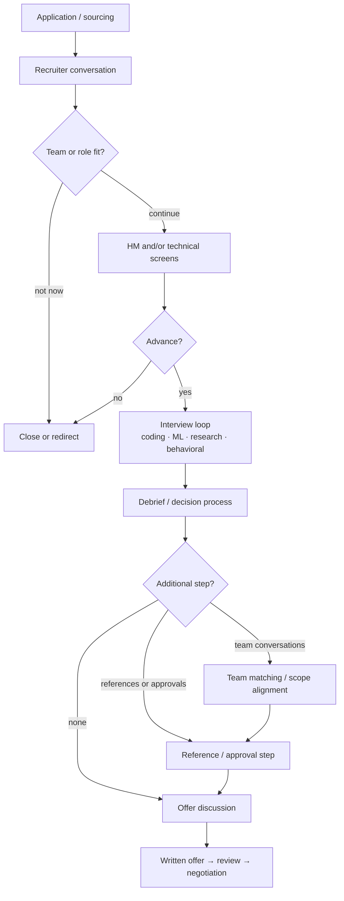

# The RS/AS Interview Pipeline

<div class="tag-row"><span class="tag">recruiter → offer</span><span class="tag">RS vs AS vs MLE</span><span class="tag">team match</span><span class="tag">process tracking</span></div>

> [!TIP] 이 chapter가 존재하는 이유
> research/applied-scientist 채용은 여러 접점이 서로 다른 signal을 모으는 과정입니다. 중요한 것은 “보통 몇 라운드”를 외우는 일이 아니라, **이번 지원 건의 각 단계가 무엇을 평가하고 무엇을 준비해야 하는지** 확인하는 것입니다. 이 chapter는 전체 지도이고, 당일 준비는 [폰 스크린 허브](#/process/phone-screens), 회사별 조사는 [Company Playbooks](#/process/companies)로 이어집니다.

> [!WARNING] 실제 초대장과 recruiter 안내가 진실의 원천입니다
> 단계의 이름·순서·길이·횟수·도구·대면 여부·team matching·reference check는 회사뿐 아니라 팀, req, level, 지역, 시점에 따라 달라집니다. 아래는 가능한 구성요소를 보여주는 **모델**이지 고정 절차나 성공 확률이 아닙니다. 지원마다 확인일과 출처를 기록하세요.

## 가능한 흐름 한눈에 보기



일부 단계는 생략·통합·재배치될 수 있습니다. 특히 reference는 회사가 정한 절차와 후보 동의에 따라 시점과 대상이 다르므로 “당연히 offer 전/후”라고 가정하지 마세요.

## 각 평가 유형이 모으려는 signal

| 평가 유형 | 주로 보는 것 | 준비할 증거 |
| --- | --- | --- |
| Recruiter conversation | 역할·지역·일정·work authorization·기본 fit | 짧은 경력 arc, 사실 기반 logistics, 확인 질문 |
| HM conversation | 연구 궤적, 팀 문제와의 접점, scope | theme→대표 결과→다음 문제, ownership 사례 |
| Coding / DSA | 문제 분해, 구현 정확성, 테스트, 소통 | clarify→approach→code→verify 습관 |
| ML/LLM implementation | 수식과 모델을 실행 가능한 코드로 옮기는 능력 | 핵심 primitive의 from-scratch 구현과 디버깅 |
| ML breadth/depth | 기초의 연결, 전문 분야 판단, 한계 인식 | 정의·직관·trade-off·failure mode |
| ML system design | 문제 정의부터 운영·평가까지의 end-to-end 판단 | 요구사항→data→model→eval→serve→monitor |
| Research deep-dive / job talk | novelty, ownership, 실험 판단, future taste | 대표 연구의 결정·반례·negative result·후속 방향 |
| Behavioral / collaboration | 영향력, 갈등, 실패, mentoring, 가치 판단 | 구체적 `I` 행동과 결과가 있는 story bank |

실제 길이와 세부 형식은 invitation에서 확인합니다. 라운드별 실패 패턴은 중복하지 않고 [흔한 실수 & 레드 플래그](#/playbook/mistakes)를 canonical 목록으로 사용하세요.

## title보다 실제 산출물로 역할을 분류한다

회사마다 같은 title을 다르게 쓰므로, 아래는 **경향을 확인하기 위한 질문**입니다.

| 역할 archetype | 흔히 강조될 수 있는 signal | recruiter/HM에게 확인할 질문 |
| --- | --- | --- |
| Research Scientist | 새로운 방법, 논문·research agenda, 깊은 전문성 | job talk가 있는가? publication이 핵심 산출물인가? coding 기대 수준은? |
| Applied Scientist | 모델링과 제품 영향의 연결, 실험·시스템 판단 | production ownership은 어디까지인가? DSA와 ML coding이 각각 있는가? |
| MLE / Research Engineer | 구현·시스템·성능, 연구 코드를 신뢰 가능한 시스템으로 전환 | 일반 system design과 ML infra 중 무엇을 보는가? 언어·환경은? |

논문 편수나 학위만으로 지원 가능성 또는 level을 단정하지 마세요. JD의 동사와 HM이 설명한 첫 6–12개월 scope를 기준으로, 자신의 **연구 증거와 shipping 증거**를 재가중합니다. 연구와 제품 양쪽 경험이 있는 후보는 지원마다 강조점을 바꾸되 사실 자체는 일관되게 유지합니다. 개인별 매핑은 [Your CV → Interview Map](#/resume/overview)에서 관리하세요.

## recruiter에게 반드시 확인할 것

[Recruiter & HM Screens](#/process/recruiter-hm)의 상세 스크립트를 사용해 다음을 확인합니다.

- 정확한 단계와 순서, 합쳐지거나 생략될 수 있는 단계.
- 각 세션의 평가 유형, 예상 형식과 준비해야 할 산출물.
- coding 언어, 실행 가능 여부, 플랫폼, 외부 문서·autocomplete·생성형 AI 정책.
- job talk/take-home의 주제 선택, 제출 형식, 청중, Q&A, 허용 자료.
- 원격/대면 여부, 장소·시간대, accessibility 지원과 백업 연락처.
- 특정 팀 채용인지 pooled hiring인지, team conversation의 시점과 의미.
- debrief/committee 등 recruiter가 공개할 수 있는 의사결정 절차.
- reference 요청 여부, 후보 동의, 대상과 시점.
- level/title 범위, location, visa·relocation, 의사결정 예상 시점.

도구 정책은 회사 전체의 관행으로 추측하지 말고 **이번 라운드 기준**으로 서면 확인합니다.

## debrief와 level: 관찰 가능한 사실만 다룬다

후보가 내부 점수 계산을 정확히 알기는 어렵습니다. “한 라운드가 상쇄된다”, “특정 위원회가 최종 결정한다” 같은 소문에 기대기보다 다음을 통제하세요.

1. 모든 라운드에서 가정·결정·검증을 관찰 가능하게 만듭니다.
2. 역할의 핵심 signal에서 최소 기준을 놓치지 않도록 준비합니다.
3. 자기 연구의 `I` 기여와 팀 결과를 분리해 설명합니다.
4. 약한 답 뒤에는 방어적으로 추측하지 말고, 배운 점과 확인 경로를 제시합니다.
5. level 주장은 title 비교가 아니라 다음 역할에서 소유할 scope와 과거 영향으로 뒷받침합니다.

내부 피드백이나 결과 사유는 회사가 공유하지 않을 수 있습니다. recruiter가 알려준 사실과 자신의 회고를 구분해 기록하세요.

## team matching은 이름보다 계약 시점을 본다

| 확인할 모델 | 핵심 질문 | 의사결정상 의미 |
| --- | --- | --- |
| 특정 팀 req | “offer의 팀·manager·scope가 이미 정해졌나요?” | fit을 loop 안에서 판단; 대안 팀 여부 확인 |
| pooled hiring | “평가 통과 뒤 팀을 찾나요? 팀이 없으면 패킷은 어떻게 되나요?” | 일정과 offer 조건이 팀 확정에 의존할 수 있음 |
| 추가 scope conversation | “이 대화는 상호 선택인가, 최종 승인인가, 정보 공유인가?” | 준비 방식과 deadline 판단이 달라짐 |

team match가 있다고 들었더라도 통화 횟수나 기간을 미리 단정하지 않습니다. 관심 팀, 피하고 싶은 scope, location 제약, 질문 목록을 준비하고 각 대화 뒤 비교표를 갱신하세요.

## 날짜가 있는 process snapshot

```text
Company / team / req ID:
Location / time zone:
Recruiter contact:
Last confirmed (YYYY-MM-DD):

Confirmed stages:
1.
2.

For each stage:
- purpose / interviewer role:
- format and scheduled duration:
- platform / language / allowed tools:
- materials to prepare:

Decision model disclosed by recruiter:
Team matching / references / approvals:
Expected decision window (not a guarantee):
Offer deadline, if any:

Still unverified:
Next action / owner / date:
```

예상 일정이 바뀌면 이전 값을 지우지 말고 날짜와 함께 갱신합니다. 그래야 “원래 들은 정보”와 “현재 운영 정보”가 섞이지 않습니다.

## 여러 프로세스 정렬하기

- 브랜드별 평균 기간이 아니라 recruiter가 말한 **다음 단계와 예상 의사결정 창**을 사용합니다.
- 동시에 진행 중인 절차와 실제 deadline은 정직하게 공유합니다. 존재하지 않는 긴급성을 만들지 않습니다.
- 핵심 선택지 전에 비슷한 형식의 실전 경험을 배치할 수 있지만, 첫 offer가 지나치게 일찍 만료되지 않도록 시작 시점을 조정합니다.
- 연장 가능성은 회사마다 다르므로 가정하지 말고 가능한 범위와 필요한 승인 시점을 묻습니다.
- 일정표에는 `회사`, `단계`, `날짜/시간대`, `확인 상태`, `준비 산출물`, `다음 연락일`, `deadline`을 둡니다.

offer를 받으면 [Offers, Levels & Negotiation](#/process/negotiation)의 dated snapshot으로 넘깁니다.

## 변화가 빠른 항목을 다루는 법

대면 복귀, AI-assisted coding, 새로운 reference 관행, 특정 최신 주제의 출제처럼 시점에 민감한 주장은 “현재 트렌드”로 암기하지 않습니다. 다음 네 질문으로 바꿉니다.

1. 이번 라운드는 원격인가 대면인가?
2. coding 도구와 생성형 AI 정책은 무엇이며 어디에 문서화되어 있는가?
3. reference가 있다면 후보 동의와 시점은 어떻게 되는가?
4. 기술 범위는 JD와 prep guide 중 무엇을 기준으로 준비해야 하는가?

최신 연구 주제는 interview policy와 별개입니다. 공개된 JD·논문을 읽어 why-us와 기술 대화를 준비하되, 출제 범위를 자동으로 추론하지 마세요.

## Cheat-sheet

| 질문 | 한 줄 답 |
| --- | --- |
| 전체 흐름 | 가능한 지도를 보되 이번 req의 단계는 recruiter에게 확인 |
| 라운드 수·기간 | 평균을 약속처럼 쓰지 말고 날짜 있는 snapshot으로 관리 |
| RS/AS/MLE | title이 아니라 산출물·scope·평가 구성을 확인 |
| 도구 정책 | invitation/recruiter 서면 답변이 기준 |
| team matching | 명칭보다 팀·scope·offer가 언제 확정되는지 질문 |
| reference | 시점·대상·동의 절차를 확인, back-channel을 당연시하지 않기 |
| level | 학위/연차가 아니라 독립 scope와 영향의 증거 |
| 일정 정렬 | 실제 단계·deadline만 공유하고 변경 이력을 기록 |

**Related:** [Phone Screens](#/process/phone-screens) · [Recruiter & HM Screens](#/process/recruiter-hm) · [이력서 기반 단계별 예시 답변](#/resume/interview-stage-answers) · [Company Playbooks](#/process/companies) · [Offers & Negotiation](#/process/negotiation) · [The Research Job Talk](#/research/job-talk) · [Design Framework](#/system-design/framework) · [STAR & Story Bank](#/behavioral/star)
