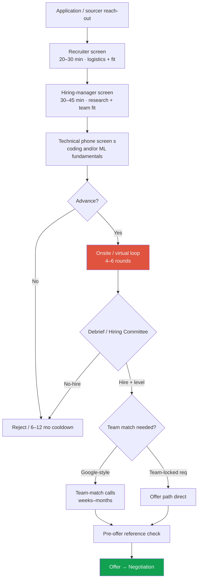
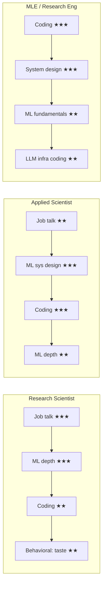

# The Big-Tech RS/AS Pipeline

recruiter → offerRS vs AS vs MLEteam match2026 trends

> [!TIP] Why this chapter exists
> A research/applied-scientist loop is not one interview — it's a **funnel of 5–10 gated touchpoints over ~1–3 months**, and each gate rejects for a *different* reason. Knowing which round measures what lets you spend prep where the funnel is narrowest. This chapter is the map; the per-company [Company Playbooks](#/process/companies) are the terrain.

> [!WARNING] On certainty
> Loop composition at frontier labs changes quarterly. Every round list here is **modal, not guaranteed** *(defensible)*. Treat the recruiter's own walkthrough as the source of truth, and confirm the specific loop in the [recruiter screen](#/process/recruiter-hm).

## The funnel at a glance

**End-to-end duration:** typically **4–12 weeks** *(community-consistent)*. Compressing factors: team-locked reqs, aligned scheduling, an active competing offer. Stretching factors: Google-style team matching, Hiring-Committee backlog, MSR-style seminar scheduling, visa/relocation review.

## What each round actually evaluates

The single most useful reframe: an interviewer is not testing "are you smart" — they are filling a **specific box on a debrief rubric** and writing a hire/no-hire with evidence. Give them the evidence for *their* box.

| Round | Length | What it measures | How to lose it |
| --- | --- | --- | --- |
| **Coding (DSA)** | 45–60 min | Problem-solving fluency, data-structures/algorithms; usually Medium, some Hard w/ follow-ups | Silent coding; brute force with no optimization; bugs you don't catch. Aim ~20-min Mediums. |
| **ML/LLM coding** | 45–60 min | Implement/debug real ML from scratch: attention, KV-cache, LoRA, beam search, an SGD loop | Only ever *used* transformers via API; can't write causal-mask attention without references |
| **ML breadth** | 30–45 min | Rapid-fire: optimization, backprop, norm, regularization, metrics + modern primitives (RoPE, MoE, RLHF, diffusion) | One hole (RL? diffusion?) sinks it — "a wrong answer or two can be enough" |
| **ML depth** | 45–60 min | Deep dive in *your* subfield; reason about SOTA and its limits | Shallow past your own paper; can't place your work in the literature |
| **ML system design** | 45–60 min | Frame a problem as ML end-to-end: data→labels→features→model→train→eval→serve→iterate | No structure; no baseline; no quantitative trade-offs. See [framework](#/system-design/framework). |
| **Research deep-dive / job talk** | 45–90 min | Depth + ownership of your research; defend it like a thesis | Obscuring *your* contribution behind "we"; can't defend baselines/ablations |
| **Behavioral** | 30–45 min | Collaboration, influence-without-authority, failure, research taste, values fit | No concrete result; no reflection; blaming others. See [STAR](#/behavioral/star). |

<figure>
<svg viewBox="0 0 660 210" xmlns="http://www.w3.org/2000/svg" font-family="Inter, sans-serif" font-size="12">
  <defs><marker id="ar" markerWidth="8" markerHeight="8" refX="6" refY="3" orient="auto"><path d="M0 0 L6 3 L0 6" fill="#98a3b2"/></marker></defs>
  <!-- funnel trapezoids -->
  <polygon points="40,20 620,20 540,60 120,60" fill="#6366f1" opacity="0.85"/>
  <polygon points="120,66 540,66 470,106 190,106" fill="#0ea5e9" opacity="0.85"/>
  <polygon points="190,112 470,112 410,152 250,152" fill="#e0533f" opacity="0.9"/>
  <polygon points="250,158 410,158 360,196 300,196" fill="#12a150"/>
  <text x="330" y="45" text-anchor="middle" fill="#fff">Applicants / sourced (100%)</text>
  <text x="330" y="91" text-anchor="middle" fill="#fff">Recruiter + HM + phone screens (~15–25%)</text>
  <text x="330" y="137" text-anchor="middle" fill="#fff">Full loop (~5–10%)</text>
  <text x="330" y="182" text-anchor="middle" fill="#fff">Offer</text>
  <text x="635" y="45" fill="#98a3b2" text-anchor="end"></text>
</svg>
<figcaption>The loop is the bottleneck, but early gates cut the most people. Each stage rejects for its own reason — prep breadth-first, then depth.</figcaption>
</figure>

## RS vs AS vs MLE — how the loop reshapes

The same seven round types get **reweighted** by title. This is the most important thing to clarify with your recruiter, because titles are inconsistent across companies.

<dl class="kv">
<dt>Research Scientist (RS)</dt><dd>Deliverable = <b>papers + novel methods</b>. Loop weights the <a href="#/research/job-talk">job talk</a>, ML depth, and research-taste behavioral heavily. Coding present but often ML-flavored/lighter. <b>3+ first-author top-venue papers</b> is a de-facto entry bar at top labs <i>(trend; exact counts are community lore)</i>. FAIR/MSR run this like a <b>postdoc/faculty hire</b>.</dd>
<dt>Applied Scientist (AS)</dt><dd>"A research scientist who can also ship." Same research rounds <b>plus at least one real SWE/LeetCode round</b> and usually an <a href="#/system-design/framework">ML system design</a> round. Judged on reproducible experiments and production-adjacent modeling.</dd>
<dt>MLE / Research Engineer</dt><dd>Loop looks like <b>SWE</b> (multiple coding + system design) <b>plus ML fundamentals</b>. Frontier-lab REs get extra "scary" rounds: LLM training/inference coding, multi-level OOP, sometimes a research presentation anyway.</dd>
</dl>

> [!NOTE] The title trap
> One recruiter's "no ML for this engineering role" is routinely contradicted by the actual interviewer. **Prepare for both depth and implementation regardless of title.** Beomyoung's own targets straddle this line — Mistral's Seoul role is *Applied Scientist* (ship + clean code), while FAIR/MSR reqs are pure RS (job talk + depth). Same story bank, different round weights.

## The debrief and leveling decision

After the loop, interviewers write **independent** written feedback *before* discussing (to reduce anchoring), then a **debrief / Hiring Committee** converts scores into a single **hire/no-hire + level**.

- **Central HC** (Meta, Google): a cross-org committee calibrates the packet — reduces individual-interviewer bias, but adds latency.
- **HM/team-driven** (NVIDIA, Apple, Adobe, MSR labs, ByteDance Seed): the hiring manager and panel decide more directly.
- **Bar-raiser analogs:** Amazon's Bar Raiser; Microsoft's **"As Appropriate" (AA)** round — a senior interviewer from *outside* the team guards the bar and long-term-potential signal, with a heavily weighted vote.

> [!QUESTION] "Can one weak round sink me?"
> **Short:** Sometimes, but it's rubric- and company-dependent. **Deep:** On rapid-fire *fundamentals*, one or two wrong answers can end it. On the full loop, a single soft round can be outweighed by strong signal elsewhere — *unless* it's the round the role hinges on (coding for AS/MLE; the job talk for RS). A "perfect" coding solution can still be a no-hire if you didn't show the *collaboration/communication* signal the rubric wanted.

## Team matching — three models

Whether you interview *for a team* or *for the company* changes everything about timing and leverage.

| Model | Mechanics | Who | Implication |
| --- | --- | --- | --- |
| **Google-style pooled** | Pass HC first, *then* match to a team via manager calls; **no formal offer until matched** | Google, some Meta orgs | Can stall for weeks–months; a strong packet can still go unmatched |
| **Meta-style pre-offer match** | HC-pass, then **3–5 HM conversations before the offer**; claim a team, then offer (post-2023, the old bootcamp team-pick is gone) | Meta | Team-fit is now a *gating* conversation, not a formality |
| **Team-locked req** | The JD *is* a specific team/lab; the loop *is* that team; little/no matching | Apple (most), NVIDIA Research, Adobe Research, ByteDance Seed, MSR labs, Mistral | Fit is assessed inside the loop; faster, but no second team to fall back to |

## 2025–2026 trends you should name

> [!EXAMPLE] Say this to sound current
> "I know the loop shifted back toward onsites at several places, that coding rounds are getting AI-tool-supervised, and that team-fit and pre-offer references are gating harder than uniform rubrics used to."

1. **Partial return to in-person onsites** *(verifiable at several orgs)* — Google, LinkedIn, xAI, Perplexity brought back on-site rounds; most research loops remain **virtual**, with only finals in person.
2. **AI-assisted / AI-supervised coding rounds** — Meta and others have introduced *proctored* shared editors: autocomplete/AI often disabled, and **from-scratch ML implementation** (attention, sampling, a training loop) is emphasized precisely because copilots make trivia cheap.
3. **Pre-offer reference checks are gating** — frontier labs (OpenAI, Anthropic, DeepMind) routinely take **back-channel references from recent managers/collaborators before extending an offer**. Curate who would speak for you *now*.
4. **Exact team-fit over uniform rubric** — at senior levels teams hire for a specific scope; "strong but off-fit" is a real rejection, sometimes redirected to an engineering track.
5. **Reasoning-era ML depth** — expect RLVR/GRPO, MoE active-vs-total, native multimodal, and agent/computer-use questions as *baseline* breadth now. See [The 2026 Landscape](#/start/landscape-2026).

How long should I expect the whole thing to take, and how do I keep offers aligned?

**Short:** Budget 4–12 weeks per company; deliberately **cluster** your processes so offers land within ~2 weeks of each other.

**Deep:** Start slower/"safety" companies first to warm up, but not so early that their offer expires before your top choice decides. Tell recruiters you're **in concurrent processes** (this is normal and expected — it *raises* your priority) and share the *earliest real deadline*. Most companies won't extend a hard deadline by more than a week or two, so the alignment work is on you. See [Offers, Levels & Negotiation](#/process/negotiation).

I'm a part-time PhD with 5 years of industry (NAVER Cloud). Which title/level should I target?

**Short:** Target **RS** where the job-talk + first-author record is the currency, **AS** where research-to-product shipping is the currency — and let leveling be calibrated by the packet, not the title.

**Deep:** Your profile (7 first-author papers incl. an ICCV Highlight, *plus* shipped products like ZIM→CLOVA-X and on-device seg) is unusually strong for **AS** and competitive for **RS** at teams valuing production transfer. The industry years + Highlight are positive signals in a **senior (E5/L5-analog)** discussion, but "PhD ⇒ automatic senior" is false — it's the loop packet that levels you. See the leveling map in [Negotiation](#/process/negotiation).

### Follow-ups they'll push after your first answer

- *"Which round do you think is hardest for you, and how are you preparing for it?"* — name the real gap (e.g., from-scratch CUDA/attention under time pressure) and the concrete plan. Self-awareness scores.
- *"If we could only run three rounds, which three would tell us the most about you?"* — a chance to steer toward your strengths (job talk + ML depth + a design round).
- *"Would you be open to an engineering track if the research fit isn't exact?"* — decide your answer *before* the loop; equivocating reads as weak conviction.

## Cheat-sheet

| Ask | One-liner |
| --- | --- |
| Funnel shape | Recruiter → HM → phone screen(s) → 4–6 round loop → debrief/HC → team match → refs → offer |
| Duration | ~4–12 weeks; team matching + HC + visa stretch it |
| RS weighting | Job talk + ML depth + research-taste behavioral; coding lighter/ML-flavored |
| AS weighting | RS rounds + ≥1 real SWE coding + ML system design |
| MLE weighting | SWE coding + system design + ML fundamentals (+ LLM-infra coding at labs) |
| Team-match models | Google pooled (offer after match) · Meta pre-offer HM calls · team-locked req |
| 2026 trends | Onsite partial return · AI-supervised coding · pre-offer references · exact team-fit |
| Source of truth | The recruiter's own loop walkthrough — confirm every round |

**Related:** [Recruiter & HM Screens](#/process/recruiter-hm) · [Company Playbooks](#/process/companies) · [Offers & Negotiation](#/process/negotiation) · [The Research Job Talk](#/research/job-talk) · [Design Framework](#/system-design/framework) · [STAR & Story Bank](#/behavioral/star) · [The 2026 Landscape](#/start/landscape-2026)
