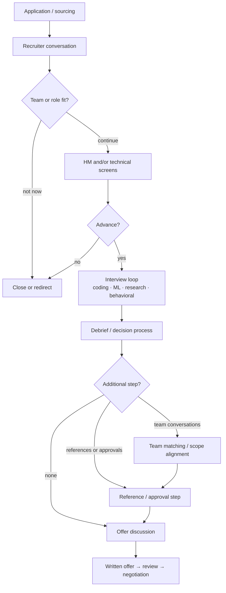

# The RS/AS Interview Pipeline

<div class="tag-row"><span class="tag">recruiter → offer</span><span class="tag">RS vs AS vs MLE</span><span class="tag">team match</span><span class="tag">process tracking</span></div>

> [!TIP] Why this chapter exists
> Research/applied-scientist hiring is a process in which different touchpoints gather different signals. What matters is not memorizing “the usual number of rounds,” but confirming **what each stage of this application evaluates and what you need to prepare**. This chapter is the overall map; day-of preparation continues in the [phone-screen hub](#/process/phone-screens), and company-specific research continues in [Company Playbooks](#/process/companies).

> [!WARNING] The actual invitation and recruiter guidance are the source of truth
> Stage names, order, length, count, tools, in-person requirements, team matching, and reference checks vary not only by company but also by team, req, level, region, and date. The diagram below is a **model** of possible components, not a fixed process or a success probability. Record a confirmation date and source for every application.

## Possible flow at a glance



Some stages may be omitted, combined, or reordered. Reference timing and participants in particular depend on the company's procedure and candidate consent, so do not assume that references “always happen before/after an offer.”

## Signals each evaluation type is trying to collect

| Evaluation type | What it usually examines | Evidence to prepare |
| --- | --- | --- |
| Recruiter conversation | Role, region, schedule, work authorization, basic fit | Short career arc, factual logistics, verification questions |
| HM conversation | Research trajectory, connection to team problems, scope | Theme → representative result → next problem, ownership example |
| Coding / DSA | Problem decomposition, implementation accuracy, testing, communication | Clarify → approach → code → verify habit |
| ML/LLM implementation | Ability to translate equations and models into executable code | From-scratch implementation and debugging of core primitives |
| ML breadth/depth | Connected fundamentals, judgment in a specialty, awareness of limits | Definition, intuition, trade-off, failure mode |
| ML system design | End-to-end judgment from problem definition through operation and evaluation | Requirements → data → model → eval → serve → monitor |
| Research deep dive / job talk | Novelty, ownership, experimental judgment, future taste | Decisions, counterexamples, negative results, and follow-up directions from representative research |
| Behavioral / collaboration | Influence, conflict, failure, mentoring, value judgments | Story bank with concrete `I` actions and outcomes |

Confirm the actual duration and detailed format in the invitation. Avoid duplicating round-specific failure patterns; use [Common Mistakes & Red Flags](#/playbook/mistakes) as the canonical list.

## Classify roles by actual output, not title

Companies use the same titles differently, so the table below provides **questions for identifying tendencies**.

| Role archetype | Signals that may be emphasized | Question for the recruiter/HM |
| --- | --- | --- |
| Research Scientist | New methods, papers and research agenda, deep expertise | Is there a job talk? Is publication a core output? What is the coding expectation? |
| Applied Scientist | Connection between modeling and product impact, experimental and systems judgment | How far does production ownership extend? Are DSA and ML coding separate? |
| MLE / Research Engineer | Implementation, systems, performance, converting research code into a reliable system | Does the process assess general system design or ML infrastructure? What language and environment are used? |

Do not infer eligibility or level from publication count or degree alone. Using the verbs in the JD and the first 6–12 months of scope described by the HM, reweight your **research evidence and shipping evidence**. Candidates with both research and product experience can shift the emphasis for each application while keeping the underlying facts consistent. Maintain person-specific mappings in [Your CV → Interview Map](#/resume/overview).

## What you must verify with the recruiter

Use the detailed scripts in [Recruiter & HM Screens](#/process/recruiter-hm) to verify the following.

- Exact stages and sequence, including stages that may be combined or omitted.
- Evaluation type, expected format, and required deliverables for each session.
- Coding language, whether code can be run, platform, and policies for external documentation, autocomplete, and generative AI.
- Job-talk/take-home topic selection, submission format, audience, Q&A, and permitted resources.
- Remote or in-person format, location, time zone, accessibility support, and backup contact.
- Whether hiring is for a specific team or a pool, plus the timing and meaning of team conversations.
- Any debrief or committee process the recruiter can disclose.
- Whether references will be requested, candidate consent, participants, and timing.
- Level/title range, location, visa or relocation, and expected decision timing.

Do not infer tool policy from company-wide practice. Confirm it in writing **for this round**.

## Debrief and level: work only with observable facts

Candidates are unlikely to know exactly how internal scores are calculated. Instead of relying on rumors such as “one round cancels another out” or “a certain committee makes the final decision,” control the following.

1. Make assumptions, decisions, and verification observable in every round.
2. Prepare so you do not miss the minimum bar on signals central to the role.
3. Separate your `I` contribution to research from the team's result.
4. After a weak answer, do not speculate defensively; state what you learned and how you would verify it.
5. Support a level claim with the scope you would own in the next role and your past impact, not by comparing titles.

A company may not disclose internal feedback or the reason for an outcome. Record recruiter-provided facts separately from your own retrospective.

## For team matching, examine when the commitment becomes concrete

| Model to verify | Core question | Decision implication |
| --- | --- | --- |
| Specific-team req | “Are the team, manager, and scope in the offer already determined?” | Fit is assessed within the loop; verify whether alternative teams are possible |
| Pooled hiring | “Do I find a team after passing the evaluation? What happens to the packet if there is no team?” | Timing and offer terms may depend on team confirmation |
| Additional scope conversation | “Is this conversation mutual selection, final approval, or information sharing?” | Preparation and deadline decisions differ |

Even if you hear there is a team match, do not assume the number or duration of conversations. Prepare teams of interest, scopes you want to avoid, location constraints, and a question list, then update the comparison table after each conversation.

## Dated process snapshot

```text
Company / team / req ID:
Location / time zone:
Recruiter contact:
Last confirmed (YYYY-MM-DD):

Confirmed stages:
1.
2.

For each stage:
- purpose / interviewer role:
- format and scheduled duration:
- platform / language / allowed tools:
- materials to prepare:

Decision model disclosed by recruiter:
Team matching / references / approvals:
Expected decision window (not a guarantee):
Offer deadline, if any:

Still unverified:
Next action / owner / date:
```

When an expected schedule changes, do not erase the previous value; add the new value with its date. This keeps “what I originally heard” separate from “current operational information.”

## Aligning multiple processes

- Use the **next stage and expected decision window** given by the recruiter, not an average duration by brand.
- Honestly disclose concurrent processes and actual deadlines. Do not manufacture urgency.
- You may schedule real practice in a similar format before a core option, but adjust start dates so the first offer does not expire far too early.
- Extension availability differs by company. Do not assume it; ask what range may be possible and when approvals would be needed.
- Keep `company`, `stage`, `date/time zone`, `verification status`, `preparation deliverable`, `next contact date`, and `deadline` in the schedule.

When you receive an offer, transfer it to the dated snapshot in [Offers, Levels & Negotiation](#/process/negotiation).

## How to handle fast-changing items

Do not memorize time-sensitive claims—such as return-to-office requirements, AI-assisted coding, new reference practices, or testing of a particular recent topic—as “current trends.” Turn them into these four questions.

1. Is this round remote or in person?
2. What are the coding-tool and generative-AI policies, and where are they documented?
3. If there are references, how do candidate consent and timing work?
4. Should technical scope preparation follow the JD or the prep guide?

Current research topics are separate from interview policy. Read public JDs and papers to prepare why-us and technical conversation, but do not infer the evaluation scope automatically.

## Cheat Sheet

| Question | One-line answer |
| --- | --- |
| Overall flow | Use the possible map, but verify this req's stages with the recruiter |
| Round count and duration | Do not treat an average as a promise; maintain a dated snapshot |
| RS/AS/MLE | Verify output, scope, and evaluation composition rather than title |
| Tool policy | The invitation and recruiter's written response are authoritative |
| Team matching | Ask when the team, scope, and offer become fixed rather than focusing on the label |
| References | Verify timing, participants, and consent process; do not assume back-channel references |
| Level | Evidence of independent scope and impact, not degree or tenure |
| Schedule alignment | Share only actual stages and deadlines, and record change history |

**Related:** [Phone Screens](#/process/phone-screens) · [Recruiter & HM Screens](#/process/recruiter-hm) · [Stage-by-Stage Resume Answers](#/resume/interview-stage-answers) · [Company Playbooks](#/process/companies) · [Offers & Negotiation](#/process/negotiation) · [The Research Job Talk](#/research/job-talk) · [Design Framework](#/system-design/framework) · [STAR & Story Bank](#/behavioral/star)
