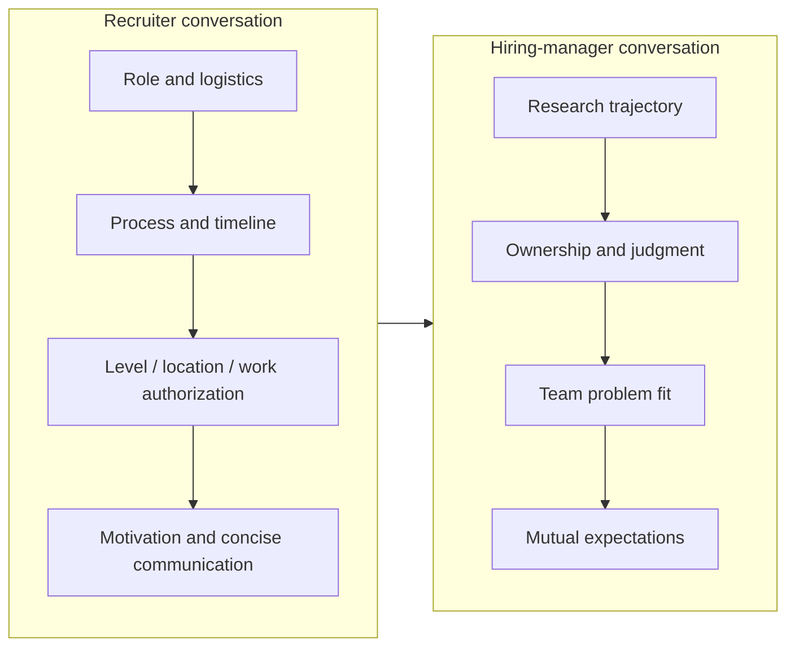
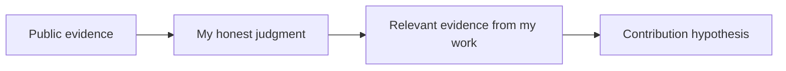

# Recruiter & Hiring-Manager Screens

first impressionwhy-usfitprocess verification

> [!TIP] 이 chapter가 존재하는 이유
> recruiter와 HM 대화는 목적이 다릅니다. recruiter는 이번 지원 건의 역할·일정·조건과 기본 fit을 맞추고, HM은 연구 궤적·ownership·팀 문제와의 접점을 봅니다. 두 대화를 구분하면 과도한 기술 설명이나 너무 이른 보상 협상을 피하면서, 뒤의 loop를 정확히 준비할 정보를 얻을 수 있습니다. 당일용 요약은 [폰 스크린 허브](#/process/phone-screens)에 있습니다.

> [!WARNING] 통화 이름만 보고 내용을 단정하지 마세요
> `intro`, `recruiter screen`, `HM chat`, `technical conversation` 같은 명칭은 회사마다 다릅니다. 초대장에 목적이 없으면 recruiter에게 면접관 역할, 평가 여부, 형식, 준비 자료를 확인하세요.

## 두 대화의 기본 목적

실제 순서와 평가 강도는 지원 건마다 다릅니다. recruiter가 기술 질문을 하거나 HM 통화가 full technical screen일 수도 있으므로, 통화 초반에 기대치를 맞추세요.

> “오늘 대화에서 제 배경과 역할 적합성을 중심으로 보면 될까요, 아니면 별도의 기술 평가나 준비할 자료가 있나요?”

## recruiter 대화 준비

| 질문 | 확인하려는 것 | 답변 방식 |
| --- | --- | --- |
| “배경을 소개해 주세요.” | 핵심을 짧게 설명하는가 | theme→대표 결과→다음 역할, 이력서 낭독 금지 |
| “무엇을 찾고 있나요?” | 역할·scope·location이 맞는가 | 문제 공간과 원하는 책임을 말하고 title에는 유연하게 |
| “왜 이 역할인가요?” | 무차별 지원이 아닌가 | 공개 JD/연구 근거 하나와 내 접점 |
| “언제 시작할 수 있나요?” | 실제 일정 제약 | 사실과 미확정 사항을 분리 |
| “location/work authorization은?” | 운영 가능성 | 현재 상태와 필요한 지원만 간결하게 |
| “comp 기대치는?” | band 정렬 | level·location·구성 확인 후 total package로 논의 |
| “다른 절차도 진행 중인가요?” | 일정 조율 | 실제 단계와 가장 이른 실제 deadline만 공유 |

현재 연봉이나 희망 보상에 관한 법·관행은 지역마다 다릅니다. 법률 판단을 단정하지 말고, 답변할 수 있는 범위에서 이번 role의 band와 scope로 대화를 돌리세요. 자세한 비교·면책은 [Offers, Levels & Negotiation](#/process/negotiation)에 있습니다.

### 이번 지원 건 확인 체크리스트

recruiter 통화의 가장 중요한 산출물은 <strong>날짜가 있는 process snapshot</strong>입니다.

- 대상 팀·조직·req ID와 특정 팀 채용/pooled hiring 여부.
- 다음 단계, 가능한 전체 순서, 각 단계의 목적.
- coding, ML coding, ML depth, system design, behavioral, job talk/take-home 포함 여부.
- 세션 형식과 예정 시간, 원격/대면, 시간대와 장소.
- coding 플랫폼·언어·실행 환경·외부 문서·autocomplete·생성형 AI 허용 정책.
- job talk/take-home의 주제, 청중, 제출물, 자료·도구 정책.
- team conversation, decision process, reference의 시점과 후보 동의 절차.
- title/level 범위, work location, employment entity, visa·relocation 지원.
- 예상 다음 연락 시점과 recruiter의 백업 연락처.

모르는 항목을 추측으로 채우지 말고 `미확인`으로 남긴 뒤 이메일로 재확인하세요. 전체 기록 양식은 [The RS/AS Pipeline](#/process/pipeline)에 있습니다.

## HM 대화: 깊이를 조절할 수 있는 research arc

HM 대화는 job talk 전체를 압축 낭독하는 시간이 아닙니다. 먼저 짧은 arc를 주고, HM이 당기는 hook에서 깊어집니다.

> [!EXAMPLE] 범용 research arc 템플릿
> “제 연구의 중심은 <strong>{문제 theme}</strong>입니다. 최근에는 <strong>{대표 프로젝트}</strong>에서 {내가 내린 핵심 결정}을 통해 <strong>{검증 가능한 결과/영향}</strong>을 만들었습니다. 이전의 {연결되는 경험}을 바탕으로 지금은 <strong>{다음 질문}</strong>을 탐구하고 있습니다. 이번 역할에서는 그 경험을 {JD의 구체적 문제/scope}에 연결하고 싶습니다.”

구조는 `theme → flagship의 내 결정과 영향 → trajectory → forward question → why here`입니다. 첫 답변은 대개 한두 분 안에 끝낼 수 있게 연습하되, 면접관의 요청과 통화 길이에 맞춰 줄이거나 늘립니다. 개인 프로젝트의 정확한 서사는 [Your CV → Interview Map](#/resume/overview), [이력서 기반 단계별 예시 답변](#/resume/interview-stage-answers), [예상 질문 & 답변](#/resume/predicted-questions)에서 관리하세요.

### HM이 파고들 때 보여줄 것

- **문제 선택:** 왜 중요한 문제였고 어떤 대안을 버렸는가.
- **개인 ownership:** 팀 결과와 내가 직접 내린 결정·구현·실험을 구분.
- **판단:** metric, baseline, ablation, failure mode를 어떻게 정했는가.
- **전이:** 연구 결과가 논문·제품·인프라 중 어디까지 갔는가.
- **미래 방향:** 현재 한계에서 자연스럽게 이어지는 다음 질문은 무엇인가.
- **팀 접점:** 이 팀에서 검증하고 싶은 가설이며, 내부 roadmap을 안다는 척하지 않는가.

## why us / why now / why leave

### Why us

공식 JD, 논문, 기술 블로그, 공개 제품 중 하나를 근거로 삼습니다.

> “{공개 자료}에서 {구체적 선택}이 인상적이었습니다. 제 {관련 경험}에서 {문제/제약}을 다뤘고, 이 역할에서는 {기여 가설}을 팀과 검증해 보고 싶습니다.”

회사 이름과 최신 모델명을 나열하는 것보다 <strong>읽은 근거 하나, 정직한 판단 하나, 내 증거 하나</strong>가 강합니다. 회사별 조사 항목은 고정 hook 목록 대신 [Company Playbooks](#/process/companies)의 dated snapshot으로 관리하세요.

### Why now

개인 경력의 전환점을 직무의 문제와 연결합니다. 학위 종료, 제품 전이 경험, 연구 주제의 성숙 같은 사실을 쓰되 “지금 아니면 안 된다”는 과장 대신 다음 단계에서 얻고 줄 수 있는 것을 설명합니다.

### Why leave

현재 조직을 공격하거나 보상만 이유로 만들지 않고, 앞으로 끌리는 문제와 scope를 중심으로 답합니다.

> “현재 역할에서 {배운 것/만든 것}을 얻었습니다. 다음 단계에서는 {더 넓거나 다른 책임/문제}를 일관된 agenda로 다루고 싶고, 이번 역할의 {공개된 scope}가 그 방향과 맞습니다.”

학업과 일을 병행하는 경우에는 추상적인 “문제없다”보다 일정·이해상충·업무 우선순위를 어떻게 관리하는지 사실대로 설명합니다. 회사 정책과 비자 조건은 recruiter에게 별도로 확인하세요.

## 초반 comp 질문

hard number를 먼저 고정하기보다 role, level, location과 package 구성을 확인합니다.

> “현재는 역할의 scope와 level을 정확히 맞추는 데 집중하고 있습니다. 이 req의 location별 band와 주요 구성요소를 공유해 주실 수 있을까요? 그 정보를 바탕으로 전체 패키지에 대해 구체적으로 논의하겠습니다.”

범위를 말해야 한다면 `통화`, `지역`, `level 가정`, `base/total package 구분`을 붙이세요. 시장 aggregate는 조회일과 한계를 기록하며, 실제 기준은 서면 offer입니다.

## HM에게 할 질문

- “첫 6–12개월에 이 역할이 독립적으로 소유할 문제와 성공 기준은 무엇인가요?”
- “팀의 결과는 논문, 제품, 인프라, 또는 그 조합 중 어떻게 평가되나요?”
- “research와 engineering/product 사이의 handoff와 ownership은 어떻게 나뉘나요?”
- “문제 선택, compute, data 접근은 어떤 원칙으로 결정되나요?”
- “publication/open-source 가능 범위와 실제 승인 과정은 어떻게 되나요?”
- “이 역할의 기대와 현재 제 경험 사이에서 가장 확인하고 싶은 부분은 무엇인가요?”

질문은 면접관이 이미 설명한 내용을 반복하지 말고, 답에 따라 자신의 fit 판단이 달라지는 것을 고르세요. 더 많은 선택지는 [Questions to Ask Them](#/playbook/questions-to-ask)에 있습니다.

## follow-up 대비

“팀 결과에서 본인이 직접 한 일은 무엇인가요?”

먼저 한 문장으로 ownership 경계를 긋고, `내 결정 → 대안 → 검증 → 팀과의 interface` 순으로 답하세요. “제가 다 했다”와 “우리가 했다” 사이에서 사실을 정확히 나누는 것이 핵심입니다.

“첫 해에 무엇을 하고 싶나요?”

내부 roadmap을 추측하지 마세요. 공개된 역할 문제와 내 lever를 연결한 <strong>가설</strong>로 답하고 HM에게 보정받습니다. “제가 이해한 scope가 맞다면 {첫 진단/실험}부터 시작하겠습니다. 현재 팀의 우선순위와 어떻게 다른가요?”

“가장 큰 성장 영역은?”

직무 핵심을 수행할 수 없다는 고백도, 장점으로 위장한 답도 피합니다. 실제 gap 하나, 최근 행동, 다음 검증 milestone을 말하세요.

## 통화 후 기록

- [ ] 날짜, 면접관 역할, 핵심 질문과 답을 기록했다.
- [ ] recruiter가 확인한 사실과 내가 추론한 내용을 분리했다.
- [ ] 단계·도구·자료·team matching·reference의 미확인 항목을 보냈다.
- [ ] HM이 반복한 문제·success metric·우려를 다음 라운드 준비에 반영했다.
- [ ] 감사 메일은 짧고 구체적으로, 새 주장이나 과도한 자기평가 없이 보냈다.

## Cheat-sheet

| 질문 | 한 줄 답 |
| --- | --- |
| Recruiter 목적 | 역할·조건·과정 정렬 + 날짜 있는 snapshot 확보 |
| HM 목적 | 궤적·ownership·판단·팀 문제 접점 확인 |
| Self-summary | theme→내 결정/영향→trajectory→why here |
| Why-us | 공개 근거 하나 + 판단 + 내 증거 + 기여 가설 |
| Why-leave | 현재 조직 비난 없이 다음 문제와 scope로 설명 |
| Comp 초반 | level/location/band를 확인하고 total package로 논의 |
| 도구·절차 | 회사 lore가 아니라 이번 invitation/recruiter 답변으로 확인 |
| 개인 서사 | 범용 chapter에 복제하지 않고 resume packet으로 연결 |

**Related:** [Phone Screens](#/process/phone-screens) · [The RS/AS Pipeline](#/process/pipeline) · [Company Playbooks](#/process/companies) · [Offers & Negotiation](#/process/negotiation) · [The Research Job Talk](#/research/job-talk) · [Your CV → Interview Map](#/resume/overview) · [이력서 기반 단계별 예시 답변](#/resume/interview-stage-answers) · [Questions to Ask Them](#/playbook/questions-to-ask)
