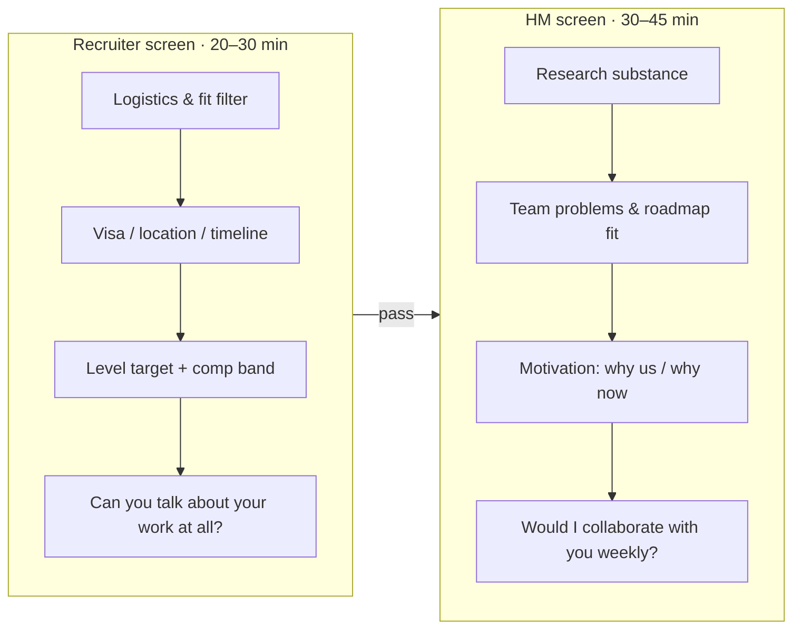
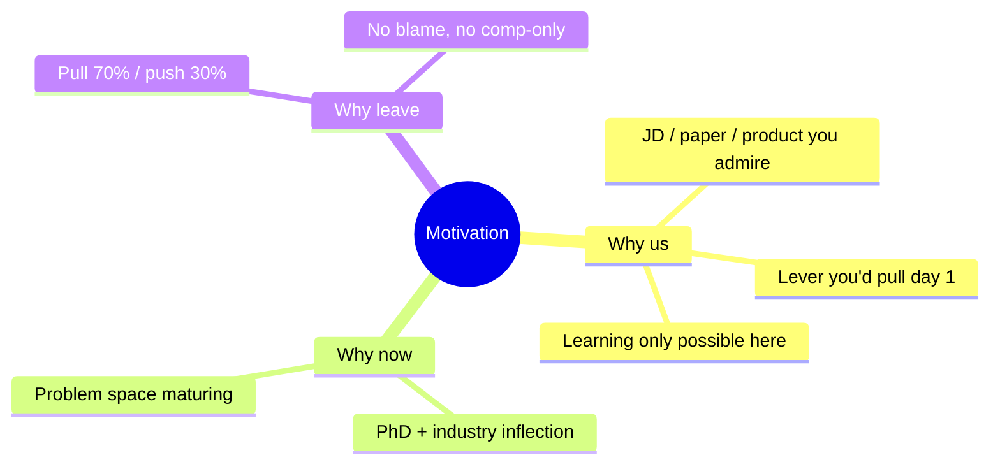

# Recruiter & Hiring-Manager Screens

first impressionwhy-usfit gatingquestions to ask

> [!TIP] 이 chapter가 존재하는 이유
> 이 둘은 loop에서 **기술적 난이도는 가장 낮고, leverage는 가장 높은** 대화입니다. recruiter screen은 offer를 따내는 일은 드물지만, 허술한 logistics로 후보 자격을 *끝내는* 일은 잦습니다. HM screen은 senior+ 레벨에서 점점 *게이팅 라운드*가 되고 있습니다 — "이 사람을 몇 년간 내 팀에 두고 싶은가?" 둘 다 거의 대본 수준의 신뢰도로 준비할 수 있고, 이게 전체 과정에서 최고의 ROI입니다.

## 두 screen, 두 가지 일

<dl class="kv">
<dt>Recruiter</dt><dd>기술 필터가 아니다 — 하지만 여기서의 허술한 답변이 이걸 <b>끝낼 수 있다</b>. 그들은 이걸 보정한다: 자기 published work를 두 문장으로 말할 수 있는지, visa/location이 가능한지, 무슨 level인지, comp 기대치가 밴드 안인지, timeline이 진짜인지.</dd>
<dt>Hiring manager</dt><dd>동료 수준의 research 대화. 그들은 당신의 <b>research 궤적</b>, 당신의 관심이 *활성* 팀 문제에 매핑되는지, 그리고 동기를 파고든다. senior 레벨에서 팀은 1–2개의 자리를 갖고 정확한 fit으로 채용하므로, 여기서 "강하지만 fit이 안 맞음"이 걸러진다.</dd>
</dl>

## recruiter screen: 그들이 파고드는 것

| 그들이 묻는 것 | 실제로 확인하는 것 | 강한 수 |
| --- | --- | --- |
| "배경을 말해주세요." | 자기를 간결하게 요약할 수 있나? | 60–90초 arc, 이력서 낭독이 아니라(아래 참조) |
| "무엇을 찾고 있나요?" | Role/level/location의 현실성 | 문제 공간 + level 범위를 짚되, 유연하게 |
| "Visa / relocation / start date?" | 라운드 투자 전 blocker | 사실대로, 과잉 설명 없이 |
| "Comp 기대치?" | 밴드 안인가? | *범위* / total-comp 프레이밍으로 부드럽게 넘기기 |
| "다른 데도 면접 보나요?" | 긴급성 + leverage | 네, 동시 프로세스 중 — 정상, 가장 이른 실제 마감일을 공유 |

> [!WARNING] recruiter-screen 자책골 세 가지
> 1. **현재 연봉을 먼저 자진 공개** — 당신을 낮게 anchor한다; market range로 리다이렉트. 2. **일반적인 "왜 여기"** — 마구잡이 지원처럼 읽힌다. 3. **프로세스 질문 제로** — 낮은 관심을 신호하고 loop를 파악할 최고의 기회를 날린다.

### recruiter 질문 체크리스트를 소진하세요

recruiter는 이 질문들에 답하고 *싶어* 합니다 — 그게 그들의 일이고, 당신을 진지해 보이게 합니다.

- Process: phone screen 이후 몇 라운드? Virtual인가 onsite인가? 어떤 라운드 유형(coding / ML coding / system design / job talk)? coding에서 AI 도구 / code execution이 허용되나? Central Hiring Committee인가 HM-final인가?
- Team/role: 특정 팀인가 pooled hiring인가? Team matching이 있나 — offer 전인가 후인가? 팀의 최근 방향과 product surface는? Publication / open-source 정책? Compute & data access?
- Level/comp/visa: 이 req의 level 범위는? comp는 어느 단계에서 논의되나? Visa/relocation 지원? Reference-check 시점과 형식?

## HM screen: 고수준 이야기이지, deep-dive가 아니다

실수는 HM screen을 [job talk](#/research/job-talk)처럼 다루는 것입니다. 그게 아닙니다 — *대화*입니다. 기술적 depth를 갈 수 있는 것보다 **한 겹 얕게** 유지하고, 매니저가 깊이 들어가라는 신호를 주는지 살피세요.

### 자기 연구를 올바른 고도로 이야기하기

> [!EXAMPLE] 60–90초 research arc (Beomyoung, 예시)
> "제 연구는 *정밀한* vision과 *grounded* multimodal reasoning의 경계에 있습니다. 저는 **ZIM**, promptable zero-shot matting foundation model — ICCV 2025 Highlight — 을 이끌었고 이를 CLOVA-X image editing에 실었습니다. 그 전에는 label-efficient/continual segmentation에 관한 일련의 first-author CVPR 연구가 있습니다. 지금은 pixel- 및 region-level 근거에 language reasoning을 붙이는 **grounded VLM**과 **training-free visual-reasoning agent**를 만들고 있습니다. 그 research-to-product 루프가 더 큰 스케일로 도는 팀을 찾고 있습니다."

형태에 주목하세요: **theme → flagship (impact + venue) → trajectory → forward motion → what I want here.** 화이트보드가 필요한 jargon은 없고; 모든 절이 HM이 당길 수 있는 hook입니다.

### "Why us / why now / why leave" — 세 가지 동기 질문

**Why-us 골격(외우고, 가운데만 바꾸세요):**
> (1) 내가 다루는 문제의 궤적 → (2) *이 팀*이 세계 최고인 지점(실제 JD 문구 / 논문 / 제품을 인용) → (3) 내가 즉시 당길 lever → (4) 여기서만 가능한 배움.

**Why-leave — 민감한 것.** **push가 아니라 pull**로 프레임하세요(~70/30). 절대 현재 팀을 탓하거나 comp-only로 만들지 마세요.
> "NAVER Cloud에서 많이 성장했고 — ZIM을 이끌고 실었습니다 — 이제 그 방향에 맞는 agenda를 가진 팀과 함께 더 큰 스케일에서 multimodal/generative research를 밀어붙이는 쪽을 바라보고 있습니다. 부정적인 이야기가 아니라 문제 공간으로의 당김입니다."

**Part-time PhD, 물어보면:**
> "명확한 주간 스케줄을 운영하고; 업무 deliverable은 일급으로 유지됩니다. 업계와 PhD가 서로 강화하도록 research 주제를 의도적으로 정렬하고 있습니다."

> [!DANGER] 말하지 마세요
> "매니저가 되고 싶어요"(IC req에서) · 지도교수/회사에 대한 긴 불만 · "돈이 주된 이유예요" · 회사의 *미공개* 제품에 대한 추측(특히 Apple).

### 자신을 가두지 않고 comp 기대치 말하기

초반에 hard number를 **절대** 대지 마세요. 스크립트:
> "저는 유연하고 role, team, growth에 집중하고 있습니다. total comp는 {location}에서 이 level의 RS/AS market band에 맞춰 보정하고 있습니다. leveling을 이해하면 기꺼이 구체적으로 말하겠습니다 — 이 role은 보통 어느 밴드에 들어가나요?"

location별로 **분리된** target/walk-away 범위를 유지하세요(US 대 Singapore 대 Seoul은 통화, RSU, relocation이 다릅니다). 자세한 내용은 [Negotiation](#/process/negotiation).

## 회사별 "why-us" hook

각각 한 줄, 공개된 JD 언어 / 발표된 연구에 근거하되 — 유출된 내부 정보는 절대 아니게.

| Company | Why-us 각도 | 앞세울 프로젝트 |
| --- | --- | --- |
| **Meta / FAIR** | Product 스케일에서의 multimodal reasoning + generation; milestone을 동반한 장기 목표; open-sourcing | ZIM + grounded VLM |
| **Apple** | 프라이버시 + on-device 효율 제약 아래 ship되는 foundation-model 연구 | On-device seg + ZIM |
| **NVIDIA** | Research 목표로서의 generative/efficient AI; 일급 과학적 목표로서의 효율; GPU co-design | ZIM deploy + multi-node training |
| **Adobe** | Creative Cloud / Firefly로 전이되는 editing-quality generative vision | ZIM + CLOVA-X editing |
| **ByteDance Seed** | Product token-scale에서의 visual foundation *generative* model | ZIM (SAM 계보) → generative intent |
| **Mistral** | Full-stack: frontier model → 고객 시스템; 깔끔하고 shipped된 코드; open-weights 신념 | Research-to-product 루프 + code ownership |
| **Microsoft / MSR** | Agentic AI + systems; agent의 perception layer로서의 multimodal grounding | Grounded VLM + visual agents |

> [!NOTE] 사전 조사를 하세요
> 각 HM screen마다, 그 org의 최근 공개 논문/모델을 **하나** 읽고 정직한 한 문장을 준비하세요: *"저는 ___를 존경했는데, 그 이유는 ___입니다."* 그게 여러분이 실제로 *이 팀*을 원한다는 가장 값싸고 신뢰할 수 있는 signal입니다.

"자, 자기소개를 해보세요." — 얼마나 깊이 들어가나요?

**짧게:** 60–90초, 리스트가 아니라 arc, *이* 팀인 이유로 끝내기. 그다음 멈추고 그들이 이끌게 두세요.

**깊게:** 실패 모드는 3분을 태우고 HM을 disengage하게 만드는 연대기적 이력서 낭독입니다. 여러분 연구를 통합하는 *theme*으로 시작하고, flagship 하나를 impact *와* venue와 함께 짚고, 궤적을 스케치하고, hook을 건네세요. 매니저는 자기 관심을 끄는 것을 당깁니다 — 그 당김이 *곧* 면접입니다. 과잉 설명은 그 통제권을 날립니다. [resume walkthrough](#/resume/overview)를 3분과 8분 버전으로 연습해서 그들의 신호에 맞춰 유연하게 조절하세요.

Hiring manager에게 무엇을 물어야 하나요?

**짧게:** 그냥 일자리를 구하는 게 아니라 *fit과 impact*를 평가하고 있음을 드러내는 질문을 하세요.

**깊게:** 강한 HM-라운드 질문:
- "팀의 12개월 성공은 논문으로, 제품으로, 아니면 둘 다로 정의되나요?"
- "여기서 research → engineering 인계는 어떻게 이뤄지나요?"
- "새 scientist가 보통 첫 6개월에 어떤 milestone을 맡나요?"
- "Compute와 data access는 어떻게 할당되나요?"
- "Publication / open-source 정책이 실제로는 어떤 모습인가요?"

Mistral-specific: "customer-project 시간 대 internal foundation work의 비율은 어떻게 되나요?" 이것들은 *여러분의* 실사이자 진지함의 증거로 이중으로 작동합니다. [Questions to Ask Them](#/playbook/questions-to-ask) 참조.

### 첫 답변 후 follow-up

- *"'we'를 많이 말하셨는데 — ZIM에서 **당신**이 구체적으로 뭘 했나요?"* 간결한 I-vs-we 구분을 준비해 두세요(당신이 주도한 architecture/loss/data-pipeline 결정). 이건 [job talk](#/research/job-talk)의 예고편입니다.
- *"여기서 첫 해에 무엇을 하고 싶나요?"* 구체적인 팀 문제를 당신이 이미 가진 lever에 묶으세요 — 그들의 roadmap을 당신 기술에 매핑했음을 보여줍니다.
- *"지금 researcher로서 가장 큰 약점은?"* 진짜 약점 하나를 성장 계획과 함께 짚으세요(예: 실험을 수천 개 GPU로 스케일하기), humblebrag이 아니라.

## Cheat-sheet

| 질문 | 한 줄 답 |
| --- | --- |
| Recruiter의 일 | Logistics + fit filter; 허술한 답이 *끝내고*, 좋은 답이 loop를 *파악* |
| HM의 일 | "매주 협업하고 싶은가?" — senior 레벨에서 게이팅 |
| Self-summary | 60–90초 arc: theme → flagship(impact+venue) → trajectory → why-here |
| Why-leave | Pull 70 / push 30; 남 탓 없이, comp-only 없이 |
| Comp 초반 | Market range + total-comp로 넘기고; role이 어느 밴드인지 되묻기 |
| Altitude | HM screen = job talk보다 한 겹 얕게; 깊이 들어가라는 신호를 살피기 |
| 사전 조사 | Org당 최근 논문/모델 하나 → 정직한 "I admired ___" 한 줄 |
| 항상 되묻기 | Process, team, level — 체크리스트를 소진 |

**Related:** [The RS/AS Pipeline](#/process/pipeline) · [Company Playbooks](#/process/companies) · [Offers & Negotiation](#/process/negotiation) · [The Research Job Talk](#/research/job-talk) · [STAR & Story Bank](#/behavioral/star) · [Your CV → Interview Map](#/resume/overview) · [Questions to Ask Them](#/playbook/questions-to-ask)
