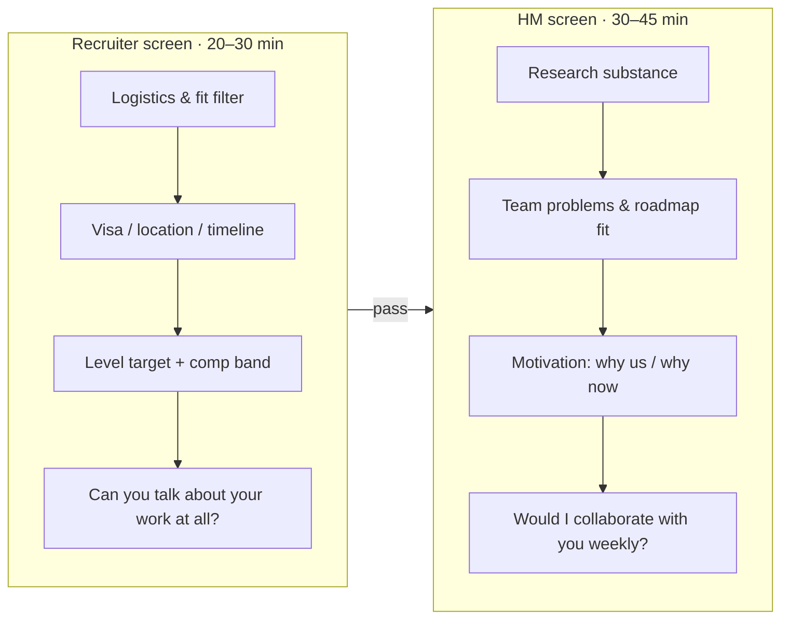
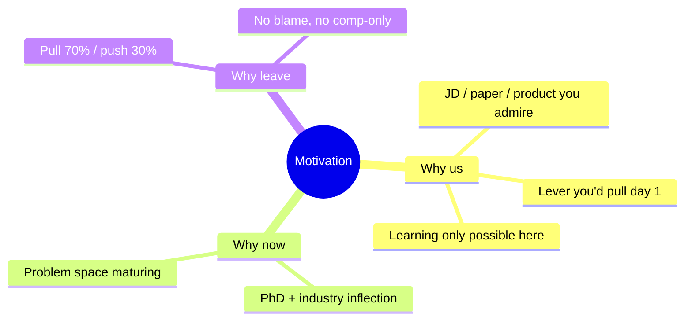

# Recruiter & Hiring-Manager Screens

first impressionwhy-usfit gatingquestions to ask

> [!TIP] Why this chapter exists
> These are the two **lowest-technical, highest-leverage** conversations in the loop. The recruiter screen rarely gets you an offer but frequently *ends* a candidacy through sloppy logistics. The HM screen, at senior+ levels, is increasingly *the gating round* — "do I want this person on my team for years?" You can prepare both to near-scripted reliability, which is the best ROI in the whole process.

## Two screens, two jobs

<dl class="kv">
<dt>Recruiter</dt><dd>Not a technical filter — but sloppy answers here <b>can</b> end it. They calibrate: can you articulate your own published work in two sentences, is your visa/location workable, what level are you, are your comp expectations in-band, and is your timeline real.</dd>
<dt>Hiring manager</dt><dd>A peer-level research conversation. They probe your <b>research trajectory</b>, whether your interests map to an *active* team problem, and your motivation. At senior levels teams have 1–2 openings and hire for exact fit, so this is where "strong but off-fit" gets filtered.</dd>
</dl>

## The recruiter screen: what they probe

| They ask | What they're really checking | Strong move |
| --- | --- | --- |
| "Walk me through your background." | Can you self-summarize crisply? | 60–90 s arc, not a résumé readout (see below) |
| "What are you looking for?" | Role/level/location realism | Name the problem space + level range, stay flexible |
| "Visa / relocation / start date?" | Blockers before investing rounds | Answer factually, no over-explaining |
| "Comp expectations?" | Are you in-band? | Deflect gently to a *range* / total-comp framing |
| "Are you interviewing elsewhere?" | Urgency + leverage | Yes, in concurrent processes — normal, share earliest real deadline |

> [!WARNING] Three recruiter-screen own-goals
> 1. **Volunteering your current salary first** — anchors you low; redirect to a market range. 2. **A generic "why here"** — reads as spray-and-pray applications. 3. **Asking zero process questions** — signals low interest and forfeits your best chance to map the loop.

### Exhaust your recruiter question checklist

The recruiter *wants* to answer these — it's their job, and it makes you look serious.

- Process: How many rounds after the phone screen? Virtual or onsite? Which round types (coding / ML coding / system design / job talk)? Are AI tools / code execution allowed in coding? Central Hiring Committee or HM-final?
- Team/role: Is this a specific team or pooled hiring? Is there team matching — before or after the offer? What's the team's recent direction and product surface? Publication / open-source policy? Compute & data access?
- Level/comp/visa: What level range is this req? At what stage is comp discussed? Visa/relocation support? Reference-check timing and format?

## The HM screen: high-level story, not a deep-dive

The mistake is treating the HM screen like the [job talk](#/research/job-talk). It isn't — it's a *conversation*. Keep technical depth **one layer shallower** than you could go, and watch for the manager's cue to dive.

### Talk about your work at the right altitude

> [!EXAMPLE] The 60–90-second research arc (Beomyoung, illustrative)
> "My work sits at the boundary of *precise* vision and *grounded* multimodal reasoning. I led **ZIM**, a promptable zero-shot matting foundation model — an ICCV 2025 Highlight — and shipped it into CLOVA-X image editing. Before that, a line of first-author CVPR work on label-efficient and continual segmentation. Now I'm building **grounded VLMs** and **training-free visual-reasoning agents** that attach language reasoning to pixel- and region-level evidence. I'm looking for a team where that research-to-product loop runs at larger scale."

Notice the shape: **theme → flagship (impact + venue) → trajectory → forward motion → what I want here.** No jargon that needs a whiteboard; every clause is a hook the HM can pull on.

### "Why us / why now / why leave" — the three motivation questions

**Why-us skeleton (memorize, swap the middle):**
> (1) the trajectory of the problem I work on → (2) where *this team* is world-class (cite a real JD line / paper / product) → (3) the lever I'd pull immediately → (4) the learning only possible here.

**Why-leave — the sensitive one.** Frame as **pull, not push** (~70/30). Never blame your current team or make it comp-only.
> "I've grown a lot at NAVER Cloud — led ZIM and shipped it — and I'm looking ahead to pushing multimodal/generative research at a larger scale with a team whose agenda matches that direction. It's a pull toward the problem space, not a negative story."

**Part-time PhD, if asked:**
> "I run a clear weekly schedule; work deliverables stay first-class. I'm deliberately aligning research topics so industry and PhD reinforce each other."

> [!DANGER] Don't say
> "I want to become a manager" (in an IC req) · a long grievance about your advisor/company · "money is the main reason" · speculating about a company's *unreleased* products (especially Apple).

### Comp expectations without boxing yourself in

Do **not** name a hard number early. Script:
> "I'm flexible and focused on the role, team, and growth. For total comp I'm calibrating to the market band for RS/AS at this level in {location}. Happy to get specific once I understand leveling — what band does this role typically fall in?"

Keep **separate** target/walk-away ranges per location (US vs Singapore vs Seoul differ in currency, RSU, relocation). Details in [Negotiation](#/process/negotiation).

## Company-specific "why-us" hooks

One line each, grounded in public JD language / released work — never in leaked internals.

| Company | Why-us angle | Project to lead with |
| --- | --- | --- |
| **Meta / FAIR** | Multimodal reasoning + generation at product scale; long-term goals w/ milestones; open-sourcing | ZIM + grounded VLM |
| **Apple** | Foundation-model research that ships under privacy + on-device efficiency constraints | On-device seg + ZIM |
| **NVIDIA** | Generative/efficient AI as a research goal; efficiency as a first-class scientific objective; GPU co-design | ZIM deploy + multi-node training |
| **Adobe** | Editing-quality generative vision that transfers to Creative Cloud / Firefly | ZIM + CLOVA-X editing |
| **ByteDance Seed** | Visual foundation *generative* models at product token-scale | ZIM (SAM lineage) → generative intent |
| **Mistral** | Full-stack: frontier models → customer systems; clean, shipped code; open-weights conviction | Research-to-product loop + code ownership |
| **Microsoft / MSR** | Agentic AI + systems; multimodal grounding as an agent's perception layer | Grounded VLM + visual agents |

> [!NOTE] Do the reading
> For each HM screen, read **one** recent public paper/model from that org and prepare a single honest sentence: *"I admired ___ because ___."* It's the cheapest, most reliable signal that you actually want *this* team.

"So, tell me about yourself." — how deep do I go?

**Short:** 60–90 seconds, arc not list, end on why *this* team. Then stop and let them steer.

**Deep:** The failure mode is a chronological résumé readout that burns three minutes and lets the HM disengage. Lead with the *theme* that unifies your work, name one flagship with its impact *and* venue, sketch the trajectory, and hand them hooks. Managers pull on whatever interests them — that pull *is* the interview. Over-explaining forfeits that control. Practice the [resume walkthrough](#/resume/overview) in 3-min and 8-min versions so you can flex to their cue.

What should I ask the hiring manager?

**Short:** Ask questions that reveal you're evaluating *fit and impact*, not just seeking a job.

**Deep:** Strong HM-round questions:
- "Is the team's 12-month success defined by papers, product, or both?"
- "How does the research → engineering handoff work here?"
- "What milestone does a new scientist typically own in the first 6 months?"
- "How is compute and data access allocated?"
- "What does the publication / open-source policy look like in practice?"

Mistral-specific: "What's the ratio of customer-project time to internal foundation work?" These double as *your* diligence and as evidence of seriousness. See [Questions to Ask Them](#/playbook/questions-to-ask).

### Follow-ups after your first answer

- *"You said 'we' a lot — what did **you** specifically do on ZIM?"* Have the crisp I-vs-we split ready (architecture/loss/data-pipeline decisions you drove). This previews the [job talk](#/research/job-talk).
- *"What would you want to work on in your first year here?"* Tie a concrete team problem to a lever you already have — shows you've mapped their roadmap onto your skills.
- *"What's your biggest weakness as a researcher right now?"* Name a real one with a growth plan (e.g., scaling experiments to 1000s of GPUs), not a humblebrag.

## Cheat-sheet

| Ask | One-liner |
| --- | --- |
| Recruiter's job | Logistics + fit filter; sloppy answers *end* it, good answers *map* the loop |
| HM's job | "Would I collaborate weekly?" — gating at senior levels |
| Self-summary | 60–90 s arc: theme → flagship (impact+venue) → trajectory → why-here |
| Why-leave | Pull 70 / push 30; no blame, no comp-only |
| Comp early | Deflect to market range + total-comp; ask what band the role is |
| Altitude | HM screen = one layer shallower than the job talk; watch for the dive cue |
| Do the reading | One recent paper/model per org → one honest "I admired ___" line |
| Always ask back | Process, team, level — exhaust the checklist |

**Related:** [The RS/AS Pipeline](#/process/pipeline) · [Company Playbooks](#/process/companies) · [Offers & Negotiation](#/process/negotiation) · [The Research Job Talk](#/research/job-talk) · [STAR & Story Bank](#/behavioral/star) · [Your CV → Interview Map](#/resume/overview) · [Questions to Ask Them](#/playbook/questions-to-ask)
