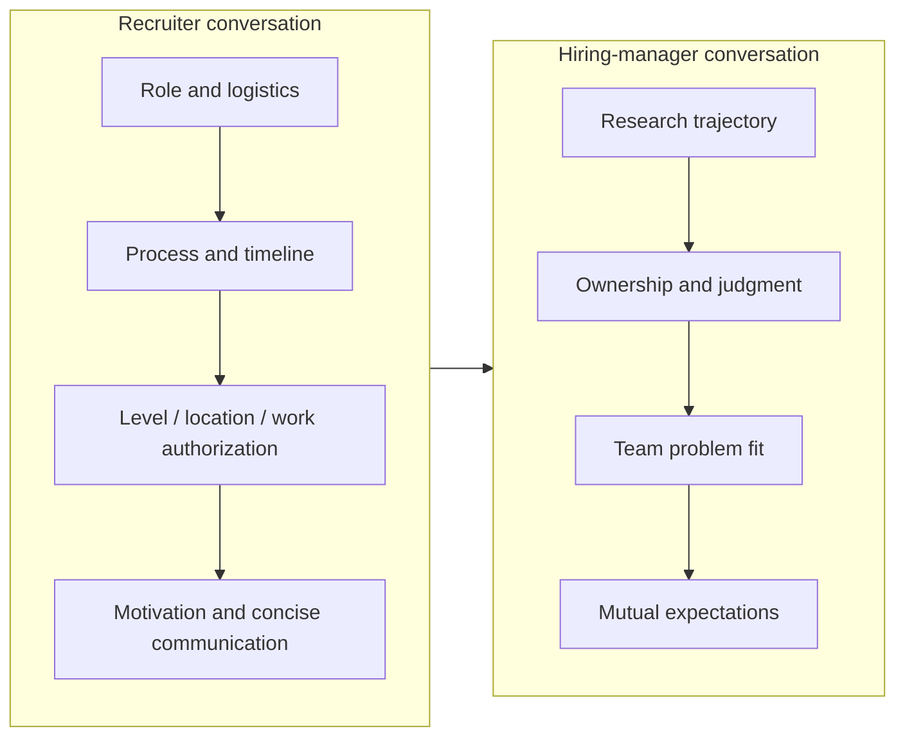
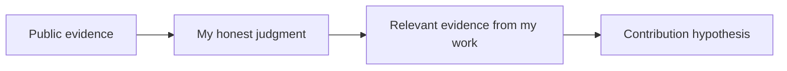

# Recruiter & Hiring-Manager Screens

first impressionwhy-usfitprocess verification

> [!TIP] Why this chapter exists
> Recruiter and HM conversations serve different purposes. A recruiter aligns the role, timeline, terms, and basic fit for this application; an HM examines research trajectory, ownership, and connection to the team's problems. Distinguishing the two lets you avoid excessive technical explanation or premature compensation negotiation while gathering the information needed to prepare accurately for the later loop. The day-of summary is in the [phone-screen hub](#/process/phone-screens).

> [!WARNING] Do not infer content from the call's name alone
> Labels such as `intro`, `recruiter screen`, `HM chat`, and `technical conversation` mean different things at different companies. If the invitation does not state the purpose, ask the recruiter about the interviewer's role, whether the call is evaluative, its format, and any materials to prepare.

## The basic purpose of each conversation

The actual order and evaluation intensity differ by application. A recruiter may ask technical questions, or an HM call may be a full technical screen, so align expectations at the beginning of the call.

> “Should we focus today's conversation on my background and fit for the role, or is there a separate technical evaluation or any material I should prepare?”

## Preparing for the recruiter conversation

| Question | What it checks | How to answer |
| --- | --- | --- |
| “Could you introduce your background?” | Can you explain the core concisely? | Theme → representative result → next role; do not recite the resume |
| “What are you looking for?” | Do the role, scope, and location align? | State the problem space and desired responsibility; stay flexible on title |
| “Why this role?” | Is this more than indiscriminate applying? | One public JD/research source and your point of connection |
| “When can you start?” | Real scheduling constraints | Separate confirmed facts from unresolved items |
| “What is your location/work authorization?” | Operational feasibility | State only your current status and support needed, concisely |
| “What are your compensation expectations?” | Band alignment | Confirm level, location, and components, then discuss the total package |
| “Are you in other processes?” | Timeline coordination | Share only actual stages and the earliest real deadline |

Laws and practices concerning current salary or compensation expectations vary by region. Do not make categorical legal claims; within what you can answer, redirect the conversation to this role's band and scope. See [Offers, Levels & Negotiation](#/process/negotiation) for detailed comparisons and disclaimers.

### Checklist for this application

The most important output of the recruiter conversation is a <strong>dated process snapshot</strong>.

- Target team, organization, and req ID, plus whether this is specific-team or pooled hiring.
- The next stage, possible overall sequence, and purpose of each stage.
- Whether coding, ML coding, ML depth, system design, behavioral, and a job talk/take-home are included.
- Session format and scheduled duration, remote or in person, time zone, and location.
- Coding platform, language, execution environment, and policies for external documentation, autocomplete, and generative AI.
- Job-talk/take-home topic, audience, deliverable, and resource/tool policy.
- Timing and candidate-consent process for team conversations, decision processes, and references.
- Title/level range, work location, employing entity, and visa or relocation support.
- Expected next-contact date and the recruiter's backup contact.

Do not fill unknown fields with guesses. Leave them as `unverified` and reconfirm by email. The complete record template is in [The RS/AS Pipeline](#/process/pipeline).

## HM conversation: a research arc with adjustable depth

An HM conversation is not the time to recite your entire job talk in compressed form. Start with a short arc, then go deeper at the hook the HM pulls on.

> [!EXAMPLE] Generic research-arc template
> “The central theme of my research is <strong>{problem theme}</strong>. Most recently, in <strong>{representative project}</strong>, I made {key decision I made} and produced <strong>{verifiable result/impact}</strong>. Building on {connected prior experience}, I am now exploring <strong>{next question}</strong>. In this role, I would like to connect that experience to {specific problem/scope from the JD}.”

The structure is `theme → my decision and impact in the flagship work → trajectory → forward question → why here`. Practice finishing the initial answer within roughly one or two minutes, while shortening or expanding it for the interviewer's request and the call length. Maintain the exact narratives for personal projects in [Your CV → Interview Map](#/resume/overview), [Stage-by-Stage Resume Answers](#/resume/interview-stage-answers), and [Predicted Questions & Answers](#/resume/predicted-questions).

### What to show when the HM digs deeper

- **Problem selection:** Why did the problem matter, and which alternatives did you reject?
- **Personal ownership:** Separate the team's result from decisions, implementation, and experiments you personally owned.
- **Judgment:** How did you select metrics, baselines, ablations, and failure modes?
- **Transfer:** How far did the research result reach—paper, product, or infrastructure?
- **Future direction:** What next question follows naturally from the current limitation?
- **Team connection:** Is this a hypothesis you want to test with the team, without pretending to know its internal roadmap?

## Why us / why now / why leave

### Why us

Use one official JD, paper, technical blog, or public product as evidence.

> “In {public source}, I was impressed by {specific choice}. In my {relevant experience}, I worked with {problem/constraint}, and in this role I would like to test {contribution hypothesis} with the team.”

Compared with listing company names and recent model names, <strong>one source you read, one honest judgment, and one piece of your evidence</strong> are stronger. Maintain company-specific research in the dated snapshot in [Company Playbooks](#/process/companies), not as a fixed list of hooks.

### Why now

Connect a turning point in your career to the role's problem. Use facts such as degree completion, experience transferring work into a product, or maturation of a research topic; instead of exaggerating that it “must be now,” explain what you can contribute and gain in the next step.

### Why leave

Do not attack your current organization or make compensation the only reason. Center the answer on the problems and scope drawing you forward.

> “In my current role, I gained {what I learned/built}. In the next step, I want to address {broader or different responsibility/problem} as a coherent agenda, and this role's {publicly stated scope} aligns with that direction.”

If you are combining study and work, explain factually how you manage schedule, conflicts of interest, and work priorities instead of offering an abstract “there is no problem.” Verify company policy and visa conditions separately with the recruiter.

## Early compensation questions

Rather than anchoring on a hard number first, verify the role, level, location, and package composition.

> “For now, I am focused on aligning accurately on the role's scope and level. Could you share the location-specific band and main components for this req? With that context, I can discuss the complete package concretely.”

If you must give a range, attach the `currency`, `region`, `level assumption`, and `base/total-package distinction`. Record the access date and limitations of market aggregates; the written offer is the actual authority.

## Questions to ask the HM

- “What problems would this role own independently in the first 6–12 months, and what would success look like?”
- “How are team outcomes evaluated across papers, products, infrastructure, or a combination of them?”
- “How are handoff and ownership divided between research and engineering/product?”
- “What principles guide problem selection and access to compute and data?”
- “What scope of publication/open-source work is possible, and what does the actual approval process look like?”
- “What would you most want to validate about the fit between this role's expectations and my current experience?”

Do not repeat something the interviewer has already explained. Choose questions whose answers would change your own fit assessment. See [Questions to Ask Them](#/playbook/questions-to-ask) for more options.

## Follow-up preparation

“What did you personally do in the team's result?”

First draw the ownership boundary in one sentence, then answer in the order `my decision → alternatives → validation → interface with the team`. The key is to divide the facts accurately between “I did everything” and “we did it.”

“What would you like to do in your first year?”

Do not speculate about the internal roadmap. Answer with a <strong>hypothesis</strong> connecting the public role problem to your lever, then ask the HM to correct it. “If I understand the scope correctly, I would start with {first diagnosis/experiment}. How does that differ from the team's current priorities?”

“What is your biggest growth area?”

Avoid both admitting that you cannot perform a core responsibility and disguising a strength as an answer. State one real gap, a recent action, and the next validation milestone.

## After-call record

- [ ] I recorded the date, interviewer's role, and key questions and answers.
- [ ] I separated recruiter-confirmed facts from my inferences.
- [ ] I sent questions about unverified stages, tools, materials, team matching, and references.
- [ ] I incorporated problems, success metrics, and concerns the HM repeated into preparation for the next round.
- [ ] I sent a short, specific thank-you email without new claims or excessive self-evaluation.

## Cheat Sheet

| Question | One-line answer |
| --- | --- |
| Recruiter purpose | Align role, terms, and process + obtain a dated snapshot |
| HM purpose | Examine trajectory, ownership, judgment, and connection to team problems |
| Self-summary | Theme → my decision/impact → trajectory → why here |
| Why-us | One public source + judgment + my evidence + contribution hypothesis |
| Why-leave | Explain through the next problem and scope, without attacking the current organization |
| Compensation early | Verify level/location/band and discuss the total package |
| Tools and process | Verify with this invitation/recruiter response, not company lore |
| Personal narrative | Link to the resume packet rather than duplicating it in generic chapters |

**Related:** [Phone Screens](#/process/phone-screens) · [The RS/AS Pipeline](#/process/pipeline) · [Company Playbooks](#/process/companies) · [Offers & Negotiation](#/process/negotiation) · [The Research Job Talk](#/research/job-talk) · [Your CV → Interview Map](#/resume/overview) · [Stage-by-Stage Resume Answers](#/resume/interview-stage-answers) · [Questions to Ask Them](#/playbook/questions-to-ask)
