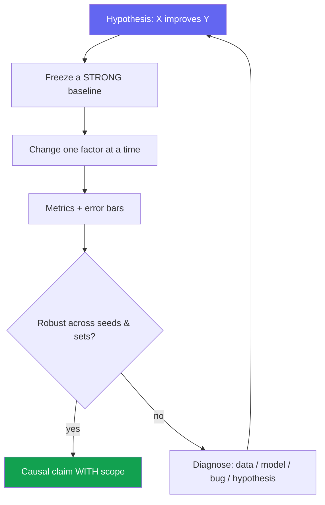
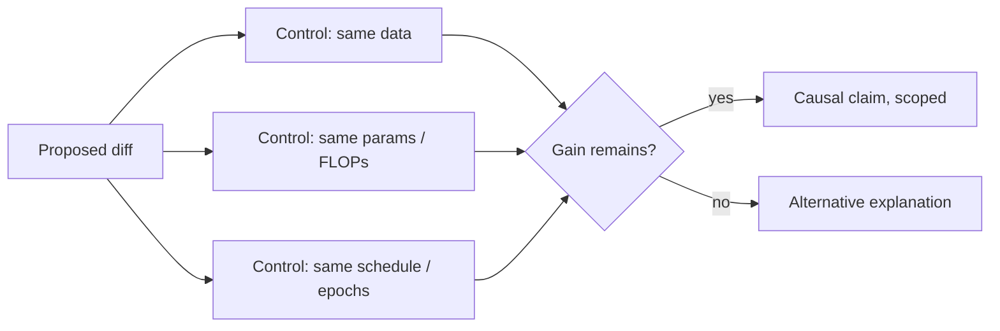

# Experiment Design & Ablations

<div class="tag-row"><span class="tag">hypothesis-driven</span><span class="tag">ablation discipline</span><span class="tag">controls & confounders</span><span class="tag">seeds & significance</span><span class="tag">compute budget</span></div>

> [!TIP] 질문 뒤의 질문
> RS/AS 면접에서는 아이디어의 매력과 함께 <strong>“이 변경이 개선의 원인임을 어떻게 아는가?”라는 질문</strong>을 자주 던집니다. 강한 답변은 hypothesis → 재현 가능한 baseline → matched comparison/factorial design → confounder 통제 → uncertainty → claim scope를 잇습니다. 이 장은 [Debugging & Experimentation](#/foundations/debugging-experimentation)의 research 측 짝입니다.



## Start from a falsifiable hypothesis

무엇이든 돌리기 *전에* claim을 **예측된 방향을 가진 한 문장**으로 쓰세요: "*A matting-oriented decoder head recovers soft boundary structure that a binary-mask head cannot, improving Grad/Conn error at fixed data.*" 반증할 수 없는 hypothesis는 실험이 아니라 데모입니다.

<details class="qa"><summary>"How do you design an experiment to test a research idea?"</summary>
<div class="qa-body">

**Short:** hypothesis와 그것을 *반증할* metric을 명시; 강한 baseline을 고정; 정확히 한 factor만 토글; 효과가 seed와 out-of-domain set에서 살아남는지 확인; 그다음 실제로 측정한 것에 claim의 범위를 한정.

**Deep:** 순서가 중요합니다. 성공/실패 *threshold*를 먼저 정의하세요(나중에 합리화할 수 없도록). Primary metric과 secondary 1~2개를 미리 결정. 대략적인 **kill criterion**을 pre-register("2주 안에 baseline 대비 이득 없으면 → pivot"). 이것이 hypothesis-driven 작업과 metric-chasing을 가릅니다.
</div></details>

## Ablation discipline

> [!WARNING] "All modules on = best"는 ablation이 아니다
> 기본 ablation은 한 component만 제거/교체하고 data·schedule·augmentation·resolution을 맞춰 **조건부 marginal effect**를 봅니다. Component interaction이 예상되면 leave-one-out 하나로 끝내지 말고 factorial/additive 비교를 추가합니다.

| Technique | What it isolates | When |
| --- | --- | --- |
| **Leave-one-out** | 각 module의 필요성 (A 제거, 나머지 유지) | Default; 죽은 무게가 없음을 보여줌 |
| **Additive** | 충분성 / build-up (baseline → +A → +A+B) | Component가 복리로 쌓이도록 의도된 경우 |
| **Replace-with-simpler** | 학습된/복잡한 부분이 비용값을 하는가? (learned → heuristic) | "더 단순한 게 될 것"을 반박할 때 |
| **Sensitivity sweep** | 핵심 hyperparameter에 대한 robustness | Reviewer가 "그냥 튜닝한 것 아니냐"고 물을 때 |
| **Cross-dataset / backbone** | 하나의 세팅에 overfit인지 vs generality | Generality 주장 |

**개인 프로젝트 예시를 쓸 때:** architecture, loss, data를 독립 축으로 둔 factorial/additive ablation을 설계하고 상호작용도 보고합니다. `+α`, `+β`, 데이터 규모 같은 숫자는 [ZIM deep-dive](#/resume/zim)와 실제 실험표에서 확인된 값으로만 채우며, 측정하지 않은 독립성을 가정하지 않습니다.

> [!NOTE] Interaction effects
> 때때로 component는 *다른 것이 있을 때만* 도움이 됩니다(각각 단독 제거하면 미미; 둘 다 제거하면 붕괴). 이를 숨기지 말고 2×2로 명시적으로 보고하세요 — 지저분한 결과가 아니라 진짜 과학적 발견입니다.

## Controls & confounders

"이 component 때문에 좋아졌다"는 causal attribution입니다. 단순 benchmark 우위와 원인 귀속을 구분하고, 귀속을 말할 때 matched control을 사용하세요.



**흔한 confounder** *(암기 — top follow-up입니다):*

- **More training** — 새 variant가 몰래 더 많은 epoch / 더 긴 wall-clock을 돌림.
- **More capacity** — 아이디어가 아니라 여분의 params/FLOPs가 이득을 견인 → **capacity-matched** control 보고.
- **Resolution / augmentation drift** — module과 함께 input size나 aug policy가 바뀜.
- **Better baseline hygiene** — 자기 방법은 튜닝하고 baseline은 stock 사용.
- **Test-set leakage / tuning on test** — hyperparameter를 test split에서 선택.

> [!DANGER] Foundation-model 시대의 오염
> Web-scale pretraining에는 benchmark 예제가 섞였을 수 있습니다. Near-duplicate·timestamp·source overlap을 가능한 범위에서 감사하고, official split과 validation으로 선택하며 test/lockbox 접근 횟수를 제한·기록하세요. 완전한 corpus visibility가 없다면 contamination을 배제했다고 단정하지 말고 known/unknown을 보고합니다. → [Reading & Critiquing Papers](#/research/papers).

## Statistical significance, seeds & variance

<details class="qa"><summary>"Is a 0.3-point improvement real?"</summary>
<div class="qa-body">

**Short:** 같은 seed/split의 **paired difference**를 만들고 effect size와 confidence interval을 봅니다. mean±std만으로 "실제" 여부를 판정하거나 effect가 std보다 커야 한다는 규칙은 없습니다.

**Deep:** single-run delta는 불확실합니다. 먼저 분석 단위(seed, image, query, user)를 정하고, 가능한 경우 paired bootstrap/permutation 또는 적절한 hierarchical model로 **차이의 CI**를 구합니다. 필요한 seed·sample 수는 예상 effect와 variance에 대한 power analysis로 정합니다. benchmark·metric·HPO trial을 많이 본 뒤 최고값만 고르면 selection bias가 생기므로 primary hypothesis를 미리 정하고 multiple-comparison 보정 또는 확인용 holdout을 둡니다.
</div></details>

> [!NOTE] CV-metric 미묘함
> mIoU와 AP 모두 aggregate가 작은 객체·희귀 class·boundary 품질을 숨길 수 있습니다. **AP는 confidence threshold 하나에 고정된 지표가 아니라 ranking을 적분**하지만, IoU threshold 범위, max detections, interpolation과 class averaging 규약에 민감합니다. size/class/difficulty와 operating-point metric을 함께 보고하세요. → [Evaluation Metrics](#/foundations/evaluation-metrics).

**Seed가 비쌀 때** full-scale 반복이 비현실적일 수 있습니다. 더 작은 scale/fine-tuning의 variance와 learning curve를 보고, 핵심 ablation에 반복을 우선 배정하며, 여러 dataset 결과가 seed uncertainty를 대신하지는 않는다고 밝히세요. Headline model이 single run이면 그대로 명시하고 가능한 paired per-example uncertainty를 보완합니다.

<details class="concept-code">
<summary>개념 코드로 보기</summary>

> 아래는 matched comparison과 paired uncertainty의 **실험 의사코드**입니다. 통계 방법은 metric과 분석 단위에 맞게 바꿔야 합니다.

```python
def run_matched_experiment(base_cfg, proposed_diff, seeds, frozen_eval):
    records = []
    for seed in seeds:
        common = freeze_everything_except(base_cfg, proposed_diff.changed_factor)
        for variant in ["baseline", "proposed"]:
            seed_everything(seed)
            cfg = apply_variant(common, proposed_diff, variant)
            model = train(cfg)                              # 같은 data/schedule/budget
            model.eval()
            with no_grad():
                pred = model(frozen_eval.inputs)
            records.append(per_unit_metrics(
                pred, frozen_eval.labels,
                unit_id=frozen_eval.analysis_unit,          # image/query/user/scene
                seed=seed, variant=variant,
                artifact_hash=hash_config_data_code(cfg),
            ))

    paired = join_on(records, keys=["seed", "unit_id"])
    delta = paired.proposed - paired.baseline
    # seed와 user/video 같은 분석 단위를 계층째 재표집한다.
    interval = hierarchical_bootstrap_ci(delta, levels=["seed", "unit_id"])
    return {"effect": mean(delta), "confidence_interval": interval,
            "slice_effects": prespecified_slices(delta)}
```

Test/lockbox는 HPO 선택에 재사용하지 않고, 결측 run·실패 run도 이유와 함께 기록합니다. 단순 per-example bootstrap이 seed·사용자·video 계층의 변동을 모두 설명한다고 가정하지 마세요.

</details>

## Compute-budgeting the experiment plan

> [!QUESTION] "You have 64 GPUs for two weeks. How do you spend them?"
> **Short:** 예산 대부분을 하나의 hero run이 아니라 *GPU-hour당 불확실성 감소*에 쓰세요. 작은 규모로 pilot하여 나쁜 아이디어를 저렴하게 죽이고, seed/ablation에 일부를 예약하며, 불가피한 re-run을 위한 buffer를 남기세요.

방어 가능한 배분:

| Bucket | Share | Purpose |
| --- | --- | --- |
| Small-scale pilots / sweeps | 예시 ~40% | 싸게 구현·학습곡선·민감도 확인; full-scale 순위 보존 여부는 검증 |
| Main runs (baseline + method) | ~30% | Headline 비교, matched setting |
| Ablations + seeds | ~20% | 귀속 + variance |
| Buffer / re-runs | ~10% | Bug, OOM, reviewer가 원할 control 하나 더 |

> [!NOTE] 커밋 전에 pilot
> Pilot은 bug와 명백히 약한 방향을 싸게 거르지만, 작은 scale의 순위가 full scale에서 뒤집힐 수 있습니다. 여러 scale point의 learning curve와 rank correlation을 확인하고, "pilot 무효 → 아이디어 사망"이 아니라 미리 정한 escalation rule로 사용하세요. 위 40/30/20/10은 예시이며 uncertainty·failure cost·cluster 제약에 맞춰 바꿉니다.

**Compute를 first-class result로 보고:** train GPU-hour·energy/hardware, params(MoE는 active와 total), inference latency/throughput/memory, data-curation human-hour를 함께 적습니다. ratio 하나(`accuracy/cost`)는 trade-off 모양을 숨기므로 **동일한 train/test-time budget의 비교와 Pareto frontier**를 보고합니다. 개인 latency 사례는 device·batch·precision·input size가 CV/보고서에 확인된 경우에만 인용하세요.

## Reproducibility artifacts

내부적으로 고정할 최소 세트: seed, library/driver/hardware, lockfile/container, 전체 config, data-prep·split provenance, eval entrypoint, checkpoint hash와 reporting convention. License·privacy·용량이 허용하는 범위에서 code/config/checkpoint를 공개하고, 불가하면 synthetic sample·pseudocode·artifact manifest로 경계를 설명합니다. **one-command reproduce**를 목표로 하되 bit-level determinism과 statistical reproducibility를 구분하세요. 개인 OSS 사례는 실제 repository가 이 요건을 충족하는지 확인한 뒤 증거로 듭니다.

## Agent / multimodal experiments differ

"module"은 더 이상 layer만이 아니라 **tool, memory, orchestrator, verifier, 그리고 test-time compute budget**입니다.

- Ablate: no-memory · no-verifier · single- vs multi-agent · perception-tool-off (blind LLM).
- **Budget-match:** agent에게 더 많은 tool/token/attempt를 주면 성공률이 오를 수 있습니다. 동일 budget 비교와 함께 quality-cost frontier도 보고, planner별 실제 지출과 early stopping을 기록합니다.
- Trajectory metric과 final success를 함께 보고, 재현용 snapshot(seed, cached/simulated web, pinned tool version)과 최신 live-environment 평가를 분리합니다. Live web은 완전히 고정할 수 없으므로 timestamp·failure provenance를 남깁니다. → [Agentic AI & Tool Use](#/llm/agents), [Reasoning & Test-Time Compute](#/llm/reasoning).

### Follow-ups they'll push

- *"What's the single most common confounder in your field?"* — resolution/epoch/capacity drift; 빠르게 짚으세요.
- *"How would you convince me the gain isn't cherry-picked?"* — seed + out-of-domain set + failure case 보여주기.
- *"When do you stop ablating?"* — 의사결정을 바꿀 핵심 attribution·interaction·failure boundary를 답했고, 다음 실험의 정보 가치가 비용보다 낮을 때.
- *"Additive vs leave-one-out — which and why?"* — 필요성엔 leave-one-out, 복리 스토리엔 additive; 둘이 어긋나면 둘 다 보고.

## Experiment-design checklist (copy-paste)

```
[ ] Hypothesis in one sentence, with a disconfirming outcome
[ ] Primary metric + 1–2 secondaries chosen up front
[ ] Strong, reproducible baseline frozen
[ ] One factor changed at a time (ablation matrix drafted)
[ ] Confounders controlled: data / capacity / schedule / resolution
[ ] Paired effect + confidence interval; sample/seed 수의 power 근거
[ ] HPO/benchmark 선택 횟수 기록; multiple-comparison/selection bias 통제
[ ] Contamination / leakage check
[ ] Compute reported (GPU-hrs, params, latency)
[ ] Failure cases + stratified analysis
[ ] Repro artifacts (config, seeds, eval, checkpoint)
```

## Cheat-sheet

| Item | One-liner |
| --- | --- |
| Hypothesis | 예측된 방향을 가진, 먼저 쓴 반증 가능한 한 문장 |
| Ablation | 한 factor만 변경; 각 component의 marginal contribution을 보여라 |
| ZIM pattern | 이득을 independent axes에 귀속: architecture · loss · data |
| Confounders | Epochs, capacity, resolution, augmentation, test-tuning |
| Uncertainty | 분석 단위를 정하고 paired effect·CI·power; mean±std는 보조 요약 |
| CV metrics | Stratify — aggregate mIoU/AP은 small-object & boundary failure를 숨김 |
| Compute | Pilot 저렴하게, matched main run, seed, buffer; 비용을 result로 보고 |
| Agents | Module = tool/memory/verifier; 모든 비교를 **budget-match** |
| Contamination | Near-dup/source/time audit, test 접근 제한·기록, unknown 명시 |

**Related:** [Debugging & Experimentation](#/foundations/debugging-experimentation) · [Failure & Negative Results](#/research/failure) · [Reading & Critiquing Papers](#/research/papers) · [The Research Job Talk](#/research/job-talk) · [Evaluation Metrics](#/foundations/evaluation-metrics) · [Agentic AI & Tool Use](#/llm/agents) · [Deep-Dive: ZIM](#/resume/zim) · [Deep-Dive: ECLIPSE](#/resume/eclipse)
