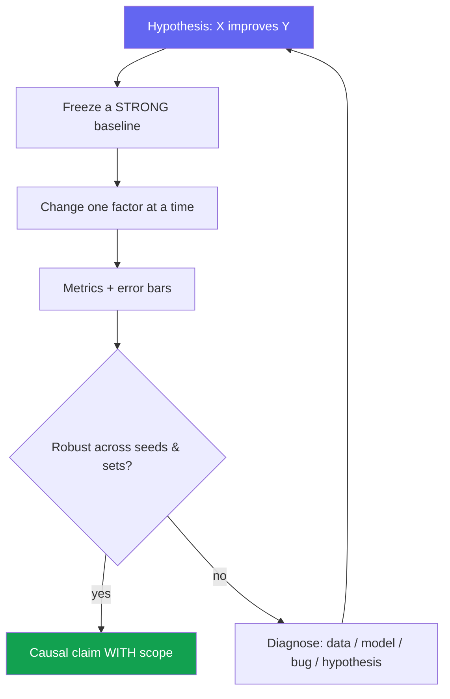
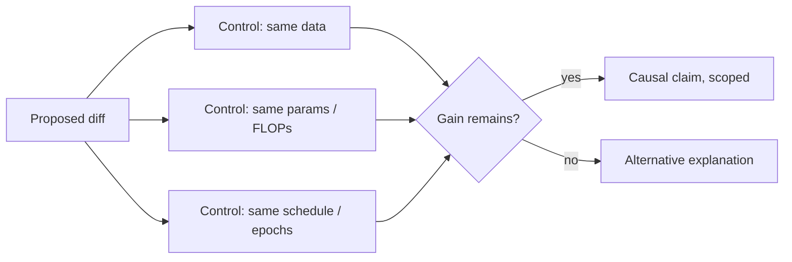

# Experiment Design & Ablations

<div class="tag-row"><span class="tag">hypothesis-driven</span><span class="tag">ablation discipline</span><span class="tag">controls & confounders</span><span class="tag">seeds & significance</span><span class="tag">compute budget</span></div>

> [!TIP] 질문 뒤의 질문
> RS/AS 심사위원단은 "your idea가 좋은가"를 거의 묻지 않습니다 — **"how do you know this diff actually caused the improvement?"**를 묻습니다. 강한 답변은 깔끔한 사슬을 따라갑니다: 하나의 hypothesis → 강한 frozen baseline → 한 factor만 변경 → confounder 통제 → variance/seeds → claim의 범위 한정. 이 장은 [Debugging & Experimentation](#/foundations/debugging-experimentation)의 research 측 짝입니다.



## Start from a falsifiable hypothesis

무엇이든 돌리기 *전에* claim을 **예측된 방향을 가진 한 문장**으로 쓰세요: "*A matting-oriented decoder head recovers soft boundary structure that a binary-mask head cannot, improving Grad/Conn error at fixed data.*" 반증할 수 없는 hypothesis는 실험이 아니라 데모입니다.

<details class="qa"><summary>"How do you design an experiment to test a research idea?"</summary>
<div class="qa-body">

**Short:** hypothesis와 그것을 *반증할* metric을 명시; 강한 baseline을 고정; 정확히 한 factor만 토글; 효과가 seed와 out-of-domain set에서 살아남는지 확인; 그다음 실제로 측정한 것에 claim의 범위를 한정.

**Deep:** 순서가 중요합니다. 성공/실패 *threshold*를 먼저 정의하세요(나중에 합리화할 수 없도록). Primary metric과 secondary 1~2개를 미리 결정. 대략적인 **kill criterion**을 pre-register("2주 안에 baseline 대비 이득 없으면 → pivot"). 이것이 hypothesis-driven 작업과 metric-chasing을 가릅니다.
</div></details>

## Ablation discipline

> [!WARNING] "All modules on = best"는 ablation이 아니다
> Ablation은 각 component를 **한 번에 하나씩** 제거/교체하여, 나머지(data, schedule, augmentation, resolution)를 모두 baseline에 고정한 채 그것의 **marginal contribution**을 보여야 합니다.

| Technique | What it isolates | When |
| --- | --- | --- |
| **Leave-one-out** | 각 module의 필요성 (A 제거, 나머지 유지) | Default; 죽은 무게가 없음을 보여줌 |
| **Additive** | 충분성 / build-up (baseline → +A → +A+B) | Component가 복리로 쌓이도록 의도된 경우 |
| **Replace-with-simpler** | 학습된/복잡한 부분이 비용값을 하는가? (learned → heuristic) | "더 단순한 게 될 것"을 반박할 때 |
| **Sensitivity sweep** | 핵심 hyperparameter에 대한 robustness | Reviewer가 "그냥 튜닝한 것 아니냐"고 물을 때 |
| **Cross-dataset / backbone** | 하나의 세팅에 overfit인지 vs generality | Generality 주장 |

**Beomyoung's worked example (ZIM):** 이득을 **세 개의 independent axes**에 걸쳐 귀속 — architecture(matting head), loss(soft-boundary term), 그리고 ~1M-image **data pipeline**. Data-alone (+α), data 위의 architecture (+β), 그리고 full model을 보고하여 어떤 reviewer도 스토리를 "just more data"로 뭉갤 수 없게 하세요. [ZIM deep-dive](#/resume/zim) 참고.

> [!NOTE] Interaction effects
> 때때로 component는 *다른 것이 있을 때만* 도움이 됩니다(각각 단독 제거하면 미미; 둘 다 제거하면 붕괴). 이를 숨기지 말고 2×2로 명시적으로 보고하세요 — 지저분한 결과가 아니라 진짜 과학적 발견입니다.

## Controls & confounders

모든 "our method is better"는 causal claim입니다. Control로 원인을 증명하세요.



**흔한 confounder** *(암기 — top follow-up입니다):*

- **More training** — 새 variant가 몰래 더 많은 epoch / 더 긴 wall-clock을 돌림.
- **More capacity** — 아이디어가 아니라 여분의 params/FLOPs가 이득을 견인 → **capacity-matched** control 보고.
- **Resolution / augmentation drift** — module과 함께 input size나 aug policy가 바뀜.
- **Better baseline hygiene** — 자기 방법은 튜닝하고 baseline은 stock 사용.
- **Test-set leakage / tuning on test** — hyperparameter를 test split에서 선택.

> [!DANGER] Foundation-model 시대의 오염
> Web-scale pretraining에서는 benchmark 예제가 이미 training corpus *안에* 있을 수 있습니다. Near-duplicate(perceptual hash)를 확인하고, official split만 쓰고, val에서 튜닝하며 test는 **한 번만** 건드리세요. VLM/LLM의 경우 eval이 pretraining data에 나타났는지 명시적으로 추론하세요. → [Reading & Critiquing Papers](#/research/papers).

## Statistical significance, seeds & variance

<details class="qa"><summary>"Is a 0.3-point improvement real?"</summary>
<div class="qa-body">

**Short:** **seed variance**보다 클 때만. 가능하면 baseline에 paired로 3~5 seed에 걸쳐 mean ± std를 보고; 격차가 noise band 안이면 SOTA로 팔지 마세요.

**Deep:** Academic ML은 공식 t-test를 강제하는 일이 드물지만 *원칙*은 유지됩니다: single-run delta는 일화입니다. Variance를 줄이려 paired comparison(같은 seed/split)을 쓰고, seed가 저렴하면 bootstrap CI를 쓰며, 많은 benchmark에 걸친 **multiple-comparison p-hacking**을 경계하세요. 무대에서 정직하게: "*I don't dress up a 0.2-point win that's below our seed std as a contribution.*"
</div></details>

> [!NOTE] CV-metric 미묘함
> mIoU/AP은 class imbalance와 threshold에 민감합니다; 작은 물체와 **boundary quality**는 aggregate 점수에 씻겨나갑니다. **Stratified analysis**(size / class / difficulty별)를 하세요 — aggregate는 정확히 제품이 신경 쓰는 failure를 숨길 수 있습니다. → [Evaluation Metrics](#/foundations/evaluation-metrics).

**Seed가 비쌀 때**(1 run = 다수 GPU에서 며칠): full pretrain의 5 seed를 평균낼 수 없습니다. 완화책: *fine-tuning* 단계의 variance를 보고, 더 작은 ablation에 seed를 주고, robustness proxy로 여러 dataset에서 효과를 보이며, headline model이 single run임을 명시하세요.

## Compute-budgeting the experiment plan

> [!QUESTION] "You have 64 GPUs for two weeks. How do you spend them?"
> **Short:** 예산 대부분을 하나의 hero run이 아니라 *GPU-hour당 불확실성 감소*에 쓰세요. 작은 규모로 pilot하여 나쁜 아이디어를 저렴하게 죽이고, seed/ablation에 일부를 예약하며, 불가피한 re-run을 위한 buffer를 남기세요.

방어 가능한 배분:

| Bucket | Share | Purpose |
| --- | --- | --- |
| Small-scale pilots / sweeps | ~40% | 커밋하기 전 1/10 비용으로 약한 hypothesis 죽이기 |
| Main runs (baseline + method) | ~30% | Headline 비교, matched setting |
| Ablations + seeds | ~20% | 귀속 + variance |
| Buffer / re-runs | ~10% | Bug, OOM, reviewer가 원할 control 하나 더 |

> [!NOTE] 커밋 전에 pilot
> 가장 저렴한 실험은 full scale로 *돌리지 않는* 실험입니다. 1/10 data/step에서 신호가 없는 hypothesis는 full scale에서 거의 스스로 구제되지 않습니다 — 비싼 run *전에* 아이디어를 죽이거나 승격시키는 데 pilot 예산을 쓰세요. 큰 run은 살아남은 두세 개의 hypothesis에 예약하세요.

**Compute를 first-class result로 보고:** train GPU-hour, params(MoE는 *active* params도), inference ms/memory, data-curation human-hour. Accuracy만의 Pareto는 불완전합니다 — reviewer와 product 모두 **accuracy per cost**로 결정합니다. Beomyoung의 ~10 ms on-device segmentation은 예산이 실험을 정의한 *constraint-first* 설계의 깔끔한 예입니다.

## Reproducibility artifacts

고정/릴리스할 최소 세트: seed 목록, library 버전/lockfile 또는 Docker, **모든** hyperparameter가 담긴 config YAML, data-prep script + license note, eval entrypoint, checkpoint, 그리고 mean/std 보고 컨벤션. **one-command reproduce**를 목표로. Bit-level determinism은 GPU에서 종종 불가능합니다(non-deterministic kernel) — 그럴 땐 **statistical** reproducibility(variance 안)와 bugfix changelog에 커밋하세요. Beomyoung의 open-source codebase(ZIM, ECLIPSE, PointWSSIS, BESTIE, SSUL, DRS)가 여기서 인용할 증거입니다.

## Agent / multimodal experiments differ

"module"은 더 이상 layer만이 아니라 **tool, memory, orchestrator, verifier, 그리고 test-time compute budget**입니다.

- Ablate: no-memory · no-verifier · single- vs multi-agent · perception-tool-off (blind LLM).
- **Budget-match:** agent에게 더 많은 tool/token을 주면 성공률이 하찮게 올라갑니다 — 항상 **동일한 test-time token/tool budget**에서 비교하세요, 아니면 ablation이 무의미합니다.
- Trajectory metric *과* final success를 보고; non-deterministic 환경을 고정(seed, cached web, frozen tool version). → [Agentic AI & Tool Use](#/llm/agents), [Reasoning & Test-Time Compute](#/llm/reasoning).

### Follow-ups they'll push

- *"What's the single most common confounder in your field?"* — resolution/epoch/capacity drift; 빠르게 짚으세요.
- *"How would you convince me the gain isn't cherry-picked?"* — seed + out-of-domain set + failure case 보여주기.
- *"When do you stop ablating?"* — 남은 각 component의 marginal effect가 noise 안에 들거나, reviewer의 causal 질문이 답변됐을 때.
- *"Additive vs leave-one-out — which and why?"* — 필요성엔 leave-one-out, 복리 스토리엔 additive; 둘이 어긋나면 둘 다 보고.

## Experiment-design checklist (copy-paste)

```
[ ] Hypothesis in one sentence, with a disconfirming outcome
[ ] Primary metric + 1–2 secondaries chosen up front
[ ] Strong, reproducible baseline frozen
[ ] One factor changed at a time (ablation matrix drafted)
[ ] Confounders controlled: data / capacity / schedule / resolution
[ ] Seeds run; mean ± std reported; effect > variance
[ ] Contamination / leakage check
[ ] Compute reported (GPU-hrs, params, latency)
[ ] Failure cases + stratified analysis
[ ] Repro artifacts (config, seeds, eval, checkpoint)
```

## Cheat-sheet

| Item | One-liner |
| --- | --- |
| Hypothesis | 예측된 방향을 가진, 먼저 쓴 반증 가능한 한 문장 |
| Ablation | 한 factor만 변경; 각 component의 marginal contribution을 보여라 |
| ZIM pattern | 이득을 independent axes에 귀속: architecture · loss · data |
| Confounders | Epochs, capacity, resolution, augmentation, test-tuning |
| Significance | Seed에 걸친 mean ± std; 효과가 seed variance를 초과해야 함 |
| CV metrics | Stratify — aggregate mIoU/AP은 small-object & boundary failure를 숨김 |
| Compute | Pilot 저렴하게, matched main run, seed, buffer; 비용을 result로 보고 |
| Agents | Module = tool/memory/verifier; 모든 비교를 **budget-match** |
| Contamination | Near-dup check, official split, test는 한 번만 |

**Related:** [Debugging & Experimentation](#/foundations/debugging-experimentation) · [Failure & Negative Results](#/research/failure) · [Reading & Critiquing Papers](#/research/papers) · [The Research Job Talk](#/research/job-talk) · [Evaluation Metrics](#/foundations/evaluation-metrics) · [Agentic AI & Tool Use](#/llm/agents) · [Deep-Dive: ZIM](#/resume/zim) · [Deep-Dive: ECLIPSE](#/resume/eclipse)
