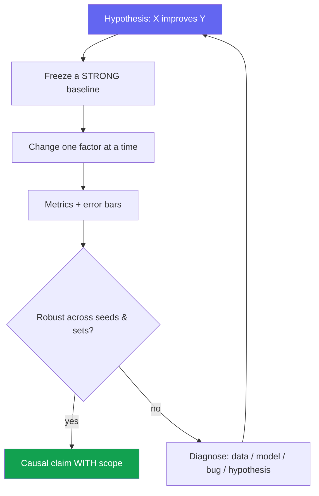
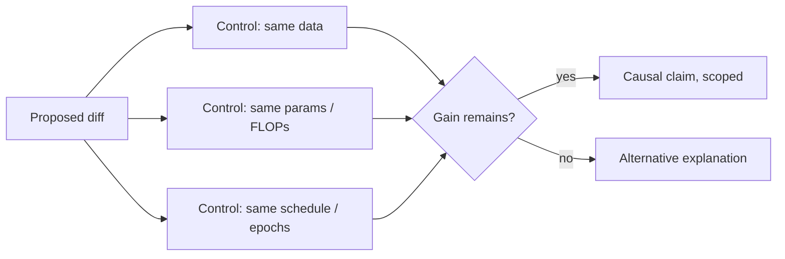

# Experiment Design & Ablations

<div class="tag-row"><span class="tag">hypothesis-driven</span><span class="tag">ablation discipline</span><span class="tag">controls & confounders</span><span class="tag">seeds & significance</span><span class="tag">compute budget</span></div>

> [!TIP] The question behind the question
> RS/AS panels rarely ask "is your idea good" — they ask **"how do you know this diff actually caused the improvement?"** A strong answer walks a clean chain: one hypothesis → a strong frozen baseline → change one factor → control confounders → variance/seeds → scope the claim. This chapter is the research-facing complement to [Debugging & Experimentation](#/foundations/debugging-experimentation).



## Start from a falsifiable hypothesis

Write the claim as **one sentence with a predicted direction** *before* running anything: "*A matting-oriented decoder head recovers soft boundary structure that a binary-mask head cannot, improving Grad/Conn error at fixed data.*" A hypothesis you can't falsify isn't an experiment — it's a demo.

<details class="qa"><summary>"How do you design an experiment to test a research idea?"</summary>
<div class="qa-body">

**Short:** State the hypothesis and the metric that would *disconfirm* it; freeze a strong baseline; toggle exactly one factor; check the effect survives seeds and an out-of-domain set; then scope the claim to what you actually measured.

**Deep:** The order matters. Define success/failure *thresholds* first (so you can't rationalize afterward). Decide the primary metric and 1–2 secondaries up front. Pre-register a rough **kill criterion** ("no gain over baseline in 2 weeks → pivot"). This is what separates hypothesis-driven work from metric-chasing.
</div></details>

## Ablation discipline

> [!WARNING] "All modules on = best" is not an ablation
> An ablation must show the **marginal contribution** of each component by removing/replacing it **one at a time**, holding everything else (data, schedule, augmentation, resolution) fixed at the baseline.

| Technique | What it isolates | When |
| --- | --- | --- |
| **Leave-one-out** | Necessity of each module (remove A, keep rest) | Default; shows nothing is dead weight |
| **Additive** | Sufficiency / build-up (baseline → +A → +A+B) | When components are meant to compound |
| **Replace-with-simpler** | Is the learned/complex part earning its cost? (learned → heuristic) | To rebut "a simpler thing would do" |
| **Sensitivity sweep** | Robustness to a key hyperparameter | Reviewers ask "did you just tune it?" |
| **Cross-dataset / backbone** | Generality vs overfitting to one setting | Generality claims |

**Beomyoung's worked example (ZIM):** attribute the gain across **three independent axes** — architecture (matting head), loss (soft-boundary terms), and the ~1M-image **data pipeline**. Report data-alone (+α), architecture-on-top-of-data (+β), and the full model, so no reviewer can collapse the story into "just more data." See the [ZIM deep-dive](#/resume/zim).

> [!NOTE] Interaction effects
> Sometimes a component only helps *in the presence of* another (removing either alone shows little; removing both collapses). Report this explicitly with a 2×2 rather than hiding it — it's a real scientific finding, not a messy result.

## Controls & confounders

Every "our method is better" is a causal claim. Prove the cause with controls.



**The usual confounders** *(memorize — they're the top follow-ups):*

- **More training** — the new variant secretly ran more epochs / longer wall-clock.
- **More capacity** — extra params/FLOPs, not the idea, drive the gain → report a **capacity-matched** control.
- **Resolution / augmentation drift** — input size or aug policy changed with the module.
- **Better baseline hygiene** — you tuned your method but used a stock baseline.
- **Test-set leakage / tuning on test** — hyperparameters chosen on the test split.

> [!DANGER] Contamination in the foundation-model era
> With web-scale pretraining, benchmark examples may already be *in* the training corpus. Check near-duplicates (perceptual hash), use official splits only, tune on val and touch test **once**. For VLMs/LLMs, explicitly reason about whether the eval appeared in pretraining data. → [Reading & Critiquing Papers](#/research/papers).

## Statistical significance, seeds & variance

<details class="qa"><summary>"Is a 0.3-point improvement real?"</summary>
<div class="qa-body">

**Short:** Only if it's larger than **seed variance**. Report mean ± std over 3–5 seeds (paired to the baseline where possible); if the gap is inside the noise band, don't sell it as SOTA.

**Deep:** Academic ML rarely enforces a formal t-test, but the *principle* holds: a single-run delta is an anecdote. Use paired comparisons (same seeds/splits) to reduce variance, bootstrap CIs when seeds are cheap, and beware **multiple-comparison p-hacking** across many benchmarks. Be honest on stage: "*I don't dress up a 0.2-point win that's below our seed std as a contribution.*"
</div></details>

> [!NOTE] CV-metric subtleties
> mIoU/AP are sensitive to class imbalance and threshold; small objects and **boundary quality** get washed out by aggregate scores. Do **stratified analysis** (by size / class / difficulty) — the aggregate can hide exactly the failure a product cares about. → [Evaluation Metrics](#/foundations/evaluation-metrics).

**When seeds are expensive** (one run = days on many GPUs): you can't average 5 seeds of a full pretrain. Mitigations: report variance of the *fine-tuning* stage, seed the smaller ablations, show the effect on multiple datasets as a robustness proxy, and be explicit that the headline model is a single run.

## Compute-budgeting the experiment plan

> [!QUESTION] "You have 64 GPUs for two weeks. How do you spend them?"
> **Short:** Spend most of the budget *reducing uncertainty per GPU-hour*, not on one hero run. Pilot at small scale to kill bad ideas cheaply, reserve a slice for seeds/ablations, and keep a buffer for the inevitable re-run.

A defensible allocation:

| Bucket | Share | Purpose |
| --- | --- | --- |
| Small-scale pilots / sweeps | ~40% | Kill weak hypotheses at 1/10 cost before committing |
| Main runs (baseline + method) | ~30% | The headline comparison, matched settings |
| Ablations + seeds | ~20% | Attribution + variance |
| Buffer / re-runs | ~10% | Bugs, OOMs, one more control a reviewer will want |

> [!NOTE] Pilot before you commit
> The cheapest experiment is the one you *don't* run at full scale. A hypothesis that shows no signal at 1/10 data/steps rarely rescues itself at full scale — spend the pilot budget to kill or promote ideas *before* the expensive runs. Reserve the big runs for the two or three hypotheses that survived.

**Report compute as a first-class result:** train GPU-hours, params (and *active* params for MoE), inference ms/memory, and data-curation human-hours. An accuracy-only Pareto is incomplete — reviewers and product both decide on **accuracy per cost**. Beomyoung's ~10 ms on-device segmentation is a clean example of *constraint-first* design where the budget defined the experiment.

## Reproducibility artifacts

Minimum set to fix/release: seed list, library versions/lockfile or Docker, config YAML with **all** hyperparameters, data-prep script + license note, eval entrypoint, checkpoints, and a mean/std reporting convention. Aim for **one-command reproduce**. Bit-level determinism is often impossible on GPU (non-deterministic kernels) — then commit to **statistical** reproducibility (within variance) and a bugfix changelog. Beomyoung's open-sourced codebases (ZIM, ECLIPSE, PointWSSIS, BESTIE, SSUL, DRS) are the evidence to cite here.

## Agent / multimodal experiments differ

The "modules" are no longer just layers — they're **tools, memory, orchestrator, verifier, and a test-time compute budget**.

- Ablate: no-memory · no-verifier · single- vs multi-agent · perception-tool-off (blind LLM).
- **Budget-match:** giving an agent more tools/tokens trivially raises success — always compare at **equal test-time token/tool budget**, or the ablation is meaningless.
- Report trajectory metrics *and* final success; fix non-deterministic environments (seed, cached web, frozen tool versions). → [Agentic AI & Tool Use](#/llm/agents), [Reasoning & Test-Time Compute](#/llm/reasoning).

### Follow-ups they'll push

- *"What's the single most common confounder in your field?"* — resolution/epoch/capacity drift; name it fast.
- *"How would you convince me the gain isn't cherry-picked?"* — seeds + out-of-domain set + show failure cases.
- *"When do you stop ablating?"* — when each remaining component's marginal effect is inside the noise, or the reviewer's causal question is answered.
- *"Additive vs leave-one-out — which and why?"* — leave-one-out for necessity, additive for a compounding story; report both if they disagree.

## Experiment-design checklist (copy-paste)

```
[ ] Hypothesis in one sentence, with a disconfirming outcome
[ ] Primary metric + 1–2 secondaries chosen up front
[ ] Strong, reproducible baseline frozen
[ ] One factor changed at a time (ablation matrix drafted)
[ ] Confounders controlled: data / capacity / schedule / resolution
[ ] Seeds run; mean ± std reported; effect > variance
[ ] Contamination / leakage check
[ ] Compute reported (GPU-hrs, params, latency)
[ ] Failure cases + stratified analysis
[ ] Repro artifacts (config, seeds, eval, checkpoint)
```

## Cheat-sheet

| Item | One-liner |
| --- | --- |
| Hypothesis | One falsifiable sentence with a predicted direction, written first |
| Ablation | Change one factor; show each component's marginal contribution |
| ZIM pattern | Attribute gain across independent axes: architecture · loss · data |
| Confounders | Epochs, capacity, resolution, augmentation, test-tuning |
| Significance | Mean ± std over seeds; effect must exceed seed variance |
| CV metrics | Stratify — aggregate mIoU/AP hides small-object & boundary failure |
| Compute | Pilot cheap, matched main runs, seeds, buffer; report cost as a result |
| Agents | Modules = tools/memory/verifier; **budget-match** every comparison |
| Contamination | Near-dup check, official splits, touch test once |

**Related:** [Debugging & Experimentation](#/foundations/debugging-experimentation) · [Failure & Negative Results](#/research/failure) · [Reading & Critiquing Papers](#/research/papers) · [The Research Job Talk](#/research/job-talk) · [Evaluation Metrics](#/foundations/evaluation-metrics) · [Agentic AI & Tool Use](#/llm/agents) · [Deep-Dive: ZIM](#/resume/zim) · [Deep-Dive: ECLIPSE](#/resume/eclipse)
