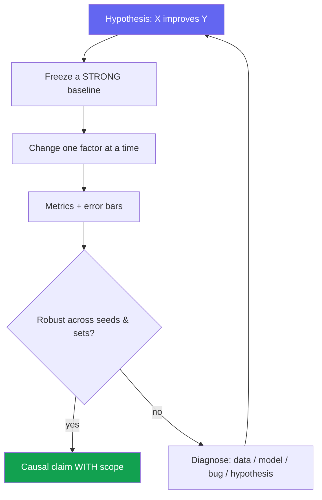
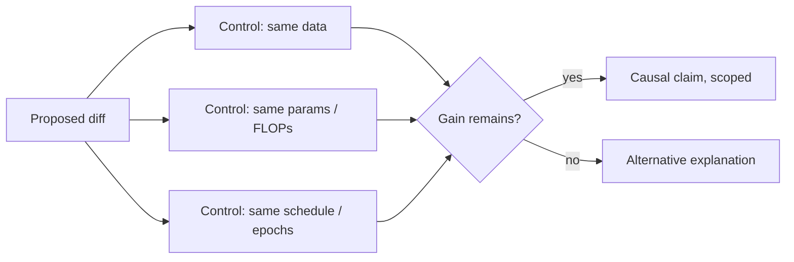

# Experiment Design & Ablations

<div class="tag-row"><span class="tag">hypothesis-driven</span><span class="tag">ablation discipline</span><span class="tag">controls & confounders</span><span class="tag">seeds & significance</span><span class="tag">compute budget</span></div>

> [!TIP] The question behind the question
> In RS/AS interviews, an appealing idea is often followed by **"How do you know this change caused the improvement?"** A strong answer connects hypothesis → reproducible baseline → matched comparison or factorial design → confounder control → uncertainty → claim scope. This chapter is the research-facing complement to [Debugging & Experimentation](#/foundations/debugging-experimentation).



## Start from a falsifiable hypothesis

Write the claim as **one sentence with a predicted direction** *before* running anything: "*A matting-oriented decoder head recovers soft boundary structure that a binary-mask head cannot, improving Grad/Conn error at fixed data.*" A hypothesis you can't falsify isn't an experiment — it's a demo.

<details class="qa"><summary>"How do you design an experiment to test a research idea?"</summary>
<div class="qa-body">

**Short:** State the hypothesis and the metric that would *disconfirm* it; freeze a strong baseline; toggle exactly one factor; check the effect survives seeds and an out-of-domain set; then scope the claim to what you actually measured.

**Deep:** The order matters. Define success/failure *thresholds* first (so you can't rationalize afterward). Decide the primary metric and 1–2 secondaries up front. Pre-register a rough **kill criterion** ("no gain over baseline in 2 weeks → pivot"). This is what separates hypothesis-driven work from metric-chasing.
</div></details>

## Ablation discipline

> [!WARNING] "All modules on = best" is not an ablation
> A basic ablation removes or replaces one component while matching data, schedule, augmentation, and resolution, thereby estimating a **conditional marginal effect**. If components are expected to interact, do not stop at leave-one-out; add a factorial or additive comparison.

| Technique | What it isolates | When |
| --- | --- | --- |
| **Leave-one-out** | Necessity of each module (remove A, keep rest) | Default; shows nothing is dead weight |
| **Additive** | Sufficiency / build-up (baseline → +A → +A+B) | When components are meant to compound |
| **Replace-with-simpler** | Is the learned/complex part earning its cost? (learned → heuristic) | To rebut "a simpler thing would do" |
| **Sensitivity sweep** | Robustness to a key hyperparameter | Reviewers ask "did you just tune it?" |
| **Cross-dataset / backbone** | Generality vs overfitting to one setting | Generality claims |

**When using a personal-project example:** design a factorial or additive ablation with architecture, loss, and data as separate axes, and report their interactions. Fill in values such as `+α`, `+β`, or data scale only when they are verified in the [ZIM deep-dive](#/resume/zim) and the actual experiment table; do not assume unmeasured independence.

> [!NOTE] Interaction effects
> Sometimes a component only helps *in the presence of* another (removing either alone shows little; removing both collapses). Report this explicitly with a 2×2 rather than hiding it — it's a real scientific finding, not a messy result.

## Controls & confounders

"Our method is better" can describe benchmark superiority; "this component caused the gain" is causal attribution. Keep those claims distinct and use matched controls when making the latter.



**The usual confounders** *(memorize — they're the top follow-ups):*

- **More training** — the new variant secretly ran more epochs / longer wall-clock.
- **More capacity** — extra params/FLOPs, not the idea, drive the gain → report a **capacity-matched** control.
- **Resolution / augmentation drift** — input size or aug policy changed with the module.
- **Better baseline hygiene** — you tuned your method but used a stock baseline.
- **Test-set leakage / tuning on test** — hyperparameters chosen on the test split.

> [!DANGER] Contamination in the foundation-model era
> Web-scale pretraining may contain benchmark examples. Audit near-duplicates, timestamps, and source overlap where possible; use official splits and validation for selection; and limit and log access to the test set or lockbox. If you lack complete corpus visibility, do not claim contamination has been ruled out—report what is known and unknown. → [Reading & Critiquing Papers](#/research/papers).

## Statistical significance, seeds & variance

<details class="qa"><summary>"Is a 0.3-point improvement real?"</summary>
<div class="qa-body">

**Short:** Form a **paired difference** on the same seeds and splits, then inspect the effect size and confidence interval. There is no rule that mean ± standard deviation alone decides whether it is "real," or that the effect must exceed the standard deviation.

**Deep:** A single-run delta is uncertain. First define the analysis unit—seed, image, query, or user—then, where appropriate, estimate a **confidence interval for the difference** with a paired bootstrap or permutation test, or an appropriate hierarchical model. Determine the required number of seeds or samples with power analysis based on the expected effect and variance. Selecting only the best result after many benchmarks, metrics, or HPO trials creates selection bias, so predeclare the primary hypothesis and use multiple-comparison correction or a confirmatory holdout.
</div></details>

> [!NOTE] CV-metric subtleties
> Both mIoU and AP can hide small objects, rare classes, and boundary quality in an aggregate. **AP integrates a ranking rather than fixing one confidence threshold**, but it is sensitive to the IoU-threshold range, maximum detections, interpolation, and class-averaging convention. Report size, class, and difficulty slices along with operating-point metrics. → [Evaluation Metrics](#/foundations/evaluation-metrics).

**When seeds are expensive,** full-scale replication may be impractical. Examine variance and learning curves at smaller scale or in fine-tuning, prioritize repeats for the key ablations, and state that results across multiple datasets do not replace seed uncertainty. If the headline model is a single run, say so and supplement it with paired per-example uncertainty where possible.

<details class="concept-code">
<summary>View as conceptual code</summary>

> This is **experimental pseudocode** for a matched comparison with paired uncertainty. The statistical method must be adapted to the metric and analysis unit.

```python
def run_matched_experiment(base_cfg, proposed_diff, seeds, frozen_eval):
    records = []
    for seed in seeds:
        common = freeze_everything_except(base_cfg, proposed_diff.changed_factor)
        for variant in ["baseline", "proposed"]:
            seed_everything(seed)
            cfg = apply_variant(common, proposed_diff, variant)
            model = train(cfg)                              # Same data, schedule, and budget
            model.eval()
            with no_grad():
                pred = model(frozen_eval.inputs)
            records.append(per_unit_metrics(
                pred, frozen_eval.labels,
                unit_id=frozen_eval.analysis_unit,          # Image, query, user, or scene
                seed=seed, variant=variant,
                artifact_hash=hash_config_data_code(cfg),
            ))

    paired = join_on(records, keys=["seed", "unit_id"])
    delta = paired.proposed - paired.baseline
    # Resample whole hierarchy levels such as seed and user or video.
    interval = hierarchical_bootstrap_ci(delta, levels=["seed", "unit_id"])
    return {"effect": mean(delta), "confidence_interval": interval,
            "slice_effects": prespecified_slices(delta)}
```

Do not reuse the test set or lockbox for HPO selection, and record missing or failed runs with their reasons. Do not assume a simple per-example bootstrap captures all seed-, user-, or video-level variation.

</details>

## Compute-budgeting the experiment plan

> [!QUESTION] "You have 64 GPUs for two weeks. How do you spend them?"
> **Short:** Spend most of the budget *reducing uncertainty per GPU-hour*, not on one hero run. Pilot at small scale to kill bad ideas cheaply, reserve a slice for seeds/ablations, and keep a buffer for the inevitable re-run.

A defensible allocation:

| Bucket | Share | Purpose |
| --- | --- | --- |
| Small-scale pilots / sweeps | example ~40% | Check implementation, learning curves, and sensitivity cheaply; verify whether rankings persist at full scale |
| Main runs (baseline + method) | ~30% | The headline comparison, matched settings |
| Ablations + seeds | ~20% | Attribution + variance |
| Buffer / re-runs | ~10% | Bugs, OOMs, one more control a reviewer will want |

> [!NOTE] Pilot before you commit
> Pilots cheaply filter bugs and obviously weak directions, but rankings at small scale can reverse at full scale. Check learning curves and rank correlation across several scales, and use a predeclared escalation rule rather than "pilot failed → idea dead." The 40/30/20/10 split above is illustrative; adapt it to uncertainty, failure cost, and cluster constraints.

**Report compute as a first-class result:** training GPU-hours, energy and hardware, parameters (active and total for MoE), inference latency/throughput/memory, and data-curation human-hours. A single ratio such as `accuracy/cost` hides the shape of the trade-off, so show comparisons at equal training and test-time budgets and the **Pareto frontier**. Cite a personal latency result only when device, batch, precision, and input size are verified in the CV or report.

## Reproducibility artifacts

The minimum internal fixed set is: seeds, library/driver/hardware versions, lockfile or container, full configuration, data-preparation and split provenance, evaluation entry point, checkpoint hash, and reporting convention. Release code, configs, or checkpoints when license, privacy, and size permit; otherwise explain the boundary with a synthetic sample, pseudocode, or an artifact manifest. Aim for **one-command reproduce**, but distinguish bit-level determinism from statistical reproducibility. Cite a personal open-source example only after verifying that its repository actually meets these requirements.

## Agent / multimodal experiments differ

The "modules" are no longer just layers — they're **tools, memory, orchestrator, verifier, and a test-time compute budget**.

- Ablate: no-memory · no-verifier · single- vs multi-agent · perception-tool-off (blind LLM).
- **Budget-match:** more tools, tokens, or attempts can raise agent success. Report equal-budget comparisons as well as the quality–cost frontier, and record actual spending and early stopping by planner.
- Report trajectory metrics and final success; separate reproducible snapshots (seed, cached or simulated web, pinned tool versions) from current live-environment evaluation. A live web cannot be fully frozen, so record timestamps and failure provenance. → [Agentic AI & Tool Use](#/llm/agents), [Reasoning & Test-Time Compute](#/llm/reasoning).

### Follow-ups they'll push

- *"What's the single most common confounder in your field?"* — resolution/epoch/capacity drift; name it fast.
- *"How would you convince me the gain isn't cherry-picked?"* — seeds + out-of-domain set + show failure cases.
- *"When do you stop ablating?"* — when you have answered the key attribution, interaction, and failure-boundary questions that could change the decision, and the next experiment's information value is below its cost.
- *"Additive vs leave-one-out — which and why?"* — leave-one-out for necessity, additive for a compounding story; report both if they disagree.

## Experiment-design checklist (copy-paste)

```
[ ] Hypothesis in one sentence, with a disconfirming outcome
[ ] Primary metric + 1–2 secondaries chosen up front
[ ] Strong, reproducible baseline frozen
[ ] One factor changed at a time (ablation matrix drafted)
[ ] Confounders controlled: data / capacity / schedule / resolution
[ ] Paired effect + confidence interval; power rationale for the sample/seed count
[ ] HPO/benchmark selection count logged; multiple-comparison/selection bias controlled
[ ] Contamination / leakage check
[ ] Compute reported (GPU-hrs, params, latency)
[ ] Failure cases + stratified analysis
[ ] Repro artifacts (config, seeds, eval, checkpoint)
```

## Cheat-sheet

| Item | One-liner |
| --- | --- |
| Hypothesis | One falsifiable sentence with a predicted direction, written first |
| Ablation | Change one factor; show each component's marginal contribution |
| ZIM pattern | Attribute gain across independent axes: architecture · loss · data |
| Confounders | Epochs, capacity, resolution, augmentation, test-tuning |
| Uncertainty | Define the analysis unit; paired effect, CI, and power; mean ± std is a supporting summary |
| CV metrics | Stratify — aggregate mIoU/AP hides small-object & boundary failure |
| Compute | Pilot cheap, matched main runs, seeds, buffer; report cost as a result |
| Agents | Modules = tools/memory/verifier; **budget-match** every comparison |
| Contamination | Near-duplicate/source/time audit, limited and logged test access, unknowns stated |

**Related:** [Debugging & Experimentation](#/foundations/debugging-experimentation) · [Failure & Negative Results](#/research/failure) · [Reading & Critiquing Papers](#/research/papers) · [The Research Job Talk](#/research/job-talk) · [Evaluation Metrics](#/foundations/evaluation-metrics) · [Agentic AI & Tool Use](#/llm/agents) · [Deep-Dive: ZIM](#/resume/zim) · [Deep-Dive: ECLIPSE](#/resume/eclipse)
