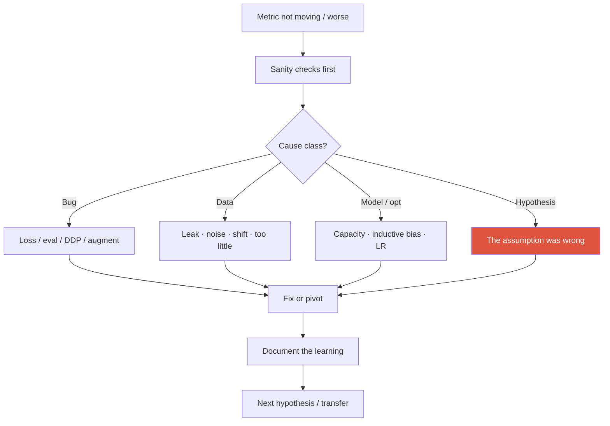
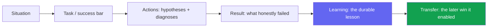

# Failure & Negative Results

<div class="tag-row"><span class="tag">the "this didn't work" story</span><span class="tag">scientific integrity</span><span class="tag">kill criteria & pivots</span><span class="tag">framing negatives</span></div>

> [!TIP] "tell me about a failure"가 진짜 채점하는 것
> Failure 자체가 아니라 — 당신의 **진단 능력, intellectual honesty, learning transfer**입니다. "안 됐어요, 운이 나빴죠"라고 하는 후보는 탈락; 원인을 분류하고, 반증 실험을 보이며, 그것이 *나중에 씨앗이 된* 승리를 짚는 후보는 시니어로 읽힙니다. 모든 강한 연구자에게는 무덤이 있습니다; 신호는 그것을 파며 무엇을 배웠느냐입니다.



## Classify before you despair

> [!WARNING] 의심의 순서
> **bug와 eval 실수를 먼저** 배제하고, 그다음 **data**, 그다음 **model/optimization**, 그리고 *마지막에만* "hypothesis가 틀렸다"고 결론내세요. 아이디어를 너무 일찍 죽이면 learning을 잃고; 너무 늦으면 bug에 몇 주를 태웁니다.

| Cause class | Symptom | Fast disconfirming test |
| --- | --- | --- |
| **Bug** | NaN loss, 불가능한 metric, train↓/val↑ 이상 | Overfit 10–20 images; eval on train; visualize predictions; unit-test IoU/NMS/loss |
| **Data** | 한 도메인만 실패; label noise | Data audit; stratum별 confusion; augment가 label을 손상시키지 않는지 확인 |
| **Model / opt** | Underfit, 불안정, plateau | LR sweep, longer train, simpler model, init/normalization 확인 |
| **Hypothesis** | 모든 합리적 세팅에서 *zero* 이득 | Oracle / upper-bound features; 빈 곳까지 ablate |

**왜 bug 먼저:** 흔하고 고치기 저렴합니다; "the idea is wrong"은 **가장 비싼 결론**이며 가장 많은 증거를 요구해야 합니다. Segmentation 특유의 함정: mask-resize interpolation(nearest vs bilinear), class-index offset, void/ignore-region 처리 — Beomyoung이 segmentation 라인 전반에서 겪은 바로 그런 종류입니다.

## The "this didn't work and here's what I learned" story

한 가지 반전이 있는 STAR: payload는 Result가 아니라 **Learning → Transfer**입니다.



<details class="qa"><summary>"Tell me about a research direction that didn't pan out."</summary>
<div class="qa-body">

**Short:** 진짜 사례를 하나 고르고, 놓친 success bar를 말하고, 시험한 2~3개 hypothesis와 *각각을 왜 기각했는지*를 서술한 뒤, 교훈과 그것이 나중에 어디서 결실을 맺었는지 — ~2~3분 안에.

**Deep:** **기술적이고 구체적**으로 유지하세요(숫자, timeline, 팀 대비 당신의 역할). 팀원, 운, 또는 "받은 나쁜 data"를 **탓하지** 마세요. 미래 지향적으로 마무리: "*that failure is why my next project made X a first-class objective.*" 결과가 아니라 arc가 채점됩니다.
</div></details>

### Draft stories from Beomyoung's line (pick ONE, go deep)

<dl class="kv">
<dt>A — Proxy-metric vs perceived quality (weak-sup → matting)</dt><dd><b>S:</b> 저렴한 supervision에서 instance/segmentation 품질을 밀어붙임. <b>A:</b> post-processing/CRF 경로가 benchmark 숫자를 올렸지만 *제품에서 보이는* boundary 품질은 여전히 나빴음. <b>R:</b> benchmark 상승, 사용자 체감 품질은 정체. <b>L:</b> proxy metric과 perceived quality가 갈라졌음. <b>X:</b> ZIM은 **soft-boundary / alpha fidelity**를 post-hoc 패치가 아니라 명시적 training target으로 만듦.</dd>
<dt>B — Plasticity–stability wall (continual)</dt><dd><b>S:</b> 새 class 추가가 old-class 성능을 무너뜨림. <b>A:</b> naive fine-tune 실패; regularization/replay/prompt-based 옵션 탐색. <b>R:</b> 일부 세팅은 여전히 plasticity나 stability를 맞바꿈. <b>L:</b> *constraint*(memory/privacy, full replay 없음)는 **problem definition에** 속함. <b>X:</b> ECLIPSE의 효율적 visual-prompt-tuning continual 접근.</dd>
<dt>C — Latency budget (on-device)</dt><dd><b>S:</b> mobile-CPU near-real-time segmentation. <b>A:</b> 큰 model을 distill하니 서류상 accuracy target은 맞았지만 on-device에서 op-incompatibility / budget overrun에 걸림. <b>R:</b> 재설계 전에 ms target을 놓침. <b>L:</b> **constraint-first** 설계가 accuracy-then-shrink를 이김. <b>X:</b> ~10 ms ONNX-served model.</dd>
</dl>

하나를 철저히 준비하고; 나머지 둘은 follow-up용 one-liner로 두세요. → [STAR & Story Bank](#/behavioral/star).

## Scientific integrity

> [!DANGER] 절대 넘지 않는 선
> Result로 파는 test-set tuning 금지 · main claim을 대신하는 cherry-pick된 qualitative 금지 · 성의 없는 시도 후의 "method X doesn't work" 금지 · 평균을 해치는 seed를 조용히 버리는 것 금지. 조작이 발각되면 커리어가 끝납니다; 무대에서는 **calibrated** claim이 항상 부풀린 것을 이깁니다.

잘 작성된 **negative result**는 기여입니다: 남들이 같은 막다른 길을 반복하지 않게 막습니다. Positive처럼 보고하세요 — 동일한 setup의 엄밀함, 커버한 hyperparameter **search range**, 그리고 결정적으로 **failure가 *구현*의 한계인지 *아이디어*의 한계인지**. 부분적/조건부 성공("불투명하면 되고, translucency에서 실패")은 밋밋한 "안 됨"보다 유용합니다.

> [!NOTE] Reviewer의 시선
> Failure case가 *전혀* 없이 단조 증가하는 table은 인상적이 아니라 **의심스럽게** 읽힙니다. 정직한 limitations는 trust와 soundness를 *높입니다*. → [Reading & Critiquing Papers](#/research/papers).

<details class="qa"><summary>"Where do negative results belong — main text or appendix?"</summary>
<div class="qa-body">

**Short:** 방법에 대한 독자의 *믿음을 형성*한다면(뻔하지만-틀린 baseline, 깨지는 세팅) main text에; 보조 세부(전체 search grid)라면 appendix에. Pure-negative 논문은 드물지만 analysis/workshop 기여로 유효합니다.

**Deep:** 판단 기준: 그것을 빼면 독자가 당신의 claim을 과일반화하게 되는가? 그렇다면 appendix footnote가 아니라 main-text limitation입니다. Claim을 한정짓는 그 하나의 failure를 묻는 것은 예리한 reviewer가 벌하는 종류의 누락입니다.
</div></details>

## Kill criteria & pivoting

감정적으로 몰입하기 *전에* 출구를 정하세요 — hypothesis처럼 pre-register하세요.

| Signal | Reading | Action |
| --- | --- | --- |
| Bug 같은 anomaly | 아이디어 아직 미검증 | 아이디어 유지, 구현 수정 |
| Capacity/data 여유 있는데 underfit | 아직 공정한 검증 아님 | Model/data 스케일, 재시도 |
| **oracle**조차 실패 | Problem framing이 어긋남 | 문제 재정의 |
| 정직한 노력 후 이득 < noise | 아이디어가 *여기선* 도움 안 될 가능성 | Pivot하거나 claim 좁히기 |

<details class="qa"><summary>"How do you decide when to kill a project vs push harder?"</summary>
<div class="qa-body">

**Short:** ego가 아니라 미리 정한 기준에 대해 — 예: "2주 안에 tiny-set 신호 없음 ⇒ 구현 문제; 4주 안에 강한 baseline 대비 우위 없음 ⇒ pivot." Oracle-features 테스트도 *함께* 실패하는 것이 가장 강한 kill 신호입니다(천장이 거기 없음).

**Deep:** 매주 hypothesis 상태를 소통하세요("alive / threatened / dead"); 죽어가는 방향을 숨기면 조직 비용이 올라갑니다. Manager가 죽은 아이디어를 계속 밀면, 의견이 아니라 **반증 실험**을 가져가세요 — data가 감정 없이 이견을 해소합니다.
</div></details>

## Research success but product failure

Benchmark-SOTA model도 프로덕션에서 실패할 수 있으며 — 보통 잘못된 hypothesis가 아니라 **success-definition mismatch**입니다.

- Offline metric이 online/user metric과 무상관.
- Aggregate에 숨은 slice failure(lighting, skin tone, 희귀 class).
- Fail-safe / rollback 없음; latency나 robustness 벽; annotation/monitoring 비용.

Beomyoung의 research→product 트랙(ZIM→CLOVA-X, FaceSign, 상용 tool을 이긴 foreground API)은 이를 **metric-alignment** failure로 framing하고 해법(slice analysis, shadow deployment, FaceSign의 fail-closed safety)을 기술하게 해줍니다.

## New failure modes in agent/LLM research

고전적 ML 디버깅 **더하기 trajectory-level** 디버깅: 무한 루프, **reward hacking**, tool 오용, non-stationary web 환경, LLM-judge bias, failure mode로서의 cost 폭증. **orchestration** failure와 **perception** failure를 구분하세요(Beomyoung의 under-review NeurIPS 작업은 silent perception failure를 typed diagnosis로 바꿉니다). Kill criteria에 **stall/loop detection**을 추가하고 복구를 위한 human-in-the-loop를 넣으세요. → [Agentic AI & Tool Use](#/llm/agents), [Post-Training & Alignment](#/llm/alignment).

> [!EXAMPLE] 잘 꽂히는 transfer 신호
> "Seeing **metric-hacking** in weakly-supervised segmentation gave me the intuition to spot **reward-hacking** in RL/agents early — same failure, different layer of the stack."

## Delivering it on stage — tone

Fact → diagnosis → learning → later impact, 그 순서로. **짧고 기술적으로** 유지; 감정적 서사는 최소화; 팀원을 지울 필요는 없습니다(공유된 learning은 괜찮음); 미래 지향적으로 마무리. 유머로 회피하지 말고, 이전 고용주를 절대 폄하하거나 기밀/미공개 세부를 말하지 마세요.

### Follow-ups they'll push

- *"When exactly did you first see a red flag, and why was it ignored?"* — retro 성숙도를 보여줌; 비난이 아니라 process fix로 답변.
- *"What assumption did you most wrongly believe going in?"* — 구체적인 기술적 가정을 하나 짚으세요.
- *"If you restarted today, what changes in week one?"* — 명료한 답이 교훈을 추출했음을 증명.
- *"How do you coach a junior through a failing project?"* — failure를 감지하는 *latency*를 줄이고; 아이디어를 죽이는 것을 정상화.

## One-page diagnosis card

```
Symptom:
Expected vs observed:
Sanity checks passed?  (overfit-tiny / eval-on-train / viz / unit-tests)
Likely cause class:  bug / data / model / hypothesis
Disconfirming experiment run:
Decision:  fix / pivot / kill  (against which criterion?)
Learning to keep:
Where it transferred:
```

## Cheat-sheet

| Item | One-liner |
| --- | --- |
| Suspicion order | Bug → data → model/opt → hypothesis (last) |
| Story arc | S-T-A-R **+ Learning + Transfer**; payload는 교훈 |
| Never blame | 팀원, 운, "우리가 받은 나쁜 data" — 진단을 스스로 책임 |
| Integrity | Calibrated > inflated; search range와 partial success를 보고 |
| Negative result | 남들의 막다른 길을 아껴주면 기여 |
| Kill criteria | Pre-register; oracle도 실패 = 가장 강한 kill 신호 |
| Product failure | 보통 wrong hypothesis가 아니라 metric-alignment |
| Agent failures | Loop, reward-hacking, tool 오용; stall detection 추가 |
| Tone | Fact → diagnosis → learning → 미래 지향; 짧고 기술적으로 |

**Related:** [Experiment Design & Ablations](#/research/experiment-design) · [Debugging & Experimentation](#/foundations/debugging-experimentation) · [Reading & Critiquing Papers](#/research/papers) · [The Research Job Talk](#/research/job-talk) · [STAR & Story Bank](#/behavioral/star) · [Common Behavioral Questions](#/behavioral/questions) · [Agentic AI & Tool Use](#/llm/agents) · [Deep-Dive: ECLIPSE](#/resume/eclipse)
