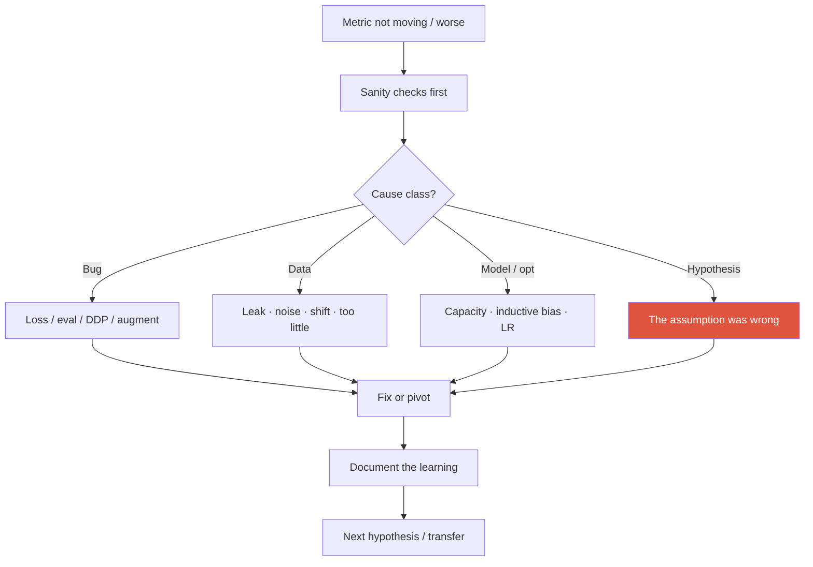
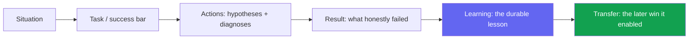

# Failure & Negative Results

<div class="tag-row"><span class="tag">the "this didn't work" story</span><span class="tag">scientific integrity</span><span class="tag">kill criteria & pivots</span><span class="tag">framing negatives</span></div>

> [!TIP] What "tell me about a failure" really scores
> Not the failure itself, but your **diagnostic ability, intellectual honesty, and learning transfer**. Classify the cause, show the disconfirming experiments and the next decision, and explain how the lesson changed a later design. Do not infer a candidate's level from one story; leave concrete evidence.



## Classify before you despair

> [!WARNING] Order of suspicion
> Start with cheap sanity checks, but do not treat bug → data → model → hypothesis as an absolute serial order. Track several symptom-driven hypotheses in parallel and prioritize the cheapest experiment that maximizes expected information gain. An implementation bug and a wrong assumption can coexist.

| Cause class | Symptom | Fast disconfirming test |
| --- | --- | --- |
| **Bug** | NaN, impossible metric, train/eval code-path mismatch | Tiny-set overfit; eval on train; visualize predictions; unit-test the metric/loss |
| **Expected overfit** | train loss↓, val loss↑, or widening gap | Distinguish regularization/data/early stopping from leakage or distribution differences |
| **Data** | Only one domain fails; label noise | Data audit; confusion by stratum; check augmentation does not corrupt labels |
| **Model / opt** | Underfit, unstable, plateau | LR sweep, longer train, simpler model, check init/normalization |
| **Hypothesis** | *Zero* gain across all reasonable settings | Oracle / upper-bound features; ablate to emptiness |

**Why sanity checks first:** they are common and cheap to fix. But sunk cost does not justify continuing; decide from the information value and remaining upside of the next experiment. In segmentation, quickly inspect mask interpolation, class-index offsets, and void/ignore handling.

## The "this didn't work and here's what I learned" story

STAR with a twist: the payload is **Learning → Transfer**, not Result.



<details class="qa"><summary>"Tell me about a research direction that didn't pan out."</summary>
<div class="qa-body">

**Short:** Pick a real one, state the success bar you missed, narrate the 2–3 hypotheses you tested and *why you rejected each*, then the lesson and where it later paid off — in ~2–3 minutes.

**Deep:** Keep it **technical and specific** (numbers, timeline, your role vs the team's). Do **not** blame teammates, luck, or "bad data we were handed." End forward-looking: "*that failure is why my next project made X a first-class objective.*" The arc, not the outcome, is what's graded.
</div></details>

### When drafting from personal experience (use one public, verified example)

<dl class="kv">
<dt>A — Proxy-metric vs perceived quality (weak-sup → matting)</dt><dd><b>S:</b> pushing instance/segmentation quality from cheap supervision. <b>A:</b> a post-processing/CRF route lifted the benchmark number but the *visible* boundary quality in-product stayed poor. <b>R:</b> benchmark up, user-perceived quality flat. <b>L:</b> the proxy metric and perceived quality had diverged. <b>X:</b> ZIM made **soft-boundary / alpha fidelity** an explicit training target, not a post-hoc patch.</dd>
<dt>B — Plasticity–stability wall (continual)</dt><dd><b>S:</b> adding new classes crushed old-class performance. <b>A:</b> naive fine-tune failed; explored regularization/replay/prompt-based options. <b>R:</b> some settings still traded away plasticity or stability. <b>L:</b> the *constraint* (memory/privacy, no full replay) belongs **in the problem definition**. <b>X:</b> ECLIPSE's efficient visual-prompt-tuning continual approach.</dd>
<dt>C — Latency budget (on-device)</dt><dd><b>S:</b> mobile-CPU near-real-time segmentation. <b>A:</b> distilling a large model hit accuracy targets on paper but tripped op-incompatibility / budget overruns on-device. <b>R:</b> missed the ms target before redesign. <b>L:</b> **constraint-first** design beats accuracy-then-shrink. <b>X:</b> the ~10 ms ONNX-served model.</dd>
</dl>

The structures above are draft templates. Use one only when your role, numbers, and outcome match the submitted CV or public record; otherwise replace it with your own case. Prepare one deeply and keep the rest for follow-ups. → [STAR & Story Bank](#/behavioral/star).

## Scientific integrity

> [!DANGER] The lines you never cross
> Presenting test-set tuning as a new result, replacing the main claim with success-only qualitative examples, generalizing "method X does not work" from an inadequate search, and hiding unfavorable seeds all damage research integrity. Deliberate manipulation can have serious ethical and professional consequences. Use calibrated claims that disclose search scope and uncertainty.

A well-written negative result can be a contribution when it has adequate search scope and reproducible evidence. Scope it as "we did not detect an effect for this implementation, budget, and data" rather than "the method does not work," and report conditional success and uncertainty.

> [!NOTE] Reviewer's-eye view
> The absence of a failure case does not by itself prove manipulation. But a broad claim without boundary conditions or error analysis may have insufficient evidence. Honest limitations let readers judge the domain of applicability. → [Reading & Critiquing Papers](#/research/papers).

<details class="qa"><summary>"Where do negative results belong — main text or appendix?"</summary>
<div class="qa-body">

**Short:** In the main text if they *shape the reader's belief* about the method (the obvious-but-wrong baseline, the setting where it breaks); in the appendix if they're supporting detail (full search grids). A pure-negative paper is rare but valid as an analysis/workshop contribution.

**Deep:** The test is: would omitting it let a reader over-generalize your claim? If yes, it's a main-text limitation, not an appendix footnote. Burying the one failure that bounds your claim is the kind of omission a sharp reviewer punishes.
</div></details>

## Kill criteria & pivoting

Decide the exit *before* you're emotionally invested — pre-register it like a hypothesis.

| Signal | Reading | Action |
| --- | --- | --- |
| Bug-like anomalies | Idea untested yet | Keep idea, fix implementation |
| Underfits with capacity/data headroom | Not yet a fair test | Scale model/data, retry |
| A validated **oracle** also fails | Question the framing, metric, or data assumption | Validate the oracle first, then redefine the problem |
| Gain < noise after honest effort | Idea likely doesn't help *here* | Pivot or narrow the claim |

<details class="qa"><summary>"How do you decide when to kill a project vs push harder?"</summary>
<div class="qa-body">

**Short:** Decide from predeclared evidence and opportunity cost, not from a date alone. Tiny-set failure warns of an implementation or optimization problem but does not identify the cause by itself; an oracle test is strong evidence only when the oracle is a genuine upper bound.

**Deep:** Communicate hypothesis health weekly ("alive / threatened / dead"); hiding a dying direction raises organizational cost. If a manager keeps pushing a weak direction, bring a **disconfirming experiment**, not just an opinion. Data helps the decision, but review the metric and experiment design as well.
</div></details>

## Research success but product failure

A benchmark-SOTA model can still fail in production. One common cause is a **success-definition mismatch**, but distinguish it from data shift, integration bugs, capacity, and UX.

- Offline metric uncorrelated with the online/user metric.
- Slice failures (lighting, skin tone, rare classes) hidden by the aggregate.
- No fail-safe / rollback; latency or robustness wall; annotation/monitoring cost.

If you have a publicly discussable research-to-product case, connect offline/online metric mismatch, slice analysis, shadow rollout, and fail-closed design. Mention product names, commercial comparisons, or security certifications only to the extent verified by public material or the submitted CV.

## New failure modes in agent/LLM research

Add trajectory-level debugging to classic ML debugging: loops, reward hacking, tool misuse, a non-stationary web, judge bias, and cost blow-ups. Separate orchestration from perception failures, and add stall detection, budgets, and human escalation. Do not disclose the venue or conclusions of unpublished or under-review work before approval; when disclosure is allowed, describe it at the research-question level—for example, "exploring typed diagnosis." → [Agentic AI & Tool Use](#/llm/agents), [Post-Training & Alignment](#/llm/alignment).

> [!EXAMPLE] Transfer signal that lands
> "Seeing **metric-hacking** in weakly-supervised segmentation gave me the intuition to spot **reward-hacking** in RL/agents early — same failure, different layer of the stack."

## Delivering it on stage — tone

Keep the sequence Fact → diagnosis → learning → later impact, concise and technical. Classify each piece of evidence as **public / CV-approved / anonymized aggregate / confidential**, and omit confidential data, customers, and unpublished venues or conclusions. Accurately describing team roles and structural constraints is not blame avoidance; still make your own decisions and learning explicit.

### Follow-ups they'll push

- *"When exactly did you first see a red flag, and why was it ignored?"* — shows retro maturity; answer with a process fix, not blame.
- *"What assumption did you most wrongly believe going in?"* — name a concrete technical one.
- *"If you restarted today, what changes in week one?"* — a crisp answer proves you extracted the lesson.
- *"How do you coach a junior through a failing project?"* — reduce the *latency to detect* failure; normalize killing ideas.

## One-page diagnosis card

```
Symptom:
Expected vs observed:
Sanity checks passed?  (overfit-tiny / eval-on-train / viz / unit-tests)
Likely cause class:  bug / data / model / hypothesis
Disconfirming experiment run:
Decision:  fix / pivot / kill  (against which criterion?)
Learning to keep:
Where it transferred:
```

## Cheat-sheet

| Item | One-liner |
| --- | --- |
| Suspicion order | Start with cheap sanity checks, then disconfirm high-information hypotheses in parallel |
| Story arc | S-T-A-R **+ Learning + Transfer**; payload is the lesson |
| Accountability | Explain external causes with evidence; avoid blame and make your diagnosis, decision, and mitigation clear |
| Integrity | Calibrated > inflated; report search range & partial successes |
| Negative result | A contribution if it saves others the dead end |
| Kill criteria | Predeclare evidence and opportunity cost; validate that the oracle is meaningful |
| Product failure | Diagnose metric alignment, data shift, integration, capacity, and UX separately |
| Agent failures | Loops, reward-hacking, tool misuse; add stall detection |
| Tone | Fact → diagnosis → learning → forward-looking; short & technical |

**Related:** [Experiment Design & Ablations](#/research/experiment-design) · [Debugging & Experimentation](#/foundations/debugging-experimentation) · [Reading & Critiquing Papers](#/research/papers) · [The Research Job Talk](#/research/job-talk) · [STAR & Story Bank](#/behavioral/star) · [Common Behavioral Questions](#/behavioral/questions) · [Agentic AI & Tool Use](#/llm/agents) · [Deep-Dive: ECLIPSE](#/resume/eclipse)
