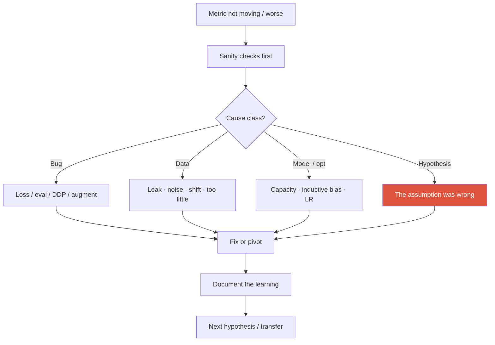
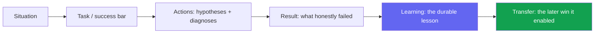

# Failure & Negative Results

<div class="tag-row"><span class="tag">the "this didn't work" story</span><span class="tag">scientific integrity</span><span class="tag">kill criteria & pivots</span><span class="tag">framing negatives</span></div>

> [!TIP] What "tell me about a failure" really scores
> Not the failure — your **diagnostic ability, intellectual honesty, and learning transfer**. A candidate who says "it didn't work, bad luck" fails; one who classifies the cause, shows the disconfirming experiment, and names the win it *seeded later* reads as senior. Every strong researcher has a graveyard; the signal is what you learned digging it.



## Classify before you despair

> [!WARNING] Order of suspicion
> Rule out **bugs and eval mistakes first**, then **data**, then **model/optimization**, and only *last* conclude "the hypothesis is wrong." Killing an idea too early loses the learning; too late burns weeks on a bug.

| Cause class | Symptom | Fast disconfirming test |
| --- | --- | --- |
| **Bug** | NaN loss, impossible metric, train↓/val↑ oddity | Overfit 10–20 images; eval on train; visualize predictions; unit-test IoU/NMS/loss |
| **Data** | Only one domain fails; label noise | Data audit; confusion by stratum; check augment isn't corrupting labels |
| **Model / opt** | Underfit, unstable, plateau | LR sweep, longer train, simpler model, check init/normalization |
| **Hypothesis** | *Zero* gain across all reasonable settings | Oracle / upper-bound features; ablate to emptiness |

**Why bugs first:** they're common and cheap to fix; "the idea is wrong" is the **most expensive conclusion** and should require the most evidence. Segmentation-specific traps: mask-resize interpolation (nearest vs bilinear), class-index offset, void/ignore-region handling — exactly the kind Beomyoung has hit across the segmentation line.

## The "this didn't work and here's what I learned" story

STAR with a twist: the payload is **Learning → Transfer**, not Result.



<details class="qa"><summary>"Tell me about a research direction that didn't pan out."</summary>
<div class="qa-body">

**Short:** Pick a real one, state the success bar you missed, narrate the 2–3 hypotheses you tested and *why you rejected each*, then the lesson and where it later paid off — in ~2–3 minutes.

**Deep:** Keep it **technical and specific** (numbers, timeline, your role vs the team's). Do **not** blame teammates, luck, or "bad data we were handed." End forward-looking: "*that failure is why my next project made X a first-class objective.*" The arc, not the outcome, is what's graded.
</div></details>

### Draft stories from Beomyoung's line (pick ONE, go deep)

<dl class="kv">
<dt>A — Proxy-metric vs perceived quality (weak-sup → matting)</dt><dd><b>S:</b> pushing instance/segmentation quality from cheap supervision. <b>A:</b> a post-processing/CRF route lifted the benchmark number but the *visible* boundary quality in-product stayed poor. <b>R:</b> benchmark up, user-perceived quality flat. <b>L:</b> the proxy metric and perceived quality had diverged. <b>X:</b> ZIM made **soft-boundary / alpha fidelity** an explicit training target, not a post-hoc patch.</dd>
<dt>B — Plasticity–stability wall (continual)</dt><dd><b>S:</b> adding new classes crushed old-class performance. <b>A:</b> naive fine-tune failed; explored regularization/replay/prompt-based options. <b>R:</b> some settings still traded away plasticity or stability. <b>L:</b> the *constraint* (memory/privacy, no full replay) belongs **in the problem definition**. <b>X:</b> ECLIPSE's efficient visual-prompt-tuning continual approach.</dd>
<dt>C — Latency budget (on-device)</dt><dd><b>S:</b> mobile-CPU near-real-time segmentation. <b>A:</b> distilling a large model hit accuracy targets on paper but tripped op-incompatibility / budget overruns on-device. <b>R:</b> missed the ms target before redesign. <b>L:</b> **constraint-first** design beats accuracy-then-shrink. <b>X:</b> the ~10 ms ONNX-served model.</dd>
</dl>

Prepare one thoroughly; keep the other two as one-liners for follow-ups. → [STAR & Story Bank](#/behavioral/star).

## Scientific integrity

> [!DANGER] The lines you never cross
> No test-set tuning sold as a result · no cherry-picked qualitatives standing in for the main claim · no "method X doesn't work" after a half-hearted attempt · no quietly dropping seeds that hurt the average. Getting caught fabricating is career-ending; on stage, a **calibrated** claim always beats an inflated one.

A well-written **negative result** is a contribution: it stops others repeating the dead end. Report it like a positive one — same rigor of setup, the hyperparameter **search range** you covered, and crucially **whether the failure is a limitation of the *implementation* or of the *idea*.** Partial/conditional successes ("works when the object is opaque, fails on translucency") are more useful than a flat "doesn't work."

> [!NOTE] Reviewer's-eye view
> Monotonically-improving tables with *no* failure cases read as **suspicious**, not impressive. Honest limitations *raise* trust and soundness. → [Reading & Critiquing Papers](#/research/papers).

<details class="qa"><summary>"Where do negative results belong — main text or appendix?"</summary>
<div class="qa-body">

**Short:** In the main text if they *shape the reader's belief* about the method (the obvious-but-wrong baseline, the setting where it breaks); in the appendix if they're supporting detail (full search grids). A pure-negative paper is rare but valid as an analysis/workshop contribution.

**Deep:** The test is: would omitting it let a reader over-generalize your claim? If yes, it's a main-text limitation, not an appendix footnote. Burying the one failure that bounds your claim is the kind of omission a sharp reviewer punishes.
</div></details>

## Kill criteria & pivoting

Decide the exit *before* you're emotionally invested — pre-register it like a hypothesis.

| Signal | Reading | Action |
| --- | --- | --- |
| Bug-like anomalies | Idea untested yet | Keep idea, fix implementation |
| Underfits with capacity/data headroom | Not yet a fair test | Scale model/data, retry |
| Even the **oracle** fails | Problem framing is off | Re-define the problem |
| Gain < noise after honest effort | Idea likely doesn't help *here* | Pivot or narrow the claim |

<details class="qa"><summary>"How do you decide when to kill a project vs push harder?"</summary>
<div class="qa-body">

**Short:** Against a pre-set criterion, not ego — e.g. "no tiny-set signal in 2 weeks ⇒ implementation problem; no edge over a strong baseline in 4 weeks ⇒ pivot." An oracle-features test that *also* fails is the strongest kill signal (the ceiling isn't there).

**Deep:** Communicate hypothesis health weekly ("alive / threatened / dead"); hiding a dying direction raises organizational cost. If a manager keeps pushing a dead idea, bring the **disconfirming experiment**, not an opinion — data resolves the disagreement without it becoming personal.
</div></details>

## Research success but product failure

A benchmark-SOTA model can still fail in production — and that's usually a **success-definition mismatch**, not a wrong hypothesis.

- Offline metric uncorrelated with the online/user metric.
- Slice failures (lighting, skin tone, rare classes) hidden by the aggregate.
- No fail-safe / rollback; latency or robustness wall; annotation/monitoring cost.

Beomyoung's research→product track (ZIM→CLOVA-X, FaceSign, foreground API beating commercial tools) lets him frame these as **metric-alignment** failures and describe the fix (slice analysis, shadow deployment, fail-closed safety for FaceSign).

## New failure modes in agent/LLM research

Classic ML debugging **plus trajectory-level** debugging: infinite loops, **reward hacking**, tool misuse, non-stationary web environments, LLM-judge bias, cost blow-up as a failure mode. Distinguish **orchestration** failure from **perception** failure (Beomyoung's under-review NeurIPS work turns silent perception failures into typed diagnoses). Add **stall/loop detection** to kill criteria and human-in-the-loop for recovery. → [Agentic AI & Tool Use](#/llm/agents), [Post-Training & Alignment](#/llm/alignment).

> [!EXAMPLE] Transfer signal that lands
> "Seeing **metric-hacking** in weakly-supervised segmentation gave me the intuition to spot **reward-hacking** in RL/agents early — same failure, different layer of the stack."

## Delivering it on stage — tone

Fact → diagnosis → learning → later impact, in that order. Keep it **short and technical**; minimize the emotional narrative; you don't need to erase teammates (shared learning is fine); close forward-looking. Avoid deflecting with humor, and never disparage a former employer or name confidential/unpublished details.

### Follow-ups they'll push

- *"When exactly did you first see a red flag, and why was it ignored?"* — shows retro maturity; answer with a process fix, not blame.
- *"What assumption did you most wrongly believe going in?"* — name a concrete technical one.
- *"If you restarted today, what changes in week one?"* — a crisp answer proves you extracted the lesson.
- *"How do you coach a junior through a failing project?"* — reduce the *latency to detect* failure; normalize killing ideas.

## One-page diagnosis card

```
Symptom:
Expected vs observed:
Sanity checks passed?  (overfit-tiny / eval-on-train / viz / unit-tests)
Likely cause class:  bug / data / model / hypothesis
Disconfirming experiment run:
Decision:  fix / pivot / kill  (against which criterion?)
Learning to keep:
Where it transferred:
```

## Cheat-sheet

| Item | One-liner |
| --- | --- |
| Suspicion order | Bug → data → model/opt → hypothesis (last) |
| Story arc | S-T-A-R **+ Learning + Transfer**; payload is the lesson |
| Never blame | Teammates, luck, "bad data we got" — own the diagnosis |
| Integrity | Calibrated > inflated; report search range & partial successes |
| Negative result | A contribution if it saves others the dead end |
| Kill criteria | Pre-register; oracle-also-fails = strongest kill signal |
| Product failure | Usually metric-alignment, not wrong hypothesis |
| Agent failures | Loops, reward-hacking, tool misuse; add stall detection |
| Tone | Fact → diagnosis → learning → forward-looking; short & technical |

**Related:** [Experiment Design & Ablations](#/research/experiment-design) · [Debugging & Experimentation](#/foundations/debugging-experimentation) · [Reading & Critiquing Papers](#/research/papers) · [The Research Job Talk](#/research/job-talk) · [STAR & Story Bank](#/behavioral/star) · [Common Behavioral Questions](#/behavioral/questions) · [Agentic AI & Tool Use](#/llm/agents) · [Deep-Dive: ECLIPSE](#/resume/eclipse)
