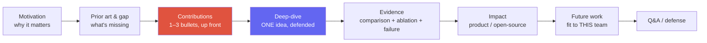
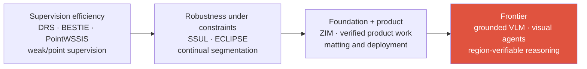
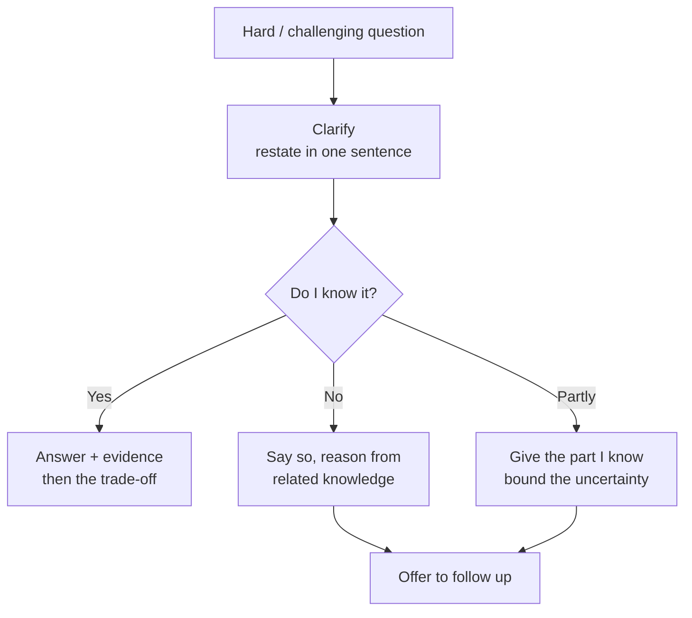

# The Research Job Talk

motivation → contributions → deep-dive → impact → futureslide budgethard Q&Awhat panels score

> [!TIP] 이것부터 말하세요
> Job talk은 많은 Research Scientist 채용에서 <strong>핵심 신호를 모으는 라운드</strong>지만, 비중·길이·청중·평가표는 회사와 팀마다 다릅니다. 이건 논문 낭독이 아니라, 처음 보는 심사위원들이 (a) 어려운 문제를 빠르게 이해할 수 있는지, (b) 팀의 기여에서 *당신의* 기여를 분리해낼 수 있는지, (c) 당신과 협업하는 모습을 그려볼 수 있는지를 검증하는 자리입니다. 완결성이 아니라 <strong>legibility와 defensibility</strong>를 최적화하세요.

> [!WARNING] 흔한 실패 유형
> 논문 전체를 욱여넣는 것. 많은 얕은 결과보다 <strong>하나의 명료한 아이디어와 이를 지지하는 근거</strong>가 기억되도록 선별하세요. 얼마나 많이 했느냐가 아니라 <strong>중요도 × 설명 가능성</strong>으로 구성합니다.

## What the panel is actually scoring

실제 rubric과 의사결정 방식은 조직마다 다르지만, 아래 축은 흔히 반복됩니다. 추상적인 자기평가 대신 각 축을 뒷받침할 <strong>검증 가능한 관찰</strong>을 주세요.

| Axis | The signal they look for | Evidence to supply |
| --- | --- | --- |
| **Problem taste** | 왜 이 문제인가, 왜 지금인가, 왜 어려운가 | Editing-grade boundary는 눈에 보이는 제품 품질의 벽; binary mask는 hair/fur/glass에서 실패 |
| **Contribution clarity** | 팀의 결과와 *당신의* 소유 범위를 구분 | 논문 author contribution·이력서·내부 기록과 일치하는 역할만 1인칭으로 |
| **Technical depth** | 선택을 방어하고, 대안을 안다 | SAM의 한계 → ZIM의 설계 축 → 각 축이 필요했던 근거 |
| **Experimental rigor** | 이득을 귀속시키는 ablation; failure analysis | Architecture / loss / data ablated **on separate axes** |
| **Communication** | 다양한 청중이 따라온다 | 공개 기록으로 확인되는 발표가 있다면 audience별 구성 차이를 예로 |
| **Impact & trajectory** | 제품/OSS 도달 범위 + 설득력 있는 다음 질문 | 공개된 배포·오픈소스 범위와 비공개 내부 결과를 명확히 분리 |
| **Intellectual honesty** | 질문받기 전에 한계를 먼저 말한다 | 대표 failure와 claim scope를 선제적으로 제시 |

> [!NOTE] "I" vs "we"
> "we"만 반복하면 본인 역할이 흐려지고, 반대로 모든 일을 "I"로 말하면 협업을 왜곡합니다. 문장의 주어를 실제 owner에 맞추세요. 예: "*The team shipped the service; my documented scope was the model and evaluation.*" 역할 범위는 논문·이력서·동료가 확인해도 같은 문장이 되게 합니다.

## The canonical arc

<strong>기여는 일찍 밝히고</strong>(gap 바로 다음), deep-dive에서 그것을 *증명*하는 데 시간을 쓰세요. 도착지를 아는 심사위원단은 유도 과정을 훨씬 잘 따라옵니다.

### Slide budget & timing

시계를 두고 리허설하세요. <strong>분당 슬라이드 1장</strong>은 출발점일 뿐이며, visual density와 설명 깊이에 따라 크게 달라집니다. 초대 메일의 발표·질문 시간을 먼저 따르고, 불명확하면 recruiter에게 확인하세요. 아래 표는 하나의 rehearsal baseline입니다.

| Section | 20-min talk | 45-min job talk | Slides (45-min) |
| --- | --- | --- | --- |
| Title + agenda | 0.5 | 1 | 2 |
| Motivation + prior art + gap | 3 | 7 | 4–5 |
| Contributions (explicit) | 1 | 2 | 1 |
| Method deep-dive (one idea) | 6 | 14 | 6–8 |
| Results + ablations + failure | 5 | 11 | 5–7 |
| Impact + future/team-fit | 2.5 | 6 | 3–4 |
| Buffer / transitions | 2 | 4 | — |
| **Q&A (separate)** | 10–15 | 15–30 | backup deck |

> [!DANGER] 시간 규율
> 길어지면 전환·질문 시간이 사라집니다. 노트에 "10분 경고가 뜨면 슬라이드 X로 점프"라는 탈출 경로를 표시하고 작은 buffer를 남기세요. 다만 정해진 발표 시간을 모두 쓰라는 안내가 있다면 그 형식을 우선합니다.

## A concrete outline: the ZIM / continual-seg / weak-sup line

하나의 deck에서 두 가지 버전. 슬라이드 제목은 영어로; 정확한 숫자는 [ZIM deep-dive](#/resume/zim), 논문, 최신 이력서에서 채우세요 — **무대에서 절대 지어내지 마세요**. 아래 고유명사·수치·본인 역할은 완성된 대본이 아니라 채워야 할 예시입니다.

> [!WARNING] 발표 전 claim ledger
> 각 문장을 `peer-reviewed/public` · `public product/OSS` · `confidential but interview-safe` · `placeholder` 중 하나로 표시하세요. `lead author`, `~1M images`, `Highlight`, 제품 통합, latency, 상용 서비스 비교는 출처와 공개 가능 범위를 확인한 뒤에만 남깁니다. 내부 평가는 "우리 제품 분포의 내부 테스트에서"처럼 범위를 함께 말하고, 비교사별 수치나 보편적 우월성으로 확대하지 않습니다.

### Version A — single-paper deep-dive (ZIM, 45 min)

<dl class="kv">
<dt>S0 Title (30s)</dt><dd>*ZIM: Zero-Shot Image Matting for Anything* · venue/honor/author role · 공개적으로 확인 가능한 product/OSS impact. 각 항목은 claim ledger를 통과한 것만 넣습니다.</dd>
<dt>S1 Agenda (20s)</dt><dd>Why boundaries → SAM's gap → ZIM method → evidence → impact & next.</dd>
<dt>S2–3 Motivation (2–3 min)</dt><dd><strong>구체적인 pain</strong>: 들쭉날쭉한 binary edge의 배경 제거는 사용자에게 즉시 보이고; hair/fur/glass/motion-blur가 hard segmentation을 깨뜨립니다. 한 줄로: <strong>“mask quality is the ceiling on editing quality.”</strong> 시장 규모 차트가 아니라 나쁜 binary edge를 보여주세요.</dd>
<dt>S4 Problem formulation (1–2 min)</dt><dd>Promptable segmentation vs matting; output = soft alpha / high-frequency boundary; constraints = SAM-style promptability를 유지하면서 zero-shot generalization.</dd>
<dt>S5 Prior art & gap (2–3 min)</dt><dd>Table: classic matting (soft edge지만 trimap에 묶이고 promptable하지 않음) · SAM-family (promptable, zero-shot지만 binary에 가까움) · task-specific editors (제품 품질이지만 범용은 아님). Framing: <strong>“we don't discard SAM — we lift it to editing-grade boundaries.”</strong></dd>
<dt>S6 Contributions (1 min) ★</dt><dd>논문이 입증한 contribution을 세 개 이하로: 예를 들면 (1) SAM stem 위의 matting 지향 decoder/head; (2) soft, high-frequency 구조를 복원하는 loss; (3) data pipeline. dataset 규모와 개인 ownership은 출처가 확인된 경우에만 수치·1인칭으로 말합니다. "The gain is not one trick — it's these axes, and I'll show what each contributes."</dd>
<dt>S7 Deep-dive: the ONE idea (8–10 min) ★★</dt><dd>가장 비자명한 선택 하나를 고르세요 — 예: *왜 binary-mask supervision이 잘못된 target인지, 그리고 matting head + loss가 모델이 학습하는 바를 어떻게 바꾸는지.* Intuition → diagram → the one equation that matters → 당신이 기각한 대안(Q&A를 미리 장전).</dd>
<dt>S8 Data pipeline (2 min)</dt><dd>Synthetic vs real, filtering, label-noise 처리. 메시지: <q>architecture alone was <strong>not</strong> enough — data was load-bearing</q> → failure story로 연결 ([Failure & Negative Results](#/research/failure)).</dd>
<dt>S9 Qualitative (1–2 min)</dt><dd>어려운 케이스: hair, translucency, thin structure. 같은 crop·scale·prompt에서 baseline과 방법을 나란히 놓고, 대표 failure도 질문받기 전에 보여주세요.</dd>
<dt>S10 Quantitative (2 min)</dt><dd>주요 matting metric (논문 기준 SAD/MSE/Grad/Conn) + zero-shot protocol을 한 문장으로. 아무도 불공정한 baseline이라 비난하지 못하도록 비교의 backbone/data를 명시하세요.</dd>
<dt>S11 Ablations (2–3 min)</dt><dd>세 축을 독립적으로 제거: −data recipe, −loss term, −architecture change. "This is how I attribute the gain to a *cause*, not a coincidence." → [Experiment Design](#/research/experiment-design).</dd>
<dt>S12 Impact (1–2 min)</dt><dd>공개적으로 확인 가능한 product integration·release·demo를 먼저 제시하세요. Foreground-segmentation API의 상용 서비스 비교나 on-device latency는 측정 분포·device·runtime·statistic과 공개 가능 범위를 붙이고, ZIM과 동일 모델인 것처럼 합치지 않습니다.</dd>
<dt>S13 Limitations (1 min)</dt><dd>정직하게: 깨지는 도메인, latency/memory, video temporal consistency 없음 (→ future).</dd>
<dt>S14 Future → this team (1–2 min)</dt><dd>회사마다 마지막 두 문장만 바뀝니다(아래 표). Grounded VLM / region-verifiable reasoning으로 이어지는 다리.</dd>
</dl>

### Version B — trajectory talk (20 min, HM screen / team match)

어떤 심사위원단은 논문 하나가 아니라 <strong>research program</strong>을 원합니다.

1. **2 min** — 각 시기를 한 문장으로 하는 career arc (weak/continual seg → matting foundation model → grounded VLM + agents).
2. **10 min** — ZIM 압축본 (Version A, S5–S11).
3. **4 min** — 제품 전이 (공개·이력서로 확인되는 FaceSign, mobile segmentation, foreground API의 범위와 본인 역할).
4. **2 min** — 팀에 맞춘 향후 2~5년의 비전.
5. **Q&A.**

### The one slide you re-skin per company

아래 문구는 <strong>illustrative hook</strong>입니다. 면접 직전 최신 job description, 해당 팀의 최근 논문·제품, 실제 role scope를 읽고 두 문장만 구체화하세요. 회사 이름에서 연구 의제를 추측하지 않습니다.

| Team | Future-work hook (last two sentences) |
| --- | --- |
| Meta FAIR / VLM | Region-level visual evidence ↔ multimodal reasoning & generation |
| Apple MLR | On-device, efficient, privacy-preserving customized foundation models |
| Adobe Research | Generative editing with Photoshop-grade controllability |
| NVIDIA Research | Efficient generative/perception models on GPU at scale |
| ByteDance Seed | Visual foundation + generative models at product scale |
| Microsoft MSR | Agentic multimodal tools that act on pixels/UI |

### Backup deck (mandatory)

B1 더 많은 failure case · B2 training compute/hyperparameter (정직하게 주장할 수 있는 규모) · B3 serving / ONNX / distillation 경로 · B4 논문·이력서로 author role이 확인된 작업을 90초짜리 breadth 답변으로 · B5 진행 중인 grounded-VLM 작업의 **공개 가능한 문제 정의만** — 팀에 따라 main으로 올리거나 backup에 둡니다.

## Handling Q&A and challenging questions

Q&A는 RS 후보가 만들어지거나 무너지는 곳입니다. 심사위원단은 당신이 아는 것의 *경계*를 찾고 *싶어* 합니다 — 그게 일이지, 모욕이 아닙니다.

"Why didn't you just use a high-res SAM plus a CRF / post-processing?"

<strong>Short:</strong> 실제로 테스트했다면 그 결과를 말하고, 아니라면 "I haven't run that control"이라고 먼저 밝히세요. 예상되는 차이는 CRF가 hard-label boundary를 정제할 수는 있어도, 그 자체로 fractional alpha의 image-formation target을 학습하지는 않는다는 점입니다.

<strong>Deep:</strong> 실제로 돌려봤는지, 어떤 metric이 움직였는지, 입력 unary와 label space가 무엇이었는지를 분리하세요. Dense CRF도 soft probability를 다룰 수 있으므로 "fractional 값을 절대 표현하지 못한다"고 말하면 과장입니다. 더 정확한 주장은 hard segmentation objective 뒤의 CRF가 matting의 alpha decomposition을 새로 식별해 주지는 않는다는 것입니다. 패턴은 <strong>acknowledge → tested or not → evidence/mechanism → residual limitation.</strong>

"Is the gain from your architecture or just from a bigger/cleaner dataset?"

<strong>Short:</strong> 논문의 matched ablation이 있으면 실제 table 값으로 data 효과와 architecture/loss 효과를 각각 말하세요. 없다면 "둘 다 기여할 가능성이 있지만 현재 실험으로 완전히 분리하지 못했다"고 범위를 제한합니다. 무대에서 <code>α</code>, <code>β</code> 같은 placeholder를 읽지 않습니다.

<strong>Deep:</strong> 이것이 바로 ablation을 <strong>independent axes</strong> 위에서 하는 이유입니다. 완전히 분리할 수 없다면, 그렇다고 말하고 예상되는 <em>방향</em>과 그것을 판가름할 실험을 제시하세요. 측정하지 않은 깔끔한 귀속을 절대 주장하지 마세요. → <a href="#/research/experiment-design">Experiment Design</a>.

A question you genuinely don't know the answer to.

<strong>Script (memorize):</strong> <em>“I haven't run that exact experiment, so I don't want to invent a number. Based on our ablation on ___, I'd expect ___. To verify, I'd ___. Happy to follow up.”</em>

<strong>Why it works:</strong> 모르는 범위를 분명히 하면서도 검증 계획을 제시하면 technical judgment를 보여줍니다. 특정 회사나 인물의 공식 평가 기준으로 입증되지 않은 인용을 붙일 필요가 없습니다. 틀린 숫자를 자신 있게 만드는 것보다 정확한 uncertainty가 낫습니다.

> [!QUESTION] "How do I handle a panelist who's openly combative?"
> **Short:** 따뜻함을 유지하고, 속도를 늦추며, 강한 어조와 *기술적* 질문을 분리하세요. **Deep:** 중립적으로 재진술하고("So the concern is whether X confounds the result"), 본질에 답하며, 필요하면 scope나 시간을 확인하세요. 상대의 의도를 "침착함 테스트"라고 단정하지 말고, 반복되는 무례함에는 moderator나 recruiter의 절차를 따릅니다.

### Follow-ups they'll push after your first answer

- *"What would you do differently if you started ZIM today?"* — "nothing"이 아니라 진짜 답을 가지세요 (예: 처음부터 video temporal consistency, 또는 더 저렴한 data pipeline).
- *"Where does this break, and who would be hurt if it shipped wrong?"* — 제품 신뢰와 연결하고, 본인 역할·사건·완화책이 확인되는 안전 관련 사례를 사용하세요.
- *"If we gave you 10× the compute/data, what's the next bottleneck?"* — label noise, eval, curation cost — "just scale it"이 아닙니다.
- *"What's the one experiment you're most proud of, and the one you'd retract?"* — 하나의 답 안에서 taste와 정직함을 보여줍니다.

## Rehearsal plan (D-7 → D-0)

| When | Do |
| --- | --- |
| D-7 | Outline 고정; 논문/CV의 모든 숫자 채우기 |
| D-5 | 시계를 두고 녹화하며 영어 풀런 1회 |
| D-3 | Q&A 카드 12개를 소리 내어 답하기 |
| D-2 | 동료에게 날카롭지만 전문적인 **challenging** Q&A 요청 |
| D-1 | Backup만 다듬기 — 본문을 과도하게 손대지 말 것 |
| D-0 | 화면 공유, 타이머, 데모 mute-fallback 이미지 확인 |

## Cheat-sheet

| Item | One-liner |
| --- | --- |
| Arc | Motivation → gap → contributions (up front) → one deep-dive → evidence → impact → future/fit |
| Golden rule | 얕게 다룬 논문 전체보다, 깊이 방어한 하나의 기억할 만한 아이디어가 낫다 |
| Timing | 초대 형식을 우선; ~1 slide/min은 출발점; buffer와 탈출 경로 준비 |
| Contribution | 실제 owner를 주어로; 팀 결과와 *당신의* 범위를 분리 |
| Rigor | Independent axes로 ablate; failure case를 먼저 스스로 보여줘라 |
| Unknown question | 그렇다고 말하기 → 인접 근거에서 추론 → follow-up 제안; 절대 숫자로 허세 금지 |
| Challenging panelist | 중립적으로 재진술, 본질에 답변, 따뜻함과 경계 유지 |
| Per-company | future-work 슬라이드만 re-skin |

**Related:** [이력서 기반 단계별 예시 답변](#/resume/interview-stage-answers) · [CV deep-dives →](#/resume/overview) · [Deep-Dive: ZIM](#/resume/zim) · [Deep-Dive: ECLIPSE](#/resume/eclipse) · [Presenting Research](#/research/presenting) · [Experiment Design & Ablations](#/research/experiment-design) · [Failure & Negative Results](#/research/failure) · [Reading & Critiquing Papers](#/research/papers) · [STAR & Story Bank](#/behavioral/star) · [The RS/AS Pipeline](#/process/pipeline)
