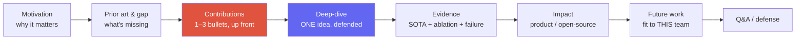
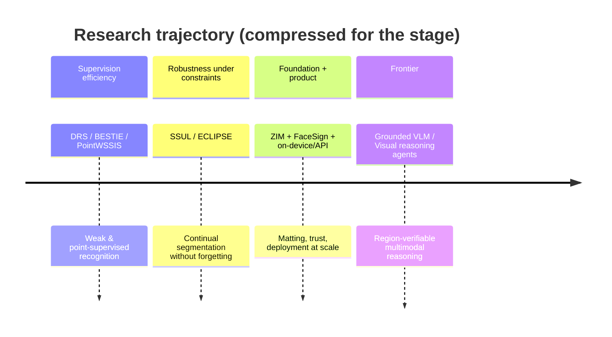

# The Research Job Talk

motivation → contributions → deep-dive → impact → futureslide budgethostile Q&Awhat panels score

> [!TIP] 이것부터 말하세요
> Job talk은 **Research Scientist 채용에서 가장 큰 비중을 차지하는 단일 라운드**입니다 *(defensible)*. 이건 논문 낭독이 아니라, 처음 보는 심사위원들이 (a) 어려운 문제를 다섯 문장 안에 이해할 수 있는지, (b) 팀의 기여에서 *당신의* 기여를 분리해낼 수 있는지, (c) 당신과 협업하는 모습을 그려볼 수 있는지를 검증하는 자리입니다. 완결성이 아니라 **legibility와 defensibility**를 최적화하세요.

> [!WARNING] 1순위 실패 유형
> 논문 전체를 욱여넣는 것. *아무것도* 기억하지 못한 채 나가는 심사위원단은 *하나의 명료한 아이디어를 깊이* 기억하는 심사위원단보다 당신에게 낮은 점수를 줍니다. 얼마나 많이 했느냐가 아니라 **중요도 × 설명 가능성**으로 선별하세요.

## What the panel is actually scoring

각 면접관은 **rubric box**를 채운 뒤 근거와 함께 hire/no-hire를 씁니다. 그들의 box에 들어갈 근거를 주세요.

| Axis | The signal they look for | How Beomyoung supplies it |
| --- | --- | --- |
| **Problem taste** | 왜 이 문제인가, 왜 지금인가, 왜 어려운가 | Editing-grade boundary는 눈에 보이는 제품 품질의 벽; binary mask는 hair/fur/glass에서 실패 |
| **Contribution clarity** | 팀이 아닌 *당신* — 하나의 method, 하나의 insight | "I designed the architecture, matting losses, and the ~1M-image data pipeline" |
| **Technical depth** | 선택을 방어하고, 대안을 안다 | SAM's limits → the three ZIM design axes and why each was needed |
| **Experimental rigor** | 이득을 귀속시키는 ablation; failure analysis | Architecture / loss / data ablated **on separate axes** |
| **Communication** | 다양한 청중이 따라온다 | Prior stage experience: DAN 24, Centum Digital Week, NeurIPS 2021 Social |
| **Impact & trajectory** | 제품/OSS 도달 범위 + 설득력 있는 다음 질문 | ZIM → CLOVA-X Image Editing; open-sourced; → grounded VLMs |
| **Intellectual honesty** | 질문받기 전에 한계를 먼저 말한다 | Shows a failure case *first*; scopes claims |

> [!NOTE] "I" vs "we"
> "we"의 과용은 **RS에게 치명적인 신호**입니다 — 심사위원단이 당신이 무엇을 주도했는지 알 수 없기 때문입니다. 규칙: 협업자를 한 번, 명시적으로 credit한 뒤 자신의 기여는 1인칭으로 서술하세요. "*The team shipped the service; I owned the model, the losses, and the data curation.*"

## The canonical arc

**기여는 일찍 밝히고**(gap 바로 다음), deep-dive에서 그것을 *증명*하는 데 시간을 쓰세요. 도착지를 아는 심사위원단은 유도 과정을 훨씬 잘 따라옵니다.

### Slide budget & timing

시계를 두고 리허설하세요. 본문에서는 **분당 슬라이드 1장** 정도를 목표로 하고, Q&A는 잠식하지 않는 *별도의* 예산으로 취급하세요.

| Section | 20-min talk | 45-min job talk | Slides (45-min) |
| --- | --- | --- | --- |
| Title + agenda | 0.5 | 1 | 2 |
| Motivation + prior art + gap | 3 | 7 | 4–5 |
| Contributions (explicit) | 1 | 2 | 1 |
| Method deep-dive (one idea) | 6 | 14 | 6–8 |
| Results + ablations + failure | 5 | 11 | 5–7 |
| Impact + future/team-fit | 2.5 | 6 | 3–4 |
| Buffer / transitions | 2 | 4 | — |
| **Q&A (separate)** | 10–15 | 15–30 | backup deck |

> [!DANGER] 시간 규율
> 길어지면 *심사위원단이 Q&A를 잘라야 하는데* — 바로 그들이 가장 강한 신호를 모으는 지점입니다. 노트에 "10분 경고가 뜨면 슬라이드 X로 점프"라는 탈출 경로를 표시해두세요. 의도적으로 본문을 **2~3분 일찍** 끝내세요.

## A concrete outline: the ZIM / continual-seg / weak-sup line

하나의 deck에서 두 가지 버전. 슬라이드 제목은 영어로; 정확한 숫자는 [ZIM deep-dive](#/resume/zim)와 논문에서 채우세요 — **무대에서 절대 지어내지 마세요**.

### Version A — single-paper deep-dive (ZIM, 45 min)

<dl class="kv">
<dt>S0 Title (30s)</dt><dd>*ZIM: Zero-Shot Image Matting for Anything* · ICCV 2025 Highlight · lead author · CLOVA-X Image Editing에 배포됨.</dd>
<dt>S1 Agenda (20s)</dt><dd>Why boundaries → SAM's gap → ZIM method → evidence → impact & next.</dd>
<dt>S2–3 Motivation (2–3 min)</dt><dd>**구체적인 pain**: 들쭉날쭉한 binary edge의 배경 제거는 사용자에게 즉시 보이고; hair/fur/glass/motion-blur가 hard segmentation을 깨뜨립니다. 한 줄로: "**mask quality is the ceiling on editing quality.**" 시장 규모 차트가 아니라 나쁜 binary edge를 보여주세요.</dd>
<dt>S4 Problem formulation (1–2 min)</dt><dd>Promptable segmentation vs matting; output = soft alpha / high-frequency boundary; constraints = SAM-style promptability를 유지하면서 zero-shot generalization.</dd>
<dt>S5 Prior art & gap (2–3 min)</dt><dd>Table: classic matting (soft edge지만 trimap에 묶이고 promptable하지 않음) · SAM-family (promptable, zero-shot지만 binary에 가까움) · task-specific editors (제품 품질이지만 범용은 아님). Framing: "**we don't discard SAM — we lift it to editing-grade boundaries.**"</dd>
<dt>S6 Contributions (1 min) ★</dt><dd>1인칭으로 세 개의 bullet: (1) SAM stem 위의 matting 지향 decoder/head; (2) soft, high-frequency 구조를 복원하는 loss; (3) 큐레이션된 ~1M-image data pipeline. "The gain is not one trick — it's these three axes, and I'll show each is necessary."</dd>
<dt>S7 Deep-dive: the ONE idea (8–10 min) ★★</dt><dd>가장 비자명한 선택 하나를 고르세요 — 예: *왜 binary-mask supervision이 잘못된 target인지, 그리고 matting head + loss가 모델이 학습하는 바를 어떻게 바꾸는지.* Intuition → diagram → the one equation that matters → 당신이 기각한 대안(Q&A를 미리 장전).</dd>
<dt>S8 Data pipeline (2 min) ★ panels love this</dt><dd>Synthetic vs real, filtering, label-noise 처리. 메시지: "architecture alone was **not** enough — data was load-bearing" → failure story로 연결 ([Failure & Negative Results](#/research/failure)).</dd>
<dt>S9 Qualitative (1–2 min)</dt><dd>어려운 케이스: hair, translucency, thin structure. SAM vs ZIM 나란히. **Show a failure case yourself, first** — 신뢰를 삽니다.</dd>
<dt>S10 Quantitative (2 min)</dt><dd>주요 matting metric (논문 기준 SAD/MSE/Grad/Conn) + zero-shot protocol을 한 문장으로. 아무도 불공정한 baseline이라 비난하지 못하도록 비교의 backbone/data를 명시하세요.</dd>
<dt>S11 Ablations (2–3 min)</dt><dd>세 축을 독립적으로 제거: −data recipe, −loss term, −architecture change. "This is how I attribute the gain to a *cause*, not a coincidence." → [Experiment Design](#/research/experiment-design).</dd>
<dt>S12 Impact (1–2 min)</dt><dd>CLOVA-X Image Editing 통합; 공개 릴리스 + 데모; 인접 전이 (상용 대안을 능가하는 foreground-segmentation API, on-device ~10 ms human seg).</dd>
<dt>S13 Limitations (1 min)</dt><dd>정직하게: 깨지는 도메인, latency/memory, video temporal consistency 없음 (→ future).</dd>
<dt>S14 Future → this team (1–2 min)</dt><dd>회사마다 마지막 두 문장만 바뀝니다(아래 표). Grounded VLM / region-verifiable reasoning으로 이어지는 다리.</dd>
</dl>

### Version B — trajectory talk (20 min, HM screen / team match)

어떤 심사위원단은 논문 하나가 아니라 **research program**을 원합니다.

1. **2 min** — 각 시기를 한 문장으로 하는 career arc (weak/continual seg → matting foundation model → grounded VLM + agents).
2. **10 min** — ZIM 압축본 (Version A, S5–S11).
3. **4 min** — 제품 전이 (FaceSign anti-spoofing, ~10 ms mobile seg, foreground API).
4. **2 min** — 팀에 맞춘 향후 2~5년의 비전.
5. **Q&A.**

### The one slide you re-skin per company

| Team | Future-work hook (last two sentences) |
| --- | --- |
| Meta FAIR / VLM | Region-level visual evidence ↔ multimodal reasoning & generation |
| Apple MLR | On-device, efficient, privacy-preserving customized foundation models |
| Adobe Research | Generative editing with Photoshop-grade controllability |
| NVIDIA Research | Efficient generative/perception models on GPU at scale |
| ByteDance Seed | Visual foundation + generative models at product scale |
| Microsoft MSR | Agentic multimodal tools that act on pixels/UI |

### Backup deck (mandatory)

B1 더 많은 failure case · B2 training compute/hyperparameter (정직하게 주장할 수 있는 규모) · B3 serving / ONNX / distillation 경로 · B4 first-author 라인 (ECLIPSE, PointWSSIS)을 90초짜리 breadth 답변으로 · B5 진행 중인 grounded-VLM 작업 — 팀에 따라 main으로 올리거나 backup에 둡니다.

## Handling Q&A and hostile questions

Q&A는 RS 후보가 만들어지거나 무너지는 곳입니다. 심사위원단은 당신이 아는 것의 *경계*를 찾고 *싶어* 합니다 — 그게 일이지, 모욕이 아닙니다.

"Why didn't you just use a high-res SAM plus a CRF / post-processing?"

**Short:** post-hoc refinement를 시도했습니다; edge를 겉보기에는 날카롭게 하지만 *soft* alpha 구조(sub-pixel hair, translucency)를 복원하지 못하고, failure mode를 해결하지 못한 채 latency만 더합니다.

**Deep:** 실제로 돌려봤는지(정직하게 말하기), 어떤 metric이 움직였고 아니었는지, 그리고 *왜*인지를 밝히세요 — CRF는 hard label field 위에서 동작하므로 fractional coverage를 표현할 수 없습니다. 이것이 모든 "why not baseline X?"의 패턴입니다: **acknowledge → did you test it → mechanistic reason → residual limitation.**

"Is the gain from your architecture or just from a bigger/cleaner dataset?"

**Short:** 둘 다 기여하며, 나는 그것을 분리했습니다: data alone이 metric을 α만큼 올리고, data를 고정한 채 architecture/loss가 그 위에 β를 더합니다.

**Deep:** 이것이 바로 ablation을 **independent axes** 위에서 하는 이유입니다. 완전히 분리할 수 없다면, 그렇다고 말하고 예상되는 *방향*과 그것을 판가름할 실험을 제시하세요. 측정하지 않은 깔끔한 귀속을 절대 주장하지 마세요. → [Experiment Design](#/research/experiment-design).

A question you genuinely don't know the answer to.

**Script (memorize):** "*I haven't run that exact experiment, so I don't want to invent a number. Based on our ablation on ___, I'd expect ___. To verify, I'd ___. Happy to follow up.*"

**Why it scores:** intellectual honesty는 *채점되는* 축입니다 (NVIDIA가 명시하고; MSR의 Danyel Fisher는 우아한 "I don't know, but here's my approach"를 핵심 평가 자질로 꼽습니다). 틀린 숫자로 자신 있게 허세를 부리는 것은 실격 사유입니다.

> [!QUESTION] "How do I handle a panelist who's openly combative?"
> **Short:** 따뜻함을 유지하고, 속도를 늦추며, 그 공격을 어조를 벗겨낸 *기술적* 질문으로 다루세요. **Deep:** 중립적으로 재진술하고("So the concern is whether X confounds the result — good question"), 본질에 답하며, 절대 방어적이거나 무시하는 태도를 취하지 마세요. 심사위원단은 때때로 침착함을 의도적으로 시험합니다; 논쟁하거나 질문을 흘려버리는 후보는 정답을 말해도 협업 신호에서 탈락합니다.

### Follow-ups they'll push after your first answer

- *"What would you do differently if you started ZIM today?"* — "nothing"이 아니라 진짜 답을 가지세요 (예: 처음부터 video temporal consistency, 또는 더 저렴한 data pipeline).
- *"Where does this break, and who would be hurt if it shipped wrong?"* — 제품 신뢰와 연결; FaceSign이 진정한 safety-mindset 스토리를 줍니다.
- *"If we gave you 10× the compute/data, what's the next bottleneck?"* — label noise, eval, curation cost — "just scale it"이 아닙니다.
- *"What's the one experiment you're most proud of, and the one you'd retract?"* — 하나의 답 안에서 taste와 정직함을 보여줍니다.

## Rehearsal plan (D-7 → D-0)

| When | Do |
| --- | --- |
| D-7 | Outline 고정; 논문/CV의 모든 숫자 채우기 |
| D-5 | 시계를 두고 녹화하며 영어 풀런 1회 |
| D-3 | Q&A 카드 12개를 소리 내어 답하기 |
| D-2 | 동료에게 의도적으로 **hostile**한 Q&A 요청 |
| D-1 | Backup만 다듬기 — 본문을 과도하게 손대지 말 것 |
| D-0 | 화면 공유, 타이머, 데모 mute-fallback 이미지 확인 |

## Cheat-sheet

| Item | One-liner |
| --- | --- |
| Arc | Motivation → gap → contributions (up front) → one deep-dive → evidence → impact → future/fit |
| Golden rule | 얕게 다룬 논문 전체보다, 깊이 방어한 하나의 기억할 만한 아이디어가 낫다 |
| Timing | ~1 slide/min; 본문을 2~3분 일찍 끝내라; Q&A는 별도 예산 |
| Contribution | 팀을 한 번 credit한 뒤, *당신의* 몫을 1인칭으로 서술 |
| Rigor | Independent axes로 ablate; failure case를 먼저 스스로 보여줘라 |
| Unknown question | 그렇다고 말하기 → 인접 근거에서 추론 → follow-up 제안; 절대 숫자로 허세 금지 |
| Hostile panelist | 중립적으로 재진술, 본질에 답변, 따뜻함 유지 — 침착함이 채점됨 |
| Per-company | future-work 슬라이드만 re-skin |

**Related:** [CV deep-dives →](#/resume/overview) · [Deep-Dive: ZIM](#/resume/zim) · [Deep-Dive: ECLIPSE](#/resume/eclipse) · [Presenting Research](#/research/presenting) · [Experiment Design & Ablations](#/research/experiment-design) · [Failure & Negative Results](#/research/failure) · [Reading & Critiquing Papers](#/research/papers) · [STAR & Story Bank](#/behavioral/star) · [The RS/AS Pipeline](#/process/pipeline)
