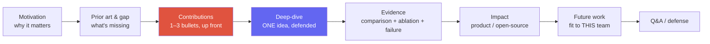
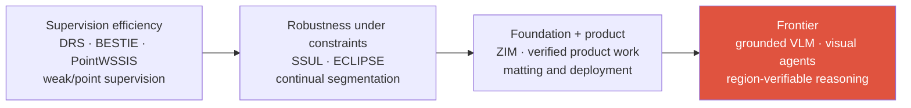
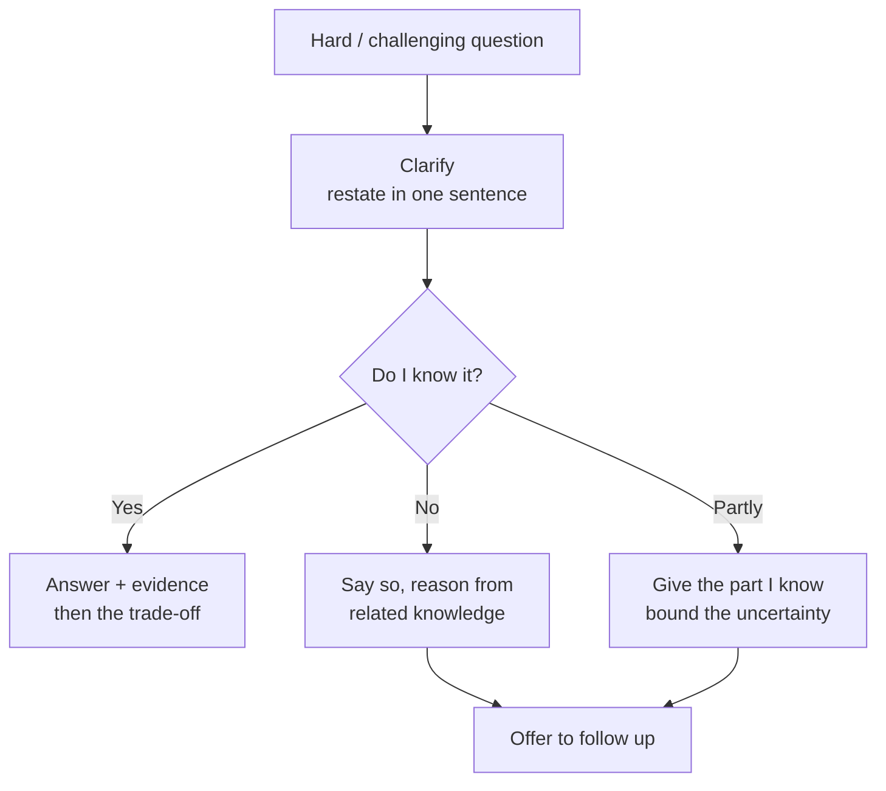

# The Research Job Talk

motivation → contributions → deep-dive → impact → futureslide budgethard Q&Awhat panels score

> [!TIP] Say this first
> The job talk is a **major signal-gathering round** in many Research Scientist hiring processes, but its weight, length, audience, and rubric vary by company and team. It is not a paper reading: it tests whether a panel of strangers can (a) understand a hard problem quickly, (b) isolate *your* contribution from the team's, and (c) picture collaborating with you. Optimize for **legibility and defensibility**, not completeness.

> [!WARNING] The #1 failure mode
> Cramming in the whole paper. Select so the audience remembers **one clear idea and the evidence supporting it**, rather than many shallow results. Organize by **importance × explainability**, not by volume of work.

## What the panel is actually scoring

Actual rubrics and decision processes vary by organization, but the following axes recur. Supply **verifiable observations** for each rather than abstract self-assessment.

| Axis | The signal they look for | Evidence to supply |
| --- | --- | --- |
| **Problem taste** | Why this problem, why now, why it's hard | Editing-grade boundaries are a visible product-quality wall; binary masks fail on hair/fur/glass |
| **Contribution clarity** | Distinguish the team's result from *your* scope | Use first person only for a role consistent with author contributions, the CV, and internal records |
| **Technical depth** | Defends choices, knows the alternatives | SAM's limits → the three ZIM design axes and why each was needed |
| **Experimental rigor** | Ablations that attribute the gain; failure analysis | Architecture / loss / data ablated **on separate axes** |
| **Communication** | A mixed audience follows | If public speaking records are available, show how the framing changed by audience |
| **Impact & trajectory** | Product/OSS reach + a credible next question | Clearly separate public deployments and open-source scope from private internal results |
| **Intellectual honesty** | Names limits before being asked | Present a representative failure and claim scope proactively |

> [!NOTE] "I" vs "we"
> Repeating only "we" obscures your role, while saying "I" for everything distorts collaboration. Match the grammatical subject to the actual owner: for example, "*The team shipped the service; my documented scope was the model and evaluation.*" Your scope should remain the same if checked against the paper, CV, and collaborators.

## The canonical arc

**State contributions early** (right after the gap), then spend the deep-dive *earning* them. A panel that knows the destination follows the derivation far better.

### Slide budget & timing

Rehearse with a clock. **One slide per minute** is only a starting point; visual density and explanatory depth can change it substantially. Follow the talk and Q&A times in the invitation, and ask the recruiter if they are unclear. The table below is one rehearsal baseline.

| Section | 20-min talk | 45-min job talk | Slides (45-min) |
| --- | --- | --- | --- |
| Title + agenda | 0.5 | 1 | 2 |
| Motivation + prior art + gap | 3 | 7 | 4–5 |
| Contributions (explicit) | 1 | 2 | 1 |
| Method deep-dive (one idea) | 6 | 14 | 6–8 |
| Results + ablations + failure | 5 | 11 | 5–7 |
| Impact + future/team-fit | 2.5 | 6 | 3–4 |
| Buffer / transitions | 2 | 4 | — |
| **Q&A (separate)** | 10–15 | 15–30 | backup deck |

> [!DANGER] Time discipline
> Running long removes transition or question time. Mark an escape route in your notes—"if the ten-minute warning appears, jump to slide X"—and keep a small buffer. If you are explicitly asked to use the entire scheduled presentation time, follow that format instead.

## A concrete outline: the ZIM / continual-seg / weak-sup line

Two versions from one deck. Keep slide titles in English; fill exact numbers from the [ZIM deep-dive](#/resume/zim), the paper, and the latest CV—**never invent them on stage**. The names, numbers, and ownership below are examples to verify, not a finished script.

> [!WARNING] Claim ledger before the talk
> Label every sentence `peer-reviewed/public`, `public product/OSS`, `confidential but interview-safe`, or `placeholder`. Keep `lead author`, `~1M images`, `Highlight`, product integration, latency, and comparisons with commercial services only after checking both the source and disclosure boundary. Scope an internal evaluation as "on an internal test drawn from our product distribution," rather than expanding it into per-competitor numbers or universal superiority.

### Version A — single-paper deep-dive (ZIM, 45 min)

<dl class="kv">
<dt>S0 Title (30s)</dt><dd>*ZIM: Zero-Shot Image Matting for Anything* · venue/honor/author role · publicly verifiable product/OSS impact. Include each item only after it passes the claim ledger.</dd>
<dt>S1 Agenda (20s)</dt><dd>Why boundaries → SAM's gap → ZIM method → evidence → impact & next.</dd>
<dt>S2–3 Motivation (2–3 min)</dt><dd>A **specific pain**: background removal with a jagged binary edge is instantly visible to a user; hair/fur/glass/motion-blur break hard segmentation. One line: "**mask quality is the ceiling on editing quality.**" Show a bad binary edge, not a market-size chart.</dd>
<dt>S4 Problem formulation (1–2 min)</dt><dd>Promptable segmentation vs matting; output = soft alpha / high-frequency boundary; constraints = zero-shot generalization while keeping SAM-style promptability.</dd>
<dt>S5 Prior art & gap (2–3 min)</dt><dd>Table: classic matting (soft edges, but trimap-bound, not promptable) · SAM-family (promptable, zero-shot, but binary-ish) · task-specific editors (product quality, not general). Framing: "**we don't discard SAM — we lift it to editing-grade boundaries.**"</dd>
<dt>S6 Contributions (1 min) ★</dt><dd>Use at most three contributions established by the paper, for example (1) a matting-oriented decoder/head on the SAM stem, (2) a loss that recovers soft high-frequency structure, and (3) a data pipeline. State dataset size and personal ownership numerically or in first person only when sourced. "The gain is not one trick—it's these axes, and I'll show what each contributes."</dd>
<dt>S7 Deep-dive: the ONE idea (8–10 min) ★★</dt><dd>Pick the single most non-obvious choice — e.g. *why binary-mask supervision is the wrong target and how the matting head + loss changes what the model learns.* Intuition → diagram → the one equation that matters → the alternative you rejected (pre-loading the Q&A).</dd>
<dt>S8 Data pipeline (2 min)</dt><dd>Synthetic vs real, filtering, and label-noise handling. Message: <q>architecture alone was <strong>not</strong> enough—data was load-bearing</q> → link to the failure story ([Failure & Negative Results](#/research/failure)).</dd>
<dt>S9 Qualitative (1–2 min)</dt><dd>Hard cases: hair, translucency, and thin structures. Put the baseline and method side by side with the same crop, scale, and prompt, and show a representative failure before being asked.</dd>
<dt>S10 Quantitative (2 min)</dt><dd>Primary matting metrics (SAD/MSE/Grad/Conn per the paper) + the zero-shot protocol in one sentence. State the comparison's backbone/data so no one can accuse you of an unfair baseline.</dd>
<dt>S11 Ablations (2–3 min)</dt><dd>Three axes removed independently: −data recipe, −loss term, −architecture change. "This is how I attribute the gain to a *cause*, not a coincidence." → [Experiment Design](#/research/experiment-design).</dd>
<dt>S12 Impact (1–2 min)</dt><dd>Lead with publicly verifiable product integration, release, or demos. Attach the evaluation distribution, device, runtime, statistic, and disclosure scope to a foreground-segmentation API comparison or on-device latency, and do not imply it is the same model as ZIM.</dd>
<dt>S13 Limitations (1 min)</dt><dd>Honest: domains where it breaks, latency/memory, no video temporal consistency (→ future).</dd>
<dt>S14 Future → this team (1–2 min)</dt><dd>Only the last two sentences change per company (table below). Bridge to grounded VLMs / region-verifiable reasoning.</dd>
</dl>

### Version B — trajectory talk (20 min, HM screen / team match)

Some panels want the **research program**, not one paper.

1. **2 min** — career arc as one sentence per era (weak/continual seg → matting foundation model → grounded VLM + agents).
2. **10 min** — ZIM compressed (Version A, S5–S11).
3. **4 min** — product transfers, limited to the scope and role verifiable from public material or the CV (FaceSign, mobile segmentation, foreground API).
4. **2 min** — vision for the next 2–5 years, tailored to the team.
5. **Q&A.**

### The one slide you re-skin per company

The text below is an **illustrative hook**. Immediately before the interview, read the current job description, recent work or products from the team, and the actual role scope, then make only the final two sentences concrete. Do not infer a research agenda from the company name.

| Team | Future-work hook (last two sentences) |
| --- | --- |
| Meta FAIR / VLM | Region-level visual evidence ↔ multimodal reasoning & generation |
| Apple MLR | On-device, efficient, privacy-preserving customized foundation models |
| Adobe Research | Generative editing with Photoshop-grade controllability |
| NVIDIA Research | Efficient generative/perception models on GPU at scale |
| ByteDance Seed | Visual foundation + generative models at product scale |
| Microsoft MSR | Agentic multimodal tools that act on pixels/UI |

### Backup deck (mandatory)

B1 more failure cases · B2 training compute/hyperparameters at a scale you can honestly claim · B3 serving / ONNX / distillation path · B4 work whose author role is verified by the paper and CV as a 90-second breadth answer · B5 only the **publicly discussable problem definition** of ongoing grounded-VLM work—promote to main or keep in backup depending on the team.

## Handling Q&A and challenging questions

Q&A is where RS candidates are made or broken. The panel *wants* to find the edge of what you know — that is the job, not an insult.

"Why didn't you just use a high-res SAM plus a CRF / post-processing?"

**Short:** If you actually tested it, report the result; otherwise begin with "I haven't run that control." The expected distinction is that a CRF can refine a hard-label boundary, but does not by itself learn the image-formation target for fractional alpha.

**Deep:** Separate whether you ran it, which metric moved, and what the unary input and label space were. A dense CRF can operate on soft probabilities, so saying it can never represent fractional values is too strong. The more precise claim is that a CRF after a hard-segmentation objective does not newly identify the alpha decomposition of matting. Use **acknowledge → tested or not → evidence/mechanism → residual limitation.**

"Is the gain from your architecture or just from a bigger/cleaner dataset?"

**Short:** If the paper has a matched ablation, use its actual table values to report the data effect and the architecture/loss effect separately. If not, say that both may contribute but the current experiment does not fully separate them. Never read placeholders such as <code>α</code> or <code>β</code> on stage.

**Deep:** This is exactly why the ablation is on **independent axes**. If you can't fully separate them, say so and give the *direction* you'd expect and the experiment that would settle it. Never claim a clean attribution you didn't measure. → [Experiment Design](#/research/experiment-design).

A question you genuinely don't know the answer to.

**Script (memorize):** "*I haven't run that exact experiment, so I don't want to invent a number. Based on our ablation on ___, I'd expect ___. To verify, I'd ___. Happy to follow up.*"

**Why it works:** Marking the boundary of what you know while proposing a validation plan demonstrates technical judgment. You do not need an unsupported quotation about an official evaluation criterion from a particular company or individual. Calibrated uncertainty is better than inventing a precise number.

> [!QUESTION] "How do I handle a panelist who's openly combative?"
> **Short:** Stay warm, slow down, and separate the strong tone from the *technical* question. **Deep:** Restate it neutrally ("So the concern is whether X confounds the result"), answer the substance, and ask about scope or time if needed. Do not assume the intent is to test composure; for repeated disrespect, follow the moderator's or recruiter's process.

### Follow-ups they'll push after your first answer

- *"What would you do differently if you started ZIM today?"* — have a real answer (e.g., video temporal consistency from the start, or a cheaper data pipeline), not "nothing."
- *"Where does this break, and who would be hurt if it shipped wrong?"* — connect to product trust and use a safety example only when your role, incident, and mitigation are verified.
- *"If we gave you 10× the compute/data, what's the next bottleneck?"* — label noise, eval, curation cost — not "just scale it."
- *"What's the one experiment you're most proud of, and the one you'd retract?"* — shows taste and honesty in a single answer.

## Rehearsal plan (D-7 → D-0)

| When | Do |
| --- | --- |
| D-7 | Freeze outline; fill every number from the paper/CV |
| D-5 | One full English run, recorded, on the clock |
| D-3 | Answer 12 of your Q&A cards out loud |
| D-2 | Ask a colleague for a sharp but professional **challenging** Q&A |
| D-1 | Polish backup only — do not over-edit the body |
| D-0 | Check screen-share, timer, demo mute-fallback image |

## Cheat-sheet

| Item | One-liner |
| --- | --- |
| Arc | Motivation → gap → contributions (up front) → one deep-dive → evidence → impact → future/fit |
| Golden rule | One memorable idea, deeply defended > the whole thesis, shallowly |
| Timing | Follow the invitation; ~1 slide/min is a starting point; keep a buffer and escape route |
| Contribution | Match the subject to the actual owner; separate the team's result from *your* scope |
| Rigor | Ablate on independent axes; show a failure case yourself first |
| Unknown question | Say so → reason from adjacent evidence → offer to follow up; never bluff a number |
| Challenging panelist | Restate neutrally, answer the substance, and maintain warmth and boundaries |
| Per-company | Re-skin only the future-work slide |

**Related:** [Resume-based stage-by-stage answer examples](#/resume/interview-stage-answers) · [CV deep-dives →](#/resume/overview) · [Deep-Dive: ZIM](#/resume/zim) · [Deep-Dive: ECLIPSE](#/resume/eclipse) · [Presenting Research](#/research/presenting) · [Experiment Design & Ablations](#/research/experiment-design) · [Failure & Negative Results](#/research/failure) · [Reading & Critiquing Papers](#/research/papers) · [STAR & Story Bank](#/behavioral/star) · [The RS/AS Pipeline](#/process/pipeline)
