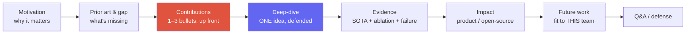
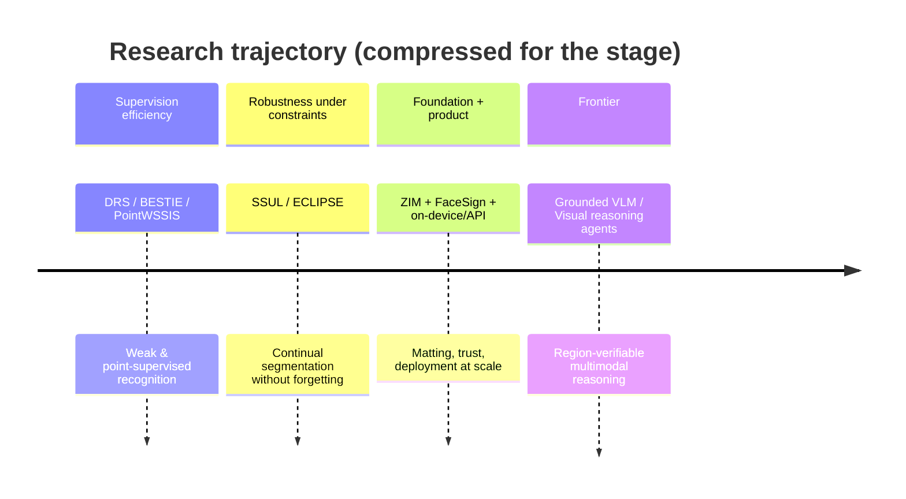

# The Research Job Talk

motivation → contributions → deep-dive → impact → futureslide budgethostile Q&Awhat panels score

> [!TIP] Say this first
> The job talk is the **single most heavily-weighted round for a Research Scientist** *(defensible)*. It is not a paper reading — it is a test of whether a panel of strangers can (a) understand a hard problem in five sentences, (b) isolate *your* contribution from the team's, and (c) picture collaborating with you. Optimize for **legibility and defensibility**, not completeness.

> [!WARNING] The #1 failure mode
> Cramming the whole thesis. A panel that leaves remembering *nothing* scores you lower than one that remembers *one crisp idea deeply*. Select for **importance × explainability**, not for how much you did.

## What the panel is actually scoring

Interviewers each fill a **rubric box**, then write hire/no-hire with evidence. Give them the evidence for their box.

| Axis | The signal they look for | How Beomyoung supplies it |
| --- | --- | --- |
| **Problem taste** | Why this problem, why now, why it's hard | Editing-grade boundaries are a visible product-quality wall; binary masks fail on hair/fur/glass |
| **Contribution clarity** | *You* vs the team — one method, one insight | "I designed the architecture, matting losses, and the ~1M-image data pipeline" |
| **Technical depth** | Defends choices, knows the alternatives | SAM's limits → the three ZIM design axes and why each was needed |
| **Experimental rigor** | Ablations that attribute the gain; failure analysis | Architecture / loss / data ablated **on separate axes** |
| **Communication** | A mixed audience follows | Prior stage experience: DAN 24, Centum Digital Week, NeurIPS 2021 Social |
| **Impact & trajectory** | Product/OSS reach + a credible next question | ZIM → CLOVA-X Image Editing; open-sourced; → grounded VLMs |
| **Intellectual honesty** | Names limits before being asked | Shows a failure case *first*; scopes claims |

> [!NOTE] "I" vs "we"
> Over-using "we" is a **fatal signal for RS** — the panel cannot tell what you drove. Rule: credit collaborators once, explicitly, then narrate your own contributions in the first person. "*The team shipped the service; I owned the model, the losses, and the data curation.*"

## The canonical arc

**State contributions early** (right after the gap), then spend the deep-dive *earning* them. A panel that knows the destination follows the derivation far better.

### Slide budget & timing

Rehearse with a clock. Aim for **~1 slide/minute** in the body, and treat Q&A as a *separate* budget you do not eat into.

| Section | 20-min talk | 45-min job talk | Slides (45-min) |
| --- | --- | --- | --- |
| Title + agenda | 0.5 | 1 | 2 |
| Motivation + prior art + gap | 3 | 7 | 4–5 |
| Contributions (explicit) | 1 | 2 | 1 |
| Method deep-dive (one idea) | 6 | 14 | 6–8 |
| Results + ablations + failure | 5 | 11 | 5–7 |
| Impact + future/team-fit | 2.5 | 6 | 3–4 |
| Buffer / transitions | 2 | 4 | — |
| **Q&A (separate)** | 10–15 | 15–30 | backup deck |

> [!DANGER] Time discipline
> Running long *forces the panel to cut Q&A* — the exact place they gather their strongest signal. Mark a "if the 10-min warning hits, jump to slide X" escape route on your notes. Finish the body **2–3 minutes early** on purpose.

## A concrete outline: the ZIM / continual-seg / weak-sup line

Two versions off one deck. Slide titles in English; fill exact numbers from the [ZIM deep-dive](#/resume/zim) and the paper — **never invent them on stage**.

### Version A — single-paper deep-dive (ZIM, 45 min)

<dl class="kv">
<dt>S0 Title (30s)</dt><dd>*ZIM: Zero-Shot Image Matting for Anything* · ICCV 2025 Highlight · lead author · deployed in CLOVA-X Image Editing.</dd>
<dt>S1 Agenda (20s)</dt><dd>Why boundaries → SAM's gap → ZIM method → evidence → impact & next.</dd>
<dt>S2–3 Motivation (2–3 min)</dt><dd>A **specific pain**: background removal with a jagged binary edge is instantly visible to a user; hair/fur/glass/motion-blur break hard segmentation. One line: "**mask quality is the ceiling on editing quality.**" Show a bad binary edge, not a market-size chart.</dd>
<dt>S4 Problem formulation (1–2 min)</dt><dd>Promptable segmentation vs matting; output = soft alpha / high-frequency boundary; constraints = zero-shot generalization while keeping SAM-style promptability.</dd>
<dt>S5 Prior art & gap (2–3 min)</dt><dd>Table: classic matting (soft edges, but trimap-bound, not promptable) · SAM-family (promptable, zero-shot, but binary-ish) · task-specific editors (product quality, not general). Framing: "**we don't discard SAM — we lift it to editing-grade boundaries.**"</dd>
<dt>S6 Contributions (1 min) ★</dt><dd>Three bullets, first person: (1) a matting-oriented decoder/head on the SAM stem; (2) losses that recover soft, high-frequency structure; (3) a curated ~1M-image data pipeline. "The gain is not one trick — it's these three axes, and I'll show each is necessary."</dd>
<dt>S7 Deep-dive: the ONE idea (8–10 min) ★★</dt><dd>Pick the single most non-obvious choice — e.g. *why binary-mask supervision is the wrong target and how the matting head + loss changes what the model learns.* Intuition → diagram → the one equation that matters → the alternative you rejected (pre-loading the Q&A).</dd>
<dt>S8 Data pipeline (2 min) ★ panels love this</dt><dd>Synthetic vs real, filtering, label-noise handling. Message: "architecture alone was **not** enough — data was load-bearing" → links to the failure story ([Failure & Negative Results](#/research/failure)).</dd>
<dt>S9 Qualitative (1–2 min)</dt><dd>Hard cases: hair, translucency, thin structures. SAM vs ZIM side-by-side. **Show a failure case yourself, first** — it buys credibility.</dd>
<dt>S10 Quantitative (2 min)</dt><dd>Primary matting metrics (SAD/MSE/Grad/Conn per the paper) + the zero-shot protocol in one sentence. State the comparison's backbone/data so no one can accuse you of an unfair baseline.</dd>
<dt>S11 Ablations (2–3 min)</dt><dd>Three axes removed independently: −data recipe, −loss term, −architecture change. "This is how I attribute the gain to a *cause*, not a coincidence." → [Experiment Design](#/research/experiment-design).</dd>
<dt>S12 Impact (1–2 min)</dt><dd>CLOVA-X Image Editing integration; public release + demo; adjacent transfers (foreground-segmentation API beating commercial alternatives, on-device ~10 ms human seg).</dd>
<dt>S13 Limitations (1 min)</dt><dd>Honest: domains where it breaks, latency/memory, no video temporal consistency (→ future).</dd>
<dt>S14 Future → this team (1–2 min)</dt><dd>Only the last two sentences change per company (table below). Bridge to grounded VLMs / region-verifiable reasoning.</dd>
</dl>

### Version B — trajectory talk (20 min, HM screen / team match)

Some panels want the **research program**, not one paper.

1. **2 min** — career arc as one sentence per era (weak/continual seg → matting foundation model → grounded VLM + agents).
2. **10 min** — ZIM compressed (Version A, S5–S11).
3. **4 min** — product transfers (FaceSign anti-spoofing, ~10 ms mobile seg, foreground API).
4. **2 min** — vision for the next 2–5 years, tailored to the team.
5. **Q&A.**

### The one slide you re-skin per company

| Team | Future-work hook (last two sentences) |
| --- | --- |
| Meta FAIR / VLM | Region-level visual evidence ↔ multimodal reasoning & generation |
| Apple MLR | On-device, efficient, privacy-preserving customized foundation models |
| Adobe Research | Generative editing with Photoshop-grade controllability |
| NVIDIA Research | Efficient generative/perception models on GPU at scale |
| ByteDance Seed | Visual foundation + generative models at product scale |
| Microsoft MSR | Agentic multimodal tools that act on pixels/UI |

### Backup deck (mandatory)

B1 more failure cases · B2 training compute/hyperparameters (scale you can honestly claim) · B3 serving / ONNX / distillation path · B4 the first-author line (ECLIPSE, PointWSSIS) as a 90-second breadth answer · B5 ongoing grounded-VLM work — promote to main or leave in backup depending on the team.

## Handling Q&A and hostile questions

Q&A is where RS candidates are made or broken. The panel *wants* to find the edge of what you know — that is the job, not an insult.

"Why didn't you just use a high-res SAM plus a CRF / post-processing?"

**Short:** We tried post-hoc refinement; it sharpens edges cosmetically but doesn't recover *soft* alpha structure (sub-pixel hair, translucency), and it adds latency without solving the failure mode.

**Deep:** State whether you actually ran it (say so honestly), what metric it moved vs didn't, and *why* — a CRF operates on a hard label field, so it can't represent fractional coverage. This is the pattern for every "why not baseline X?": **acknowledge → did you test it → mechanistic reason → residual limitation.**

"Is the gain from your architecture or just from a bigger/cleaner dataset?"

**Short:** Both contribute, and I separated them: data alone lifts the metric by α, the architecture/loss adds β on top of that, holding data fixed.

**Deep:** This is exactly why the ablation is on **independent axes**. If you can't fully separate them, say so and give the *direction* you'd expect and the experiment that would settle it. Never claim a clean attribution you didn't measure. → [Experiment Design](#/research/experiment-design).

A question you genuinely don't know the answer to.

**Script (memorize):** "*I haven't run that exact experiment, so I don't want to invent a number. Based on our ablation on ___, I'd expect ___. To verify, I'd ___. Happy to follow up.*"

**Why it scores:** intellectual honesty *is* a graded axis (NVIDIA names it; MSR's Danyel Fisher lists graceful "I don't know, but here's my approach" as a core evaluated quality). A confident bluff with a wrong number is disqualifying.

> [!QUESTION] "How do I handle a panelist who's openly combative?"
> **Short:** Stay warm, slow down, and treat the attack as a *technical* question stripped of its tone. **Deep:** Restate it neutrally ("So the concern is whether X confounds the result — good question"), answer the substance, and never get defensive or dismissive. Panels sometimes test composure deliberately; a candidate who argues or waves off the question fails the collaboration signal even with a correct answer.

### Follow-ups they'll push after your first answer

- *"What would you do differently if you started ZIM today?"* — have a real answer (e.g., video temporal consistency from the start, or a cheaper data pipeline), not "nothing."
- *"Where does this break, and who would be hurt if it shipped wrong?"* — connect to product trust; FaceSign gives you a genuine safety-mindset story.
- *"If we gave you 10× the compute/data, what's the next bottleneck?"* — label noise, eval, curation cost — not "just scale it."
- *"What's the one experiment you're most proud of, and the one you'd retract?"* — shows taste and honesty in a single answer.

## Rehearsal plan (D-7 → D-0)

| When | Do |
| --- | --- |
| D-7 | Freeze outline; fill every number from the paper/CV |
| D-5 | One full English run, recorded, on the clock |
| D-3 | Answer 12 of your Q&A cards out loud |
| D-2 | Ask a colleague for a deliberately **hostile** Q&A |
| D-1 | Polish backup only — do not over-edit the body |
| D-0 | Check screen-share, timer, demo mute-fallback image |

## Cheat-sheet

| Item | One-liner |
| --- | --- |
| Arc | Motivation → gap → contributions (up front) → one deep-dive → evidence → impact → future/fit |
| Golden rule | One memorable idea, deeply defended > the whole thesis, shallowly |
| Timing | ~1 slide/min; finish body 2–3 min early; Q&A is a separate budget |
| Contribution | Credit the team once, then narrate *your* part in first person |
| Rigor | Ablate on independent axes; show a failure case yourself first |
| Unknown question | Say so → reason from adjacent evidence → offer to follow up; never bluff a number |
| Hostile panelist | Restate neutrally, answer the substance, stay warm — composure is scored |
| Per-company | Re-skin only the future-work slide |

**Related:** [CV deep-dives →](#/resume/overview) · [Deep-Dive: ZIM](#/resume/zim) · [Deep-Dive: ECLIPSE](#/resume/eclipse) · [Presenting Research](#/research/presenting) · [Experiment Design & Ablations](#/research/experiment-design) · [Failure & Negative Results](#/research/failure) · [Reading & Critiquing Papers](#/research/papers) · [STAR & Story Bank](#/behavioral/star) · [The RS/AS Pipeline](#/process/pipeline)
