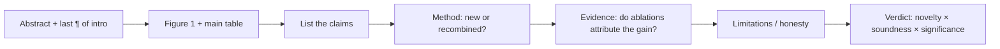
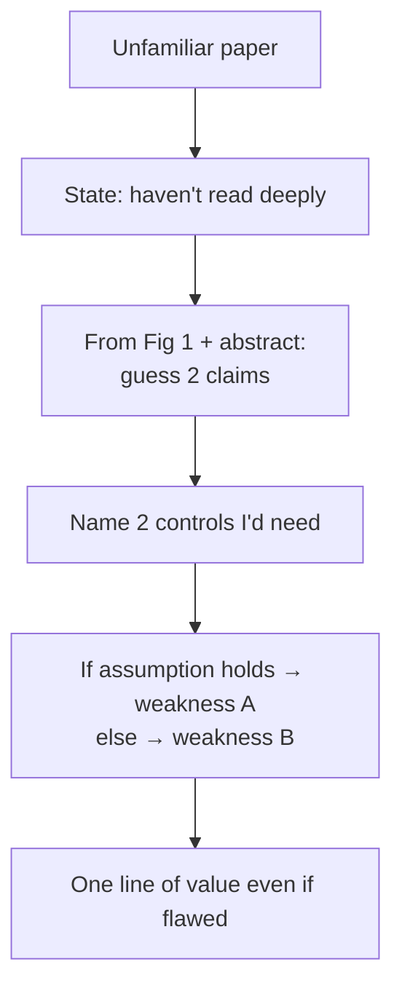

# Reading & Critiquing Papers

<div class="tag-row"><span class="tag">walk me through a recent paper</span><span class="tag">critique framework</span><span class="tag">staying current</span><span class="tag">2025–26 must-knows</span></div>

> [!TIP] 이 라운드가 진짜 검증하는 것
> "논문 X를 읽었느냐"가 아니라 — **논문을 60초 안에 그 주장으로 압축하고 load-bearing 약점을 찾아낼 수 있느냐**입니다. CVPR/ICCV/NeurIPS/ICLR/TPAMI/TMLR reviewer(2023–2026)로서 Beomyoung의 강점은 *area chair가 하듯* 답하는 것입니다: claims → method → evidence → limitations, 건설적으로.



## The "walk me through a recent paper" question

이 질문은 **taste**(무엇을 고르는가), **compression**(어떻게 요약하는가), **judgment**(무엇을 비판하는가)를 탐색하기 위한 것입니다. 아무 준비 없이도 서술할 수 있는 논문 2~3편을 준비하세요.

<details class="qa"><summary>"Walk me through a recent paper you found interesting."</summary>
<div class="qa-body">

**Short (~90초 안에 맞춰야 할 형태):** "The problem is P. Everyone did X, which fails at Y. Their key idea is Z — mechanistically, it works because W. The evidence I trust most is [ablation A]; the gap I'd push on is [missing control B]. Even if B holds, the take-home insight is C."

**Deep:** architecture가 아니라 *problem과 gap*으로 시작하세요. 작동하게 만드는 **하나의** mechanism을 짚으세요 — 짚지 못하면 이해하지 못한 것입니다. 그다음 reviewer처럼 비판하세요: 강점 하나, 진짜 약점 하나, 그리고 어떤 실험이 그것을 판가름할지. 지속되는 insight로 마무리하세요(숫자가 무너져도 살아남는 것).
</div></details>

> [!WARNING] Don't
> Abstract를 낭독하거나, 모든 module을 쏟아내거나, 과하게 칭찬하지("this is amazing") 마세요. 시니어의 신호는 **calibrated**된 것입니다: "strong evidence for the in-domain claim, weak evidence for the *generality* claim."

## The critique framework

대부분의 top venue가 공유하는 네 축(이름은 다양함): **Novelty · Soundness · Clarity · Significance.** 취향이 아니라 *evidence-based* 코멘트로 채점하세요.

| Axis | The question | Common failure it exposes |
| --- | --- | --- |
| **Claims** | 정확히 무엇을, 얼마나 넓게 주장하는가? | Overclaim된 generality; benchmark 상승을 "solving"으로 파는 것 |
| **Method** | 아이디어가 새로운가, 이름만 바꾼 재조합인가? 선행 연구를 special case로 포괄하는가? | "New name, old mechanism" |
| **Evidence** | Ablation이 이득을 *귀속*시키는가? Fair baseline? Seeds/variance? | Confounded ablation (module을 제거하면서 *동시에* schedule 변경); 약하거나 낡은 baseline |
| **Limitations** | Failure mode와 비용을 정직하게 밝히는가? | Cherry-pick된 qualitative; compute 미보고; footnote에 묻힌 failure |

**면접 답변 템플릿:** *"The core claim is X. The strongest evidence is table Z. The biggest hole is that Y isn't controlled — the gain could come from A. I'd request one ablation isolating that. Even so, insight C is valuable and I'd lean accept-with-revision."*

> [!NOTE] Soundness red flags (memorize)
> *다른* training data에서의 "Outperforms SOTA" · 두 가지를 동시에 바꾸는 ablation · in-domain test only · main claim에 qualitative-only · 방법은 그 반대에 의존하는데 i.i.d.를 가정하는 theory · seed variance보다 작은 0.2%p 승리를 SOTA로 파는 것.

<details class="qa"><summary>"Is an incremental paper always a reject?"</summary>
<div class="qa-body">

**Short:** 아니요. Novelty = **meaningful knowledge delta × rigor of evidence**이지, "세계 최초"가 아닙니다. 명확한 유용성을 가진 견고하고 잘 입증된 증분이 화려하지만 불건전한 "novel" 방법을 이깁니다.

**Deep:** 물어보세요: 선행 연구를 special case로 포괄하는가, 새로운 문제 세팅(예: *continual*이나 *on-device*)을 여는가, 전이 가능한 insight를 남기는가 — 아니면 engineering tuning뿐인가. Beomyoung의 DRS→BESTIE→PointWSSIS 라인은 weakly-supervised segmentation에서 *복리로 쌓이는* 증분의 좋은 모델이며, 각각 깔끔하게 격리된 기여를 가집니다.
</div></details>

## Staying current without drowning

> [!EXAMPLE] Say this to sound current
> "I skim arXiv-sanity / venue proceedings weekly at the *Figure-1 + main-table* level, read ~2 papers deeply per week, and go full-reproduction only for work adjacent to what I'm building."

Time-box: **10 min** = summary + 3 suspicions · **30 min** = method + evidence gaps · **2 h+** = reproducibility, derivation. 고립된 논문이 아니라 *thread*(segmentation foundation model, reasoning RL, native-multimodal)를 추적하세요 — 새 논문을 궤적 위에 놓을 수 있어야 합니다.

## 2025–2026 papers worth discussing

암기한 점수가 아니라 **mechanism과 trade-off**를 아세요. Vendor가 보고한 숫자는 hedge해야 하고; 아래 릴리스 세부사항 일부는 최근이며 빠르게 변합니다 *(보고된 것으로 취급, 인용 전 검증)*.

### SAM 3 — promptable *concept* segmentation *(reported, Meta)*

<dl class="kv">
<dt>Mechanism</dt><dd>Segment Anything 라인을 geometric prompt(point/box/mask)에서 **open-vocabulary / concept prompt** 쪽으로 확장 — 하나의 promptable 모델 안에서 detection + segmentation + video tracking과 함께, text나 exemplar prompt로 *한 concept의 모든 instance를* segment.</dd>
<dt>Why it matters</dt><dd>"segment anything"을 *interactive*에서 *semantic*으로 이동: 하나씩 클릭하는 대신 "every red handbag"을 요청. Open-vocabulary detection과 class-agnostic segmentation을 잇습니다.</dd>
<dt>What Beomyoung would critique</dt><dd>Concept prompt는 **vocabulary/annotation bias**를 물려받고 희귀하거나 compositional한 concept에서 고전합니다; 그리고 — ZIM과 연결하면 — promptable *mask*는 여전히 binary입니다: editing-grade **boundary/alpha quality**는 concept recall과 직교합니다. 자신의 작업으로 연결하기 좋은 지점.</dd>
</dl>

### DINOv3 — self-supervised dense features at scale *(reported, Meta)*

<dl class="kv">
<dt>Mechanism</dt><dd>Label-free self-distillation (student가 teacher/EMA view를 맞춤)을 data와 model 크기에서 스케일하여, segmentation/detection/depth에 frozen으로 쓸 수 있는 **general-purpose dense features** 생성. 스케일에서 알려진 난점은 긴 학습에서 dense feature 품질이 저하되는 것; 보고된 해법은 patch-level feature를 regularize/anchor(예: "gram-anchoring" 스타일 objective)하여 dense map을 선명하게 유지합니다.</dd>
<dt>Why it matters</dt><dd>Supervised feature에 필적하는 frozen backbone은 **less labeling**을 뜻하며 — 바로 Beomyoung의 label-efficient 전문 영역.</dd>
<dt>Critique angle</dt><dd>SSL 평가는 protocol에 민감합니다(linear-probe vs fine-tune vs frozen-dense); "no labels"는 무거운 **data-curation** 비용을 숨깁니다. Curation pipeline이 무엇을 걸러냈는지 물으세요.</dd>
</dl>

### DeepSeek-R1 — RL-incentivized reasoning *(verifiable paper)*

<dl class="kv">
<dt>Mechanism</dt><dd>**R1-Zero**는 base model에 직접 **rule-based, verifiable reward**(math/code 정답성)로 대규모 RL(GRPO)을 적용 — supervised CoT 없이 reasoning/long chain-of-thought가 *emerge*. **R1**은 가독성을 위한 작은 cold-start SFT를 더한 뒤 RL, 그다음 reasoning을 더 작은 dense model로 distill.</dd>
<dt>Why it matters</dt><dd>**RLVR**(RL from verifiable rewards)이 저렴하게 reasoning을 bootstrap할 수 있고, reasoning이 작은 model로 **distill**된다는 증거. [Reasoning & Test-Time Compute](#/llm/reasoning)와 [Post-Training & Alignment](#/llm/alignment)로 상호 연결.</dd>
<dt>Critique angle</dt><dd>Verifiable reward는 답을 검증할 수 있는 곳(math/code)에만 존재; pure-RL(R1-Zero)에서 reward-hacking과 readability collapse는 실재; open-ended, non-verifiable task로의 generalization이 미해결 질문.</dd>
</dl>

### Native (early-fusion) multimodal VLMs *(mechanism; specific models reported)*

<dl class="kv">
<dt>Mechanism</dt><dd>Late-fusion adapter 패턴(frozen vision encoder → projector → LLM, LLaVA 식) 대신, **native** VLM은 image(및 audio)를 공유 sequence로 tokenize하고 처음부터 **단일 transformer를 함께 학습**(early fusion)하며, 종종 mixed image-text corpus 위에서; 일부는 interleaved image *생성 및* 이해를 지원.</dd>
<dt>Why it matters</dt><dd>Early fusion은 cross-modal grounding을 개선하고 frozen-encoder 병목을 피할 수 있습니다; 여러 2025 frontier VLM 뒤의 방향. → [Vision-Language Pretraining](#/vlm/pretraining).</dd>
<dt>Critique angle</dt><dd>Joint training은 **compute-heavy하고 data-hungry**하며, 안정화가 어렵고, pure-text 능력을 *퇴행*시킬 수 있습니다. Grounding 연구자에게 진짜 질문: early fusion이 실제로 **region-level** grounding을 개선하는가, 아니면 holistic captioning만 개선하는가? 이것이 바로 Beomyoung의 grounded-VLM 논지. → [Grounding & Region Reasoning](#/vlm/grounding).</dd>
</dl>

## Live critique of a paper you haven't read

면접관이 때때로 익숙하지 않은 논문을 건넵니다. 이건 **선물**입니다 — reviewer 스킬을 직접 보여주니까요.



> [!QUESTION] "Critique this paper you've never seen — go."
> **Short:** "I haven't read it deeply, so I'll reason from the figure and abstract." 그다음 read protocol을 *소리 내어* 실행하세요. **Deep:** Figure 1에서 claim을 추측하고, 빠진 control을 짚고, "if X holds the weakness is A, otherwise B"라고 말하는 것이 어떤 암기 요약보다 더 큰 research 성숙도를 보여줍니다. 그다음 결정을 위해 필요한 하나의 숫자를 요청하세요.

### Critiquing your *own* work like a reviewer

방어만 하면 주니어로 읽힙니다. 선제적으로:

- **ZIM** — 이득이 data scale에서 오는가, architecture에서 오는가? (per-axis ablation으로 답변.) Matte 속 hallucinated detail은 product-trust 리스크.
- **ECLIPSE** — continual-panoptic 시나리오가 얼마나 현실적인가; memory/privacy 가정은 무엇인가?
- **PointWSSIS / BESTIE** — point/image-level supervision이 실제로 더 저렴한가, eval protocol은 얼마나 민감한가?

Template: *"As a reviewer, the first thing I'd flag is ___. We addressed it by ___. The limitation that genuinely remains is ___, which is what my next work targets."*

### Follow-ups they'll push

- *"What separates a borderline accept from a borderline reject for you?"* — novelty보다 claims–evidence 정합성; 정직한 limitations section이 accept 쪽으로 이동시킴.
- *"How do you handle concurrent/independent work?"* — cite하고, 증명할 수 없는 priority를 주장하지 말 것; timestamp가 아니라 delta로 판단.
- *"A paper with great ideas but poor writing?"* — clarity는 *reproducibility*에 영향을 주므로 soundness confidence를 낮춤; core가 건전하면 reject가 아니라 major-revision을 밀겠음.
- *"Which 2026 direction do you think is over-hyped?"* — *방어 가능한 의견*을 준비(의견이라고 태그) — 예: "agentic benchmarks without budget-matched baselines."

## 5-minute critique worksheet

```
Title:
Core claim(s):    1)              2)
Strongest evidence:
Biggest hole (missing control):
Alternative explanation for the gain:
Accept? Why / what revision:
Take-home insight even if rejected:
```

## Cheat-sheet

| Item | One-liner |
| --- | --- |
| Read order | Abstract → Fig 1 → main table → claims → method → ablations → limits |
| 4 axes | Novelty · Soundness · Clarity · Significance — 취향이 아니라 근거 |
| Novelty | Meaningful delta × rigor; incremental ≠ reject |
| Soundness killers | Confounded ablation · unfair baseline · in-domain-only · noise-as-effect |
| Walk-me-through | Problem → gap → one mechanism → best evidence → real weakness → insight |
| Unknown paper | 그렇다고 말하고, protocol을 소리 내어 실행, 결정적 숫자를 요청 |
| SAM 3 | Concept/text-promptable segmentation + tracking *(reported)* |
| DINOv3 | Label-free dense features at scale; anchors dense quality |
| DeepSeek-R1 | RLVR + GRPO; reasoning emerges, then distills to small models |
| Native VLM | Early-fusion joint training vs late-fusion adapter; grounding is the test |

**Related:** [Experiment Design & Ablations](#/research/experiment-design) · [Failure & Negative Results](#/research/failure) · [The Research Job Talk](#/research/job-talk) · [Presenting Research](#/research/presenting) · [Reasoning & Test-Time Compute](#/llm/reasoning) · [Vision-Language Pretraining](#/vlm/pretraining) · [Grounding & Region Reasoning](#/vlm/grounding) · [Deep-Dive: ZIM](#/resume/zim)
