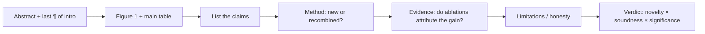
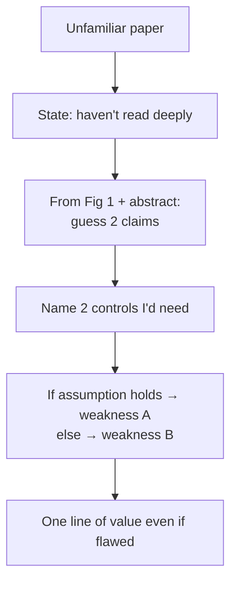

# Reading & Critiquing Papers

<div class="tag-row"><span class="tag">walk me through a recent paper</span><span class="tag">critique framework</span><span class="tag">staying current</span><span class="tag">2025–26 must-knows</span></div>

> [!TIP] 이 라운드가 진짜 검증하는 것
> "논문 X를 읽었느냐"가 아니라 — <strong>논문을 60초 안에 그 주장으로 압축하고 load-bearing 약점을 찾아낼 수 있느냐</strong>입니다. 이력서나 공개 프로필에서 실제 reviewer 경력을 확인할 수 있다면, 그 경험을 살려 *area chair가 하듯* 답하세요: claims → method → evidence → limitations, 건설적으로. 확인되지 않은 venue·연도·역할은 답변에 덧붙이지 않습니다.



## The "walk me through a recent paper" question

이 질문은 **taste**(무엇을 고르는가), **compression**(어떻게 요약하는가), **judgment**(무엇을 비판하는가)를 탐색하기 위한 것입니다. 아무 준비 없이도 서술할 수 있는 논문 2~3편을 준비하세요.

<details class="qa"><summary>"Walk me through a recent paper you found interesting."</summary>
<div class="qa-body">

<strong>Short (~90초 안에 맞춰야 할 형태):</strong> "The problem is P. Everyone did X, which fails at Y. Their key idea is Z — mechanistically, it works because W. The evidence I trust most is [ablation A]; the gap I'd push on is [missing control B]. Even if B holds, the take-home insight is C."

<strong>Deep:</strong> architecture가 아니라 <em>problem과 gap</em>으로 시작하세요. 작동하게 만드는 <strong>하나의</strong> mechanism을 짚으세요. 그다음 reviewer처럼 강점 하나, 진짜 약점 하나, 그리고 어떤 실험이 판가름할지를 설명하고 지속되는 insight로 마무리하세요.
</div></details>

> [!WARNING] Don't
> Abstract를 낭독하거나, 모든 module을 쏟아내거나, 과하게 칭찬하지("this is amazing") 마세요. 시니어의 신호는 <strong>calibrated</strong>된 것입니다: "strong evidence for the in-domain claim, weak evidence for the *generality* claim."

## The critique framework

대부분의 top venue가 공유하는 네 축(이름은 다양함): **Novelty · Soundness · Clarity · Significance.** 취향이 아니라 *evidence-based* 코멘트로 채점하세요.

| Axis | The question | Common failure it exposes |
| --- | --- | --- |
| **Claims** | 정확히 무엇을, 얼마나 넓게 주장하는가? | Overclaim된 generality; benchmark 상승을 "solving"으로 파는 것 |
| **Method** | 아이디어가 새로운가, 이름만 바꾼 재조합인가? 선행 연구를 special case로 포괄하는가? | "New name, old mechanism" |
| **Evidence** | Ablation이 이득을 *귀속*시키는가? Fair baseline? Seeds/variance? | Confounded ablation (module을 제거하면서 *동시에* schedule 변경); 약하거나 낡은 baseline |
| **Limitations** | Failure mode와 비용을 정직하게 밝히는가? | Cherry-pick된 qualitative; compute 미보고; footnote에 묻힌 failure |

**면접 답변 템플릿:** *"The core claim is X. The strongest evidence is table Z. The biggest hole is that Y isn't controlled — the gain could come from A. I'd request one ablation isolating that. Even so, insight C is valuable, and I'd currently lean [accept/reject] with moderate confidence."* `accept-with-revision`이나 `major revision`은 저널처럼 해당 결정을 제공하는 venue에서만 쓰세요. 많은 학회 review는 보완 요구를 적더라도 최종 추천은 accept/reject 축입니다.

> [!NOTE] Soundness red flags (memorize)
> *다른* training data에서의 "Outperforms SOTA" · 두 가지를 동시에 바꾸는 ablation · in-domain test only · main claim에 qualitative-only · 방법은 그 반대에 의존하는데 i.i.d.를 가정하는 theory · seed variance보다 작은 0.2%p 승리를 SOTA로 파는 것.

<details class="qa"><summary>"Is an incremental paper always a reject?"</summary>
<div class="qa-body">

<strong>Short:</strong> 아니요. Novelty = <strong>meaningful knowledge delta × rigor of evidence</strong>이지, "세계 최초"가 아닙니다. 명확한 유용성을 가진 견고하고 잘 입증된 증분이 화려하지만 불건전한 "novel" 방법을 이깁니다.

<strong>Deep:</strong> 물어보세요: 선행 연구를 special case로 포괄하는가, 새로운 문제 세팅(예: <em>continual</em>이나 <em>on-device</em>)을 여는가, 전이 가능한 insight를 남기는가 — 아니면 engineering tuning뿐인가. 자신의 DRS→BESTIE→PointWSSIS 라인을 예로 든다면, 각 논문이 남긴 지식 증가분과 이를 격리한 근거를 논문·이력서에 기록된 범위에서만 설명하세요.
</div></details>

## Staying current without drowning

> [!EXAMPLE] Say this to sound current
> "I scan arXiv feeds and venue proceedings weekly at the *Figure-1 + main-table* level, read a small number deeply, and reproduce only work adjacent to what I'm building." 구체적인 도구와 주당 편수는 실제 습관에 맞추세요. 추천·검색 서비스는 바뀌므로 한 서비스 이름을 최신성의 증거처럼 외우지 않습니다.

Time-box: **10 min** = summary + 3 suspicions · **30 min** = method + evidence gaps · **2 h+** = reproducibility, derivation. 고립된 논문이 아니라 *thread*(segmentation foundation model, reasoning RL, native-multimodal)를 추적하세요 — 새 논문을 궤적 위에 놓을 수 있어야 합니다.

## 2025–2026 papers worth discussing

암기한 점수가 아니라 <strong>mechanism과 trade-off</strong>를 아세요. Vendor가 보고한 숫자는 hedge하고, 면접 직전 논문 버전·공식 모델 카드를 다시 확인하세요. 아래는 <strong>2026년 7월 기준</strong> 읽기 출발점이지 고정된 최신 목록이 아닙니다.

### [SAM 3](https://ai.meta.com/blog/segment-anything-model-3/) — promptable *concept* segmentation *(Meta release)*

<dl class="kv">
<dt>Mechanism</dt><dd>Segment Anything 라인을 geometric prompt(point/box/mask)에서 <strong>open-vocabulary / concept prompt</strong> 쪽으로 확장 — 하나의 promptable 모델 안에서 detection + segmentation + video tracking과 함께, text나 exemplar prompt로 <em>한 concept의 모든 instance를</em> segment.</dd>
<dt>Why it matters</dt><dd>"segment anything"을 *interactive*에서 *semantic*으로 이동: 하나씩 클릭하는 대신 "every red handbag"을 요청. Open-vocabulary detection과 class-agnostic segmentation을 잇습니다.</dd>
<dt>Critique angle</dt><dd>Concept prompt는 <strong>vocabulary/annotation bias</strong>를 물려받고 희귀하거나 compositional한 concept에서 고전할 수 있습니다. 그리고 — ZIM과 연결하면 — promptable <em>mask</em>와 editing-grade <strong>boundary/alpha quality</strong>는 별개의 평가 축입니다. 실제 failure example과 boundary metric으로 검증할 질문이지, 이름만 보고 단정할 결론은 아닙니다. Meta는 2026년 3월 SAM 3.1 업데이트도 공개했으므로 버전별 결과를 섞지 마세요.</dd>
</dl>

### [DINOv3](https://ai.meta.com/research/publications/dinov3/) — self-supervised dense features at scale *(Meta paper)*

<dl class="kv">
<dt>Mechanism</dt><dd>Label-free self-distillation을 data와 model 크기에서 스케일하여, segmentation/detection/depth에 frozen으로 쓸 수 있는 <strong>general-purpose dense features</strong>를 학습합니다. 긴 학습에서 dense feature가 저하되는 문제를 막기 위해 paper가 제안한 정확한 용어는 <strong>Gram anchoring</strong>입니다. 단순한 "gram-style regularizer"로 뭉개지 말고 anchor teacher와 feature-correlation 보존의 역할을 논문 기준으로 설명하세요.</dd>
<dt>Why it matters</dt><dd>강한 frozen backbone은 downstream label과 task별 학습 비용을 줄일 가능성이 있어 label-efficient 연구와 직접 맞닿습니다. 다만 모든 task에서 supervised specialist를 자동으로 대체한다는 뜻은 아닙니다.</dd>
<dt>Critique angle</dt><dd>SSL 평가는 protocol에 민감합니다(linear-probe vs fine-tune vs frozen-dense); "no labels"는 무거운 <strong>data-curation</strong> 비용을 숨깁니다. Curation pipeline이 무엇을 걸러냈는지 물으세요.</dd>
</dl>

### [DeepSeek-R1](https://arxiv.org/abs/2501.12948) — RL-incentivized reasoning *(paper)*

<dl class="kv">
<dt>Mechanism</dt><dd><strong>R1-Zero</strong>는 base model에 직접 <strong>rule-based, verifiable reward</strong>(math/code 정답성)와 GRPO를 적용했고, paper는 supervised cold-start 없이 더 긴 reasoning pattern이 나타났다고 보고합니다. <strong>R1</strong>은 소량의 cold-start data, reasoning-oriented RL, rejection sampling/SFT와 후속 RL을 결합하고, 공개한 reasoning data로 더 작은 dense model도 distill합니다. 이를 단일 RL 단계로 축약하지 마세요.</dd>
<dt>Why it matters</dt><dd><strong>RLVR</strong>(RL <strong>with</strong> verifiable rewards)이 reasoning behavior를 강화하고, 그 결과 일부를 작은 model로 <strong>distill</strong>할 수 있음을 보여준 중요한 사례입니다. "저렴하다"는 결론은 verifier 비용뿐 아니라 rollout·training compute까지 비교한 뒤 내려야 합니다. [Reasoning & Test-Time Compute](#/llm/reasoning)와 [Post-Training & Alignment](#/llm/alignment)로 상호 연결.</dd>
<dt>Critique angle</dt><dd>정확한 verifier는 주로 math/code처럼 답을 기계적으로 확인할 수 있는 영역에 제한됩니다. R1 paper는 R1-Zero의 가독성 저하와 언어 혼합을 보고했고, 더 일반적으로 verifier의 허점을 최적화할 위험도 있습니다. 이를 증거 없이 "readability collapse"나 실제 reward hacking이 관찰됐다고 확대하지 말고, open-ended·non-verifiable task 전이를 별도 질문으로 두세요.</dd>
</dl>

### Native (early-fusion) multimodal VLMs *(mechanism; specific models reported)*

<dl class="kv">
<dt>Mechanism</dt><dd>Frozen vision encoder → projector → LLM이라는 고정형 adapter 패턴과 달리, 넓은 의미의 <strong>native/joint multimodal</strong> 모델은 image·audio·text token을 더 이른 단계부터 함께 최적화합니다. 하지만 구현은 다양합니다. pretrained encoder/projector/LLM을 유지한 채 end-to-end로 풀기도 하고, unified decoder를 쓰기도 하므로 "처음부터 하나의 transformer"가 정의는 아닙니다.</dd>
<dt>Why it matters</dt><dd>공동 최적화는 frozen-encoder·projector 병목을 줄일 가능성이 있지만, cross-modal grounding 개선은 architecture 이름이 아니라 region-level evaluation과 ablation으로 확인해야 합니다. → [Vision-Language Pretraining](#/vlm/pretraining).</dd>
<dt>Critique angle</dt><dd>Joint training은 대체로 <strong>compute-heavy하고 data-hungry</strong>하며 modality balance와 catastrophic interference를 관리해야 합니다. 진짜 질문은 early fusion이 <strong>region-level</strong> grounding을 개선하는지, 아니면 holistic captioning score만 올리는지입니다. → [Grounding & Region Reasoning](#/vlm/grounding).</dd>
</dl>

## Live critique of a paper you haven't read

면접관이 때때로 익숙하지 않은 논문을 건넵니다. 이건 <strong>reviewer 스킬을 직접 보여줄 기회</strong>입니다.



> [!QUESTION] "Critique this paper you've never seen — go."
> **Short:** "I haven't read it deeply, so I'll reason from the figure and abstract." 그다음 read protocol을 *소리 내어* 실행하세요. **Deep:** Figure 1에서 claim을 추측하고, 빠진 control을 짚고, "if X holds the weakness is A, otherwise B"라고 말하는 것이 어떤 암기 요약보다 더 큰 research 성숙도를 보여줍니다. 그다음 결정을 위해 필요한 하나의 숫자를 요청하세요.

### Critiquing your *own* work like a reviewer

방어만 하면 주니어로 읽힙니다. 선제적으로:

- **ZIM** — 이득이 data scale에서 오는가, architecture에서 오는가? (per-axis ablation으로 답변.) Matte 속 hallucinated detail은 product-trust 리스크.
- **ECLIPSE** — continual-panoptic 시나리오가 얼마나 현실적인가; memory/privacy 가정은 무엇인가?
- **PointWSSIS / BESTIE** — point/image-level supervision이 실제로 더 저렴한가, eval protocol은 얼마나 민감한가?

Template: *"As a reviewer, the first thing I'd flag is ___. We addressed it by ___. The limitation that genuinely remains is ___, which is what my next work targets."*

### Follow-ups they'll push

- *"What separates a borderline accept from a borderline reject for you?"* — novelty보다 claims–evidence 정합성; 정직한 limitations section이 accept 쪽으로 이동시킴.
- *"How do you handle concurrent/independent work?"* — cite하고, 증명할 수 없는 priority를 주장하지 말 것; timestamp가 아니라 delta로 판단.
- *"A paper with great ideas but poor writing?"* — clarity는 *reproducibility*와 soundness 판단의 confidence를 낮춥니다. 기술적 근거와 결정 기준을 분리해 말하고, 저널이라면 revision 범위를, 학회라면 현재 accept/reject 추천과 필요한 보완을 각각 적으세요.
- *"Which 2026 direction do you think is over-hyped?"* — *방어 가능한 의견*을 준비(의견이라고 태그) — 예: "agentic benchmarks without budget-matched baselines."

## 5-minute critique worksheet

```
Title:
Core claim(s):    1)              2)
Strongest evidence:
Biggest hole (missing control):
Alternative explanation for the gain:
Accept? Why / what revision:
Take-home insight even if rejected:
```

## Cheat-sheet

| Item | One-liner |
| --- | --- |
| Read order | Abstract → Fig 1 → main table → claims → method → ablations → limits |
| 4 axes | Novelty · Soundness · Clarity · Significance — 취향이 아니라 근거 |
| Novelty | Meaningful delta × rigor; incremental ≠ reject |
| Soundness killers | Confounded ablation · unfair baseline · in-domain-only · noise-as-effect |
| Walk-me-through | Problem → gap → one mechanism → best evidence → real weakness → insight |
| Unknown paper | 그렇다고 말하고, protocol을 소리 내어 실행, 결정적 숫자를 요청 |
| SAM 3 | Concept/text/exemplar-promptable segmentation + tracking; 버전별 결과 분리 |
| DINOv3 | Label-free dense features at scale; anchors dense quality |
| DeepSeek-R1 | RLVR + GRPO; reasoning emerges, then distills to small models |
| Native VLM | Joint optimization은 여러 구조를 포함; grounding 개선은 별도 검증 |

**Related:** [Experiment Design & Ablations](#/research/experiment-design) · [Failure & Negative Results](#/research/failure) · [The Research Job Talk](#/research/job-talk) · [Presenting Research](#/research/presenting) · [Reasoning & Test-Time Compute](#/llm/reasoning) · [Vision-Language Pretraining](#/vlm/pretraining) · [Grounding & Region Reasoning](#/vlm/grounding) · [Deep-Dive: ZIM](#/resume/zim)
