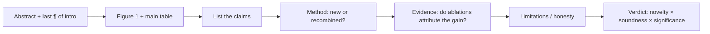
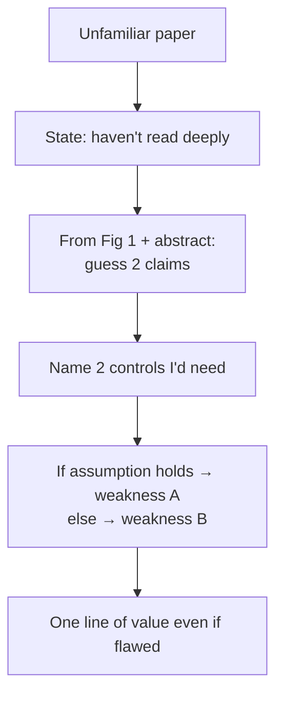

# Reading & Critiquing Papers

<div class="tag-row"><span class="tag">walk me through a recent paper</span><span class="tag">critique framework</span><span class="tag">staying current</span><span class="tag">2025–26 must-knows</span></div>

> [!TIP] What this round really tests
> Not "have you read paper X" — it's **can you compress a paper to its claim in 60 seconds and find the load-bearing weakness**. As a CVPR/ICCV/NeurIPS/ICLR/TPAMI/TMLR reviewer (2023–2026), Beomyoung's edge is to answer *as an area chair would*: claims → method → evidence → limitations, constructively.



## The "walk me through a recent paper" question

They ask this to probe **taste** (what you choose), **compression** (how you summarize), and **judgment** (what you critique). Prepare 2–3 papers you can narrate cold.

<details class="qa"><summary>"Walk me through a recent paper you found interesting."</summary>
<div class="qa-body">

**Short (the shape to hit in ~90 s):** "The problem is P. Everyone did X, which fails at Y. Their key idea is Z — mechanistically, it works because W. The evidence I trust most is [ablation A]; the gap I'd push on is [missing control B]. Even if B holds, the take-home insight is C."

**Deep:** Lead with the *problem and the gap*, not the architecture. Name the **one** mechanism that makes it work — if you can't, you didn't understand it. Then critique like a reviewer: one strong point, one real weakness, and what experiment would settle it. Close with the durable insight (what survives even if the numbers don't).
</div></details>

> [!WARNING] Don't
> Recite the abstract, dump every module, or over-praise ("this is amazing"). A senior signal is **calibrated**: "strong evidence for the in-domain claim, weak evidence for the *generality* claim."

## The critique framework

Four axes most top venues share (names vary): **Novelty · Soundness · Clarity · Significance.** Score with *evidence-based* comments, not taste.

| Axis | The question | Common failure it exposes |
| --- | --- | --- |
| **Claims** | What exactly is claimed, and how broadly? | Overclaimed generality; a benchmark bump sold as "solving" the task |
| **Method** | Is the idea new, or a renamed recombination? Does it subsume prior work as a special case? | "New name, old mechanism" |
| **Evidence** | Do the ablations *attribute* the gain? Fair baselines? Seeds/variance? | Confounded ablation (removes module *and* changes schedule); weak/outdated baseline |
| **Limitations** | Are failure modes and costs stated honestly? | Cherry-picked qualitatives; no compute report; failures buried in a footnote |

**Interview answer template:** *"The core claim is X. The strongest evidence is table Z. The biggest hole is that Y isn't controlled — the gain could come from A. I'd request one ablation isolating that. Even so, insight C is valuable and I'd lean accept-with-revision."*

> [!NOTE] Soundness red flags (memorize)
> "Outperforms SOTA" on *different* training data · ablation that changes two things at once · in-domain test only · qualitative-only for the main claim · theory assuming i.i.d. while the method relies on the opposite · a 0.2%-point win smaller than seed variance sold as SOTA.

<details class="qa"><summary>"Is an incremental paper always a reject?"</summary>
<div class="qa-body">

**Short:** No. Novelty = **meaningful knowledge delta × rigor of evidence**, not "first in the world." A solid, well-evidenced increment with clear usefulness beats a flashy-but-unsound "novel" method.

**Deep:** Ask: does it subsume prior work as a special case, open a new problem setting (e.g. *continual* or *on-device*), or leave a transferable insight — versus only engineering tuning? Beomyoung's DRS→BESTIE→PointWSSIS line is a good model of *compounding* increments in weakly-supervised segmentation, each with a clean isolated contribution.
</div></details>

## Staying current without drowning

> [!EXAMPLE] Say this to sound current
> "I skim arXiv-sanity / venue proceedings weekly at the *Figure-1 + main-table* level, read ~2 papers deeply per week, and go full-reproduction only for work adjacent to what I'm building."

Time-boxes: **10 min** = summary + 3 suspicions · **30 min** = method + evidence gaps · **2 h+** = reproducibility, derivations. Track *threads* (segmentation foundation models, reasoning RL, native-multimodal) rather than isolated papers — you want to place a new paper on a trajectory.

## 2025–2026 papers worth discussing

Know the **mechanism and the trade-off**, not memorized scores. Vendor-reported numbers should be hedged; some release details below are recent and fast-moving *(treat as reported, verify before quoting)*.

### SAM 3 — promptable *concept* segmentation *(reported, Meta)*

<dl class="kv">
<dt>Mechanism</dt><dd>Extends the Segment Anything line from geometric prompts (point/box/mask) toward **open-vocabulary / concept prompts** — segment *all instances of a concept* from a text or exemplar prompt, with detection + segmentation + video tracking in one promptable model.</dd>
<dt>Why it matters</dt><dd>Moves "segment anything" from *interactive* to *semantic*: you ask for "every red handbag" rather than clicking each one. Bridges open-vocabulary detection and class-agnostic segmentation.</dd>
<dt>What Beomyoung would critique</dt><dd>Concept prompts inherit **vocabulary/annotation bias** and struggle on rare or compositional concepts; and — connecting to ZIM — a promptable *mask* is still binary: editing-grade **boundary/alpha quality** is orthogonal to concept recall. A great point to link your own work.</dd>
</dl>

### DINOv3 — self-supervised dense features at scale *(reported, Meta)*

<dl class="kv">
<dt>Mechanism</dt><dd>Label-free self-distillation (student matches a teacher/EMA view) scaled in data and model size, producing **general-purpose dense features** usable frozen for segmentation/detection/depth. A known challenge at scale is that dense feature quality degrades over long training; the reported fix regularizes/anchors patch-level features (e.g. a "gram-anchoring"-style objective) so dense maps stay sharp.</dd>
<dt>Why it matters</dt><dd>A frozen backbone that rivals supervised features means **less labeling** — directly in Beomyoung's label-efficient wheelhouse.</dd>
<dt>Critique angle</dt><dd>SSL evaluation is protocol-sensitive (linear-probe vs fine-tune vs frozen-dense); "no labels" hides heavy **data-curation** cost. Ask what the curation pipeline filtered.</dd>
</dl>

### DeepSeek-R1 — RL-incentivized reasoning *(verifiable paper)*

<dl class="kv">
<dt>Mechanism</dt><dd>**R1-Zero** applies large-scale RL (GRPO) with **rule-based, verifiable rewards** (correctness of math/code) directly on a base model — reasoning/long chain-of-thought *emerges* without supervised CoT. **R1** adds a small cold-start SFT for readability, then RL, then distills the reasoning into smaller dense models.</dd>
<dt>Why it matters</dt><dd>Evidence that **RLVR** (RL from verifiable rewards) can bootstrap reasoning cheaply, and that reasoning **distills** into small models. Cross-links to [Reasoning & Test-Time Compute](#/llm/reasoning) and [Post-Training & Alignment](#/llm/alignment).</dd>
<dt>Critique angle</dt><dd>Verifiable rewards only exist where answers are checkable (math/code); reward-hacking and readability collapse in pure-RL (R1-Zero) are real; generalization to open-ended, non-verifiable tasks is the open question.</dd>
</dl>

### Native (early-fusion) multimodal VLMs *(mechanism; specific models reported)*

<dl class="kv">
<dt>Mechanism</dt><dd>Instead of the late-fusion adapter pattern (frozen vision encoder → projector → LLM, à la LLaVA), **native** VLMs tokenize image (and audio) into a shared sequence and train a **single transformer jointly from the start** (early fusion), often over mixed image-text corpora; some support interleaved image *generation and* understanding.</dd>
<dt>Why it matters</dt><dd>Early fusion can improve cross-modal grounding and avoid the frozen-encoder bottleneck; it's the direction behind several 2025 frontier VLMs. → [Vision-Language Pretraining](#/vlm/pretraining).</dd>
<dt>Critique angle</dt><dd>Joint training is **compute-heavy and data-hungry**, harder to stabilize, and can *regress* pure-text ability. The real question for a grounding researcher: does early fusion actually improve **region-level** grounding, or just holistic captioning? This is exactly Beomyoung's grounded-VLM thesis. → [Grounding & Region Reasoning](#/vlm/grounding).</dd>
</dl>

## Live critique of a paper you haven't read

Interviewers sometimes hand you an unfamiliar paper. This is a **gift** — it shows the reviewer skill directly.



> [!QUESTION] "Critique this paper you've never seen — go."
> **Short:** "I haven't read it deeply, so I'll reason from the figure and abstract." Then execute the read protocol *out loud*. **Deep:** Guessing the claims from Figure 1, naming the missing control, and stating "if X holds the weakness is A, otherwise B" demonstrates more research maturity than any memorized summary. Then ask for the one number you'd need to decide.

### Critiquing your *own* work like a reviewer

Defending-only reads as junior. Pre-empt:

- **ZIM** — is the gain from data scale or architecture? (Answer with the per-axis ablation.) Hallucinated detail in the matte is a product-trust risk.
- **ECLIPSE** — how realistic is the continual-panoptic scenario; what's the memory/privacy assumption?
- **PointWSSIS / BESTIE** — is point/image-level supervision actually cheaper in practice, and how sensitive is the eval protocol?

Template: *"As a reviewer, the first thing I'd flag is ___. We addressed it by ___. The limitation that genuinely remains is ___, which is what my next work targets."*

### Follow-ups they'll push

- *"What separates a borderline accept from a borderline reject for you?"* — claims–evidence alignment over novelty; an honest limitations section moves you toward accept.
- *"How do you handle concurrent/independent work?"* — cite it, don't claim priority you can't prove; judge on the delta, not the timestamp.
- *"A paper with great ideas but poor writing?"* — clarity affects *reproducibility*, so it lowers soundness confidence; I'd push major-revision, not reject, if the core is sound.
- *"Which 2026 direction do you think is over-hyped?"* — have a *defensible opinion* ready (tag it as opinion) — e.g. "agentic benchmarks without budget-matched baselines."

## 5-minute critique worksheet

```
Title:
Core claim(s):    1)              2)
Strongest evidence:
Biggest hole (missing control):
Alternative explanation for the gain:
Accept? Why / what revision:
Take-home insight even if rejected:
```

## Cheat-sheet

| Item | One-liner |
| --- | --- |
| Read order | Abstract → Fig 1 → main table → claims → method → ablations → limits |
| 4 axes | Novelty · Soundness · Clarity · Significance — evidence, not taste |
| Novelty | Meaningful delta × rigor; incremental ≠ reject |
| Soundness killers | Confounded ablation · unfair baseline · in-domain-only · noise-as-effect |
| Walk-me-through | Problem → gap → one mechanism → best evidence → real weakness → insight |
| Unknown paper | Say so, run the protocol out loud, ask for the deciding number |
| SAM 3 | Concept/text-promptable segmentation + tracking *(reported)* |
| DINOv3 | Label-free dense features at scale; anchors dense quality |
| DeepSeek-R1 | RLVR + GRPO; reasoning emerges, then distills to small models |
| Native VLM | Early-fusion joint training vs late-fusion adapter; grounding is the test |

**Related:** [Experiment Design & Ablations](#/research/experiment-design) · [Failure & Negative Results](#/research/failure) · [The Research Job Talk](#/research/job-talk) · [Presenting Research](#/research/presenting) · [Reasoning & Test-Time Compute](#/llm/reasoning) · [Vision-Language Pretraining](#/vlm/pretraining) · [Grounding & Region Reasoning](#/vlm/grounding) · [Deep-Dive: ZIM](#/resume/zim)
