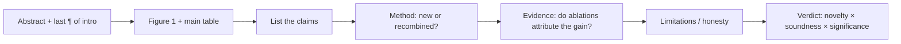
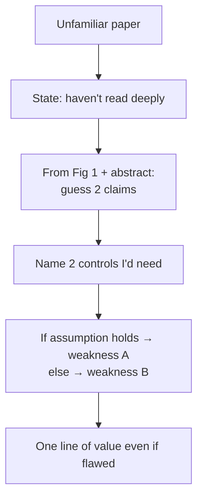

# Reading & Critiquing Papers

<div class="tag-row"><span class="tag">walk me through a recent paper</span><span class="tag">critique framework</span><span class="tag">staying current</span><span class="tag">2025–26 must-knows</span></div>

> [!TIP] What this round really tests
> Not "have you read paper X," but **can you compress it to its claim in 60 seconds and find the load-bearing weakness?** If reviewer experience is verifiable from the CV or a public profile, use it to answer *as an area chair would*: claims → method → evidence → limitations, constructively. Do not add an unverified venue, year, or role.



## The "walk me through a recent paper" question

They ask this to probe **taste** (what you choose), **compression** (how you summarize), and **judgment** (what you critique). Prepare 2–3 papers you can narrate cold.

<details class="qa"><summary>"Walk me through a recent paper you found interesting."</summary>
<div class="qa-body">

**Short (the shape to hit in ~90 s):** "The problem is P. Everyone did X, which fails at Y. Their key idea is Z — mechanistically, it works because W. The evidence I trust most is [ablation A]; the gap I'd push on is [missing control B]. Even if B holds, the take-home insight is C."

**Deep:** Lead with the *problem and the gap*, not the architecture. Name the **one** mechanism that makes it work — if you can't, you didn't understand it. Then critique like a reviewer: one strong point, one real weakness, and what experiment would settle it. Close with the durable insight (what survives even if the numbers don't).
</div></details>

> [!WARNING] Don't
> Recite the abstract, dump every module, or over-praise ("this is amazing"). A senior signal is **calibrated**: "strong evidence for the in-domain claim, weak evidence for the *generality* claim."

## The critique framework

Four axes most top venues share (names vary): **Novelty · Soundness · Clarity · Significance.** Score with *evidence-based* comments, not taste.

| Axis | The question | Common failure it exposes |
| --- | --- | --- |
| **Claims** | What exactly is claimed, and how broadly? | Overclaimed generality; a benchmark bump sold as "solving" the task |
| **Method** | Is the idea new, or a renamed recombination? Does it subsume prior work as a special case? | "New name, old mechanism" |
| **Evidence** | Do the ablations *attribute* the gain? Fair baselines? Seeds/variance? | Confounded ablation (removes module *and* changes schedule); weak/outdated baseline |
| **Limitations** | Are failure modes and costs stated honestly? | Cherry-picked qualitatives; no compute report; failures buried in a footnote |

**Interview answer template:** *"The core claim is X. The strongest evidence is table Z. The biggest hole is that Y isn't controlled—the gain could come from A. I'd request one ablation isolating that. Even so, insight C is valuable, and I'd currently lean [accept/reject] with moderate confidence."* Use `accept-with-revision` or `major revision` only for a venue that actually offers such a journal-style decision. Many conference reviews can request improvements while the final recommendation remains on an accept/reject axis.

> [!NOTE] Soundness red flags (memorize)
> "Outperforms SOTA" on *different* training data · ablation that changes two things at once · in-domain test only · qualitative-only for the main claim · theory assuming i.i.d. while the method relies on the opposite · a 0.2%-point win smaller than seed variance sold as SOTA.

<details class="qa"><summary>"Is an incremental paper always a reject?"</summary>
<div class="qa-body">

**Short:** No. Novelty = **meaningful knowledge delta × rigor of evidence**, not "first in the world." A solid, well-evidenced increment with clear usefulness beats a flashy-but-unsound "novel" method.

**Deep:** Ask whether it subsumes prior work as a special case, opens a new setting such as *continual* or *on-device*, or leaves a transferable insight—versus merely tuning the engineering. If you use your DRS→BESTIE→PointWSSIS line as an example, describe each paper's knowledge delta and the evidence isolating it only to the extent documented by the papers and CV.
</div></details>

## Staying current without drowning

> [!EXAMPLE] Say this to sound current
> "I scan arXiv feeds and venue proceedings weekly at the *Figure-1 + main-table* level, read a small number deeply, and reproduce only work adjacent to what I'm building." Match the specific tools and weekly count to your real habit. Recommendation and search services change, so do not memorize one service name as proof of being current.

Time-boxes: **10 min** = summary + 3 suspicions · **30 min** = method + evidence gaps · **2 h+** = reproducibility, derivations. Track *threads* (segmentation foundation models, reasoning RL, native-multimodal) rather than isolated papers — you want to place a new paper on a trajectory.

## 2025–2026 papers worth discussing

Know the **mechanism and the trade-off**, not memorized scores. Hedge vendor-reported numbers and recheck the paper version and official model card immediately before the interview. The list below is a reading starting point **as of July 2026**, not a permanent latest list.

### [SAM 3](https://ai.meta.com/blog/segment-anything-model-3/) — promptable *concept* segmentation *(Meta release)*

<dl class="kv">
<dt>Mechanism</dt><dd>Extends the Segment Anything line from geometric prompts (point/box/mask) toward **open-vocabulary / concept prompts** — segment *all instances of a concept* from a text or exemplar prompt, with detection + segmentation + video tracking in one promptable model.</dd>
<dt>Why it matters</dt><dd>Moves "segment anything" from *interactive* to *semantic*: you ask for "every red handbag" rather than clicking each one. Bridges open-vocabulary detection and class-agnostic segmentation.</dd>
<dt>Critique angle</dt><dd>Concept prompts inherit <strong>vocabulary/annotation bias</strong> and may struggle with rare or compositional concepts. Connecting to ZIM, promptable <em>mask</em> quality and editing-grade <strong>boundary/alpha quality</strong> are separate evaluation axes. Test this with real failure examples and boundary metrics rather than concluding it from the name. Meta also released a SAM 3.1 update in March 2026, so do not mix results across versions.</dd>
</dl>

### [DINOv3](https://ai.meta.com/research/publications/dinov3/) — self-supervised dense features at scale *(Meta paper)*

<dl class="kv">
<dt>Mechanism</dt><dd>Scales label-free self-distillation in both data and model size to learn <strong>general-purpose dense features</strong> that can be used frozen for segmentation, detection, and depth. The paper's exact term for preventing dense-feature degradation during long training is <strong>Gram anchoring</strong>. Do not blur this into a generic "gram-style regularizer"; explain the anchor teacher and preservation of feature correlations as described in the paper.</dd>
<dt>Why it matters</dt><dd>A strong frozen backbone may reduce downstream labels and task-specific training, directly connecting to label-efficient research. It does not mean it automatically replaces a supervised specialist on every task.</dd>
<dt>Critique angle</dt><dd>SSL evaluation is protocol-sensitive (linear-probe vs fine-tune vs frozen-dense); "no labels" hides heavy **data-curation** cost. Ask what the curation pipeline filtered.</dd>
</dl>

### [DeepSeek-R1](https://arxiv.org/abs/2501.12948) — RL-incentivized reasoning *(paper)*

<dl class="kv">
<dt>Mechanism</dt><dd><strong>R1-Zero</strong> applies GRPO and <strong>rule-based, verifiable rewards</strong> for math/code correctness directly to a base model; the paper reports the emergence of longer reasoning patterns without supervised cold-start data. <strong>R1</strong> combines a small amount of cold-start data, reasoning-oriented RL, rejection sampling/SFT, and subsequent RL, then distills smaller dense models with released reasoning data. Do not collapse it into one RL stage.</dd>
<dt>Why it matters</dt><dd>A major example of <strong>RLVR</strong>—RL <strong>with</strong> verifiable rewards—strengthening reasoning behavior and distilling some of it into smaller models. Conclude that it is "cheap" only after comparing verifier, rollout, and training compute. Cross-link to [Reasoning & Test-Time Compute](#/llm/reasoning) and [Post-Training & Alignment](#/llm/alignment).</dd>
<dt>Critique angle</dt><dd>Exact verifiers are largely limited to domains such as math and code where answers are mechanically checkable. The R1 paper reports degraded readability and language mixing in R1-Zero, and verifier loopholes are a broader risk. Do not inflate this into unsupported claims of "readability collapse" or observed reward hacking; treat transfer to open-ended, non-verifiable tasks as a separate question.</dd>
</dl>

### Native (early-fusion) multimodal VLMs *(mechanism; specific models reported)*

<dl class="kv">
<dt>Mechanism</dt><dd>Unlike a fixed adapter pattern of frozen vision encoder → projector → LLM, <strong>native/joint multimodal</strong> broadly means optimizing image, audio, and text tokens together from an earlier stage. Implementations vary: some retain pretrained encoders, projectors, or LLMs and unfreeze them end to end; others use a unified decoder. "One transformer from scratch" is not the definition.</dd>
<dt>Why it matters</dt><dd>Joint optimization may reduce frozen-encoder and projector bottlenecks, but improvements in cross-modal grounding must be demonstrated with region-level evaluation and ablations, not inferred from the architecture label. → [Vision-Language Pretraining](#/vlm/pretraining).</dd>
<dt>Critique angle</dt><dd>Joint training is generally <strong>compute-heavy and data-hungry</strong>, and must manage modality balance and catastrophic interference. The real question is whether early fusion improves <strong>region-level</strong> grounding or only holistic captioning scores. → [Grounding & Region Reasoning](#/vlm/grounding).</dd>
</dl>

## Live critique of a paper you haven't read

Interviewers sometimes hand you an unfamiliar paper. This is a **gift** — it shows the reviewer skill directly.



> [!QUESTION] "Critique this paper you've never seen — go."
> **Short:** "I haven't read it deeply, so I'll reason from the figure and abstract." Then execute the read protocol *out loud*. **Deep:** Guessing the claims from Figure 1, naming the missing control, and stating "if X holds the weakness is A, otherwise B" demonstrates more research maturity than any memorized summary. Then ask for the one number you'd need to decide.

### Critiquing your *own* work like a reviewer

Defending-only reads as junior. Pre-empt:

- **ZIM** — is the gain from data scale or architecture? (Answer with the per-axis ablation.) Hallucinated detail in the matte is a product-trust risk.
- **ECLIPSE** — how realistic is the continual-panoptic scenario; what's the memory/privacy assumption?
- **PointWSSIS / BESTIE** — is point/image-level supervision actually cheaper in practice, and how sensitive is the eval protocol?

Template: *"As a reviewer, the first thing I'd flag is ___. We addressed it by ___. The limitation that genuinely remains is ___, which is what my next work targets."*

### Follow-ups they'll push

- *"What separates a borderline accept from a borderline reject for you?"* — claims–evidence alignment over novelty; an honest limitations section moves you toward accept.
- *"How do you handle concurrent/independent work?"* — cite it, don't claim priority you can't prove; judge on the delta, not the timestamp.
- *"A paper with great ideas but poor writing?"* — clarity lowers confidence in reproducibility and soundness. Separate the technical rationale from the decision rule: for a journal, describe the revision scope; for a conference, state the current accept/reject recommendation and the needed improvements.
- *"Which 2026 direction do you think is over-hyped?"* — have a *defensible opinion* ready (tag it as opinion) — e.g. "agentic benchmarks without budget-matched baselines."

## 5-minute critique worksheet

```
Title:
Core claim(s):    1)              2)
Strongest evidence:
Biggest hole (missing control):
Alternative explanation for the gain:
Accept? Why / what revision:
Take-home insight even if rejected:
```

## Cheat-sheet

| Item | One-liner |
| --- | --- |
| Read order | Abstract → Fig 1 → main table → claims → method → ablations → limits |
| 4 axes | Novelty · Soundness · Clarity · Significance — evidence, not taste |
| Novelty | Meaningful delta × rigor; incremental ≠ reject |
| Soundness killers | Confounded ablation · unfair baseline · in-domain-only · noise-as-effect |
| Walk-me-through | Problem → gap → one mechanism → best evidence → real weakness → insight |
| Unknown paper | Say so, run the protocol out loud, ask for the deciding number |
| SAM 3 | Concept/text/exemplar-promptable segmentation + tracking; keep versions separate |
| DINOv3 | Label-free dense features at scale; anchors dense quality |
| DeepSeek-R1 | RLVR + GRPO; reasoning emerges, then distills to small models |
| Native VLM | Joint optimization spans several architectures; grounding gains require separate validation |

**Related:** [Experiment Design & Ablations](#/research/experiment-design) · [Failure & Negative Results](#/research/failure) · [The Research Job Talk](#/research/job-talk) · [Presenting Research](#/research/presenting) · [Reasoning & Test-Time Compute](#/llm/reasoning) · [Vision-Language Pretraining](#/vlm/pretraining) · [Grounding & Region Reasoning](#/vlm/grounding) · [Deep-Dive: ZIM](#/resume/zim)
