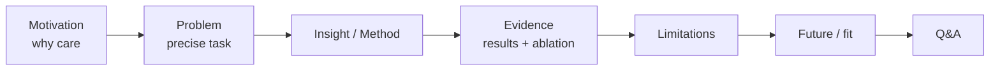
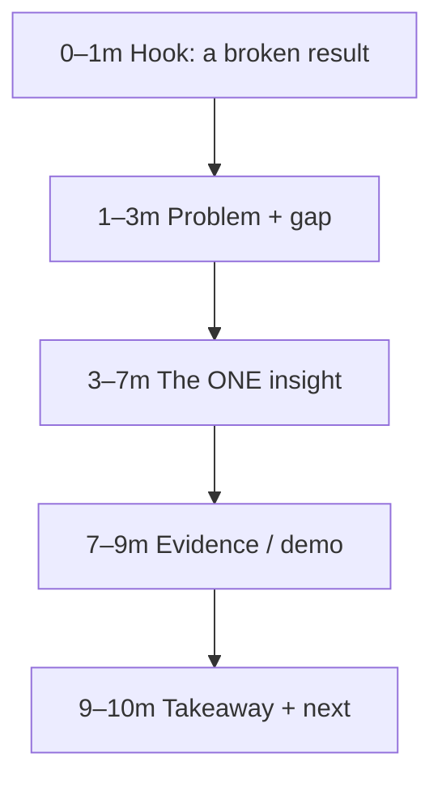
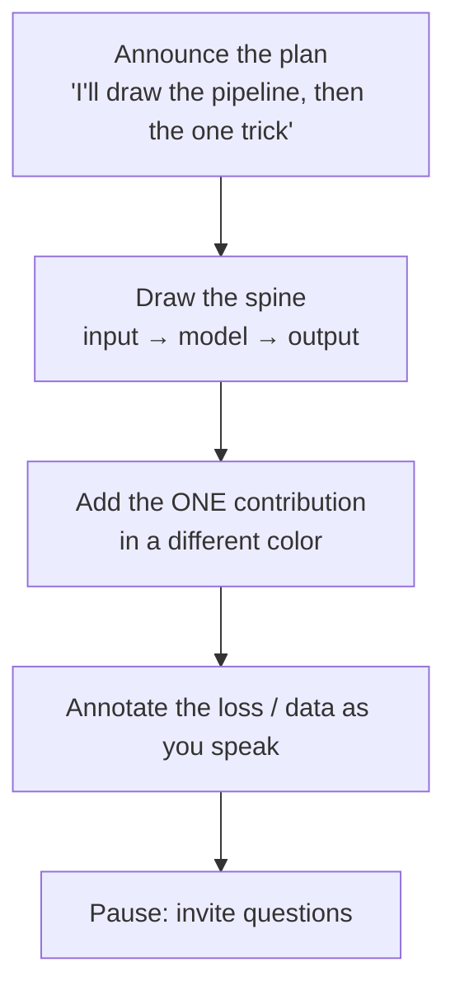

# Presenting Research

<div class="tag-row"><span class="tag">whiteboarding your work</span><span class="tag">2-min / 10-min / 30-min</span><span class="tag">tailoring to audience</span><span class="tag">figures that land</span></div>

> [!TIP] 메타 스킬
> Presenting은 slide-design 작업이 아니라 — **시간 예산 하의 audience-modeling**입니다. 같은 작업이 *누가 듣고 얼마나 오래*냐에 따라 elevator pitch, whiteboard chalk-talk, 또는 full job talk가 됩니다. 이 장은 일반 스킬이고; [The Research Job Talk](#/research/job-talk)은 구체적인 45분 포맷입니다. Beomyoung은 참고할 실제 무대 경험이 있으니 — DAN 24, Centum Digital Week 2025, NeurIPS 2021 Social — 이론이 아니라 *검증된 습관*에서 말하세요.



## One work, three lengths

가장 어려운 스킬은 **graceful degradation**입니다: 흐름을 잃지 않으면서 내용을 잘라내기. 30분 버전을 만든 뒤, 세부를 *덜어내되 spine은 절대 덜어내지 않고* 더 짧은 버전을 파생하세요.

| | **2-minute** (elevator / hallway) | **10-minute** (chalk-talk / screen) | **30-minute** (seminar / job talk) |
| --- | --- | --- | --- |
| Goal | 더 듣고 싶게 만들기 | **하나의 아이디어** + 증거 전달 | Depth + defensibility + trajectory |
| Content | Problem + your one result | Motivation → 1 insight → 2 evidences → next | Full arc + ablations + limitations + future |
| Slides/board | none / 1 | ~6–10 | ~18–22 + backup |
| Cut first | hook + result만 빼고 전부 | background, secondary results | nothing — 이게 full version |
| Keep always | the pain and your delta | the *mechanism* | the honest limitation |

### The 2-minute version (memorize)

> "I make pixel-level perception **label-efficient**, and I ship it: my work became a segmentation API that beats commercial tools and an image-matting model (ZIM, ICCV 2025 Highlight) inside CLOVA-X. Now I'm connecting that pixel-level grounding to language models so they reason from **visual evidence**, not guesses."

패턴: **Pain → what you did → why it matters → where you're going**, 네 호흡에. jargon 없이, 즉시 풀지 않을 acronym 없이.

### The 10-minute version

Background를 희생하고; mechanism 정확히 하나만 유지하세요.



### The 30-minute version

Full resolution의 [job-talk arc](#/research/job-talk): motivation → prior art → **contributions up front** → one deep-dive → results + ablations → impact → future/fit, 방어용 backup deck과 함께.

## Tailoring to the audience

> [!WARNING] 잘못된 altitude가 talk을 가라앉힌다
> 같은 슬라이드가 expert panel에는 너무 얕고 mixed room에는 너무 빽빽합니다. **먼저 방을 읽고** altitude를 설정하세요 — job talk에서 채점되는 신호입니다.

| Audience | Set altitude to… | Lead with | Beomyoung's rep |
| --- | --- | --- | --- |
| Mixed / product (execs, PMs) | User value & impact first | 보이는 제품 pain, 데모 | **DAN 24** — CLOVA-X Image Editing |
| Trend / broad tech | Narrative + one concrete anchor | 분야가 가는 방향, 그다음 *당신의* 작업을 증명으로 | **Centum Digital Week 2025** — agents |
| Expert research panel | Mechanism & evidence | gap과 당신의 delta; 선택을 방어 | **NeurIPS 2021 Social** — SSUL |
| Hiring committee | Contribution clarity + trajectory | *당신이* 한 것, 그리고 다음 질문 | the [job talk](#/research/job-talk) |

> [!EXAMPLE] audience-tailoring에 대해 할 말
> "At DAN, user value came before research detail; at the NeurIPS Social, the technical core came first. I practice changing **altitude** for the room without changing the truth of the result."

<details class="qa"><summary>"You have a mixed audience — non-experts and experts. What's your first two minutes?"</summary>
<div class="qa-body">

**Short:** 모두가 이해하는 구체적이고 보이는 failure(들쭉날쭉한 cut-out edge; VLM이 자신 있게 물체를 오분류)로 시작하고, one-line promise를 말하고, 깊이가 오고 있음을 *신호*하여 expert가 인내하게 하세요.

**Deep:** 모두가 올라타는 단일 "on-ramp"을 준 뒤 올라가세요. 각 acronym을 한 번 정의. "for the experts, details in backup" 포인터를 두어 어느 쪽도 잃지 마세요. AI 대서사나 시장 규모 차트로 절대 시작하지 말고 — *pain*으로 시작하세요.
</div></details>

## Whiteboarding your own work

어떤 라운드는 **슬라이드가 없습니다** — 마커와 "explain your best paper"만 받습니다. 다른 스킬입니다: 숨을 polish가 없고, 전부 구조와 명료함입니다.



<details class="qa"><summary>"Whiteboard your most important result for me."</summary>
<div class="qa-body">

**Short:** 계획을 말하고, **pipeline spine**을 왼쪽에서 오른쪽으로 그린 뒤, 무엇이 *당신 것*인지 시각적으로 명백하도록 두 번째 색으로 기여를 더하고, 진행하며 loss/data를 서술하세요.

**Deep:** 보드를 슬라이드처럼 관리하세요: 공간을 예약(가장자리로 벗어나지 말 것), 맨 위에 *thesis sentence*를 쓰고 그대로 두기, 중요한 하나의 equation을 박스로. 그리면서 말하세요 — 침묵은 불확실로 읽힙니다. 자연스러운 지점에서 질문을 유도; whiteboard는 Q&A를 대화형으로 만들어 당신에게 유리합니다. → [Communication & Whiteboarding](#/playbook/communication).
</div></details>

> [!NOTE] Whiteboard hygiene
> 크고 읽기 쉬운 글씨 · board-wipe당 하나의 diagram · thesis sentence는 맨 위에 유지 · 기여는 뚜렷한 색으로 · 질문자가 가리키는 것을 지우지 말 것.

> [!QUESTION] "When should you switch to the whiteboard mid-talk?"
> **Short:** 질문이 *mechanism*에 관한 것인데 슬라이드가 *result*만 보여줄 때 — 즉석에서 유도하세요. **Deep:** Follow-up을 whiteboard로 그리는 것("let me draw why the loss behaves that way")은 deck 너머로 작업을 이해함을 신호하고, 방어적 Q&A를 협력적으로 바꿉니다. 바로 이것을 위해 깨끗한 보드를 하나 예약해두세요.

## Figures that land

> [!TIP] one-job 규칙
> 모든 figure는 **하나의** 질문에 답합니다; 둘이 필요하면 나누세요. 독자는 ~5초 안에 요점을 얻고, 그다음 당신이 뉘앙스를 서술합니다.

| Figure | Does one job | Trap to avoid |
| --- | --- | --- |
| **Teaser (Fig 1)** | "Here's the idea in one picture" | 정보 없는 marketing gloss |
| **Pipeline** | Data/tensor flow; *당신의* block이 어디 있는지 | 모든 layer를 그리면 = 아무것도 강조 안 됨 |
| **Qualitative** | Claim(그리고 **failure** case) 보여주기 | 일관된 crop; success-only cherry-pick |
| **Main table** | 비교, 당신의 row를 강조 | 읽을 수 없는 12-column dump; backbone/data 미표기 |
| **Ablation** | 이득의 귀속 | Axis label / error bar 없는 curve |

**projector와 양쪽 theme를 위해 설계:** high contrast, 적은 단어, **중요한 숫자를 강조**(당신의 row만 bold/color). Before/after(ZIM의 binary-vs-soft edge)는 차이가 부인할 수 없도록 같은 scale로 나란히 놓으세요. 스크린샷한 paper figure보다 다시 그린 schematic을 선호하세요. → ablation figure를 *정직하게* 만드는 것은 [Experiment Design](#/research/experiment-design).

## Delivery mechanics

- **Opener/closer는 암기**, 중간은 자유롭게 — 청중이 기억하는 두 순간.
- ~1 slide/minute; slide text ≤ ~6 lines; thesis sentence는 슬라이드에 크게.
- Live demo? 항상 **muted video / static image fallback**을 — 데모는 무대에서 실패합니다.
- Q&A: restate → answer → "does that address it?"; 절대 허세 금지. [job-talk Q&A frame](#/research/job-talk) 참고.
- English talk: **transition phrase**("which brings me to…", "the key insight here is…")를 리허설하여 word-finding에 momentum이 멈추지 않게.

### Rehearsal checklist (night before)

```
[ ] 2-min, 10-min, 30-min versions all runnable
[ ] Opening 30s + closing 30s memorized verbatim
[ ] Timed twice on the clock; marked where to cut at the 5-min warning
[ ] "What's the weakness?" answer ready  (see Reading & Critiquing Papers)
[ ] "Tell me about a failure" answer ready  (see Failure & Negative Results)
[ ] Team-fit slide reflects the JD keywords (grounding / agents / on-device)
[ ] Co-author credit accurate; 'I' vs 'we' clean
[ ] Demo fallback image loaded; screen-share + timer tested
```

### Follow-ups they'll push

- *"Compress your whole PhD into one sentence."* — trajectory 라인: label-efficient perception → matting foundation model + product → grounded VLMs / visual agents.
- *"What was the hardest question you ever got, and how'd you handle it?"* — 진짜 사례를 고르고; 침착함과 follow-up을 보여주기.
- *"Your agenda sounds broad — what's the through-line?"* — region-verifiable visual grounding, 픽셀에서 언어까지.
- *"How do you prep differently for a Korean vs English talk?"* — content는 동일; English는 암기한 transition + 느린 pace를 더함.

## Opening 30 seconds (practice draft)

> "I work on making pixel-level perception **label-efficient** and getting it into real products — a segmentation API that outperforms commercial tools, and a matting model, ZIM, inside CLOVA-X image editing. Now I'm connecting that pixel- and region-level grounding to language-model agents, so they reason from *visual evidence* instead of unsupported description. Today I'll walk one idea from that trajectory in depth, its limitations, and the next question I'd open with this team."

## Cheat-sheet

| Item | One-liner |
| --- | --- |
| Degrade gracefully | 30분 버전을 만들고, 세부를 덜어 10/2분을 파생, spine은 절대 아님 |
| 2-min | Pain → what you did → why it matters → where you're going |
| Altitude | Product room = value first; expert panel = mechanism first |
| Whiteboard | 계획 announce → spine 그리기 → 기여를 2nd color로 → 그리면서 말하기 |
| Figures | 각각 one job; ~5초 readable; 당신의 row/number만 강조 |
| Demos | 항상 muted-video / static fallback |
| Openers/closers | 축자적으로 암기; 중간은 자유롭게 |
| Q&A | Restate → answer → confirm; 절대 허세 금지 |

**Related:** [The Research Job Talk](#/research/job-talk) · [Reading & Critiquing Papers](#/research/papers) · [Failure & Negative Results](#/research/failure) · [Experiment Design & Ablations](#/research/experiment-design) · [Communication & Whiteboarding](#/playbook/communication) · [CV deep-dives →](#/resume/overview) · [Deep-Dive: ZIM](#/resume/zim) · [Agentic AI & Tool Use](#/llm/agents)
