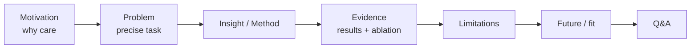
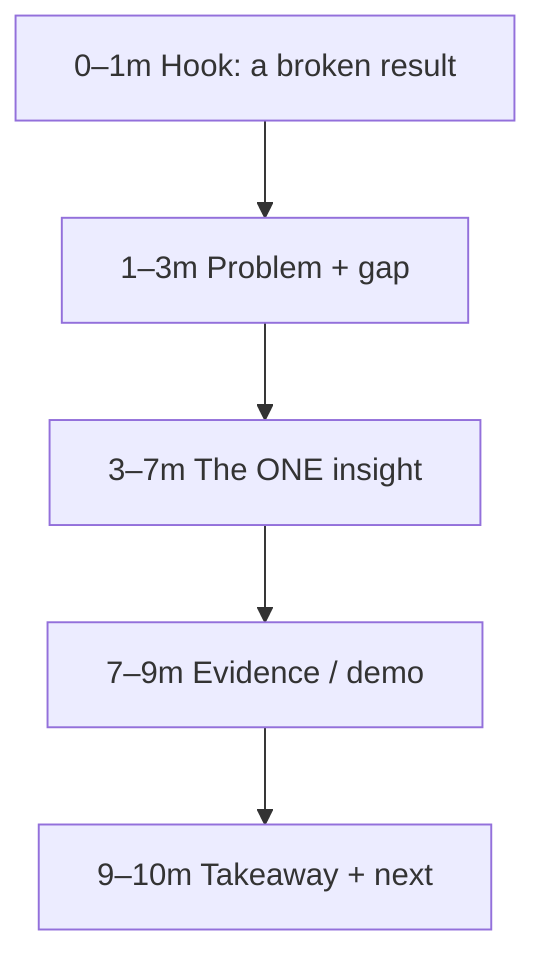
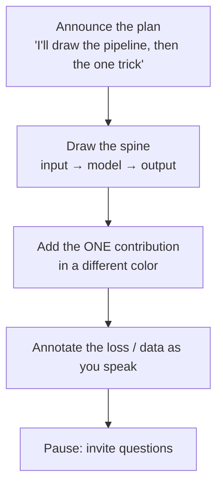

# Presenting Research

<div class="tag-row"><span class="tag">whiteboarding your work</span><span class="tag">2-min / 10-min / 30-min</span><span class="tag">tailoring to audience</span><span class="tag">figures that land</span></div>

> [!TIP] The meta-skill
> Presenting is not only a slide-design task—it is **audience modeling under a time budget**. The same work becomes an elevator pitch, a whiteboard chalk talk, or a full job talk depending on *who is listening and for how long*. This chapter covers **adaptation** across length, audience, and medium; the canonical 45-minute structure, Q&A, and claim-ledger rules live once in [The Research Job Talk](#/research/job-talk). If you cite appearances such as DAN 24, Centum Digital Week, or a NeurIPS Social, verify the program, year, and your role from a public record.



## One work, three lengths

The hardest skill is **graceful degradation**: cutting content without losing the thread. Build a source deck and narrative spine, then derive versions by dropping detail to fit the time. The longest version need not always come first, but each version must preserve the connection problem → delta → evidence.

| | **2-minute** (elevator / hallway) | **10-minute** (chalk-talk / screen) | **30-minute** (seminar / job talk) |
| --- | --- | --- | --- |
| Goal | Make them want more | Convey **one idea** + evidence | Depth + defensibility + trajectory |
| Content | Problem + your one result | Motivation → 1 insight → 2 evidences → next | Full arc + ablations + limitations + future |
| Slides/board | none / 1 | ~6–10 | ~18–22 + backup |
| Cut first | **keep only** hook + result | long background, secondary results | secondary history/results; move them to backup |
| Keep always | the pain and your delta | the *mechanism* | the honest limitation |

### The 2-minute version (memorize)

> **Placeholder draft:** "I make pixel-level perception **label-efficient** and deployable. One line of work produced [publicly verifiable paper/product result]; another showed [one measured research result]. Now I'm connecting pixel-level grounding to language models so their answers can be checked against **visual evidence**."

Even if phrases such as `outperformed commercial tools`, `ICCV Highlight`, or `integrated into CLOVA-X` are true, replace the brackets only after verifying the **evaluation scope, official record, and your contribution** for each. Do not imply that two products use the same model.

Pattern: **Pain → what you did → why it matters → where you're going**, in four breaths. No jargon, no acronym you don't immediately unpack.

### The 10-minute version

Sacrifice background; keep exactly one mechanism.



### The 30-minute version

This is a compressed form of the [job-talk arc](#/research/job-talk): motivation → prior art → **contributions up front** → one deep-dive → results + ablations → impact → future/fit. Use the job-talk chapter as the source of truth for exact timing, Q&A, and claim verification rather than duplicating them here.

## Tailoring to the audience

> [!WARNING] Wrong altitude sinks talks
> The same slide is too shallow for an expert panel and too dense for a mixed room. **Read the room first**, then set altitude — this is a graded signal in the job talk.

| Audience | Set altitude to… | Lead with | Candidate evidence (if verified) |
| --- | --- | --- | --- |
| Mixed / product (execs, PMs) | User value & impact first | A visible product pain, a demo | A product-event talk, if publicly documented |
| Trend / broad tech | Narrative + one concrete anchor | Where the field is going, then *your* work as proof | A broad-tech talk, if publicly documented |
| Expert research panel | Mechanism & evidence | The gap and your delta; defend choices | A workshop/social talk tied to the paper |
| Hiring committee | Contribution clarity + trajectory | What *you* did, and the next question | the [job talk](#/research/job-talk) |

> [!EXAMPLE] The line to say about audience-tailoring
> If the contrast is verifiable in two real decks or recordings: "At the product event, user value came before research detail; at the research event, the technical core came first. I change **altitude** for the room without changing the truth of the result."

<details class="qa"><summary>"You have a mixed audience — non-experts and experts. What's your first two minutes?"</summary>
<div class="qa-body">

**Short:** Open with a concrete, visible failure everyone understands (a jagged cut-out edge; a VLM confidently mislabeling an object), state your one-line promise, and *signal* the depth is coming so experts stay patient.

**Deep:** Give a single "on-ramp" everyone boards, then climb. Define each acronym once. Put a "for the experts, details in backup" pointer so you do not lose either group. A concrete *problem or failure* the audience can inspect is usually a faster start than a giant market-size chart, although a business-review talk may appropriately lead with market evidence.
</div></details>

## Whiteboarding your own work

Some rounds have **no slides** — you get a marker and "explain your best paper." Different skill: no polish to hide behind, all structure and clarity.



<details class="qa"><summary>"Whiteboard your most important result for me."</summary>
<div class="qa-body">

**Short:** Say the plan, draw the **pipeline spine** left-to-right, then add your contribution in a second color so it's visually obvious what's *yours*, narrating the loss/data as you go.

**Deep:** Manage the board like slides: reserve space so you do not run off the edge, write the *thesis sentence* at the top and leave it, and box the one equation that matters. Explain the core intent briefly while drawing, but a short silence while thinking or drawing a complex shape is fine. Invite questions at natural breaks to make whiteboard Q&A conversational. → [Communication & Whiteboarding](#/playbook/communication).
</div></details>

> [!NOTE] Whiteboard hygiene
> Legible large letters · one diagram per board-wipe · thesis sentence stays up top · your contribution in a distinct color · don't erase what a questioner is pointing at.

> [!QUESTION] "When should you switch to the whiteboard mid-talk?"
> **Short:** The moment a question is about *mechanism* and your slide only shows the *result* — derive it live. **Deep:** Whiteboarding a follow-up ("let me draw why the loss behaves that way") signals you understand the work beyond the deck, and turns a defensive Q&A into a collaborative one. Keep a clean board reserved for exactly this.

## Figures that land

> [!TIP] The one-job rule
> Whenever possible, design a presentation figure to answer **one primary question**. If a composite figure is necessary, use panels and annotations to reveal the reading order. Make the core message discoverable within seconds, then narrate the nuance.

| Figure | Does one job | Trap to avoid |
| --- | --- | --- |
| **Teaser (Fig 1)** | "Here's the idea in one picture" | Marketing gloss with no information |
| **Pipeline** | Data/tensor flow; where *your* block sits | Every layer drawn = nothing emphasized |
| **Qualitative** | Show the claim (and a **failure** case) | Consistent crops; success-only cherry-pick |
| **Main table** | The comparison, with your row highlighted | Unreadable 12-column dump; no backbone/data noted |
| **Ablation** | Attribution of the gain | Curve with no axis labels / error bars |

**Design for the projector and both themes:** high contrast, few words, **highlight the number that matters** (bold/color only your row). For a before/after (ZIM's binary-vs-soft edge), place them adjacent at the same scale so the difference is undeniable. Prefer a redrawn schematic over a screenshotted paper figure. → [Experiment Design](#/research/experiment-design) for what makes an ablation figure *honest*.

## Delivery mechanics

- **Openers/closers memorized**, middle spoken freely — the two moments audiences remember.
- ~1 slide/minute and ~6 lines of slide text are **rehearsal starting points**, not rules. Give a complex figure more time and a transition slide less.
- A live demo can fail because of network, permissions, or latency, so prepare a **muted video / static-image fallback**.
- Q&A: restate → answer → "does that address it?"; never bluff. See the [job-talk Q&A frame](#/research/job-talk).
- English talk: rehearse **transition phrases** ("which brings me to…", "the key insight here is…") so momentum doesn't stall on word-finding.

### Rehearsal checklist (night before)

```
[ ] 2-min, 10-min, 30-min versions all runnable
[ ] Opening 30s + closing 30s memorized verbatim
[ ] Timed twice on the clock; marked where to cut at the 5-min warning
[ ] "What's the weakness?" answer ready  (see Reading & Critiquing Papers)
[ ] "Tell me about a failure" answer ready  (see Failure & Negative Results)
[ ] Team-fit slide reflects the JD keywords (grounding / agents / on-device)
[ ] Co-author credit accurate; 'I' vs 'we' clean
[ ] Demo fallback image loaded; screen-share + timer tested
```

### Follow-ups they'll push

- *"Compress your whole PhD into one sentence."* — the trajectory line: label-efficient perception → matting foundation model + product → grounded VLMs / visual agents.
- *"What was the hardest question you ever got, and how'd you handle it?"* — pick a real one; show composure and a follow-up.
- *"Your agenda sounds broad — what's the through-line?"* — region-verifiable visual grounding, from pixels to language.
- *"How do you prep differently for a Korean vs English talk?"* — content identical; English adds memorized transitions + slower pace.

## Opening 30 seconds (practice draft)

> **Placeholder draft:** "I work on making pixel-level perception **label-efficient** and deployable. In [verified project], I contributed [documented role] and we measured [scoped result]. Now I'm connecting pixel- and region-level grounding to language-model agents so their outputs can be checked against *visual evidence*. Today I'll walk through one idea from that trajectory, its limitations, and the next question I'd explore with this team."

Fill the brackets from the latest CV, paper, and public product page; for internal numbers, state only a disclosure-safe aggregate and its evaluation scope.

## Cheat-sheet

| Item | One-liner |
| --- | --- |
| Degrade gracefully | Derive 30/10/2-minute versions by removing detail from the source narrative; never remove the spine |
| 2-min | Pain → what you did → why it matters → where you're going |
| Altitude | Product room = value first; expert panel = mechanism first |
| Whiteboard | Announce plan → draw spine → contribution in 2nd color → talk while drawing |
| Figures | One primary question; clear reading order; emphasize the key row or number |
| Demos | Prepare a muted-video / static fallback |
| Openers/closers | Memorized verbatim; middle spoken freely |
| Q&A | Restate → answer → confirm; never bluff |

**Related:** [The Research Job Talk](#/research/job-talk) · [Reading & Critiquing Papers](#/research/papers) · [Failure & Negative Results](#/research/failure) · [Experiment Design & Ablations](#/research/experiment-design) · [Communication & Whiteboarding](#/playbook/communication) · [CV deep-dives →](#/resume/overview) · [Deep-Dive: ZIM](#/resume/zim) · [Agentic AI & Tool Use](#/llm/agents)
